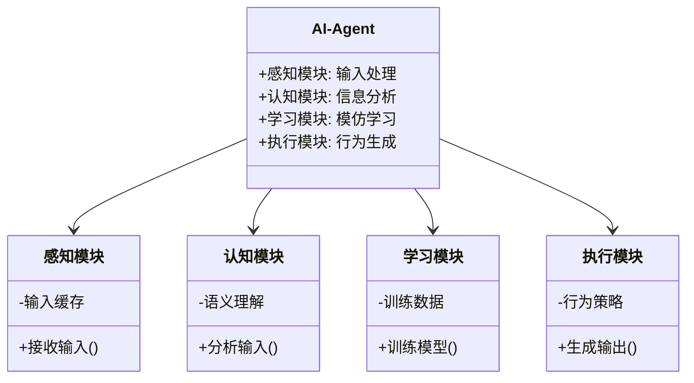
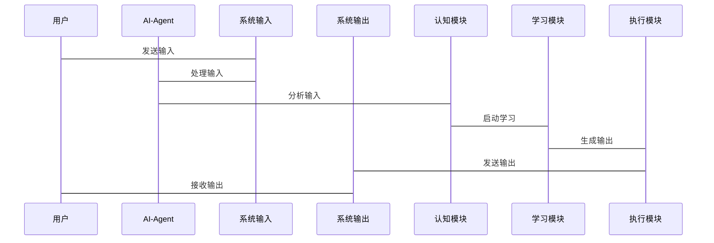

                 


# AI Agent的社交学习与模仿能力

> 关键词：AI Agent，社交学习，模仿能力，社会认知，情感理解，强化学习

> 摘要：AI Agent的社交学习与模仿能力是人工智能领域的重要研究方向。本文从AI Agent的基本概念出发，详细探讨了社交学习与模仿能力的核心机制，包括社会认知、情感理解、模仿学习算法等。通过分析实际应用场景，提出了系统架构设计，并结合具体案例展示了如何实现具备社交学习与模仿能力的AI Agent。本文最后总结了当前研究的成果，并展望了未来的发展方向。

---

## 第一部分: AI Agent的社交学习与模仿能力概述

### 第1章: AI Agent的基本概念

#### 1.1 AI Agent的定义与特点
AI Agent（人工智能代理）是指能够感知环境、自主决策并执行任务的智能实体。与传统的被动执行指令的程序不同，AI Agent具备以下特点：
- **自主性**：能够在没有外部干预的情况下自主运行。
- **反应性**：能够实时感知环境并做出反应。
- **学习能力**：通过与环境的交互不断优化自身行为。
- **社交能力**：能够与人类或其他AI Agent进行有效沟通和协作。

AI Agent的核心目标是通过智能化的行为提高人机交互的效率和体验。

#### 1.2 社交学习与模仿能力的定义
- **社交学习**：AI Agent通过观察和模仿人类或其他AI Agent的行为，学习社交规则、情感表达和协作技巧的能力。
- **模仿能力**：AI Agent能够从观察到的行为中提取关键特征，并在类似的情境中复现类似行为的能力。

社交学习与模仿能力的结合使得AI Agent能够更好地融入人类社会，并与人类进行更自然的交互。

---

### 第2章: AI Agent的类型与应用场景

#### 2.1 AI Agent的类型
根据功能和智能水平的不同，AI Agent可以分为以下几种类型：
- **简单反射型AI Agent**：基于预定义的规则对输入做出反应，不具备学习能力。
- **基于规则的AI Agent**：通过预定义的规则和逻辑进行决策，适用于任务简单且规则明确的场景。
- **基于学习的AI Agent**：通过机器学习算法从数据中学习行为模式，适用于复杂且规则动态变化的场景。
- **基于推理的AI Agent**：能够进行逻辑推理和知识推理，适用于需要复杂决策的任务。

#### 2.2 AI Agent的应用场景
AI Agent的社交学习与模仿能力在多个领域具有广泛的应用潜力，包括：
- **人机交互**：提升人机对话的自然性和流畅性。
- **社交机器人**：应用于客服、教育、娱乐等领域。
- **教育辅助**：帮助学生学习社交技巧和情感管理。
- **健康医疗**：辅助患者进行情感支持和行为矫正。

---

## 第二部分: 社交学习的机制与算法

### 第3章: 社交学习的基本原理

#### 3.1 社会认知理论
社会认知理论是研究人类如何通过观察和模仿他人行为来学习社交规则的理论基础。AI Agent可以通过以下步骤实现社会认知：
1. **观察**：通过感知输入（如视觉、听觉）获取社交情境中的信息。
2. **理解**：解析观察到的行为背后的意图和情感。
3. **记忆**：将观察到的行为和情境存储为经验，用于未来的决策。

**社会认知的核心要素对比表：**

| 要素 | 描述 |
|------|------|
| 行为 | 观察到的具体动作或语言 |
| 情境 | 行为发生的具体环境 |
| 意图 | 行为背后的目标或动机 |
| 情感 | 行为中蕴含的情感色彩 |

#### 3.2 情感理解与表达
情感理解是社交学习的重要组成部分。AI Agent需要通过分析语言、语调、面部表情等信息，识别和理解人类的情感状态。常用的情感理解算法包括：
- **情感分析**：基于自然语言处理（NLP）技术，对文本进行情感分类（如正面、负面、中性）。
- **情感推理**：通过上下文推理情感的细微差别，例如识别讽刺或隐含的情感。

**情感表达的实现步骤：**
1. **情感生成**：根据预设规则或学习模型生成情感表达。
2. **情感输出**：通过语言、表情或动作将情感表达传递给用户。

---

### 第4章: 模仿学习的算法与实现

#### 4.1 监督学习
监督学习是一种基于标注数据的学习方法，适用于模仿学习任务。以下是其实现步骤：
1. **数据准备**：收集模仿对象的行为数据（如语言、动作）并进行标注。
2. **模型训练**：使用训练数据训练机器学习模型，使其能够预测目标行为。
3. **模型评估**：通过测试数据验证模型的性能。

**监督学习的数学模型：**

$$L = \frac{1}{n}\sum_{i=1}^{n}(y_i - \hat{y}_i)^2$$

其中，$L$ 是损失函数，$y_i$ 是真实标签，$\hat{y}_i$ 是模型预测值。

#### 4.2 强化学习
强化学习是一种基于奖励机制的学习方法，适用于动态变化的社交环境。以下是其实现步骤：
1. **状态定义**：定义社交情境中的关键状态（如用户的情绪变化）。
2. **动作选择**：AI Agent根据当前状态选择一个动作。
3. **奖励机制**：根据动作的效果给予奖励或惩罚。
4. **策略优化**：通过不断试错优化策略，最大化累积奖励。

**强化学习的数学模型：**

$$Q(s, a) = Q(s, a) + \alpha (r + \max_{a'} Q(s', a') - Q(s, a))$$

其中，$Q(s, a)$ 是状态-动作对的价值，$\alpha$ 是学习率，$r$ 是奖励，$s'$ 是下一个状态。

---

## 第三部分: 系统架构与实现

### 第5章: 系统架构设计

#### 5.1 系统功能设计
以下是支持社交学习与模仿能力的AI Agent系统的功能模块：
- **感知模块**：负责接收外部输入（如语音、图像）。
- **认知模块**：对输入进行理解和分析，提取关键信息。
- **学习模块**：基于认知结果进行社交学习和模仿训练。
- **执行模块**：根据学习结果生成输出（如语言、动作）。

**系统功能模块的类图（Mermaid）：**



#### 5.2 系统架构设计
以下是系统的总体架构图（Mermaid）：

```mermaid
div title 系统架构设计
    rectangle 系统输入 {
        文本输入
        语音输入
        图像输入
    }
    rectangle 感知模块 {
        输入处理
        特征提取
    }
    rectangle 认知模块 {
        语义理解
        情感分析
    }
    rectangle 学习模块 {
        监督学习
        强化学习
    }
    rectangle 执行模块 {
        行为生成
        输出处理
    }
    系统输入 --> 感知模块
    感知模块 --> 认知模块
    认知模块 --> 学习模块
    学习模块 --> 执行模块
    执行模块 --> 系统输出
```

#### 5.3 系统交互设计
以下是系统交互流程图（Mermaid）：



---

## 第四部分: 项目实战与案例分析

### 第6章: 项目实战

#### 6.1 环境配置
以下是项目所需的环境配置：
- **编程语言**：Python 3.8+
- **框架与库**：
  - `numpy`：用于数值计算
  - `tensorflow` 或 `pytorch`：用于深度学习模型训练
  - `transformers`：用于自然语言处理
- **开发工具**：PyCharm或VS Code

#### 6.2 核心实现

以下是社交学习与模仿能力的核心实现代码示例：

```python
# 模仿学习的监督学习实现
import numpy as np
import tensorflow as tf

# 数据准备
class Dataset:
    def __init__(self):
        self.train_data = ...
        self.train_labels = ...
        self.test_data = ...
        self.test_labels = ...

# 模型定义
class imitation_Learning_model:
    def __init__(self):
        self.model = tf.keras.Sequential([
            tf.keras.layers.Dense(64, activation='relu'),
            tf.keras.layers.Dense(10, activation='softmax')
        ])
        self.model.compile(optimizer='adam', loss='sparse_categorical_crossentropy', metrics=['accuracy'])

    def train(self, dataset):
        self.model.fit(dataset.train_data, dataset.train_labels, epochs=10, batch_size=32)

# 训练过程
def main():
    dataset = Dataset()
    model = imitation_Learning_model()
    model.train(dataset)

if __name__ == '__main__':
    main()
```

---

## 第五部分: 最佳实践与总结

### 第7章: 最佳实践

#### 7.1 小结
本文详细探讨了AI Agent的社交学习与模仿能力，从基本概念到算法实现，再到系统设计和项目实战，全面覆盖了相关领域的核心内容。

#### 7.2 注意事项
- 在实现社交学习时，需注意数据的多样性和代表性，避免模型过拟合。
- 情感理解需要结合上下文，避免孤立地分析情感信息。
- 强化学习需要设计合理的奖励机制，以引导模型学习正确的行为。

#### 7.3 拓展阅读
- 建议进一步研究多模态学习（结合文本、语音、图像等多种信息源）。
- 探索AI Agent在教育、医疗等领域的实际应用。

---

## 结语

AI Agent的社交学习与模仿能力是实现人机交互自然化的关键。通过不断的研究与实践，我们可以让AI Agent更好地理解人类的情感和社交规则，从而在更多领域实现高效、自然的交互。

---

**作者：AI天才研究院/AI Genius Institute & 禅与计算机程序设计艺术 /Zen And The Art of Computer Programming**

