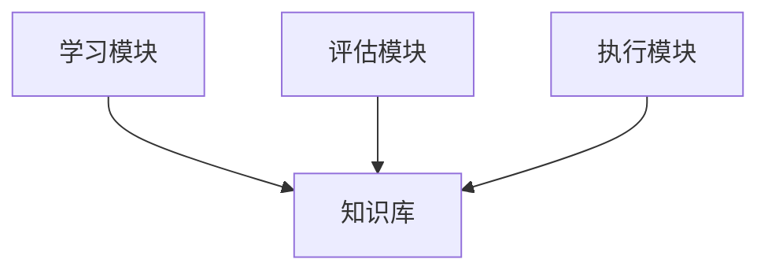
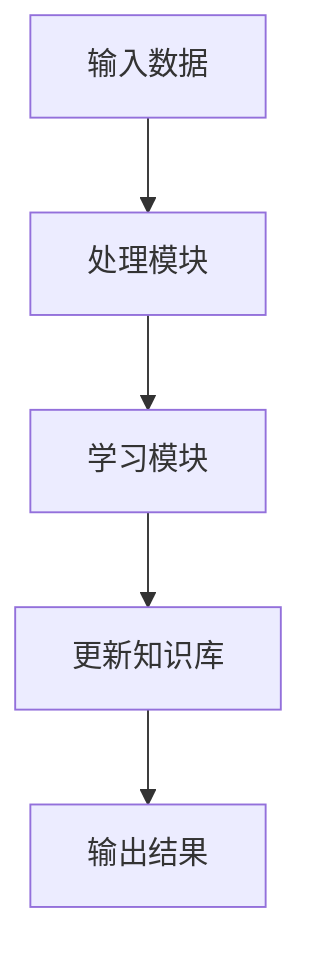
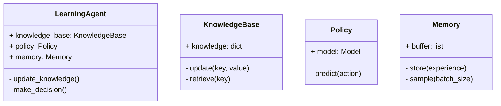
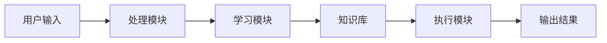
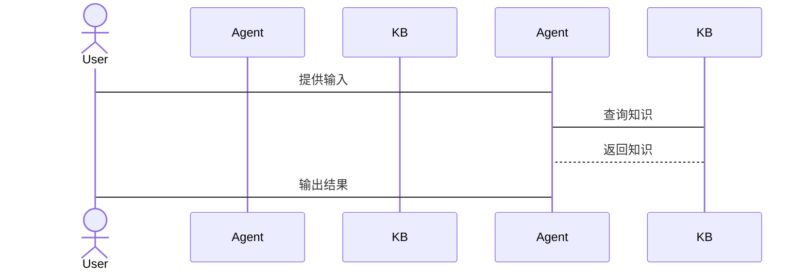

                 


# AI Agent的终身学习系统实现

---

## 关键词  
AI Agent, 终身学习, 自适应学习, 算法实现, 系统架构, 知识管理, 智能优化

---

## 摘要  
AI Agent的终身学习系统是一种能够持续学习和适应新知识的智能系统，旨在解决动态环境中的复杂问题。本文详细探讨了终身学习系统的理论基础、算法实现、系统架构设计以及实际应用案例。通过分析核心算法和数学模型，结合系统设计和项目实战，为读者提供全面的实现指南。文章还总结了最佳实践和注意事项，帮助读者更好地理解和应用终身学习系统。

---

## 正文

---

### 第一部分：背景介绍

#### 第1章：AI Agent的终身学习系统概述

##### 1.1 问题背景与问题描述  
AI Agent（智能体）是能够感知环境并采取行动以实现目标的实体。在动态和复杂环境中，AI Agent需要不断学习新知识以适应变化，这就需要终身学习系统。  

##### 1.2 问题解决与核心要素  
终身学习系统的目标是使AI Agent能够持续更新知识和技能，以应对新任务和挑战。核心要素包括知识表示、学习模块、评估机制和自适应策略。  

---

### 第二部分：核心概念与联系

#### 第2章：终身学习系统的原理与架构  

##### 2.1 核心概念的原理分析  
终身学习系统通过经验重放、策略梯度等方法实现知识更新。知识表示通常采用符号逻辑或神经网络，确保系统能够理解并应用新信息。  

##### 2.2 核心概念的属性特征对比  
| 特性 | 终身学习 | 持续学习 | 知识蒸馏 |
|------|----------|----------|----------|
| 目标 | 持续优化 | 逐步改进 | 知识压缩 |
| 方法 | 经验重放 | 微调 | 知识蒸馏 |

##### 2.3 ER实体关系图  


---

### 第三部分：算法原理讲解

#### 第3章：终身学习算法的实现  

##### 3.1 算法原理  
- **经验重放**：通过存储历史数据，减少样本偏差，提升学习稳定性。  
- **策略梯度方法**：优化策略参数，平衡探索与利用。  

##### 3.2 算法流程图  


##### 3.3 Python实现示例  
```python
class LearningAgent:
    def __init__(self, knowledge_base):
        self.knowledge_base = knowledge_base

    def learn(self, data):
        # 更新知识库
        self.knowledge_base.update(data)

    def make_decision(self, state):
        # 基于知识库做出决策
        return self.knowledge_base.retrieve(state)
```

---

### 第四部分：数学模型

#### 第4章：数学模型与公式推导  

##### 4.1 策略梯度的数学表达  
策略梯度方法通过优化策略参数 $\theta$，使目标函数 $J(\theta)$ 最大化：  
$$ J(\theta) = \mathbb{E}_{\tau \sim \pi_\theta}[\log \pi_\theta(a|s)] $$  

##### 4.2 知识更新的公式  
经验重放通过权重衰减实现：  
$$ w_{t+1} = (1-\alpha)w_t + \alpha r $$  

---

### 第五部分：系统分析与架构设计

#### 第5章：系统分析与架构设计  

##### 5.1 项目介绍  
设计一个基于终身学习的AI Agent系统，用于动态环境下的任务执行。  

##### 5.2 功能模块设计  


##### 5.3 系统架构设计  


##### 5.4 接口与交互设计  


---

### 第六部分：项目实战

#### 第6章：项目实战与案例分析  

##### 6.1 环境搭建  
安装必要的库：  
```bash
pip install numpy torch matplotlib
```

##### 6.2 核心实现  
```python
class KnowledgeBase:
    def __init__(self):
        self.knowledge = {}

    def update(self, key, value):
        self.knowledge[key] = value

    def retrieve(self, key):
        return self.knowledge.get(key, None)

class LearningAgent:
    def __init__(self, knowledge_base):
        self.knowledge_base = knowledge_base

    def learn(self, data):
        for key, value in data.items():
            self.knowledge_base.update(key, value)

    def make_decision(self, state):
        return self.knowledge_base.retrieve(state)
```

##### 6.3 实际案例分析  
案例：一个简单的终身学习系统实现，展示知识更新和决策过程。  

---

### 第七部分：最佳实践

#### 第7章：总结与展望  

##### 7.1 最佳实践  
- 定期更新知识库，保持系统的新鲜度。  
- 平衡探索与利用，避免过早收敛。  
- 使用多种学习策略，提高系统的鲁棒性。  

##### 7.2 小结  
终身学习系统是实现AI Agent智能化的关键，通过持续学习和自适应优化，系统能够更好地应对复杂环境。  

##### 7.3 注意事项  
- 数据质量对系统性能至关重要。  
- 定期评估模型性能，及时调整参数。  

##### 7.4 拓展阅读  
推荐阅读相关书籍和论文，深入理解终身学习的前沿技术。

---

## 附录  

#### 附录A：参考文献  
1. "Deep Reinforcement Learning for Autonomous Systems"  
2. "Continuous Learning in Dynamic Environments"  

#### 附录B：工具与库  
- PyTorch  
- TensorFlow  
- Scikit-learn  

---

## 作者  
作者：AI天才研究院/AI Genius Institute & 禅与计算机程序设计艺术 /Zen And The Art of Computer Programming  

---

**全文完**

