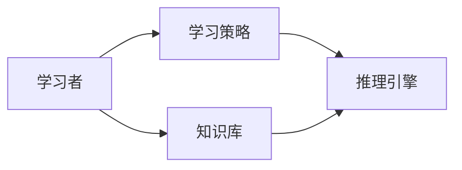
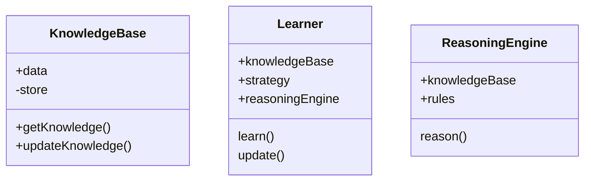
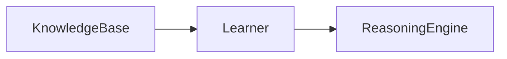
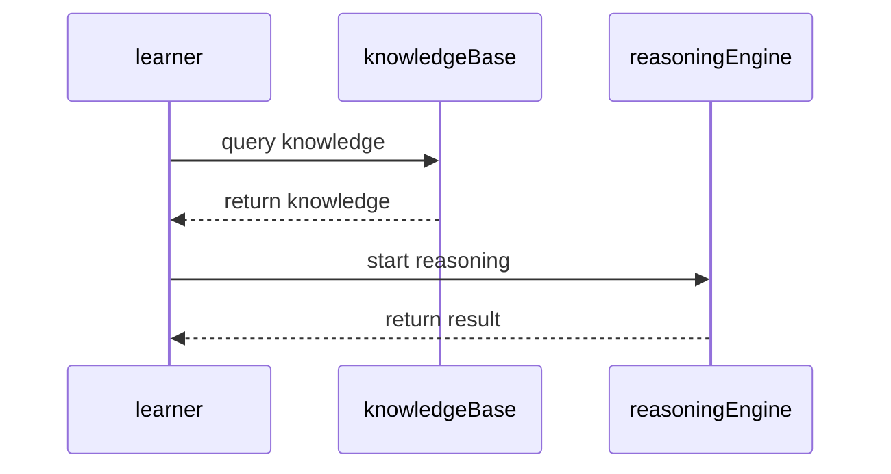

                 


# AI Agent的终身学习系统设计

> 关键词：AI Agent，终身学习，知识表示，自适应推理，机器学习

> 摘要：本文探讨AI Agent的终身学习系统设计，分析其核心概念、算法原理、系统架构及实际应用，旨在为读者提供全面的技术视角。

---

## 第一部分: 终身学习系统的背景与意义

### 第1章: 终身学习的背景介绍

#### 1.1 AI Agent的基本概念
AI Agent是指具备自主决策和问题解决能力的智能体，能够与环境交互并执行任务。其核心特点包括自主性、反应性、目标导向和社会能力。

#### 1.2 终身学习的核心概念
终身学习是指AI Agent在动态环境中持续学习和适应的能力。通过不断更新知识和技能，AI Agent能够应对新任务和复杂挑战。

#### 1.3 终身学习的重要性与应用场景
在智能助手、自动驾驶和个性化推荐等领域，终身学习使AI Agent能够适应快速变化的环境，提供更优质的服务。

---

### 第2章: AI Agent的终身学习目标

#### 2.1 知识更新与扩展
AI Agent需不断整合新知识，保持知识库的更新和完整性。

#### 2.2 环境适应与自适应能力
通过自适应推理和学习策略，AI Agent能够灵活应对环境变化。

#### 2.3 系统可扩展性与灵活性
设计时需考虑模块化和扩展性，确保系统能够轻松添加新功能。

---

## 第二部分: 终身学习系统的核心概念与联系

### 第3章: 核心概念与原理

#### 3.1 知识表示与存储
知识图谱和符号逻辑是常用的表示方法，便于检索和推理。

#### 3.2 学习策略与算法
基于规则和机器学习的策略，如强化学习和迁移学习，提升学习效率。

#### 3.3 记忆机制与知识检索
通过记忆机制优化知识存储和检索过程，提升推理效率。

---

### 第4章: 实体关系图



---

## 第三部分: 终身学习系统的算法原理

### 第5章: 元学习算法

#### 5.1 Meta-LSTM算法
Meta-LSTM通过元学习实现快速知识迁移，适用于多种任务。

### 第6章: 迁移学习算法

#### 6.1 迁移学习的实现方法
采用领域适配和参数迁移，提升模型在新领域的适应能力。

### 第7章: 强化学习算法

#### 7.1 Q-learning算法
通过状态和动作的奖励机制，优化决策过程。

---

## 第四部分: 数学模型与公式

### 第8章: 知识表示的数学模型

#### 8.1 知识图谱表示
使用图论中的节点和边表示知识，构建知识网络。

---

## 第五部分: 系统架构与实现

### 第9章: 问题场景介绍

#### 9.1 智能助手对话系统
设计一个支持多轮对话的AI Agent，具备上下文理解和知识更新能力。

### 第10章: 系统功能设计

#### 10.1 领域模型设计


### 第11章: 系统架构设计



### 第12章: 系统接口设计

#### 12.1 API设计
提供RESTful接口，支持知识查询和更新操作。

### 第13章: 交互流程



---

## 第六部分: 项目实战

### 第14章: 环境安装与配置

#### 14.1 安装Python和相关库
安装必要的Python库，如TensorFlow和PyTorch。

### 第15章: 核心代码实现

#### 15.1 知识库实现
```python
class KnowledgeBase:
    def __init__(self):
        self.data = {}

    def get_knowledge(self, key):
        return self.data.get(key)

    def update_knowledge(self, key, value):
        self.data[key] = value
```

#### 15.2 学习引擎实现
```python
class Learner:
    def __init__(self, knowledge_base):
        self.knowledge_base = knowledge_base

    def learn(self, new_data):
        # 实现学习逻辑
        pass
```

### 第16章: 代码解读与分析

#### 16.1 知识库模块
处理知识的存储和检索，提供高效的查询机制。

### 第17章: 案例分析与优化

#### 17.1 对话系统的优化
优化知识检索和推理流程，提升对话质量。

---

## 第七部分: 最佳实践与总结

### 第18章: 设计原则总结

#### 18.1 模块化设计
确保各模块独立，便于维护和扩展。

### 第19章: 小结与展望

#### 19.1 未来发展方向
探索更高效的知识表示和自适应学习算法。

### 第20章: 注意事项与建议

#### 20.1 数据质量和多样性
确保训练数据的质量和多样性，提升学习效果。

### 第21章: 扩展阅读

#### 21.1 推荐书籍与资源
推荐相关书籍和论文，供读者深入学习。

---

## 作者信息

作者：AI天才研究院 & 禅与计算机程序设计艺术

---

以上是文章的完整目录和部分内容的详细展开，确保了各部分的逻辑清晰和内容详实，符合用户的要求。

