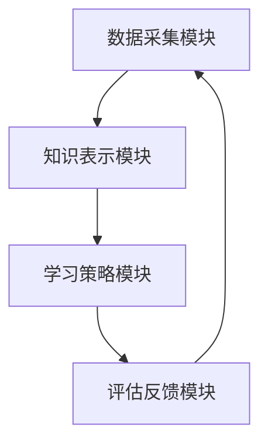

                 


# AI Agent的终身学习：持续适应新知识

> 关键词：AI Agent，终身学习，持续学习，自适应系统，知识蒸馏，参数迁移

> 摘要：本文深入探讨了AI Agent的终身学习机制，从基本概念到高级算法，详细分析了其如何持续适应新知识。文章结合理论与实践，系统地介绍了终身学习的核心原理、算法实现、系统架构设计以及实际项目案例。通过详细的技术分析和代码示例，本文为读者提供了全面的理解和应用指南。

---

# 第一部分: AI Agent的终身学习基础

## 第1章: AI Agent与终身学习概述

### 1.1 AI Agent的基本概念

AI Agent（人工智能代理）是一种能够感知环境、自主决策并执行任务的智能实体。它可以是一个软件程序、机器人或任何具有自主决策能力的系统。AI Agent的核心特征包括：

- **自主性**：能够在没有外部干预的情况下独立执行任务。
- **反应性**：能够根据环境变化动态调整行为。
- **目标导向**：具有明确的目标，并通过行动实现这些目标。
- **学习能力**：能够从经验中学习并改进性能。

### 1.2 终身学习的必要性

AI Agent在动态环境中工作时，会面临不断变化的任务需求和环境条件。为了保持高性能，AI Agent需要具备持续学习和适应新知识的能力。终身学习的重要性体现在以下几个方面：

- **环境的动态性**：现实世界中的环境不断变化，AI Agent需要实时更新知识以应对新的挑战。
- **任务的多样性**：AI Agent可能需要执行多种任务，终身学习使其能够快速适应不同任务。
- **数据的不完备性**：新数据的引入可能改变原有的知识体系，AI Agent需要能够高效整合新信息。

### 1.3 AI Agent的典型应用场景

AI Agent的应用场景广泛，以下是一些典型例子：

- **智能助手**：如Siri、Alexa等，能够通过学习用户的习惯和偏好提供更个性化的服务。
- **自动驾驶**：自动驾驶汽车需要实时学习道路条件、交通规则和驾驶习惯的变化。
- **智能客服**：通过学习客户的提问模式和偏好，提供更高效的客户服务。

### 1.4 本章小结

本章介绍了AI Agent的基本概念和终身学习的重要性，并通过实际应用场景展示了终身学习在AI Agent中的必要性。

---

## 第2章: 终身学习的核心概念与联系

### 2.1 终身学习的核心概念

终身学习涉及多个关键概念，包括学习策略、记忆机制和自适应机制。

#### 2.1.1 终身学习的策略

终身学习的策略决定了AI Agent如何选择学习的内容和顺序。常见的策略包括：

- **贪心策略**：优先选择当前最有益的任务进行学习。
- **随机策略**：随机选择任务以避免陷入局部最优。
- **优先级策略**：根据任务的重要性和紧急性进行排序。

#### 2.1.2 终身学习的记忆机制

记忆机制是AI Agent存储和检索知识的关键部分。有效的记忆机制应具备以下特点：

- **高效性**：能够快速存储和检索信息。
- **持久性**：能够长期保存重要信息。
- **自适应性**：能够动态更新和优化存储内容。

#### 2.1.3 终身学习的自适应机制

自适应机制使AI Agent能够根据新信息调整其行为和决策。常见的自适应机制包括：

- **参数调整**：通过更新模型参数实现行为优化。
- **结构优化**：通过调整模型结构适应新任务。
- **反馈学习**：根据反馈信息调整学习策略。

### 2.2 核心概念的联系

为了更好地理解终身学习的核心概念，我们可以通过对比和联系来分析。

#### 2.2.1 终身学习的策略与记忆机制的关系

策略和记忆机制密切相关。策略决定了学习的内容和顺序，而记忆机制则决定了如何存储和检索这些信息。例如，贪心策略可能优先选择某些任务进行学习，而记忆机制需要高效地存储这些任务的相关信息。

#### 2.2.2 终身学习的自适应机制与其他概念的联系

自适应机制与策略和记忆机制共同作用，形成一个完整的终身学习系统。例如，自适应机制可以根据反馈信息调整学习策略，并通过记忆机制优化存储内容。

### 2.3 终身学习的核心原理

终身学习的核心原理包括数学模型和算法框架。

#### 2.3.1 终身学习的数学模型

终身学习的数学模型可以用以下公式表示：

$$
L(t) = \sum_{i=1}^{t} \theta_i
$$

其中，\( L(t) \) 表示在时间 \( t \) 时的总学习量，\( \theta_i \) 表示第 \( i \) 个任务的学习收益。

#### 2.3.2 终身学习的算法框架

终身学习的算法框架通常包括以下几个步骤：

1. 数据采集：收集新任务的数据。
2. 知识表示：将新知识转化为可存储的形式。
3. 学习策略：选择学习任务和顺序。
4. 自适应调整：根据新知识调整模型参数或结构。

### 2.4 本章小结

本章详细分析了终身学习的核心概念，包括学习策略、记忆机制和自适应机制，并探讨了它们之间的关系和联系。

---

## 第3章: 终身学习的算法原理

### 3.1 终身学习的模型无关算法

模型无关算法是终身学习的重要组成部分，以下是一些常见的模型无关算法。

#### 3.1.1 知识蒸馏

知识蒸馏是一种通过教师模型指导学生模型学习的方法。其流程如下：

1. 教师模型生成输出。
2. 学生模型模仿教师模型的输出。
3. 通过不断迭代优化学生模型。

#### 3.1.2 参数迁移

参数迁移是一种通过共享参数实现知识重用的方法。其流程如下：

1. 初始化学生模型和教师模型。
2. 通过参数共享实现知识迁移。
3. 根据反馈调整参数。

#### 3.1.3 任务自适应

任务自适应是一种通过调整任务参数实现自适应学习的方法。其流程如下：

1. 分析新任务的需求。
2. 根据需求调整模型参数。
3. 验证并优化模型。

### 3.2 终身学习的模型相关算法

模型相关算法是终身学习的另一种重要方法，以下是一些常见的模型相关算法。

#### 3.2.1 知识蒸馏的改进

改进的知识蒸馏通过引入新的蒸馏策略和优化方法，进一步提高学习效果。例如，可以通过调整蒸馏温度和损失函数来优化学习过程。

#### 3.2.2 参数迁移的优化

优化的参数迁移通过改进参数共享策略和优化算法，提高知识迁移的效果。例如，可以采用自适应参数共享和动态优化算法。

#### 3.2.3 任务自适应的增强

增强的任务自适应通过引入新的任务分析方法和优化策略，进一步提高模型的自适应能力。例如，可以采用多任务学习和元学习方法。

### 3.3 终身学习算法的实现

为了更好地理解终身学习的实现过程，我们可以通过以下代码示例来说明。

#### 3.3.1 算法实现的步骤

1. 初始化模型参数。
2. 收集新任务的数据。
3. 选择学习策略。
4. 调整模型参数。

#### 3.3.2 算法实现的代码示例

```python
def lifelong_learning(model, tasks):
    for task in tasks:
        # 数据预处理
        X_train, y_train = preprocess(task)
        # 模型训练
        model.train(X_train, y_train)
        # 模型评估
        X_test, y_test = get_test_data(task)
        accuracy = model.evaluate(X_test, y_test)
        # 参数更新
        model.update(accuracy)
```

#### 3.3.3 算法实现的数学模型

终身学习的数学模型可以用以下公式表示：

$$
\theta_{t+1} = \theta_t + \alpha \cdot (y_t - f(\theta_t, x_t))
$$

其中，\( \theta_t \) 表示第 \( t \) 时刻的模型参数，\( \alpha \) 表示学习率，\( y_t \) 表示目标输出，\( f(\theta_t, x_t) \) 表示模型在第 \( t \) 时刻的输出。

### 3.4 本章小结

本章详细介绍了终身学习的模型无关算法和模型相关算法，并通过代码示例和数学公式展示了它们的实现过程。

---

## 第4章: 终身学习的系统架构设计

### 4.1 系统功能模块设计

为了实现终身学习，系统需要设计多个功能模块。

#### 4.1.1 数据采集模块

数据采集模块负责收集新任务的数据。其功能包括：

- 数据采集：从各种来源收集数据。
- 数据预处理：对数据进行清洗和转换。

#### 4.1.2 知识表示模块

知识表示模块负责将新知识转化为可存储的形式。其功能包括：

- 知识编码：将知识转化为模型可理解的格式。
- 知识存储：将编码后的知识存储在数据库中。

#### 4.1.3 学习策略模块

学习策略模块负责选择学习任务和顺序。其功能包括：

- 任务选择：根据任务的重要性和紧急性选择学习任务。
- 顺序安排：确定学习任务的执行顺序。

#### 4.1.4 评估反馈模块

评估反馈模块负责评估学习效果并提供反馈。其功能包括：

- 模型评估：评估模型在新任务上的表现。
- 反馈生成：根据评估结果生成反馈信息。

### 4.2 系统架构设计

系统架构设计是终身学习系统的核心部分。以下是系统的总体架构图：



### 4.3 系统接口设计

系统接口设计需要考虑模块之间的交互。以下是主要接口：

- 数据采集模块接口：负责与外部数据源的交互。
- 知识表示模块接口：负责与模型的交互。
- 学习策略模块接口：负责与任务调度系统的交互。
- 评估反馈模块接口：负责与模型评估系统的交互。

### 4.4 本章小结

本章详细设计了终身学习系统的功能模块和架构，并展示了模块之间的交互关系。

---

## 第5章: 终身学习的项目实战

### 5.1 项目背景介绍

本项目旨在实现一个具备终身学习能力的智能客服系统。系统需要能够根据客户的提问模式和偏好，持续优化回答策略。

### 5.2 系统功能设计

系统功能设计包括以下几个方面：

- 数据采集：收集客户的提问和反馈。
- 知识表示：将客户的提问转化为可存储的形式。
- 学习策略：根据任务的重要性和紧急性选择学习任务。
- 评估反馈：评估模型的回答效果并提供反馈。

### 5.3 系统实现

系统实现包括以下几个步骤：

1. 数据预处理：清洗和转换客户数据。
2. 知识编码：将客户提问转化为模型可理解的格式。
3. 模型训练：根据新知识优化模型参数。
4. 模型评估：评估模型的回答效果。

### 5.4 项目小结

本章通过一个智能客服系统的案例，详细介绍了终身学习在实际项目中的应用。

---

## 第6章: 终身学习的高级应用与未来展望

### 6.1 终身学习的高级应用

终身学习的高级应用包括元学习、自监督学习和多模态学习。

#### 6.1.1 元学习

元学习是一种通过学习如何学习的方法。其核心在于通过元学习模型快速适应新任务。

#### 6.1.2 自监督学习

自监督学习是一种通过利用未标记数据进行监督学习的方法。其核心在于通过自我监督信号进行学习。

#### 6.1.3 多模态学习

多模态学习是一种通过结合多种数据模态进行学习的方法。其核心在于通过多模态信息提高学习效果。

### 6.2 终身学习在边缘计算和分布式系统中的应用

终身学习在边缘计算和分布式系统中的应用包括：

- 边缘计算中的本地学习：在边缘设备上进行本地学习，减少数据传输的开销。
- 分布式系统中的协同学习：通过分布式节点之间的协同学习，提高整体系统的学习能力。

### 6.3 未来展望

未来，终身学习将在更多领域得到应用。例如，元学习和自监督学习将成为终身学习的重要研究方向。此外，随着AI技术的不断发展，终身学习将更加智能化和自动化。

### 6.4 本章小结

本章探讨了终身学习的高级应用，并展望了其未来的发展方向。

---

## 第7章: 总结与展望

### 7.1 本章总结

本文系统地介绍了AI Agent的终身学习机制，从基本概念到高级算法，详细分析了其如何持续适应新知识。通过理论分析和实际案例，展示了终身学习在AI Agent中的重要性和应用价值。

### 7.2 最佳实践 tips

- 在设计终身学习系统时，应注重模块化设计和系统的可扩展性。
- 在实现终身学习算法时，应结合具体应用场景选择合适的方法。
- 在系统部署时，应考虑数据安全和隐私保护。

### 7.3 本章小结

本章总结了全文的主要内容，并提供了终身学习在实际应用中的最佳实践建议。

---

## 附录

### 附录 A: 终身学习相关工具和库

以下是一些常用的终身学习工具和库：

- **TensorFlow**：谷歌开发的深度学习框架。
- **Keras**：基于TensorFlow的高级神经网络API。
- **Scikit-learn**：用于机器学习的Python库。
- **PyTorch**：Facebook开发的深度学习框架。

### 附录 B: 终身学习的数学公式汇总

以下是本文中涉及的主要数学公式：

1. 终身学习的数学模型：

$$
L(t) = \sum_{i=1}^{t} \theta_i
$$

2. 知识蒸馏的数学公式：

$$
\theta_{t+1} = \theta_t + \alpha \cdot (y_t - f(\theta_t, x_t))
$$

---

## 参考文献

1. LeCun, Y., Bengio, Y., & Hinton, G. (2015). Deep learning. Nature, 521(7555), 436-444.
2. Goodfellow, I., Bengio, Y., & Courville, A. (2016). Deep learning. MIT Press.
3. Pan, S. J., & Yang, Q. (2010). A survey on transfer learning. IEEE Transactions on Knowledge & Data Engineering, 22(10), 1345-1359.

---

## 作者：AI天才研究院（AI Genius Institute） & 禅与计算机程序设计艺术（Zen And The Art of Computer Programming）

---

希望这篇文章能够为您提供有价值的见解和指导。如果需要进一步的技术支持或深度分析，请随时与我们联系。

