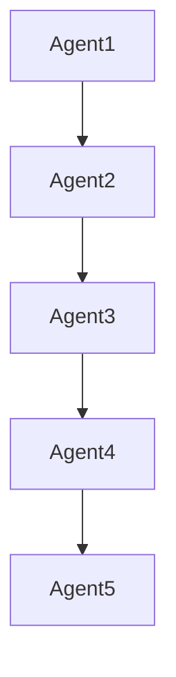

                 


---

# AI Agent的群体智能涌现机制研究

## 关键词：AI Agent、群体智能、涌现机制、多智能体系统、分布式计算

## 摘要：本文研究AI Agent的群体智能涌现机制，探讨其在多智能体系统中的应用与实现。通过分析群体智能的基本概念、数学模型、算法原理和系统架构，结合实际案例，深入解析涌现机制的核心原理及其在AI Agent中的应用。本文旨在为AI Agent的群体智能研究提供理论基础和实践指导。

---

# 第一部分: AI Agent的群体智能概述

## 第1章: AI Agent与群体智能概述

### 1.1 AI Agent的基本概念

#### 1.1.1 AI Agent的定义与特征
AI Agent（人工智能代理）是指能够感知环境并采取行动以实现目标的智能实体。其主要特征包括自主性、反应性、主动性、社会性和学习性。

#### 1.1.2 群体智能的基本概念
群体智能（Swarm Intelligence）是指通过多个简单个体（Agent）的协作，实现复杂问题求解的智能形式。其核心在于个体间的局部交互和全局涌现行为。

#### 1.1.3 群体智能与个体智能的关系
群体智能并非个体智能的简单叠加，而是通过个体间的协作涌现出新的智能特性，形成整体的群体智慧。

### 1.2 群体智能的典型应用场景

#### 1.2.1 分布式计算中的群体智能
在分布式系统中，通过多个Agent的协作完成任务分配、负载均衡等。

#### 1.2.2 多智能体系统中的协作
多智能体系统（Multi-Agent System, MAS）中，多个Agent通过协作完成复杂任务。

#### 1.2.3 群体智能在机器人和自动驾驶中的应用
在机器人编队、自动驾驶等领域，群体智能用于实现多机器人协作和交通优化。

### 1.3 群体智能的涌现机制

#### 1.3.1 涌现机制的基本概念
涌现机制是指个体简单行为通过相互作用，形成复杂的全局行为的过程。

#### 1.3.2 涌现机制的分类与特点
涌现机制可以分为局部涌现和全局涌现，具有简单规则、非中心化、自适应等特点。

#### 1.3.3 涌现机制在群体智能中的作用
涌现机制是群体智能的核心，通过个体间的协作，实现复杂任务的完成。

### 1.4 本章小结
本章介绍了AI Agent和群体智能的基本概念，探讨了群体智能的应用场景和涌现机制的核心作用。

---

## 第2章: 群体智能的数学模型与理论基础

### 2.1 群体智能的数学建模

#### 2.1.1 多智能体系统的数学模型
多智能体系统可以表示为一个动态系统，其中每个Agent的状态和行为通过数学方程描述。

#### 2.1.2 群体智能的动态模型
动态模型描述了个体Agent的行为如何影响整体系统状态的变化。

#### 2.1.3 群体智能的涌现机制模型
涌现机制模型描述了个体行为如何通过相互作用产生全局复杂行为。

### 2.2 群体智能的核心理论

#### 2.2.1 自组织理论
自组织理论研究个体通过局部规则实现整体结构的自我组织。

#### 2.2.2 协同理论
协同理论探讨个体间通过协作实现共同目标的过程。

#### 2.2.3 并行计算理论
并行计算理论为群体智能的分布式计算提供了理论基础。

### 2.3 群体智能的数学公式与模型分析

#### 2.3.1 群体智能的基本公式
个体Agent的行为可以通过以下公式表示：
$$
a_i(t) = f(s_i(t), s_{neighbors}(t))
$$
其中，$a_i(t)$ 表示第i个Agent在时间t的行为，$s_i(t)$ 和 $s_{neighbors}(t)$ 分别表示第i个Agent及其邻居的状态。

#### 2.3.2 涌现机制的数学表达
涌现机制可以通过以下方程描述：
$$
S(t+1) = F(S(t), A(t))
$$
其中，$S(t)$ 表示时间t的系统状态，$A(t)$ 表示个体Agent的行为，$F$ 表示系统的动态函数。

#### 2.3.3 群体智能模型的复杂度分析
群体智能模型的复杂度可以通过计算每个Agent的交互次数和系统规模来评估。

### 2.4 本章小结
本章通过数学建模和理论分析，揭示了群体智能的内在机制和数学表达。

---

## 第3章: 群体智能的算法原理与实现

### 3.1 群体智能的算法概述

#### 3.1.1 分布式算法
分布式算法通过多个Agent的协作完成任务，具有高并行性和容错性。

#### 3.1.2 并行算法
并行算法利用多个计算单元同时处理问题，提高计算效率。

#### 3.1.3 自适应算法
自适应算法能够根据环境变化动态调整行为策略。

### 3.2 群体智能的核心算法

#### 3.2.1 分布式计算算法
分布式计算算法包括任务分配、负载均衡等。

#### 3.2.2 协作算法
协作算法通过个体间的通信和协调实现共同目标。

#### 3.2.3 自组织算法
自组织算法模拟生物群落的自组织行为，实现系统结构的动态优化。

### 3.3 群体智能算法的实现

#### 3.3.1 算法实现的步骤
1. 确定问题目标
2. 设计个体行为规则
3. 实现个体间通信
4. 系统集成与测试

#### 3.3.2 算法实现的代码示例
以下是一个简单的群体智能算法代码示例：
```python
class Agent:
    def __init__(self, id):
        self.id = id
        self.state = 0

    def update(self, neighbors):
        new_state = 0
        for neighbor in neighbors:
            new_state += neighbor.state
        self.state = new_state

agents = [Agent(i) for i in range(5)]
```

#### 3.3.3 算法实现的优化与改进
优化包括减少通信开销、提高计算效率等。

### 3.4 本章小结
本章详细介绍了群体智能算法的原理与实现步骤，并通过代码示例进行了说明。

---

## 第4章: 群体智能系统的架构设计

### 4.1 群体智能系统的架构概述

#### 4.1.1 系统架构的基本概念
系统架构描述了系统各组成部分的结构和交互方式。

#### 4.1.2 群体智能系统的分层架构
分层架构包括感知层、决策层和执行层。

#### 4.1.3 群体智能系统的模块化设计
模块化设计将系统划分为功能模块，便于开发和维护。

### 4.2 群体智能系统的功能设计

#### 4.2.1 系统功能模块划分
功能模块包括个体行为模块、通信模块、协作模块等。

#### 4.2.2 系统功能模块的交互设计
通过定义模块间的接口和消息传递，实现模块间的协作。

#### 4.2.3 系统功能模块的实现方案
每个功能模块通过特定算法实现其功能。

### 4.3 群体智能系统的架构图

#### 4.3.1 系统架构图的绘制
使用Mermaid绘制系统架构图：


#### 4.3.2 系统架构图的分析
分析图中各Agent之间的交互关系和信息流。

#### 4.3.3 系统架构图的优化与改进
优化包括减少冗余交互、提高系统效率等。

### 4.4 本章小结
本章通过系统架构设计，明确了群体智能系统的组成部分及其交互方式。

---

## 第5章: 群体智能的项目实战与案例分析

### 5.1 项目背景与需求分析

#### 5.1.1 项目背景
本项目旨在通过群体智能实现多Agent的协作任务。

#### 5.1.2 项目需求分析
需求包括任务分配、协作通信、结果反馈等。

#### 5.1.3 项目目标的确定
项目目标是实现一个高效的多Agent协作系统。

### 5.2 项目系统设计

#### 5.2.1 系统设计的总体思路
采用模块化设计，确保系统可扩展性和可维护性。

#### 5.2.2 系统设计的具体方案
包括Agent行为设计、通信协议设计、系统架构设计等。

#### 5.2.3 系统设计的实现步骤
1. 确定系统需求
2. 设计系统架构
3. 实现各个模块
4. 系统集成与测试

### 5.3 项目实现与代码分析

#### 5.3.1 项目实现的代码框架
```python
class Agent:
    def __init__(self, id):
        self.id = id
        self.state = 0

    def update(self, neighbors):
        new_state = 0
        for neighbor in neighbors:
            new_state += neighbor.state
        self.state = new_state

agents = [Agent(i) for i in range(5)]
```

#### 5.3.2 代码实现的具体细节
详细说明代码中的每个部分及其功能。

#### 5.3.3 代码实现的优化与改进
优化包括减少通信开销、提高计算效率等。

### 5.4 项目案例分析

#### 5.4.1 案例分析的背景
分析一个实际的群体智能项目，如多机器人协作。

#### 5.4.2 案例分析的具体过程
详细描述项目实施的过程和遇到的问题。

#### 5.4.3 案例分析的结果与总结
总结项目成果及其在实际应用中的效果。

### 5.5 本章小结
本章通过项目实战和案例分析，展示了群体智能的实现过程和应用效果。

---

## 第6章: 群体智能的优化与展望

### 6.1 群体智能的优化方向

#### 6.1.1 算法优化
优化算法的效率和性能，提高系统响应速度。

#### 6.1.2 系统架构优化
优化系统架构，提高系统的可扩展性和可维护性。

#### 6.1.3 应用场景优化
针对不同的应用场景，优化系统的实现方案。

### 6.2 群体智能的未来展望

#### 6.2.1 新技术的应用
随着AI技术的发展，群体智能将与更多新技术结合。

#### 6.2.2 新应用场景的探索
群体智能将在更多领域得到应用，如智慧城市、智能交通等。

#### 6.2.3 群体智能的理论研究
进一步研究群体智能的理论基础和数学模型。

### 6.3 本章小结
本章探讨了群体智能的优化方向和未来发展趋势，为后续研究提供了方向。

---

## 作者：AI天才研究院/AI Genius Institute & 禅与计算机程序设计艺术 /Zen And The Art of Computer Programming

---

通过以上思考，我逐步分析了《AI Agent的群体智能涌现机制研究》的各个方面，从基本概念到算法实现，再到系统设计和项目实战，最终提出了优化方向和未来展望。

