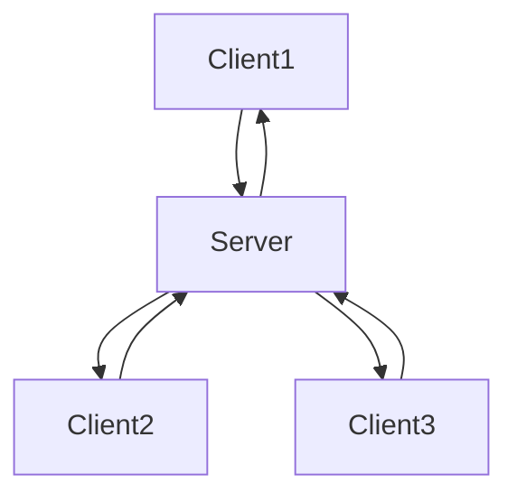

                 


# AI Agent的联邦学习技术应用

---

## 关键词：AI Agent、联邦学习、分布式学习、数据隐私、协作学习

---

## 摘要：AI Agent与联邦学习的结合为分布式环境下的智能协作提供了新的可能性。本文系统地探讨了AI Agent在联邦学习中的角色、核心算法、系统架构及实际应用，分析了当前技术的挑战与解决方案，并展望了未来的发展方向。

---

## 第1章: AI Agent与联邦学习技术概述

### 1.1 AI Agent的基本概念

#### 1.1.1 AI Agent的定义与特点

AI Agent（人工智能代理）是指能够感知环境、采取行动以实现特定目标的智能实体。AI Agent可以是软件程序、机器人或其他智能系统，具备以下特点：

- **自主性**：能够在没有外部干预的情况下自主决策。
- **反应性**：能够实时感知环境并做出反应。
- **目标导向**：所有行为都以实现特定目标为导向。
- **社交能力**：能够与其他系统或人类进行交互和协作。

#### 1.1.2 AI Agent的核心功能与应用场景

AI Agent的核心功能包括：

1. **感知环境**：通过传感器或其他数据源获取环境信息。
2. **决策与推理**：基于感知信息进行推理和决策。
3. **执行行动**：根据决策结果执行具体的动作。
4. **学习与适应**：通过与环境的交互不断优化自身的行为策略。

AI Agent的应用场景广泛，包括自动驾驶、智能助手、机器人协作、分布式系统优化等。

#### 1.1.3 联邦学习技术的背景与意义

联邦学习（Federated Learning）是一种分布式机器学习技术，允许多个参与方在不共享原始数据的情况下协作训练模型。其核心思想是：将数据保留在本地，仅在需要时进行模型更新的同步。

联邦学习的意义在于：

- **保护数据隐私**：数据无需离开本地，减少了数据泄露的风险。
- **支持分布式场景**：适用于数据分布式的场景，如移动设备、物联网等。
- **提升模型泛化能力**：通过聚合不同数据源的信息，模型更具鲁棒性和泛化能力。

### 1.2 联邦学习技术的基本原理

#### 1.2.1 联邦学习的定义与特点

联邦学习是指多个参与方协作训练共享模型，同时保持数据隐私的技术。其特点包括：

- **数据分布式存储**：数据分布在不同的参与方，每个参与方持有自己的数据集。
- **模型联合训练**：所有参与方共同优化一个全局模型，但数据不共享。
- **隐私保护**：通过加密或其他技术确保数据隐私。

#### 1.2.2 联邦学习与传统机器学习的区别

传统机器学习需要将所有数据集中到一个中心服务器进行训练，而联邦学习则通过分布式训练和模型聚合的方式，避免了数据的集中存储和传输。

| 对比维度 | 传统机器学习 | 联邦学习 |
|----------|--------------|----------|
| 数据存储 | 集中式        | 分布式    |
| 数据传输 | 高            | 低        |
| 数据隐私 | 低            | 高        |

#### 1.2.3 联邦学习的核心技术与优势

联邦学习的核心技术包括：

1. **模型聚合**：通过特定算法（如FedAvg）将各参与方的局部模型参数聚合为全局模型。
2. **数据加密**：通过加密技术确保数据在传输过程中的安全性。
3. **通信协议**：定义参与方之间的数据交互方式和通信机制。

联邦学习的优势在于：

- **保护隐私**：数据无需离开本地，隐私保护效果好。
- **支持分布式场景**：适用于数据分布式的场景，如移动设备、物联网等。
- **模型泛化能力强**：通过聚合不同数据源的信息，模型更具鲁棒性和泛化能力。

### 1.3 AI Agent在联邦学习中的作用

#### 1.3.1 AI Agent与联邦学习的结合

AI Agent可以作为联邦学习中的参与方，与其他代理或服务器进行协作，共同训练模型。每个AI Agent负责处理自己的数据，并将模型更新结果发送给服务器或其他代理。

#### 1.3.2 AI Agent在联邦学习中的功能定位

AI Agent在联邦学习中的功能定位可以是：

1. **数据提供者**：拥有自己的数据集，并参与模型的训练。
2. **模型训练者**：在本地数据上训练模型，并将更新后的模型参数发送到服务器。
3. **决策者**：基于全局模型进行决策和行动。

#### 1.3.3 联邦学习技术在AI Agent中的应用前景

随着AI Agent技术的不断发展，联邦学习在AI Agent中的应用前景广阔。通过联邦学习，多个AI Agent可以协作训练共享模型，提升整体系统的智能性和决策能力。这种协作模式可以在自动驾驶、智能城市、分布式机器人等领域发挥重要作用。

### 1.4 本章小结

本章介绍了AI Agent的基本概念、核心功能和应用场景，并探讨了联邦学习技术的背景、基本原理和优势。同时，分析了AI Agent在联邦学习中的作用和应用前景，为后续章节的深入讨论奠定了基础。

---

## 第2章: 联邦学习的核心概念

### 2.1 联邦学习的体系结构

#### 2.1.1 联邦学习的参与方

联邦学习的参与方通常包括：

1. **客户端（Client）**：拥有数据的参与方，负责本地模型的训练和更新。
2. **服务器（Server）**：负责协调各客户端的模型聚合和同步。
3. **协调者（Coordinator）**：负责整个联邦学习过程的组织和管理。

#### 2.1.2 联邦学习的数据分布

联邦学习的数据分布通常是分散的，每个客户端只拥有部分数据，且数据分布可能不均匀。

#### 2.1.3 联邦学习的通信协议

通信协议定义了客户端与服务器之间的数据交互方式，包括数据格式、传输频率和加密方式等。

### 2.2 联邦学习的协议与机制

#### 2.2.1 联邦学习的同步机制

同步机制决定了客户端与服务器之间的模型更新频率。常见的同步机制包括：

1. **同步更新**：所有客户端同时更新模型，并将结果发送给服务器。
2. **异步更新**：客户端可以在不同的时间点更新模型，服务器随时接收客户端的更新。

#### 2.2.2 联邦学习的安全机制

安全机制用于保护数据隐私和模型安全，常见的安全机制包括：

1. **加密技术**：对传输的数据进行加密，防止数据泄露。
2. **差分隐私**：通过添加噪声确保数据的隐私性。
3. **访问控制**：限制只有授权的客户端才能参与模型训练。

#### 2.2.3 联邦学习的优化策略

优化策略用于提高联邦学习的效率和模型性能，包括：

1. **模型压缩**：通过压缩模型参数减少传输数据量。
2. **异构计算**：在不同设备上进行不同精度的计算，提高效率。
3. **动态成员管理**：根据客户端的性能动态调整参与训练的客户端数量。

### 2.3 联邦学习的核心算法

#### 2.3.1 联邦平均（FedAvg）算法

FedAvg（Federated Average）是最经典的联邦学习算法之一，其核心思想是每个客户端在本地数据上训练模型，并将模型参数的更新量发送给服务器。服务器将所有客户端的更新量进行加权平均，生成新的全局模型。

#### 2.3.2 联邦聚合（FedProx）算法

FedProx（Federated Proximal）是一种基于 proximal 的联邦学习算法，其在 FedAvg 的基础上引入了正则化项，以进一步优化模型的泛化能力。

#### 2.3.3 其他联邦学习算法概述

除了 FedAvg 和 FedProx，还有一些其他联邦学习算法，如：

1. **FedSGD**：基于随机梯度下降的联邦学习算法。
2. **FedYogi**：结合了Yogi优化器的联邦学习算法。
3. **FedAdmm**：基于ADMM（交替方向乘子法）的联邦学习算法。

### 2.4 本章小结

本章详细介绍了联邦学习的核心概念，包括体系结构、参与方、数据分布、通信协议、同步机制、安全机制和优化策略。同时，还讨论了几种常见的联邦学习算法，为后续章节的算法实现奠定了基础。

---

## 第3章: 联邦学习的算法原理与数学模型

### 3.1 联邦学习的算法原理

#### 3.1.1 联邦平均（FedAvg）算法

##### 算法流程图（使用 Mermaid）



##### 算法数学模型

假设我们有一个全局模型 $\theta$，每个客户端$i$有本地数据集 $D_i$。客户端$i$在本地数据上训练模型，得到参数更新量 $\Delta\theta_i$。服务器将所有客户端的更新量进行加权平均，得到新的全局模型：

$$ \theta_{new} = \theta_{old} + \sum_{i=1}^{k} w_i \Delta\theta_i $$

其中，$w_i$ 是客户端$i$的权重，通常与数据量成正比。

#### 3.1.2 联邦聚合（FedProx）算法

##### 算法流程图（使用 Mermaid）


##### 算法数学模型

FedProx 的目标函数如下：

$$ \min_{\theta} \frac{1}{n}\sum_{i=1}^{n} \mathcal{L}(y_i, \theta) + \lambda \Omega(\theta) $$

其中，$\mathcal{L}$ 是损失函数，$\Omega(\theta)$ 是正则化项，$\lambda$ 是正则化系数。

##### 代码实现

以下是一个简单的 FedProx 算法的 Python 实现示例：

```python
import numpy as np

def fedprox_algorithm(global_theta, local_data, lambda_):
    # 初始化模型参数
    theta = global_theta.copy()
    
    # 训练模型
    for _ in range(num_epochs):
        # 前向传播
        output = model.predict(local_data, theta)
        # 计算损失
        loss = model.loss(local_data, output)
        # 反向传播
        gradient = model.backpropagate(local_data, output)
        # 更新参数
        theta = theta - learning_rate * gradient + lambda_ * (theta - global_theta)
    
    return theta
```

#### 3.1.3 算法对比与选择

在选择具体的联邦学习算法时，需要考虑以下因素：

- **数据分布**：数据是否均匀分布。
- **通信成本**：客户端与服务器之间的通信带宽和延迟。
- **模型复杂度**：模型的参数数量和训练时间。
- **隐私保护**：对隐私保护的要求。

不同的算法适用于不同的场景，例如：

- FedAvg 适用于数据均匀分布且通信成本低的场景。
- FedProx 适用于数据分布不均匀且需要更强模型泛化的场景。

### 3.2 本章小结

本章详细介绍了联邦学习的核心算法 FedAvg 和 FedProx 的原理和数学模型，并通过 Mermaid 流程图和 Python 代码示例帮助读者理解算法的实现过程。同时，还讨论了算法选择的因素和不同场景下的适用性。

---

## 第4章: 联邦学习的系统架构设计

### 4.1 系统架构概述

联邦学习的系统架构通常包括以下几个部分：

1. **客户端**：负责本地数据的训练和模型更新。
2. **服务器**：负责接收客户端的模型更新，并进行全局模型的聚合和分发。
3. **协调者**：负责整个联邦学习过程的组织和管理。

### 4.2 系统功能设计

#### 4.2.1 系统功能模块

系统功能模块包括：

1. **数据管理模块**：负责数据的存储和管理。
2. **模型训练模块**：负责本地模型的训练和更新。
3. **通信模块**：负责与服务器或其他客户端的交互。
4. **隐私保护模块**：负责数据的加密和隐私保护。

#### 4.2.2 系统功能流程

系统功能流程如下：

1. **初始化**：客户端加载本地数据，服务器初始化全局模型。
2. **模型训练**：客户端在本地数据上训练模型，并计算参数更新量。
3. **模型聚合**：服务器将所有客户端的更新量进行聚合，生成新的全局模型。
4. **模型分发**：服务器将更新后的全局模型分发给客户端。

### 4.3 系统架构设计

#### 4.3.1 系统架构图（使用 Mermaid）


#### 4.3.2 系统接口设计

系统接口设计包括：

1. **客户端接口**：提供训练和更新接口。
2. **服务器接口**：提供接收和发送模型更新的接口。
3. **协调者接口**：提供组织和管理联邦学习过程的接口。

#### 4.3.3 系统交互流程图（使用 Mermaid）


### 4.4 本章小结

本章详细介绍了联邦学习系统的架构设计，包括功能模块、系统架构图和交互流程图。通过 Mermaid 图表和文字描述，帮助读者更好地理解系统的整体架构和各部分之间的关系。

---

## 第5章: 联邦学习的项目实战

### 5.1 项目环境安装

#### 5.1.1 安装 Python 和依赖库

```bash
pip install numpy matplotlib
```

#### 5.1.2 安装联邦学习框架（可选）

```bash
pip install fedlearn
```

### 5.2 系统核心实现

#### 5.2.1 客户端实现

```python
import numpy as np

class Client:
    def __init__(self, data):
        self.data = data
        self.theta = np.random.randn(10, 1)
    
    def train(self, global_theta):
        # 前向传播
        output = self.model.predict(self.data, global_theta)
        # 计算损失
        loss = self.model.loss(self.data, output)
        # 反向传播
        gradient = self.model.backpropagate(self.data, output)
        # 更新参数
        self.theta = self.theta - learning_rate * gradient
        return self.theta
```

#### 5.2.2 服务器实现

```python
import numpy as np

class Server:
    def __init__(self, global_theta):
        self.global_theta = global_theta
    
    def aggregate(self, updates):
        # 计算平均更新量
        avg_update = np.mean(updates, axis=0)
        self.global_theta += avg_update
        return self.global_theta
```

### 5.3 代码应用解读与分析

#### 5.3.1 代码功能分析

上述代码实现了客户端和服务器的基本功能，客户端在本地数据上训练模型，并将更新后的参数发送给服务器。服务器将所有客户端的更新量进行平均，生成新的全局模型。

#### 5.3.2 代码优化建议

1. **模型压缩**：在传输过程中对模型参数进行压缩，减少数据量。
2. **异步更新**：允许多个客户端异步更新模型，提高效率。
3. **差分隐私**：在更新过程中添加噪声，保护数据隐私。

### 5.4 实际案例分析

#### 5.4.1 案例背景

假设我们有三个客户端，每个客户端拥有不同的数据集，希望在不共享数据的情况下共同训练一个全局模型。

#### 5.4.2 案例实现

```python
# 初始化全局模型
global_theta = np.random.randn(10, 1)

# 初始化客户端
client1 = Client(data1)
client2 = Client(data2)
client3 = Client(data3)

# 服务器初始化
server = Server(global_theta)

# 联邦学习过程
for _ in range(num_epochs):
    # 客户端训练
    update1 = client1.train(global_theta)
    update2 = client2.train(global_theta)
    update3 = client3.train(global_theta)
    
    # 服务器聚合
    new_theta = server.aggregate([update1, update2, update3])
    
    # 更新全局模型
    global_theta = new_theta
```

### 5.5 项目小结

本章通过具体的项目实战，详细讲解了联邦学习系统的实现过程，包括环境安装、代码实现和案例分析。通过实际操作，读者可以更好地理解联邦学习技术的应用和实现细节。

---

## 第6章: 联邦学习的优化与挑战

### 6.1 联邦学习的优化策略

#### 6.1.1 模型压缩

模型压缩可以通过以下方式实现：

1. **剪枝**：去除模型中冗余的参数。
2. **量化**：将模型参数的精度降低（如从浮点数降到整数）。
3. **知识蒸馏**：将大模型的知识迁移到小模型。

#### 6.1.2 异构计算

异构计算通过利用不同计算设备（如CPU、GPU、TPU）的优势，进一步优化模型训练和推理的效率。

#### 6.1.3 动态成员管理

动态成员管理可以根据客户端的性能动态调整参与训练的客户端数量，提高整体效率。

### 6.2 联邦学习的挑战与解决方案

#### 6.2.1 数据异构性

数据异构性是指不同客户端的数据分布和质量不同，这会影响模型的聚合效果。解决方案包括：

1. **加权聚合**：根据数据量或质量对客户端的更新量进行加权。
2. **数据预处理**：对数据进行标准化或归一化处理，减少数据异构性的影响。

#### 6.2.2 通信延迟

通信延迟是影响联邦学习效率的主要因素之一。解决方案包括：

1. **异步更新**：允许多个客户端异步更新模型，减少通信延迟。
2. **断点续传**：在通信中断时，保存当前的更新进度，恢复通信后继续传输。

#### 6.2.3 隐私泄露风险

尽管联邦学习强调数据隐私保护，但仍然存在隐私泄露的风险。解决方案包括：

1. **差分隐私**：通过添加噪声确保数据的隐私性。
2. **同态加密**：在加密状态下进行模型训练和推理。
3. **访问控制**：限制只有授权的客户端才能参与模型训练。

### 6.3 本章小结

本章分析了联邦学习的优化策略和面临的挑战，并提出了相应的解决方案。通过模型压缩、异构计算和动态成员管理等优化策略，可以进一步提升联邦学习的效率和性能。同时，针对数据异构性、通信延迟和隐私泄露风险等问题，提出了多种解决方案，为实际应用提供了参考。

---

## 第7章: 联邦学习的未来展望与总结

### 7.1 未来发展方向

#### 7.1.1 技术层面

1. **更高效的算法**：开发更高效的联邦学习算法，进一步提升模型性能和训练效率。
2. **更强大的隐私保护**：研究更先进的加密技术和隐私保护机制，确保数据的安全性。
3. **更智能的协作机制**：通过智能协作机制，动态调整参与方的权重和角色，提高整体系统的智能化水平。

#### 7.1.2 应用层面

1. **边缘计算**：将联邦学习技术应用于边缘计算，提升边缘设备的智能性和数据处理能力。
2. **多模态数据融合**：研究如何在联邦学习中融合多模态数据（如图像、文本、语音等），提升模型的综合分析能力。
3. **跨领域应用**：将联邦学习技术扩展到更多领域，如医疗、金融、交通等，推动各行业的智能化发展。

### 7.2 本章小结

本章展望了联邦学习技术的未来发展方向，从技术层面和应用层面进行了分析。通过技术的不断进步和应用的不断扩展，联邦学习将在更多领域发挥重要作用，推动人工智能技术的发展。

---

## 作者：AI天才研究院 & 禅与计算机程序设计艺术

---

### **最佳实践 Tips**

- 在实际应用中，建议根据具体场景选择合适的联邦学习算法，并结合实际需求进行优化。
- 在数据隐私保护方面，可以采用差分隐私、同态加密等技术，确保数据的安全性。
- 在系统设计中，建议采用模块化设计，便于后续的扩展和维护。

### **小结**

通过本文的系统介绍，读者可以全面了解AI Agent在联邦学习中的应用，从基本概念到算法实现，再到系统设计和项目实战，为实际应用提供了丰富的理论和实践指导。

### **注意事项**

- 在实际项目中，需要根据具体需求选择合适的算法和优化策略。
- 数据隐私保护是联邦学习的核心，必须引起高度重视。
- 系统设计时，建议充分考虑通信延迟、数据异构性等问题，确保系统的高效性和稳定性。

### **拓展阅读**

1. **《Federated Learning: Challenges, Methods, and Future Directions》**
2. **《Differential Privacy: A Survey of the State of the Art》**
3. **《Secure Multi-Party Computation: foundations and applications》**

--- 

以上是完整的文章内容，涵盖了从理论到实践的各个方面，通过详细的分析和具体的案例，帮助读者全面理解AI Agent在联邦学习中的应用。

