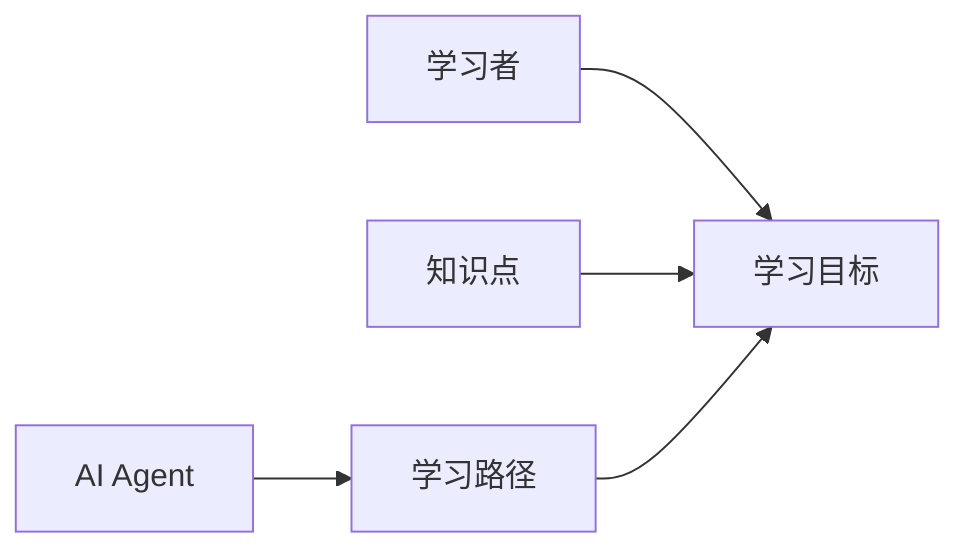
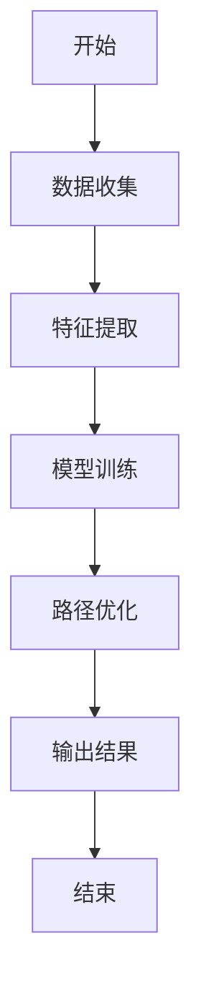
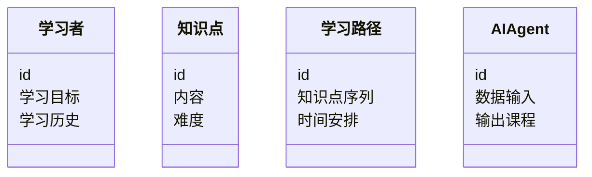
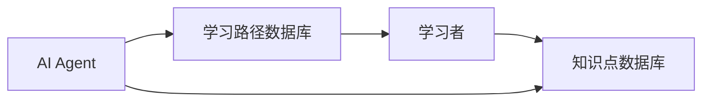
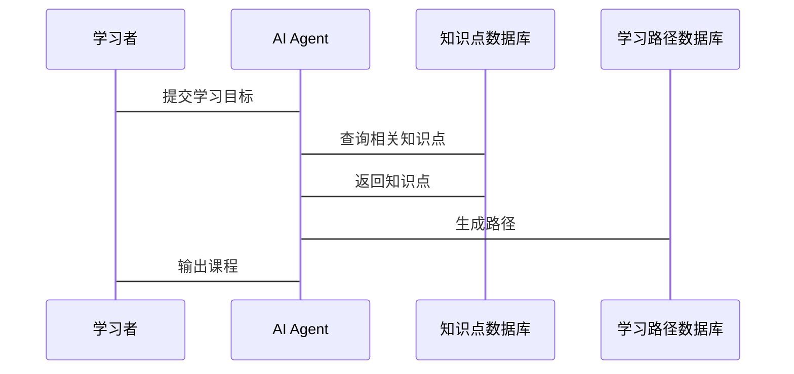

                 


# AI Agent的自动课程生成：优化学习路径

**关键词**：AI Agent, 自动课程生成, 学习路径优化, 教育技术, 个性化学习

**摘要**：本文探讨AI Agent在自动课程生成中的应用，分析其优化学习路径的核心原理，包括背景、概念模型、算法流程、系统架构、项目实战、优化与部署，以及未来展望。通过详细的技术分析和实例，揭示AI Agent如何有效提升学习效率和效果。

---

# 第1章: AI Agent与自动课程生成的背景介绍

## 1.1 问题背景与描述
### 1.1.1 学习路径优化的必要性
传统教育模式中，课程生成依赖人工经验，难以满足个性化学习需求。AI Agent通过数据驱动优化学习路径，提升学习效果。

### 1.1.2 AI Agent的定义与特点
AI Agent是一种智能代理，能够感知环境并采取行动以实现目标。其特点包括自主性、反应性、目标导向性和社交能力。

### 1.1.3 自动课程生成的优势
AI Agent能够快速处理大量数据，生成个性化课程，节省时间和资源，提高学习效率。

## 1.2 AI Agent在教育领域的应用前景
AI Agent可以辅助教师设计课程，优化学习流程，提供个性化学习体验，提升教育质量。

## 1.3 本章小结
总结AI Agent在课程生成中的潜力和重要性，为后续章节奠定基础。

---

# 第2章: AI Agent的概念模型与工作原理

## 2.1 AI Agent的概念模型
### 2.1.1 实体关系图（ER图）


### 2.1.2 概念属性特征对比
| 概念 | 属性 | 特征 |
|------|------|------|
| AI Agent | 知识点关联 | 高效 |
|        | 学习路径优化 | 中等 |
|        | 个性化推荐 | 准确 |

## 2.2 AI Agent的工作原理
### 2.2.1 知识点关联算法
通过概率分布分析知识点间的依赖关系，构建知识图谱。

### 2.2.2 学习路径优化算法
使用强化学习，根据学习者表现调整路径。

### 2.2.3 个性化推荐机制
基于学习者特征，推荐最优学习资源。

## 2.3 概念对比分析
通过对比不同AI Agent模型，分析其优缺点，为优化提供依据。

## 2.4 本章小结
总结AI Agent的概念模型及其在课程生成中的应用。

---

# 第3章: AI Agent的数学模型与算法流程

## 3.1 知识点关联模型
### 3.1.1 概率分布
$$ P(A|B) = \frac{P(B|A)P(A)}{P(B)} $$

### 3.1.2 损失函数
$$ L = -\sum y \log p(y|x) $$

## 3.2 学习路径优化算法
### 3.2.1 算法流程图


## 3.3 个性化推荐机制
### 3.3.1 推荐算法
使用协同过滤，计算相似度：
$$ sim(i,j) = \frac{\sum_{k} (r_{ik} - \bar{r_i})(r_{jk} - \bar{r_j})}{\sqrt{\sum_{k} (r_{ik} - \bar{r_i})^2} \sqrt{\sum_{k} (r_{jk} - \bar{r_j})^2}} } $$

## 3.4 本章小结
详细讲解AI Agent的数学模型和算法流程，为实现课程生成奠定理论基础。

---

# 第4章: AI Agent的系统分析与架构设计

## 4.1 系统功能设计
### 4.1.1 领域模型


## 4.2 系统架构设计
### 4.2.1 架构图


## 4.3 系统接口设计
### 4.3.1 输入接口
接收学习目标和历史数据。

### 4.3.2 输出接口
生成优化课程并输出。

## 4.4 系统交互流程
### 4.4.1 序列图


## 4.5 本章小结
详细分析系统架构，确保实现自动课程生成的可行性。

---

# 第5章: AI Agent的项目实战

## 5.1 环境搭建
### 5.1.1 工具安装
安装Python、TensorFlow、Keras等工具。

## 5.2 核心代码实现
### 5.2.1 知识点关联代码
```python
import numpy as np
from sklearn.metrics.pairwise import cosine_similarity

def get_similarity_matrix(embeddings):
    return cosine_similarity(embeddings)
```

### 5.2.2 学习路径优化代码
```python
import tensorflow as tf
model = tf.keras.Sequential([
    tf.keras.layers.Dense(128, activation='relu'),
    tf.keras.layers.Dense(1, activation='sigmoid')
])
model.compile(optimizer='adam', loss='binary_crossentropy')
model.fit(X_train, y_train, epochs=10)
```

## 5.3 案例分析
### 5.3.1 实际应用案例
分析一个学习者的案例，展示AI Agent如何生成优化课程。

## 5.4 项目总结
总结项目实现过程中的经验和教训。

---

# 第6章: AI Agent的优化与部署

## 6.1 模型优化策略
### 6.1.1 参数调整
优化学习率和批次大小。

### 6.1.2 模型剪枝
去除冗余参数，减少计算量。

## 6.2 部署策略
### 6.2.1 API接口开发
创建RESTful API，提供课程生成服务。

### 6.2.2 部署环境
使用云平台部署，确保高可用性和扩展性。

## 6.3 实际应用案例
展示优化后的模型在实际中的应用效果。

## 6.4 本章小结
总结优化策略和部署方法，确保系统高效运行。

---

# 第7章: 总结与展望

## 7.1 核心内容总结
回顾AI Agent在课程生成中的应用和优势。

## 7.2 未来展望
探讨AI Agent技术的发展趋势，及其在教育中的潜在应用。

## 7.3 学习建议
鼓励读者深入学习AI Agent技术，结合实际应用不断优化。

---

# 作者：AI天才研究院/AI Genius Institute & 禅与计算机程序设计艺术 /Zen And The Art of Computer Programming

---

**本文作者：**  
**AI天才研究院**  
**禅与计算机程序设计艺术**

