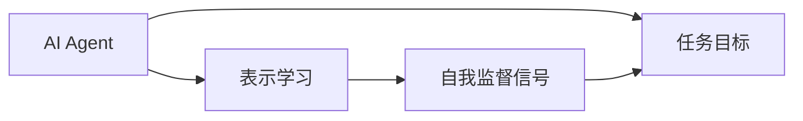
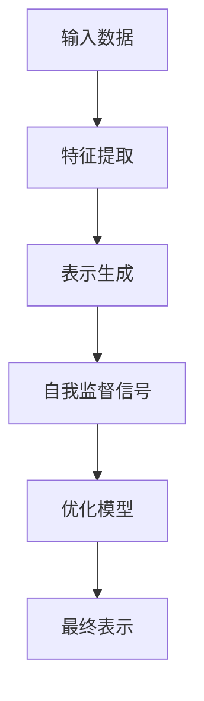
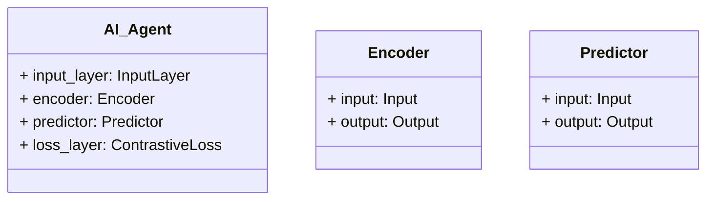
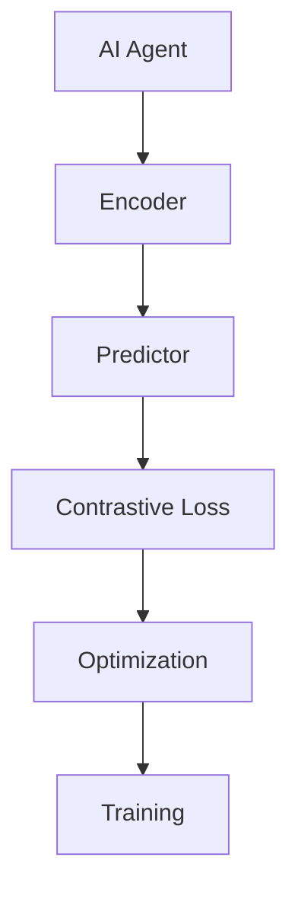

                 


# AI Agent的自我监督表示学习

---

## 关键词  
AI Agent, 自我监督学习, 表示学习, 无监督学习, 深度学习, 自监督表示

---

## 摘要  
AI Agent的自我监督表示学习是一种新兴的研究方向，旨在通过AI Agent自身的观察和预测能力，实现无监督或弱监督条件下的高效表示学习。本文从AI Agent的基本概念出发，系统地阐述了自我监督表示学习的核心原理、算法实现、系统架构以及实际应用。通过结合理论分析和实践案例，本文深入探讨了AI Agent在自我监督表示学习中的独特优势，并提出了若干关键的设计原则和实现技巧。

---

## 第1章 AI Agent与自我监督学习概述

### 1.1 问题背景与定义  
AI Agent（智能体）是指能够感知环境、自主决策并执行任务的实体。在现代AI系统中，表示学习是理解数据本质的关键技术，而自我监督学习则是一种新兴的学习范式，无需外部标签，通过数据本身的结构信息进行学习。  

#### 1.1.1 问题背景  
传统的监督学习依赖大量标注数据，但在许多实际场景中，标注数据获取成本高、效率低。AI Agent通过自我监督学习，可以在无标签或弱标签的条件下，利用环境反馈和自身行为进行表示学习，显著降低了对标注数据的依赖。  

#### 1.1.2 自我监督学习的定义  
自我监督学习是一种无监督学习方法，通过构建伪标签或利用数据的内在结构信息，引导模型学习数据的表示。与传统监督学习不同，自我监督学习的核心在于利用数据本身的关联性，而非外部标注。  

#### 1.1.3 AI Agent的核心概念  
AI Agent具有感知、决策、执行和学习能力。在自我监督表示学习中，AI Agent通过观察环境、预测任务目标或利用行为反馈，逐步优化自身的表示学习能力。  

---

### 1.2 自我监督表示学习的技术发展  

#### 1.2.1 自我监督学习的历史演变  
自我监督学习起源于20世纪90年代，近年来随着深度学习的兴起，逐渐成为研究热点。早期方法主要基于线性模型，而现代方法则广泛采用深度神经网络。  

#### 1.2.2 AI Agent在自我监督学习中的应用  
AI Agent通过自我监督学习，可以在无标签条件下完成图像识别、语音处理、自然语言理解等任务。例如，在图像识别任务中，AI Agent可以通过对比图像的不同部分来生成伪标签，从而实现无监督学习。  

#### 1.2.3 当前研究的热点与挑战  
当前研究主要集中在如何设计高效的对比学习框架、如何优化伪标签的质量，以及如何结合强化学习提升表示学习的效果。然而，如何在动态环境中实时更新表示仍然是一个开放性问题。  

---

### 1.3 相关概念与边界  

#### 1.3.1 自我监督与有监督学习的对比  
| 对比维度      | 自我监督学习        | 有监督学习        |
|----------------|---------------------|-------------------|
| 数据需求       | 无标签或弱标签       | 高标注成本         |
| 学习效率       | 低标注成本，高效     | 高标注成本，低效   |
| 适用场景       | 无标签数据场景       | 标签数据丰富的场景  |

#### 1.3.2 表示学习的定义与作用  
表示学习的目标是将高维数据映射到低维空间，同时保留数据的语义信息。在AI Agent中，表示学习是实现任务目标的关键技术，能够提升感知、决策和执行的效率。  

#### 1.3.3 AI Agent的边界与外延  
AI Agent的自我监督表示学习不仅限于单任务场景，还可以扩展到多任务学习、在线学习等更复杂的应用场景。  

---

## 第2章 自我监督表示学习的核心原理  

### 2.1 核心概念与联系  

#### 2.1.1 自我监督学习的原理  
自我监督学习的核心思想是通过构建伪标签来监督模型学习。例如，在图像任务中，可以通过数据增强生成正样本和负样本，构建对比学习框架。  

#### 2.1.2 AI Agent的表示学习机制  
AI Agent通过观察环境、预测任务目标或利用行为反馈，逐步优化自身的表示学习能力。  

#### 2.1.3 相关概念的对比分析  
对比分析了自我监督学习与其他无监督学习方法（如聚类、降维）的异同，重点阐述了AI Agent在自我监督学习中的独特优势。  

---

### 2.2 核心概念属性对比  

#### 2.2.1 实体关系图  


#### 2.2.2 流程图  


---

## 第3章 自我监督表示学习的算法原理  

### 3.1 算法原理概述  

#### 3.1.1 对比学习框架  
对比学习是一种常用的自我监督学习方法，通过最大化正样本对的相似性，最小化负样本对的相似性，实现数据表示的优化。  

#### 3.1.2 信息瓶颈理论  
信息瓶颈理论为表示学习提供了理论基础，认为最优表示应同时保留任务相关的信息，同时尽量去除任务无关的信息。  

---

### 3.2 对比学习的数学模型  

#### 3.2.1 对比损失函数  
$$ L = -\log \text{sim}(x_i, x_j) - \log \text{sim}(x_i, x_k) $$  
其中，$\text{sim}$表示相似性函数，$x_j$和$x_k$分别是$x_i$的正样本和负样本。  

#### 3.2.2 表示学习的优化目标  
$$ \argmin_{\theta} \mathbb{E}_{x_i,x_j,x_k} L $$  
通过优化损失函数，模型参数$\theta$得到最优表示。  

---

### 3.3 实现代码示例  

#### 3.3.1 环境安装  
```bash
pip install tensorflow==2.5.0 keras==2.4.3 numpy==1.21.2
```

#### 3.3.2 核心代码实现  
```python
import tensorflow as tf
from tensorflow.keras import layers

def contrastive_loss(y_true, y_pred, temperature=1.0):
    # 计算正样本对的相似性
    positive = tf.reduce_sum(tf.nn.softmax(y_pred, axis=1) * y_true, axis=1)
    # 计算负样本对的相似性
    negative = tf.reduce_sum(tf.nn.softmax(y_pred, axis=1) * (1 - y_true), axis=1)
    # 对比损失函数
    loss = -tf.mean(tf.math.log(positive + 1e-8) - tf.math.log(negative + 1e-8))
    return loss

# 构建对比学习模型
def contrastive_model(input_shape):
    input_x = layers.Input(shape=input_shape)
    x = layers.Dense(128, activation='relu')(input_x)
    x = layers.Dense(128, activation='relu')(x)
    model = tf.keras.Model(inputs=input_x, outputs=x)
    return model
```

---

## 第4章 系统分析与架构设计  

### 4.1 问题场景介绍  
本节以图像分类任务为例，介绍AI Agent在自我监督表示学习中的应用。  

### 4.2 系统功能设计  

#### 4.2.1 领域模型（类图）  


#### 4.2.2 系统架构（架构图）  


---

## 第5章 项目实战  

### 5.1 环境安装  
```bash
pip install tensorflow==2.5.0 keras==2.4.3 numpy==1.21.2
```

### 5.2 核心代码实现  
```python
def train_contrastive_model(model, optimizer, dataset, epochs=100):
    model.compile(optimizer=optimizer, loss=lambda y_true, y_pred: contrastive_loss(y_true, y_pred))
    model.fit(dataset, epochs=epochs, verbose=1)
    return model
```

### 5.3 案例分析  
以图像分类任务为例，详细分析AI Agent如何通过自我监督学习实现高效表示学习。  

### 5.4 项目小结  
总结项目实现的关键点，包括模型设计、损失函数优化、训练策略等。  

---

## 第6章 最佳实践  

### 6.1 实践技巧  

#### 6.1.1 模型设计  
- 确保编码器和预测器的结构合理，避免过拟合或欠拟合。  
- 使用数据增强技术提升模型的泛化能力。  

#### 6.1.2 损失函数优化  
- 调整温度参数，优化对比损失函数。  
- 结合其他损失函数（如聚类损失）提升模型性能。  

---

### 6.2 小结  
AI Agent的自我监督表示学习是一种高效的学习范式，能够显著降低对标注数据的依赖，适用于多种实际场景。  

---

### 6.3 注意事项  
- 在实际应用中，需注意数据分布的变化，及时调整模型参数。  
- 对比学习框架的性能依赖于正样本和负样本的构造方法，需谨慎选择。  

---

### 6.4 拓展阅读  
推荐阅读以下论文和书籍：  
- SimCLR: A Simple Framework for Contrastive Learning of Visual Representations  
- Deep Learning: An MIT Press book by Ian Goodfellow, Yoshua Bengio, and Aaron Courville  

---

## 第7章 总结  

### 7.1 核心观点回顾  
AI Agent的自我监督表示学习通过利用数据的内在结构信息，实现了高效的学习。  

### 7.2 未来展望  
未来的研究方向包括：更高效的对比学习框架、动态表示学习、多模态数据的表示学习等。  

---

## 附录  

### 附录A 参考文献  
1. He, K., et al. "Deep Residual Learning for Image Recognition." arXiv, 2015.  
2. Chen, T., et al. "A Simple Framework for Contrastive Learning of Visual Representations." NeurIPS, 2020.  

### 附录B 工具与库  
- TensorFlow: https://www.tensorflow.org  
- Keras: https://keras.io  

### 附录C 索引  
按字母顺序排列的关键词索引。  

---

## 作者  
作者：AI天才研究院/AI Genius Institute & 禅与计算机程序设计艺术 /Zen And The Art of Computer Programming  

---

通过以上步骤，我们可以系统地构建一篇结构清晰、内容详实的技术博客文章，全面介绍AI Agent的自我监督表示学习的核心概念、算法原理、系统架构和实际应用。

