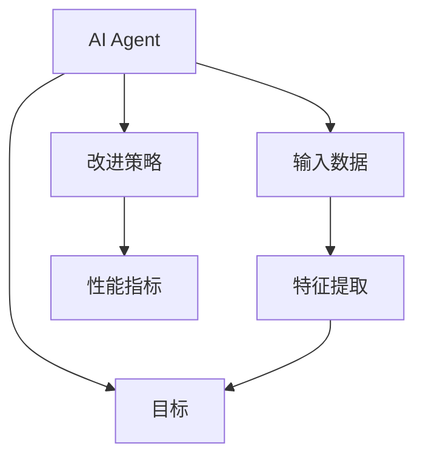
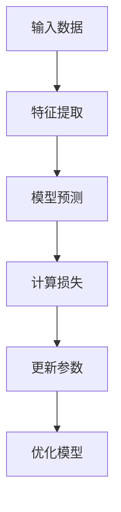
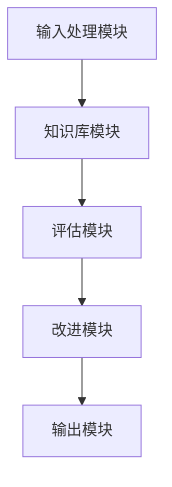
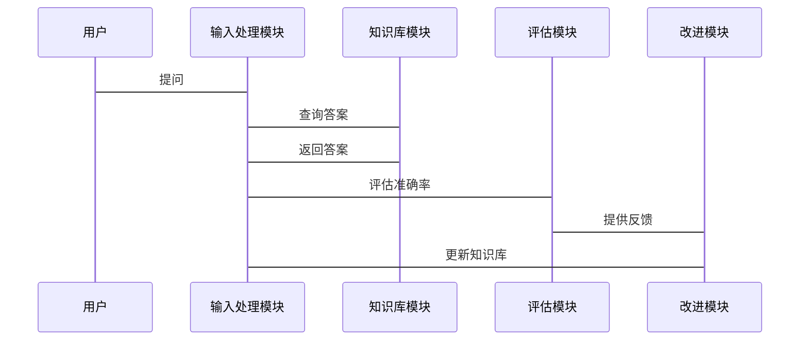

                 


# AI Agent的自我评估与改进机制

## 关键词：AI Agent，自我评估，改进机制，算法原理，系统设计

## 摘要：AI Agent作为人工智能的重要组成部分，其自我评估与改进机制是实现智能化和自适应能力的关键。本文详细探讨了AI Agent自我评估的核心概念、算法原理、系统架构设计以及实际应用案例，帮助读者全面理解并掌握相关技术。

---

# 第一部分: AI Agent的自我评估与改进机制概述

## 第1章: AI Agent的基本概念与背景

### 1.1 AI Agent的定义与特点
#### 1.1.1 什么是AI Agent
AI Agent（人工智能代理）是指能够感知环境、自主决策并采取行动以实现目标的智能实体。与传统的被动程序不同，AI Agent具备主动性和适应性，能够根据环境反馈动态调整行为。

#### 1.1.2 AI Agent的核心特点
- **自主性**：能够在没有外部干预的情况下自主决策。
- **反应性**：能够实时感知环境并做出反应。
- **目标导向性**：所有行为都以实现特定目标为导向。
- **学习能力**：通过经验或数据不断优化自身的性能。

#### 1.1.3 AI Agent的应用场景
AI Agent广泛应用于自动驾驶、智能助手、机器人、推荐系统等多个领域。例如，自动驾驶汽车中的AI Agent需要实时感知路况并做出决策；智能助手（如Siri、Alexa）需要根据用户需求提供服务。

---

### 1.2 自我评估与改进机制的背景
#### 1.2.1 为什么需要AI Agent的自我评估
AI Agent在复杂多变的环境中运行，可能会遇到未曾预料的情况。为了保证其性能和可靠性，AI Agent需要具备自我评估能力，能够发现自身的不足并进行改进。

#### 1.2.2 改进机制的重要性
改进机制是AI Agent实现自适应和优化的关键。通过不断评估自身的表现，AI Agent可以调整参数、优化算法或更新知识库，从而提高任务完成效率和准确性。

#### 1.2.3 当前技术背景与发展趋势
随着深度学习和强化学习的快速发展，AI Agent的自我评估与改进机制也在不断进化。当前的研究主要集中在如何设计高效的评估指标和改进策略，以实现更智能、更灵活的AI Agent。

---

## 第2章: AI Agent的自我评估与改进机制的核心概念

### 2.1 自我评估的原理
#### 2.1.1 基于监督学习的评估方法
在监督学习中，AI Agent通过对比实际输出与预期输出之间的差异来评估自身的表现。例如，在图像分类任务中，AI Agent可以计算预测结果与真实标签的准确率。

#### 2.1.2 基于无监督学习的评估方法
无监督学习适用于没有标签数据的情况。AI Agent通过聚类分析或异常检测等方法评估自身的表现。

#### 2.1.3 基于强化学习的评估方法
强化学习是一种通过奖励机制来评估AI Agent行为的方法。AI Agent通过与环境的交互获得奖励或惩罚，从而评估自身行为的有效性。

---

### 2.2 改进机制的实现方式
#### 2.2.1 参数调整与优化
AI Agent可以通过调整模型参数（如权重）来优化性能。常用的优化方法包括梯度下降、Adam优化器等。

#### 2.2.2 结构优化与增强学习
通过改变模型的结构（如增加或减少层数），AI Agent可以提升其处理复杂任务的能力。增强学习是一种通过强化学习机制来优化模型结构的方法。

#### 2.2.3 知识更新与迁移学习
知识更新是指AI Agent通过吸收新的知识（如新数据或经验）来提升性能。迁移学习是一种将已有的知识应用到新任务中的技术。

---

### 2.3 核心概念对比表
以下表格对比了监督学习、无监督学习和强化学习的特点：

| 特性                | 监督学习             | 无监督学习           | 强化学习           |
|---------------------|----------------------|----------------------|----------------------|
| 数据类型            | 标签数据             | 无标签数据           | 环境交互           |
| 学习目标            | 预测准确率           | 数据聚类或降维       | 最大化累积奖励     |
| 代表算法            | 线性回归、决策树      | K-means、聚类分析    | Q-learning、策略梯度 |
| 评估机制            | 预测误差             | 聚类质量             | 奖励值             |

---

### 2.4 ER实体关系图
以下Mermaid图展示了AI Agent、目标、输入数据、特征提取和改进策略之间的关系：



---

## 第3章: 自我评估与改进机制的算法原理

### 3.1 基于损失函数的评估方法
#### 3.1.1 损失函数的定义
损失函数是用来衡量AI Agent预测结果与真实值之间差异的函数。常用的损失函数包括均方误差（MSE）和交叉熵损失。

#### 3.1.2 损失函数的计算公式
均方误差（MSE）的计算公式为：
$$ L = \frac{1}{n}\sum_{i=1}^{n}(y_i - \hat{y}_i)^2 $$

交叉熵损失的计算公式为：
$$ L = -\frac{1}{n}\sum_{i=1}^{n} y_i \log(\hat{y}_i) + (1 - y_i) \log(1 - \hat{y}_i) $$

#### 3.1.3 算法流程图
以下Mermaid图展示了基于损失函数的评估算法的流程：



---

### 3.2 基于强化学习的改进机制
#### 3.2.1 强化学习的基本原理
强化学习是一种通过与环境交互来学习策略的技术。AI Agent通过执行动作并获得奖励或惩罚来优化自身的策略。

#### 3.2.2 Q-learning算法
Q-learning是一种常用的强化学习算法，其核心思想是通过更新Q值表来学习最优策略。Q值的更新公式为：
$$ Q(s, a) = Q(s, a) + \alpha (r + \gamma \max Q(s', a') - Q(s, a)) $$

#### 3.2.3 算法实现示例
以下代码示例展示了Q-learning算法的基本实现：

```python
import numpy as np

class QLearning:
    def __init__(self, state_space, action_space, learning_rate=0.1, gamma=0.9):
        self.q_table = np.zeros((state_space, action_space))
        self.lr = learning_rate
        self.gamma = gamma

    def choose_action(self, state, epsilon=0.1):
        if np.random.random() < epsilon:
            return np.random.randint(action_space)
        else:
            return np.argmax(self.q_table[state])

    def update_q_table(self, state, action, reward, next_state):
        self.q_table[state, action] = self.q_table[state, action] + self.lr * (reward + self.gamma * np.max(self.q_table[next_state]) - self.q_table[state, action])

# 示例使用
state_space = 5
action_space = 3
agent = QLearning(state_space, action_space)
action = agent.choose_action(2)
agent.update_q_table(2, action, reward, next_state)
```

---

## 第4章: 系统分析与架构设计方案

### 4.1 问题场景介绍
假设我们正在开发一个智能客服AI Agent，该AI Agent需要能够理解用户的问题并提供准确的答案。为了提高其性能，我们需要设计一个自我评估与改进机制。

### 4.2 系统功能设计
- **输入处理模块**：接收用户输入并进行预处理。
- **知识库模块**：存储和管理相关知识。
- **评估模块**：计算AI Agent的回答准确率。
- **改进模块**：根据评估结果优化回答策略。

### 4.3 系统架构设计
以下Mermaid图展示了系统的整体架构：



### 4.4 系统交互设计
以下Mermaid序列图展示了系统交互流程：



---

## 第5章: 项目实战

### 5.1 环境安装
为了实现AI Agent的自我评估与改进机制，我们需要安装以下工具：
- Python 3.8+
- NumPy、TensorFlow、Keras等深度学习库

### 5.2 系统核心实现
以下代码示例展示了AI Agent的核心实现：

```python
import numpy as np
import tensorflow as tf

# 定义神经网络模型
model = tf.keras.Sequential([
    tf.keras.layers.Dense(64, activation='relu'),
    tf.keras.layers.Dense(10, activation='softmax')
])

# 编译模型
model.compile(optimizer='adam', loss='sparse_categorical_crossentropy', metrics=['accuracy'])

# 训练模型
model.fit(x_train, y_train, epochs=10, batch_size=32)

# 评估模型
loss, accuracy = model.evaluate(x_test, y_test)
print(f"损失: {loss}, 准确率: {accuracy}")
```

### 5.3 案例分析
假设我们正在开发一个智能客服AI Agent，以下是其实现步骤：
1. 收集用户问题数据并进行预处理。
2. 构建知识库，存储常见问题及答案。
3. 训练神经网络模型，使其能够回答用户问题。
4. 使用损失函数评估模型的准确率。
5. 根据评估结果优化模型参数或结构。

---

## 第6章: 最佳实践与总结

### 6.1 小结
本文详细介绍了AI Agent的自我评估与改进机制，包括其核心概念、算法原理、系统架构设计以及实际应用案例。通过这些内容，读者可以全面理解AI Agent的工作原理，并掌握如何设计和实现自我评估与改进机制。

### 6.2 注意事项
在实际应用中，需要注意以下几点：
- 确保数据质量，避免偏差。
- 定期更新知识库，保持模型的先进性。
- 选择合适的评估指标，确保评估结果的准确性。

### 6.3 拓展阅读
- 《强化学习导论》
- 《深度学习实战》
- 《自适应控制系统》

---

# 作者：AI天才研究院/AI Genius Institute & 禅与计算机程序设计艺术 /Zen And The Art of Computer Programming

