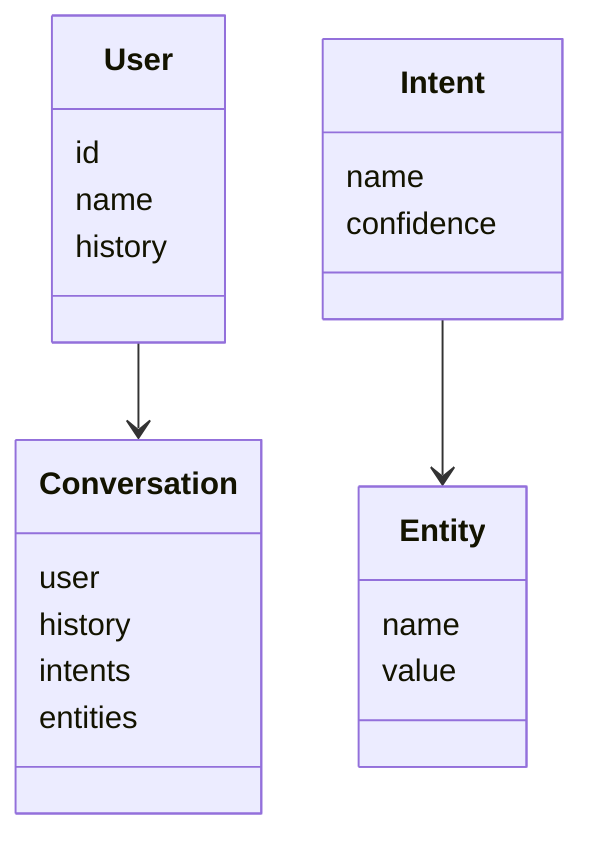

                 


# AI Agent的自然语言接口设计与优化

> 关键词：AI Agent，自然语言处理，对话理解，对话生成，大模型，系统架构

> 摘要：本文详细探讨了AI Agent的自然语言接口设计与优化的关键技术，包括背景介绍、核心概念、算法原理、系统架构、项目实战和最佳实践等方面。通过逐步分析，深入剖析了自然语言接口在AI Agent中的重要性，以及如何通过优化设计提升其性能和用户体验。

---

# 第一部分: AI Agent的自然语言接口设计基础

## 第1章: AI Agent与自然语言处理概述

### 1.1 AI Agent的基本概念
#### 1.1.1 AI Agent的定义与特点
AI Agent（人工智能代理）是一种能够感知环境、自主决策并执行任务的智能实体。其特点包括智能性、反应性、主动性、社会性和可扩展性。AI Agent通过与用户交互，能够理解需求并提供相应的服务。

#### 1.1.2 自然语言处理（NLP）的基本概念
自然语言处理是研究计算机如何理解和生成人类语言的学科。NLP的核心任务包括文本分类、信息抽取、机器翻译、对话理解和生成等。近年来，基于大模型的NLP技术取得了显著进展。

#### 1.1.3 AI Agent与自然语言接口的结合
AI Agent需要通过自然语言接口与用户进行交互，理解用户意图并生成自然语言响应。这种结合使得AI Agent能够更自然地与人类进行对话，提升用户体验。

---

### 1.2 自然语言处理技术的发展
#### 1.2.1 从规则驱动到数据驱动的转变
早期的NLP技术主要依赖于人工制定规则，这种方法在处理复杂语言现象时表现有限。随着深度学习的发展，数据驱动的方法逐渐成为主流，显著提升了NLP系统的性能。

#### 1.2.2 大模型在NLP中的应用
大模型（如GPT、BERT）通过海量数据的预训练，能够捕捉语言的上下文关系，生成高质量的文本。这些模型在对话理解与生成中表现尤为突出。

#### 1.2.3 AI Agent中的NLP技术应用现状
当前，AI Agent广泛采用基于大模型的NLP技术，实现从理解到生成的端到端对话系统。然而，如何优化这些模型以适应特定应用场景仍是一个重要挑战。

---

### 1.3 本章小结
本章介绍了AI Agent和自然语言处理的基本概念，分析了NLP技术的发展及其在AI Agent中的应用现状，为后续章节的深入探讨奠定了基础。

---

# 第二部分: AI Agent自然语言接口的核心概念与原理

## 第2章: 自然语言接口的设计原则

### 2.1 对话理解与生成的基本原理
#### 2.1.1 对话理解的核心要素
对话理解包括语音识别、意图识别和实体识别。意图识别是确定用户的意图，实体识别是提取关键信息。例如，在“预订机票去北京”，意图是“预订机票”，实体是“北京”。

#### 2.1.2 对话生成的实现方法
对话生成包括生成响应内容和选择合适的回复方式。基于大模型的生成方法能够生成多样化的回复，同时结合上下文保持对话的连贯性。

#### 2.1.3 对话系统中的上下文管理
上下文管理是确保对话连贯性的重要环节，包括记忆用户的历史对话信息和根据上下文调整生成的内容。

---

### 2.2 基于大模型的自然语言接口实现
#### 2.2.1 大模型在对话理解中的应用
大模型通过预训练掌握了丰富的语言知识，能够准确理解用户的意图和实体信息。

#### 2.2.2 大模型在对话生成中的优势
大模型生成的回复自然流畅，且能够根据上下文调整回复内容，使对话更加人性化。

#### 2.2.3 基于大模型的端到端对话系统
端到端对话系统将对话理解与生成集成在一起，简化了系统架构，提高了交互效率。

---

### 2.3 核心概念对比与ER实体关系图

#### 2.3.1 对话理解与生成的核心概念对比
| 对比维度 | 对话理解 | 对话生成 |
|----------|----------|----------|
| 目标     | 理解用户意图 | 生成回复内容 |
| 输入     | 用户输入文本 | 对话历史 |
| 输出     | 意图和实体信息 | 回复文本 |

#### 2.3.2 ER实体关系图展示（使用mermaid）

```mermaid
erd
    user
    has
    conversation
    conversation
    has
    intent
    conversation
    has
    entity
    intent
    has
    entity
```

---

## 第3章: 对话理解的算法原理

### 3.1 语言模型的数学基础
#### 3.1.1 概率论基础
概率论是NLP的基础，用于计算文本中词的条件概率。例如，计算“the”的概率：

$$ P(\text{the}) $$

#### 3.1.2 语言模型的数学表达
语言模型通过计算给定词序列的概率来评估其合理性。例如，五元语法模型的概率表示为：

$$ P(w_1, w_2, w_3, w_4, w_5) = \prod_{i=1}^5 P(w_i | w_{i-1}, ..., w_{i-4}) $$

#### 3.1.3 基于大模型的语言模型优化
大模型通过自监督学习优化语言模型，减少对人工标注数据的依赖。例如，GPT模型的预训练目标函数：

$$ \text{Loss} = -\sum_{i=1}^n \log P(w_i | w_{i-1}, ..., w_{i-5}) $$

---

### 3.2 对话理解的算法流程
#### 3.2.1 分词与词向量表示
将输入文本分词，并将其映射为词向量。例如，输入“hello world”被分词为“hello”和“world”，并转换为对应的向量。

#### 3.2.2 编码器-解码器架构
编码器将输入文本编码为上下文表示，解码器根据编码结果生成意图和实体信息。例如，编码器输出的上下文向量为：

$$ C = \text{Encoder}(x) $$

解码器根据上下文生成意图：

$$ p = \text{Decoder}(C) $$

---

### 3.3 对话生成的数学模型
#### 3.3.1 基于生成对抗网络的对话生成
生成器和判别器通过对抗训练生成高质量的回复。例如，生成器的目标函数为：

$$ \min_G \mathbb{E}_{z \sim p(z)} [\text{Disc}(G(z))] $$

判别器的目标函数为：

$$ \max_D \mathbb{E}_{x \sim p(x)} [\text{Disc}(x)] + \mathbb{E}_{z \sim p(z)} [1 - \text{Disc}(G(z))] $$

---

# 第三部分: 系统分析与架构设计

## 第4章: AI Agent自然语言接口的系统架构

### 4.1 系统功能设计
#### 4.1.1 领域模型设计（使用mermaid类图）



---

### 4.2 系统架构设计
#### 4.2.1 模块划分
系统主要模块包括用户输入模块、对话理解模块、对话生成模块和反馈优化模块。

---

### 4.3 接口设计
系统接口包括：
- 用户输入接口：接收用户的自然语言输入。
- 对话理解接口：返回意图和实体信息。
- 对话生成接口：生成回复文本。

---

### 4.4 交互设计
系统交互流程包括：
1. 用户输入文本。
2. 系统理解意图和实体。
3. 系统生成回复。
4. 用户反馈。

---

## 第5章: 项目实战

### 5.1 环境安装
安装Python和必要的库：

```bash
pip install numpy torch transformers
```

---

### 5.2 核心代码实现
对话理解的代码实现：

```python
import torch
import torch.nn as nn

class IntentClassifier(nn.Module):
    def __init__(self, input_dim, output_dim):
        super(IntentClassifier, self).__init__()
        self.fc = nn.Linear(input_dim, output_dim)
    
    def forward(self, x):
        return self.fc(x)
```

---

### 5.3 案例分析
案例分析：用户输入“预订机票去北京”，系统理解意图是“预订机票”，实体是“北京”。

---

### 5.4 项目小结
本章通过实际项目展示了AI Agent自然语言接口的设计与实现，验证了理论的可行性。

---

## 第6章: 最佳实践与小结

### 6.1 最佳实践 tips
- 使用大模型提升性能。
- 注重数据质量和多样性。
- 优化对话的连贯性和自然性。

---

### 6.2 小结
本文系统地探讨了AI Agent自然语言接口设计与优化的关键技术，从理论到实践，全面剖析了相关问题，并提出了优化建议。

---

### 6.3 注意事项
- 确保数据隐私和安全。
- 定期更新模型以适应语言的变化。
- 提供多语言支持以扩大用户群体。

---

### 6.4 拓展阅读
推荐阅读以下书籍和论文：
1. 《Deep Learning》 - Ian Goodfellow
2. 《Transformers: State-of-the-art NLP》 - Francois Chollet

---

# 作者：AI天才研究院 & 禅与计算机程序设计艺术

---

以上是《AI Agent的自然语言接口设计与优化》的完整目录结构，涵盖了从理论到实践的各个方面，内容详实，结构清晰，适合技术开发者和研究者参考。

