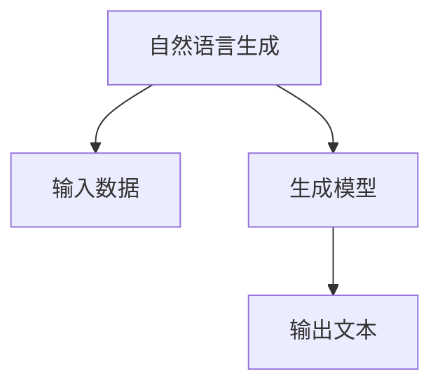
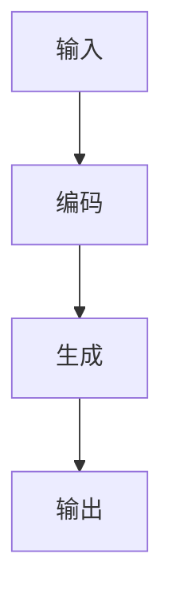
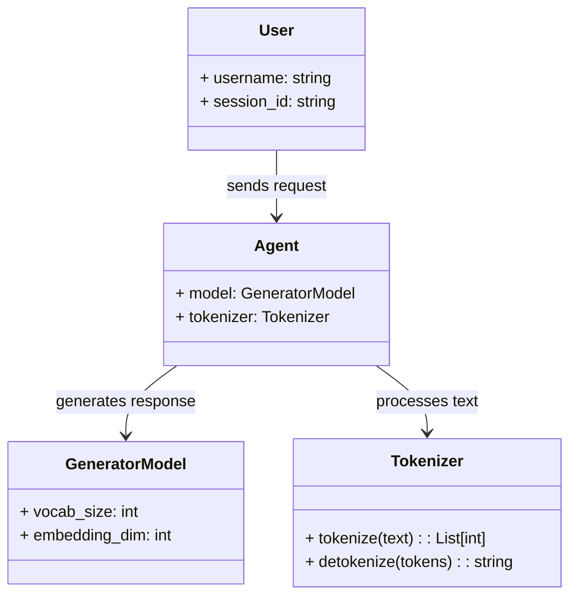
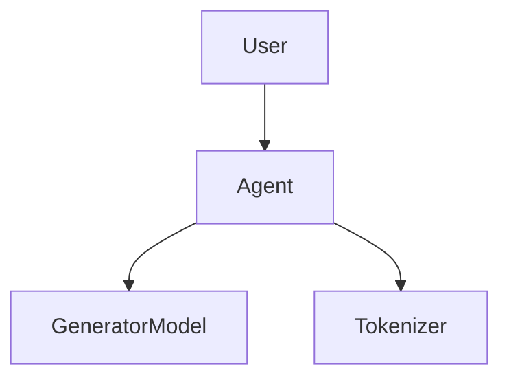
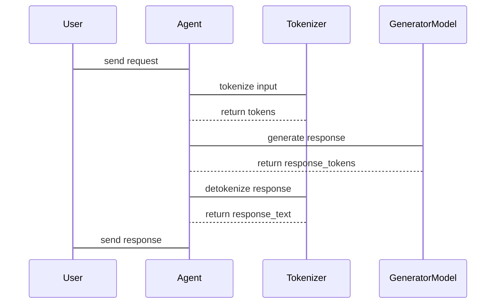

                 


# AI Agent的自然语言生成技术

> 关键词：AI Agent，自然语言生成，深度学习，Transformer，NLP

> 摘要：本文将深入探讨AI Agent在自然语言生成技术中的应用，从基本概念到算法原理，从系统设计到项目实战，全面解析自然语言生成技术的核心原理与实际应用。通过详细的分析与实例，帮助读者理解如何利用这些技术构建高效的AI Agent系统。

---

## 第一部分: AI Agent与自然语言生成技术概述

### 第1章: AI Agent与自然语言生成技术的背景介绍

#### 1.1 AI Agent的基本概念

##### 1.1.1 AI Agent的定义与特点

AI Agent（智能代理）是指能够感知环境并采取行动以实现目标的计算机程序。其特点包括：

- **自主性**：能够在没有外部干预的情况下运行。
- **反应性**：能够根据环境反馈调整行为。
- **目标导向**：所有行动都以实现特定目标为导向。

##### 1.1.2 自然语言生成技术的定义

自然语言生成（Natural Language Generation, NLP）是人工智能领域的一个重要分支，旨在使计算机能够生成与人类语言相同的文本。其核心目标是让计算机理解上下文并生成符合语境的自然语言文本。

##### 1.1.3 AI Agent与自然语言生成技术的关系

AI Agent通过自然语言生成技术，能够以人类可理解的方式与用户进行交互。这种结合使得AI Agent能够更自然地与人类用户进行对话，提供服务或解决问题。

#### 1.2 自然语言生成技术的应用场景

##### 1.2.1 在对话系统中的应用

自然语言生成技术在对话系统中应用广泛，例如智能客服、虚拟助手等。通过自然语言生成，对话系统能够理解用户的意图并生成相应的回复。

##### 1.2.2 在内容生成中的应用

自然语言生成技术还可以用于生成新闻、文章、报告等内容。例如，新闻自动写作系统可以通过自然语言生成技术快速生成新闻稿。

##### 1.2.3 在智能助手中的应用

智能助手（如Siri、Alexa）通过自然语言生成技术，能够以自然的方式与用户进行交互，提供信息查询、任务执行等服务。

#### 1.3 自然语言生成技术的挑战

##### 1.3.1 数据质量与多样性

自然语言生成技术依赖于大量的训练数据。数据的质量和多样性直接影响生成文本的效果。如果训练数据有限或存在偏差，生成的文本可能会出现错误或不符合语境。

##### 1.3.2 模型的可解释性

复杂的生成模型（如Transformer）往往缺乏可解释性。用户和开发者可能难以理解模型生成特定文本的原因，这在某些应用场景中是一个重要的问题。

##### 1.3.3 真实性与伦理问题

生成的文本可能包含虚假信息或误导性内容。如何确保生成内容的真实性和伦理合规性，是自然语言生成技术面临的重大挑战。

---

### 第2章: 自然语言生成技术的核心概念与联系

#### 2.1 自然语言生成技术的核心原理

##### 2.1.1 生成模型的原理

生成模型的目标是根据输入生成符合语境的文本。常见的生成模型包括基于规则的生成模型和基于统计的生成模型。

##### 2.1.2 基于规则的生成方法

基于规则的生成方法通过预定义的语法规则生成文本。这种方法适用于特定领域，但灵活性较低。

##### 2.1.3 统计模型与深度学习模型的对比

统计模型（如n-gram模型）依赖于数据统计特征，而深度学习模型（如RNN、Transformer）能够捕捉更复杂的语言模式。

#### 2.2 自然语言生成技术的实体关系图



#### 2.3 自然语言生成技术的流程图



---

### 第3章: 自然语言生成技术的算法原理

#### 3.1 基于Transformer的生成模型

##### 3.1.1 Transformer模型的结构

Transformer模型由编码器和解码器组成，编码器负责将输入文本转换为向量表示，解码器负责根据编码结果生成输出文本。

##### 3.1.2 解码器的生成过程

解码器通过自注意力机制捕捉输入文本中的语义信息，并逐步生成输出文本。

##### 3.1.3 注意力机制的数学公式

$$
\text{Attention}(Q,K,V) = \text{softmax}\left(\frac{QK^T}{\sqrt{d_k}}\right)V
$$

---

#### 3.2 基于RNN的生成模型

##### 3.2.1 RNN的循环结构

RNN通过循环结构处理序列数据，每个时间步生成一个输出字符。

##### 3.2.2 LSTM与GRU的对比

LSTM（长短期记忆网络）和GRU（门控循环单元）都是为了解决RNN的梯度消失问题而提出的。两者在结构和性能上存在差异，但在实际应用中表现相似。

##### 3.2.3 RNN的训练过程

RNN通过反向传播算法进行训练，优化模型参数以最小化生成文本与真实文本的差异。

#### 3.3 深度学习模型的数学模型

##### 3.3.1 损失函数的定义

$$
\mathcal{L} = -\sum_{t=1}^{T} \log p(y_t|x_{<t})
$$

##### 3.3.2 梯度下降的优化过程

$$
\theta = \theta - \eta \nabla_\theta \mathcal{L}
$$

---

### 第4章: 系统分析与架构设计

#### 4.1 项目场景介绍

以智能客服系统为例，用户通过自然语言与AI Agent交互，AI Agent通过自然语言生成技术生成回复文本。

#### 4.2 系统功能设计

##### 4.2.1 领域模型mermaid类图



#### 4.3 系统架构设计

##### 4.3.1 系统架构mermaid架构图



#### 4.4 系统接口设计

##### 4.4.1 API接口

```python
class Agent:
    def __init__(self, model, tokenizer):
        self.model = model
        self.tokenizer = tokenizer

    def generate_response(self, input_text):
        tokens = self.tokenizer.tokenize(input_text)
        response_tokens = self.model.generate(tokens)
        response_text = self.tokenizer.detokenize(response_tokens)
        return response_text
```

#### 4.5 系统交互mermaid序列图



---

### 第5章: 项目实战

#### 5.1 环境安装

```bash
pip install transformers
pip install torch
pip install numpy
```

#### 5.2 系统核心实现源代码

```python
from transformers import AutoTokenizer, AutoModelForCausalLM
import torch

class Agent:
    def __init__(self, model_name):
        self.tokenizer = AutoTokenizer.from_pretrained(model_name)
        self.model = AutoModelForCausalLM.from_pretrained(model_name)

    def generate_response(self, input_text, max_length=50):
        inputs = self.tokenizer(input_text, return_tensors="pt")
        outputs = self.model.generate(**inputs, max_length=max_length)
        response = self.tokenizer.decode(outputs[0], skip_special_tokens=True)
        return response
```

#### 5.3 代码应用解读与分析

上述代码使用了Hugging Face的Transformers库，通过预训练的模型生成自然语言文本。`generate_response`方法接收输入文本并生成相应长度的回复。

#### 5.4 实际案例分析和详细讲解剖析

以智能客服为例，用户输入“我的订单在哪里？”，AI Agent生成回复“您的订单信息请提供订单号查询。”

---

### 第6章: 最佳实践 tips、小结、注意事项、拓展阅读

#### 6.1 最佳实践 tips

- 在实际应用中，建议使用预训练的开源模型以降低开发成本。
- 注意数据隐私问题，避免生成包含敏感信息的内容。
- 定期更新模型以提升生成文本的质量。

#### 6.2 小结

本文详细介绍了AI Agent的自然语言生成技术，从基本概念到算法原理，从系统设计到项目实战，为读者提供了全面的知识体系。

#### 6.3 注意事项

- 确保生成内容的真实性和合法性。
- 定期监控模型的生成结果，及时调整参数以优化性能。

#### 6.4 拓展阅读

建议读者进一步阅读以下内容：

- Hugging Face的Transformers库官方文档。
- 最新论文《The Transformer: A Neat Extention of Deep Neural Networks》。

---

作者：AI天才研究院/AI Genius Institute & 禅与计算机程序设计艺术 /Zen And The Art of Computer Programming

