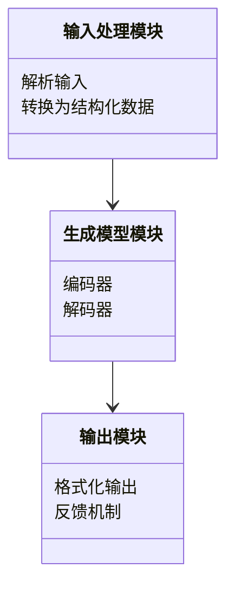
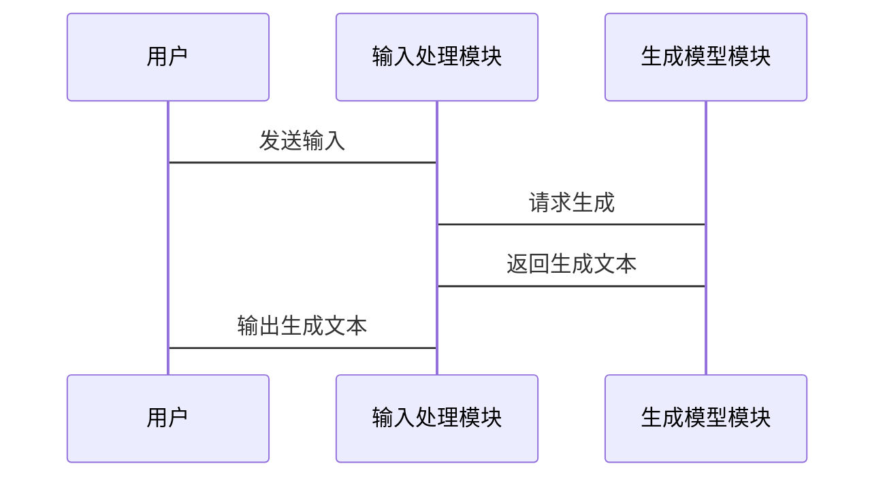

                 


# AI Agent的自然语言生成能力开发

## 关键词：AI Agent, 自然语言生成, 生成式模型, 预训练模型, 对话系统, 系统架构

## 摘要：本文深入探讨AI Agent的自然语言生成能力，从核心概念、算法原理到系统架构和实战项目，全面解析自然语言生成在AI Agent中的应用与开发。文章涵盖生成式模型的数学基础、预训练模型的微调优化、对话系统的构建与优化，以及系统架构设计与实现，为开发者提供全面的技术指导。

---

# 第1章 AI Agent与自然语言生成概述

## 1.1 AI Agent的基本概念

### 1.1.1 AI Agent的定义与特点
AI Agent（人工智能代理）是一种能够感知环境、自主决策并执行任务的智能实体。它具备以下特点：
- **自主性**：无需外部干预，自主完成任务。
- **反应性**：能够实时感知环境并做出反应。
- **目标导向**：以实现特定目标为导向。
- **学习能力**：能够通过数据和经验不断优化自身能力。

### 1.1.2 自然语言生成的定义与作用
自然语言生成（Natural Language Generation, NLG）是指将结构化数据转换为自然语言文本的过程。它在AI Agent中的作用包括：
- **信息传递**：将复杂数据转化为易于理解的文本。
- **人机交互**：通过自然语言与用户进行有效沟通。
- **内容生成**：自动生成报告、摘要等文本内容。

### 1.1.3 AI Agent与自然语言生成的关系
AI Agent通过自然语言生成能力，能够以人类可理解的方式表达信息和进行交互，从而提升用户体验和任务执行效率。自然语言生成是AI Agent实现智能化交互的核心技术之一。

## 1.2 自然语言生成的背景与应用

### 1.2.1 自然语言生成的发展历程
- **早期阶段**：基于规则的生成方法，适用于简单的文本生成。
- **统计学习阶段**：利用概率模型（如n-gram）进行生成，但仍存在语义不连贯的问题。
- **深度学习阶段**：引入神经网络（如RNN、Transformer）实现更复杂的生成任务。

### 1.2.2 当前自然语言生成的主要技术
- **生成式模型**：基于Transformer的GPT系列模型，能够生成高质量的自然语言文本。
- **预训练模型**：如BERT、GPT-3等，通过大量数据预训练后，能够快速适应特定任务。
- **多模态生成**：结合视觉、听觉等多模态信息，生成更丰富的文本内容。

### 1.2.3 AI Agent在自然语言生成中的应用场景
- **智能客服**：通过自然语言生成与用户进行对话交互。
- **内容生成**：自动生成新闻报道、产品描述等文本内容。
- **教育辅助**：为学生提供个性化的学习建议和解释。

## 1.3 本章小结
本章介绍了AI Agent和自然语言生成的基本概念，分析了自然语言生成的发展历程和主要技术，并探讨了AI Agent在自然语言生成中的应用场景，为后续内容奠定了基础。

---

# 第2章 自然语言生成的核心原理

## 2.1 自然语言生成的流程与模型

### 2.1.1 自然语言生成的基本流程
自然语言生成的基本流程包括：
1. **输入处理**：接收结构化数据或用户输入。
2. **内容生成**：通过模型生成候选文本。
3. **优化与校正**：对生成文本进行语法和语义优化。
4. **输出**：将优化后的文本输出给用户。

### 2.1.2 基于统计的生成模型
基于统计的生成模型主要通过概率模型（如n-gram）来生成文本。其优点是简单易实现，但生成文本的质量和连贯性较差。

### 2.1.3 基于深度学习的生成模型
基于深度学习的生成模型（如RNN、Transformer）通过神经网络建模语言的分布，能够生成更高质量的文本。

## 2.2 自然语言生成的关键技术

### 2.2.1 语言模型的训练与优化
语言模型通过大量文本数据进行训练，目标是学习语言的概率分布。优化目标通常是最小化生成文本的负对数似然。

$$ \text{损失函数} = -\sum_{i=1}^{n} \log P(w_i) $$

### 2.2.2 解码器与生成策略
解码器负责将输入转换为输出序列。生成策略包括贪心解码、束搜索（Beam Search）等方法，用于提高生成文本的质量。

### 2.2.3 多模态生成与上下文理解
多模态生成结合了视觉、听觉等信息，生成更丰富的文本内容。上下文理解通过注意力机制（Attention）等技术，增强生成文本的相关性。

## 2.3 本章小结
本章详细讲解了自然语言生成的基本流程、基于统计和深度学习的生成模型，以及多模态生成和上下文理解的关键技术，为后续章节的系统实现提供了理论基础。

---

# 第3章 基于预训练模型的自然语言生成

## 3.1 预训练模型的概述

### 3.1.1 预训练模型的定义与特点
预训练模型是通过在大规模通用数据上进行无监督训练得到的模型，具备以下特点：
- **大规模数据**：通常使用海量文本数据进行训练。
- **通用性**：能够适应多种不同的下游任务。
- **可迁移性**：通过微调可以快速适应特定领域任务。

### 3.1.2 常见预训练模型的介绍
- **GPT系列**：基于自回归的生成模型，擅长生成连贯的文本。
- **BERT系列**：基于Transformer的编码模型，擅长理解上下文。
- **PaLM**：Google推出的基于Pathways架构的生成模型。

## 3.2 预训练模型在自然语言生成中的应用

### 3.2.1 基于GPT的生成模型
GPT模型通过自回归的方式生成文本，生成过程如下：


### 3.2.2 基于BERT的生成模型
BERT模型通过编码上下文信息，生成与输入相关的文本。其生成过程如下：


### 3.2.3 其他预训练模型的生成能力
除了GPT和BERT，还有许多其他预训练模型（如T5、Megatron）也在自然语言生成领域展现出强大的能力。

## 3.3 预训练模型的微调与优化

### 3.3.1 微调的定义与作用
微调是通过在特定任务数据上进一步训练预训练模型，以提升模型在该任务上的性能。

### 3.3.2 基于任务的微调方法
微调方法包括：
- **任务特定的权重调整**：在预训练的基础上，调整任务相关层的权重。
- **任务特定的参数增加**：在预训练模型的基础上增加任务特定的参数。

### 3.3.3 优化策略与评估指标
优化策略包括学习率调整、批量大小调节等。评估指标主要有困惑度（Perplexity）、BLEU、ROUGE等。

## 3.4 本章小结
本章介绍了预训练模型的基本概念和常见模型，并详细讲解了预训练模型在自然语言生成中的应用和微调优化策略。

---

# 第4章 自然语言生成的算法与数学模型

## 4.1 生成式模型的算法原理

### 4.1.1 变量关系与概率模型
生成式模型的目标是学习数据的生成概率分布：

$$ P(y|x) $$

### 4.1.2 生成式模型的数学表达式
基于Transformer的生成模型的数学表达式如下：

$$ \text{输出} = \text{解码器}(\text{编码器}(输入)) $$

### 4.1.3 生成式模型的训练目标
生成式模型的训练目标是最小化生成文本的负对数似然：

$$ \text{损失函数} = -\sum_{i=1}^{n} \log P(w_i|x) $$

## 4.2 基于Transformer的生成模型

### 4.2.1 Transformer的结构与特点
Transformer模型由编码器和解码器组成，其结构如下：


### 4.2.2 Transformer在生成中的应用
在生成过程中，解码器通过自注意力机制生成每个词，确保生成文本的连贯性。

### 4.2.3 Transformer的数学模型
Transformer的数学模型包括编码器和解码器的计算公式，具体如下：

$$ \text{编码器} = \text{多头注意力}(输入) + \text{前馈网络} $$

$$ \text{解码器} = \text{多头注意力}(编码器输出) + \text{前馈网络} $$

## 4.3 本章小结
本章详细讲解了生成式模型的算法原理和基于Transformer的生成模型的数学表达式，为后续章节的系统实现提供了理论支持。

---

# 第5章 AI Agent的自然语言生成系统架构设计

## 5.1 问题场景介绍
AI Agent需要具备自然语言生成能力，能够与用户进行对话交互，生成符合用户需求的文本内容。

## 5.2 系统功能设计

### 5.2.1 领域模型设计
领域模型通过Mermaid类图展示系统的模块组成：



### 5.2.2 系统架构设计
系统架构设计通过Mermaid架构图展示模块之间的关系：


### 5.2.3 接口设计
系统接口设计包括：
- **输入接口**：接收用户的输入文本或结构化数据。
- **输出接口**：输出生成的自然语言文本。

### 5.2.4 交互流程设计
交互流程通过Mermaid序列图展示：



## 5.3 本章小结
本章详细设计了AI Agent的自然语言生成系统架构，包括功能模块、系统架构、接口设计和交互流程，为后续章节的实现提供了指导。

---

# 第6章 项目实战：基于AI Agent的智能客服系统

## 6.1 环境安装

### 6.1.1 安装Python和依赖库
```bash
pip install numpy
pip install transformers
pip install torch
```

## 6.2 系统核心实现源代码

### 6.2.1 输入处理模块
```python
def process_input(user_input):
    # 解析输入
    return user_input
```

### 6.2.2 生成模型模块
```python
from transformers import AutoModelForCausalLM, AutoTokenizer

tokenizer = AutoTokenizer.from_pretrained('gpt2')
model = AutoModelForCausalLM.from_pretrained('gpt2')
```

### 6.2.3 输出模块
```python
def format_output(generated_text):
    return generated_text
```

### 6.2.4 对话系统实现
```python
def generate_response(user_input):
    inputs = tokenizer(user_input, return_tensors='np')
    outputs = model.generate(inputs.input_ids, max_length=50)
    return tokenizer.decode(outputs[0], skip_special_tokens=True)
```

## 6.3 案例分析与详细讲解

### 6.3.1 案例分析
以智能客服系统为例，用户输入“我的订单在哪里？”，系统生成回复“您的订单可以在我的订单页面查看。”

### 6.3.2 代码应用解读
```python
# 输入处理模块
user_input = "我的订单在哪里？"
processed_input = process_input(user_input)

# 生成模型模块
response = generate_response(processed_input)

# 输出模块
formatted_response = format_output(response)
print(formatted_response)
```

## 6.4 本章小结
本章通过智能客服系统的实战，详细讲解了AI Agent的自然语言生成能力的实现过程，包括环境安装、代码实现和案例分析。

---

# 第7章 最佳实践与注意事项

## 7.1 最佳实践

### 7.1.1 模型选择与优化
选择合适的预训练模型，并通过微调优化模型性能。

### 7.1.2 数据处理与清洗
确保输入数据的质量，避免噪声干扰生成结果。

### 7.1.3 生成结果的校验与优化
通过人工校验或自动化工具优化生成文本的质量。

## 7.2 注意事项

### 7.2.1 模型的可解释性
生成结果的可解释性对于用户信任至关重要。

### 7.2.2 模型的鲁棒性
确保模型在面对异常输入时仍能生成合理的结果。

### 7.2.3 性能优化
优化生成过程中的计算效率，降低资源消耗。

## 7.3 拓展阅读

### 7.3.1 自然语言生成领域的最新研究
阅读相关学术论文，了解领域最新进展。

### 7.3.2 开源工具与框架
探索更多开源工具和框架（如Hugging Face、TensorFlow），扩展生成能力。

## 7.4 本章小结
本章总结了AI Agent自然语言生成开发中的最佳实践和注意事项，并提供了拓展阅读的方向，帮助读者进一步提升开发能力。

---

# 作者：AI天才研究院/AI Genius Institute & 禅与计算机程序设计艺术/Zen And The Art of Computer Programming

---

本文通过系统化的讲解和实战案例，深入探讨了AI Agent的自然语言生成能力开发。从核心原理到系统架构，再到实际应用，为读者提供了全面的技术指导。希望本文能为开发者在AI Agent的自然语言生成领域提供有价值的参考和启发。

