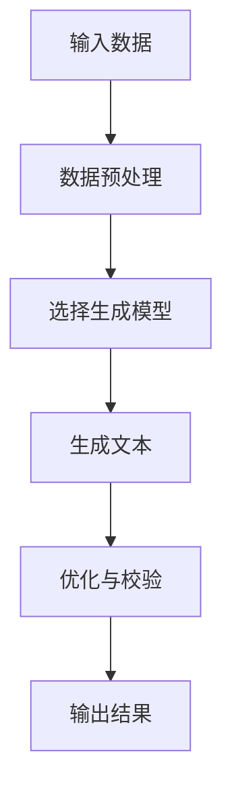
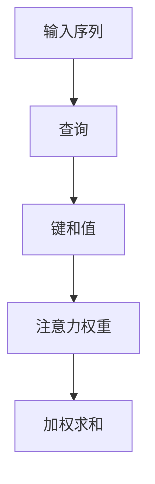
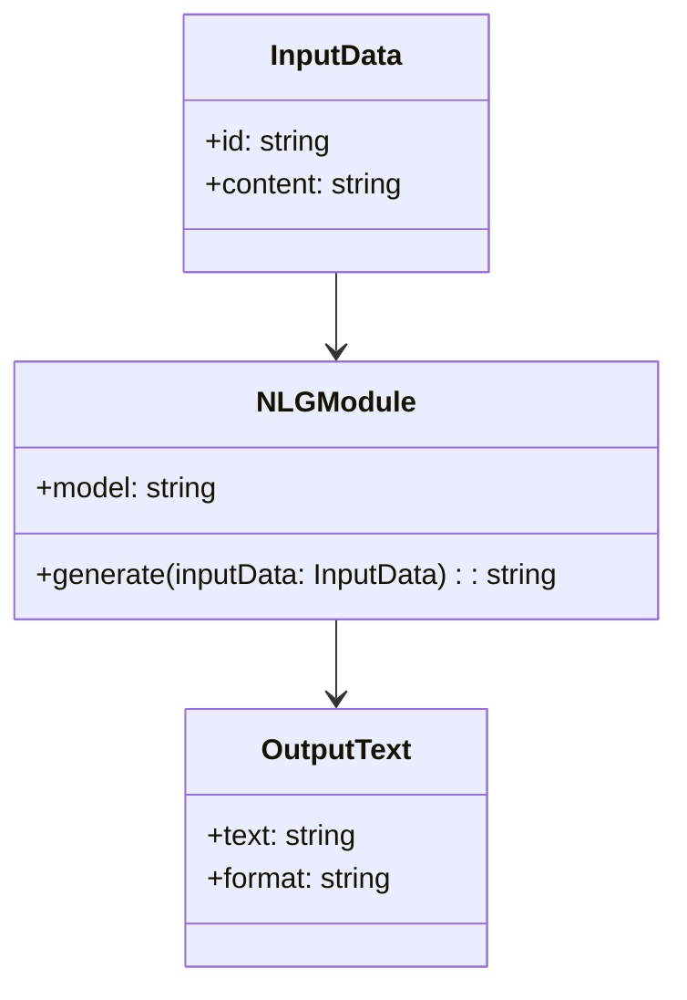
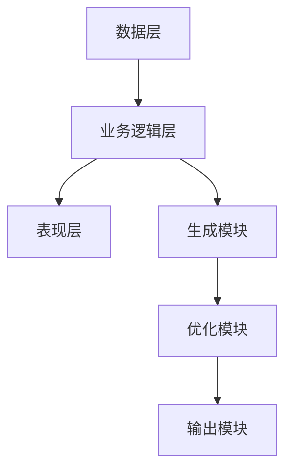
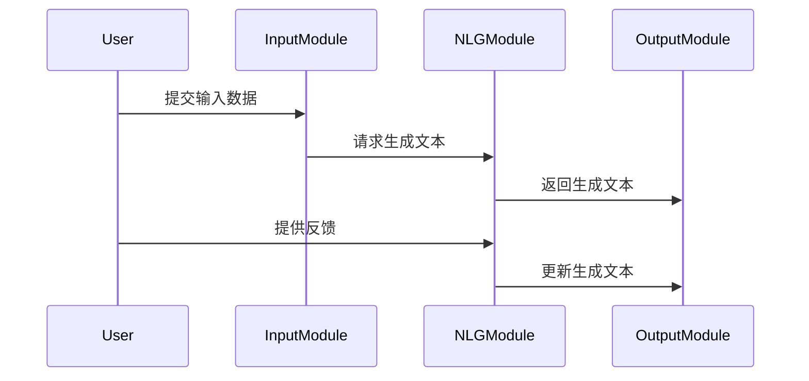

                 


# AI Agent的自然语言生成（NLG）技术应用

## 关键词：AI Agent，自然语言生成，NLG，生成式AI，大语言模型

## 摘要：本文深入探讨了AI Agent在自然语言生成（NLG）技术中的应用，分析了NLG的核心概念、算法原理以及在实际场景中的应用案例。通过结合大语言模型和生成式AI，本文详细阐述了如何构建高效、智能的AI Agent系统，并提供了系统架构设计和项目实战的详细指导。

---

# 第一部分: AI Agent与自然语言生成（NLG）概述

## 第1章: AI Agent与自然语言生成（NLG）概述

### 1.1 AI Agent的基本概念

#### 1.1.1 AI Agent的定义与特点
AI Agent（人工智能代理）是一种能够感知环境、执行任务并做出决策的智能实体。它通过与用户或系统的交互，实现特定目标。AI Agent的核心特点包括：
- **自主性**：能够在没有外部干预的情况下运行。
- **反应性**：能够实时感知环境并做出响应。
- **主动性**：主动执行任务，而非被动等待指令。
- **社会性**：能够与其他Agent或用户进行交互和协作。

#### 1.1.2 自然语言生成（NLG）的定义与作用
自然语言生成（NLG）是将结构化数据转化为自然语言文本的过程。它通过理解和分析输入数据，生成符合语法规则、语义清晰的文本输出。NLG在AI Agent中的作用主要体现在：
- **人机交互**：通过自然语言与用户进行对话。
- **内容生成**：生成报告、摘要、推荐等文本内容。
- **动态响应**：根据实时数据生成动态文本输出。

#### 1.1.3 AI Agent与NLG的结合与应用
AI Agent与NLG的结合使得Agent能够以自然语言形式与用户交互，提升用户体验。例如：
- **智能对话系统**：如智能客服、虚拟助手。
- **动态内容生成**：如新闻报道、个性化推荐。
- **多模态交互**：结合视觉、语音等多种交互方式。

### 1.2 自然语言生成（NLG）的演进

#### 1.2.1 从规则驱动到数据驱动的转变
早期的NLG技术主要依赖于规则驱动的方法，通过预定义的语法规则生成文本。这种方法在特定场景下表现良好，但缺乏灵活性和扩展性。随着机器学习和深度学习的兴起，NLG技术逐渐转向数据驱动的方法，利用大量语料库进行训练，生成更自然、多样化的文本。

#### 1.2.2 大语言模型对NLG的推动
大语言模型（如GPT、BERT）的出现，极大地推动了NLG技术的发展。这些模型通过预训练海量文本数据，掌握了语言的语义和上下文关系，能够在多种场景下生成高质量的文本。大语言模型的引入，使得NLG技术更加智能化和通用化。

#### 1.2.3 当前NLG技术的主要应用场景
当前，NLG技术已在多个领域得到广泛应用，包括：
- **自然语言处理**：如文本摘要、问答系统。
- **智能客服**：通过NLG技术生成个性化的回复。
- **新闻生成**：自动生成新闻稿。
- **教育领域**：生成个性化学习内容。

### 1.3 AI Agent中的NLG技术特点

#### 1.3.1 动态生成与实时响应
AI Agent需要根据实时输入的数据生成动态文本，例如在对话系统中，根据用户的实时输入生成回复。

#### 1.3.2 多模态交互能力
NLG技术不仅限于文本生成，还可以结合视觉、语音等多种模态，提供更加丰富的交互体验。

#### 1.3.3 个性化与情境感知
通过NLG技术，AI Agent可以根据用户的行为、偏好和情境生成个性化的文本内容，提升用户体验。

### 1.4 本章小结
本章介绍了AI Agent和自然语言生成（NLG）的基本概念，分析了NLG技术的演进过程及其在AI Agent中的应用特点，为后续章节奠定了基础。

---

# 第二部分: 自然语言生成（NLG）的核心技术与原理

## 第2章: 自然语言生成（NLG）的核心概念与原理

### 2.1 自然语言生成的基本流程

#### 2.1.1 数据输入与预处理
NLG过程通常从输入数据开始，这些数据可以是结构化数据（如数据库表）或非结构化数据（如文本）。预处理步骤包括数据清洗、格式化和特征提取。

#### 2.1.2 生成模型的选择与应用
根据任务需求选择合适的生成模型，如基于规则的生成模型、统计模型或深度学习模型。生成模型负责将输入数据转化为自然语言文本。

#### 2.1.3 输出结果的优化与校验
生成的文本需要进行优化和校验，确保其语义正确、语法规范。优化步骤可能包括重复消除、语义校对等。

#### 图2-1: 自然语言生成基本流程图


### 2.2 自然语言生成的关键技术

#### 2.2.1 生成式AI的基本原理
生成式AI通过深度学习模型（如Transformer）生成文本。模型通过自注意力机制捕捉文本中的语义关系，生成符合上下文的文本。

#### 2.2.2 解码器与编码器在NLG中的作用
- **编码器**：将输入数据转化为向量表示。
- **解码器**：将向量表示解码为自然语言文本。

#### 2.2.3 注意力机制与生成策略
注意力机制帮助模型关注输入数据中的重要部分，生成更相关的内容。生成策略包括贪心搜索、随机采样等方法。

#### 图2-2: 注意力机制示意图


### 2.3 自然语言生成的挑战与解决方案

#### 2.3.1 生成结果的准确性问题
- **解决方案**：使用预训练模型、微调模型等方法提升生成质量。

#### 2.3.2 多语言与多模态支持
- **解决方案**：设计多模态模型，支持多种语言和交互方式。

#### 2.3.3 预训练模型的微调与优化
- **解决方案**：通过微调和优化模型参数，提升生成效果。

### 2.4 本章小结
本章详细讲解了自然语言生成的核心流程、关键技术及其挑战，为后续章节的应用分析奠定了基础。

---

# 第三部分: 大语言模型在自然语言生成中的应用

## 第3章: 大语言模型与NLG技术的结合

### 3.1 大语言模型的基本特点

#### 3.1.1 模型的规模与训练数据
大语言模型通常基于海量数据进行预训练，具有强大的语义理解和生成能力。

#### 3.1.2 多任务学习能力
大语言模型可以同时处理多种NLP任务，如文本生成、问答、翻译等。

#### 3.1.3 模型的可解释性
虽然大语言模型生成能力强大，但其决策过程往往缺乏可解释性，这在实际应用中需要特别注意。

### 3.2 大语言模型在NLG中的应用案例

#### 3.2.1 文本摘要与内容生成
- **案例分析**：利用GPT生成新闻摘要。
- **实现流程**：
  1. 数据预处理：提取新闻标题和正文。
  2. 模型选择：选择适合摘要任务的模型。
  3. 模型训练与微调。
  4. 摘要生成与优化。

#### 3.2.2 对话系统中的NLG应用
- **案例分析**：智能客服系统中的对话生成。
- **实现流程**：
  1. 用户输入解析。
  2. 响应生成：基于上下文生成回复。
  3. 回复优化：确保语义清晰、语气友好。

#### 3.2.3 基于上下文的动态生成
- **案例分析**：个性化推荐系统的文本生成。
- **实现流程**：
  1. 用户行为分析。
  2. 生成个性化推荐文本。
  3. 实时更新与优化。

### 3.3 大语言模型的优缺点分析

#### 3.3.1 优势：生成能力与泛化能力
- **生成能力强**：能够生成多样化、高质量的文本。
- **泛化能力强**：适用于多种任务和场景。

#### 3.3.2 局限：计算成本与生成质量控制
- **计算成本高**：大模型的训练和推理需要大量计算资源。
- **生成质量控制难**：生成结果可能不符合特定场景的需求。

#### 3.3.3 解决方案：模型调优与后处理优化
- **模型调优**：通过微调和参数优化提升生成质量。
- **后处理优化**：使用规则过滤、人工校对等方法提升生成结果的准确性。

### 3.4 本章小结
本章通过具体案例分析了大语言模型在自然语言生成中的应用，探讨了其优缺点及解决方案，为后续章节的系统设计和项目实战提供了参考。

---

## 第四章: 系统分析与架构设计

### 4.1 系统功能设计

#### 4.1.1 领域模型设计
- **类图设计**：展示系统中各模块之间的关系。
- **功能模块**：包括数据输入模块、生成模块、优化模块和输出模块。

#### 图4-1: 领域模型类图


#### 4.1.2 系统架构设计
- **分层架构**：包括数据层、业务逻辑层和表现层。
- **模块划分**：数据预处理模块、生成模块、优化模块和输出模块。

#### 图4-2: 系统架构图


### 4.2 系统交互设计

#### 4.2.1 交互流程设计
- **用户输入**：用户输入数据或指令。
- **系统处理**：系统根据输入生成文本。
- **用户反馈**：用户对生成文本进行反馈，系统根据反馈进行优化。

#### 图4-3: 系统交互序列图


### 4.3 本章小结
本章通过系统功能设计、架构设计和交互设计，详细阐述了如何构建一个高效的自然语言生成系统。

---

## 第五章: 项目实战

### 5.1 环境搭建

#### 5.1.1 安装Python环境
- 安装Python 3.8及以上版本。
- 安装必要的库：`transformers`, `torch`, `pymermaid`。

#### 5.1.2 安装NLG生成模型
- 使用Hugging Face提供的预训练模型：如`GPT2`。
- 安装依赖：`pip install transformers`

### 5.2 核心代码实现

#### 5.2.1 数据预处理代码
```python
from transformers import AutoTokenizer, AutoModelForCausalLM

tokenizer = AutoTokenizer.from_pretrained('gpt2')
model = AutoModelForCausalLM.from_pretrained('gpt2')

def preprocess_data(input_text):
    inputs = tokenizer(input_text, return_tensors='np')
    return inputs
```

#### 5.2.2 生成模型代码
```python
def generate_text(model, tokenizer, input_text):
    inputs = tokenizer(input_text, return_tensors='np')
    outputs = model.generate(inputs.input_ids, max_length=50, temperature=0.7)
    generated_text = tokenizer.decode(outputs[0], skip_special_tokens=True)
    return generated_text
```

#### 5.2.3 模型优化代码
```python
def optimize_output(generated_text):
    # 这里可以添加优化逻辑，如重复消除、语义校对等
    return generated_text
```

### 5.3 代码运行与结果分析

#### 5.3.1 代码运行
```python
input_text = "请生成一篇关于AI Agent的介绍文章。"
generated = generate_text(model, tokenizer, input_text)
optimized = optimize_output(generated)
print("生成文本:", generated)
print("优化后文本:", optimized)
```

#### 5.3.2 代码输出示例
```
生成文本: AI Agent是一种能够自主决策和与人类交互的人工智能实体...
优化后文本: AI Agent是一种能够自主决策和与人类交互的人工智能实体，广泛应用于各个领域。
```

### 5.4 本章小结
本章通过实际项目实战，详细讲解了NLG技术的环境搭建、代码实现和优化过程，帮助读者掌握NLG技术的实际应用。

---

## 第六章: 最佳实践与总结

### 6.1 最佳实践

#### 6.1.1 模型选择与优化
- 根据任务需求选择合适的模型。
- 通过微调和优化提升生成质量。

#### 6.1.2 数据处理与管理
- 确保数据质量，避免偏差。
- 处理多语言和多模态数据时，注意数据的多样性和平衡性。

#### 6.1.3 系统设计与实现
- 设计高效的系统架构，确保系统的可扩展性和可维护性。
- 注重系统的实时性和响应速度。

### 6.2 总结与展望

#### 6.2.1 本章总结
本文详细探讨了AI Agent的自然语言生成技术，从核心概念到实际应用，全面分析了NLG技术的应用场景和实现方法。

#### 6.2.2 未来展望
随着大语言模型的不断发展，NLG技术将在更多领域得到应用。未来的研究方向包括提升生成质量、降低计算成本、增强可解释性等。

### 6.3 注意事项

#### 6.3.1 模型的可解释性
在实际应用中，需要注意模型的可解释性，避免生成不合理的文本。

#### 6.3.2 数据隐私与安全
处理用户数据时，必须注意数据隐私和安全问题。

#### 6.3.3 系统的稳定性与可靠性
确保系统的稳定性，避免生成错误或低质量的文本。

### 6.4 本章小结
本章总结了AI Agent的自然语言生成技术的应用，并提出了未来的发展方向和应用中的注意事项。

---

# 作者：AI天才研究院/AI Genius Institute & 禅与计算机程序设计艺术 /Zen And The Art of Computer Programming

---

以上是文章的完整目录和内容框架，涵盖了从基础概念到实际应用的各个方面，详细分析了AI Agent的自然语言生成技术的应用场景、实现方法和系统设计，为读者提供了全面的技术指导。

