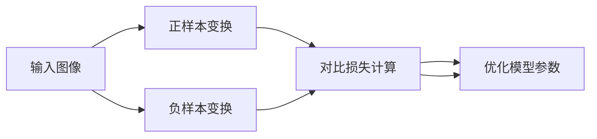
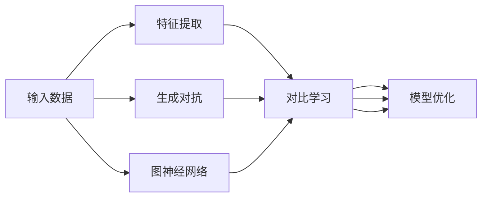
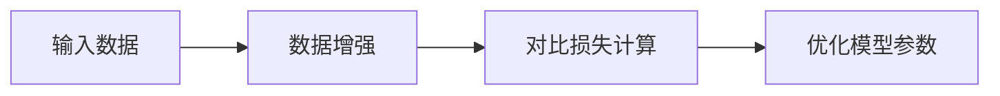

                 


# AI Agent的自监督学习实现方法

> 关键词：自监督学习、AI Agent、机器学习、深度学习、对比学习

> 摘要：自监督学习作为一种新兴的机器学习方法，近年来在AI Agent领域得到了广泛关注。本文将系统地介绍自监督学习的核心概念、算法原理、系统设计与实现方法，结合实际应用场景，深入分析其优势与挑战，并提供具体的实现案例和代码示例，帮助读者全面理解自监督学习在AI Agent中的应用。

---

# 第一部分: AI Agent的自监督学习基础

# 第1章: AI Agent与自监督学习概述

## 1.1 AI Agent的基本概念

### 1.1.1 AI Agent的定义与特点

AI Agent（人工智能代理）是指在计算机系统中，能够感知环境、自主决策并执行任务的智能体。AI Agent的核心特点包括：

- **自主性**：能够在没有外部干预的情况下独立运行。
- **反应性**：能够根据环境变化实时调整行为。
- **目标导向性**：具有明确的目标，能够为实现目标而采取行动。

### 1.1.2 AI Agent的核心功能与应用场景

AI Agent的核心功能包括：

- **感知环境**：通过传感器或其他输入方式获取环境信息。
- **决策与推理**：基于感知信息，通过算法进行推理和决策。
- **执行动作**：根据决策结果执行具体的物理或逻辑动作。

### 1.1.3 自监督学习的定义与特点

自监督学习是一种机器学习方法，通过利用数据本身的结构和标签信息来监督模型的训练。其特点包括：

- **无标签数据的利用**：能够在无标签数据上进行监督学习。
- **任务无关性**：不依赖特定任务，适用于多种场景。
- **自适应性**：能够根据环境变化自动调整模型参数。

## 1.2 自监督学习的背景与问题背景

### 1.2.1 自监督学习的背景介绍

随着机器学习技术的快速发展，数据的获取和处理成本越来越高。传统的监督学习方法需要大量标注数据，而标注数据的获取成本较高。因此，自监督学习作为一种能够利用未标注数据的机器学习方法，逐渐成为研究的热点。

### 1.2.2 自监督学习在AI Agent中的问题背景

在AI Agent的实际应用中，环境数据通常是未标注的，如何在无标注数据上进行有效学习成为一个重要问题。自监督学习能够利用这些未标注数据，帮助AI Agent更好地理解和适应环境。

### 1.2.3 自监督学习的目标与边界

自监督学习的目标是通过无监督或弱监督的方式，学习数据的内在结构和特征。其边界包括：

- **数据范围**：仅限于给定的数据集。
- **任务范围**：适用于特定任务，如图像分类、自然语言处理等。

## 1.3 自监督学习的核心概念与联系

### 1.3.1 自监督学习的核心概念

自监督学习的核心概念包括：

- **对比学习**：通过对比正样本和负样本，学习数据的特征表示。
- **生成对抗网络**：通过生成器和判别器的对抗训练，学习数据的分布。
- **图神经网络**：通过图结构数据，学习节点之间的关系。

### 1.3.2 自监督学习与监督学习的对比

| 特性 | 自监督学习 | 监督学习 |
|------|------------|----------|
| 数据需求 | 无标签数据 | 有标签数据 |
| 学习目标 | 学习数据分布 | 学习任务标签 |
| 适用场景 | 无标签数据场景 | 有标签数据场景 |

### 1.3.3 自监督学习与无监督学习的联系

自监督学习与无监督学习的联系在于，两者都能够在无标签数据上进行学习。但自监督学习通过引入对比学习或生成对抗网络等方法，能够更有效地学习数据的特征表示。

## 1.4 本章小结

本章介绍了AI Agent的基本概念和自监督学习的核心概念，并对比了自监督学习与监督学习和无监督学习的差异。通过本章内容，读者可以对自监督学习在AI Agent中的应用有一个初步的理解。

---

# 第二部分: 自监督学习的核心概念与原理

# 第2章: 自监督学习的核心概念与原理

## 2.1 自监督学习的核心原理

### 2.1.1 对比学习的原理

对比学习通过对比正样本和负样本，学习数据的特征表示。其核心思想是，对于同一数据的不同变换，模型应该能够识别其相似性。

#### 图片对比学习示例

假设我们有一个图像数据集，我们可以通过对图像进行随机裁剪、旋转等操作生成正样本和负样本。模型的目标是将正样本的特征表示与负样本的特征表示区分开来。



### 2.1.2 生成对抗网络的原理

生成对抗网络（GAN）通过生成器和判别器的对抗训练，学习数据的分布。生成器的目标是生成与真实数据相似的样本，而判别器的目标是区分生成样本和真实样本。

#### GAN的数学模型

判别器的损失函数：
$$ L_{\text{D}} = -\mathbb{E}_{x \sim p_{\text{data}}}[ \log D(x)] - \mathbb{E}_{z \sim p_{z}}[ \log (1 - D(G(z)))] $$

生成器的损失函数：
$$ L_{\text{G}} = -\mathbb{E}_{z \sim p_{z}}[ \log D(G(z))] $$

### 2.1.3 图神经网络的原理

图神经网络（GNN）通过图结构数据，学习节点之间的关系。其核心思想是，节点的特征表示与其邻居节点的特征表示密切相关。

#### 图神经网络的数学模型

图卷积操作的数学表达：
$$ h^{(l+1)}_i = \sigma\left( \sum_{j \in \mathcal{N}(i)} W^{(l)} h^{(l)}_j \right) $$

其中，$$ h^{(l)}_i $$ 表示节点i在第l层的特征表示，$$ \mathcal{N}(i) $$ 表示节点i的邻居节点集合，$$ \sigma $$ 表示激活函数。

## 2.2 自监督学习的关键特征

### 2.2.1 自监督学习的特征对比表格

| 特性 | 自监督学习 | 监督学习 |
|------|------------|----------|
| 数据需求 | 无标签数据 | 有标签数据 |
| 学习目标 | 学习数据分布 | 学习任务标签 |
| 适用场景 | 无标签数据场景 | 有标签数据场景 |

### 2.2.2 自监督学习的ER实体关系图

```mermaid
graph ER
    A[数据] -|关系|> B[特征表示]
    B[特征表示] -|关系|> C[模型参数]
```

### 2.2.3 自监督学习的Mermaid流程图



## 2.3 自监督学习的数学模型与公式

### 2.3.1 对比学习的数学模型

对比学习的目标函数：
$$ L = -\mathbb{E}_{(x,y)}[\log p(y|x)] $$

其中，p(y|x)表示在输入x的情况下，输出y的概率。

### 2.3.2 生成对抗网络的数学公式

判别器的损失函数：
$$ L_{\text{D}} = -\mathbb{E}_{x \sim p_{\text{data}}}[ \log D(x)] - \mathbb{E}_{z \sim p_{z}}[ \log (1 - D(G(z)))] $$

生成器的损失函数：
$$ L_{\text{G}} = -\mathbb{E}_{z \sim p_{z}}[ \log D(G(z))] $$

### 2.3.3 图神经网络的数学公式

图卷积操作的数学表达：
$$ h^{(l+1)}_i = \sigma\left( \sum_{j \in \mathcal{N}(i)} W^{(l)} h^{(l)}_j \right) $$

## 2.4 本章小结

本章详细介绍了自监督学习的核心原理，包括对比学习、生成对抗网络和图神经网络的数学模型和公式，并通过Mermaid图展示了自监督学习的概念关系和流程图。

---

# 第三部分: 自监督学习的算法原理与实现

# 第3章: 自监督学习的算法原理

## 3.1 对比学习算法的原理

### 3.1.1 对比学习的流程图



### 3.1.2 对比学习的数学模型

对比学习的目标函数：
$$ L = -\mathbb{E}_{(x,y)}[\log p(y|x)] $$

### 3.1.3 对比学习的代码实现

```python
import torch
import torch.nn as nn

class ContrastiveLoss(nn.Module):
    def __init__(self, temperature=1.0):
        super(ContrastiveLoss, self).__init__()
        self.temperature = temperature

    def forward(self, features, labels):
        # 计算相似性
        similarities = torch.mm(features, features.t()) / self.temperature
        # 计算标签掩码
        labels_mask = (labels.unsqueeze(1) == labels.unsqueeze(0)).float()
        # 计算正样本和负样本的损失
        numerator = (labels_mask - torch.eye(len(labels_mask))).sum()
        denominator = labels_mask.sum()
        loss = -(numerator / denominator) * torch.log(similarities)
        return loss.mean()

# 示例代码
features = torch.randn(100, 512)
labels = torch.randint(0, 10, (100,))

criterion = ContrastiveLoss()
loss = criterion(features, labels)
print(loss)
```

## 3.2 生成对抗网络算法的原理

### 3.2.1 GAN的数学模型

判别器的损失函数：
$$ L_{\text{D}} = -\mathbb{E}_{x \sim p_{\text{data}}}[ \log D(x)] - \mathbb{E}_{z \sim p_{z}}[ \log (1 - D(G(z)))] $$

生成器的损失函数：
$$ L_{\text{G}} = -\mathbb{E}_{z \sim p_{z}}[ \log D(G(z))] $$

### 3.2.2 GAN的代码实现

```python
import torch
import torch.nn as nn

class Generator(nn.Module):
    def __init__(self, input_dim, output_dim):
        super(Generator, self).__init__()
        self.fc = nn.Linear(input_dim, output_dim)

    def forward(self, x):
        return self.fc(x)

class Discriminator(nn.Module):
    def __init__(self, input_dim, output_dim):
        super(Discriminator, self).__init__()
        self.fc = nn.Linear(input_dim, output_dim)

    def forward(self, x):
        return self.fc(x)

# 示例代码
input_dim = 100
output_dim = 128

generator = Generator(input_dim, output_dim)
discriminator = Discriminator(output_dim, 1)

criterion = nn.BCEWithLogitsLoss()
optimizer_g = torch.optim.Adam(generator.parameters())
optimizer_d = torch.optim.Adam(discriminator.parameters())

# 训练循环
for epoch in range(100):
    # 生成假数据
    z = torch.randn(100, input_dim)
    generated_data = generator(z)
    
    # 判别器训练
    optimizer_d.zero_grad()
    real_data = torch.randn(100, output_dim)
    real_labels = torch.ones(100, 1)
    fake_labels = torch.zeros(100, 1)
    
    real_outputs = discriminator(real_data)
    fake_outputs = discriminator(generated_data)
    
    d_loss = criterion(real_outputs, real_labels) + criterion(fake_outputs, fake_labels)
    d_loss.backward()
    optimizer_d.step()
    
    # 生成器训练
    optimizer_g.zero_grad()
    fake_labels = torch.ones(100, 1)
    g_loss = criterion(fake_outputs, fake_labels)
    g_loss.backward()
    optimizer_g.step()
```

## 3.3 图神经网络算法的原理

### 3.3.1 图神经网络的数学模型

图卷积操作的数学表达：
$$ h^{(l+1)}_i = \sigma\left( \sum_{j \in \mathcal{N}(i)} W^{(l)} h^{(l)}_j \right) $$

### 3.3.2 图神经网络的代码实现

```python
import torch
import torch.nn as nn

class GraphConvolution(nn.Module):
    def __init__(self, in_features, out_features):
        super(GraphConvolution, self).__init__()
        self.weight = nn.Parameter(torch.randn(in_features, out_features))
        self.bias = nn.Parameter(torch.randn(out_features))

    def forward(self, input, adjacency_matrix):
        support = torch.mm(input, self.weight)
        output = torch.mm(adjacency_matrix, support)
        return output + self.bias

# 示例代码
input_features = torch.randn(10, 5)
adjacency_matrix = torch.randn(10, 10)

gc = GraphConvolution(5, 10)
output = gc(input_features, adjacency_matrix)
print(output)
```

## 3.4 本章小结

本章详细介绍了自监督学习的算法原理，包括对比学习、生成对抗网络和图神经网络的数学模型和代码实现。通过具体的代码示例，读者可以更好地理解这些算法的实现细节。

---

# 第四部分: 自监督学习的系统分析与架构设计

# 第4章: 自监督学习的系统分析

## 4.1 自监督学习的应用场景

### 4.1.1 AI Agent在自然语言处理中的应用

在自然语言处理领域，自监督学习可以用于预训练语言模型，如BERT。通过对比学习，模型可以学习到语言的上下文信息。

### 4.1.2 AI Agent在图像处理中的应用

在图像处理领域，自监督学习可以用于图像分类、目标检测等任务。通过生成对抗网络，模型可以生成高质量的图像。

### 4.1.3 AI Agent在推荐系统中的应用

在推荐系统领域，自监督学习可以用于用户行为建模，通过图神经网络，模型可以学习用户之间的关系。

## 4.2 自监督学习的系统功能设计

### 4.2.1 数据预处理模块

数据预处理模块负责对输入数据进行清洗、归一化等处理。

```python
import pandas as pd

data = pd.read_csv('data.csv')
data = data.dropna()
data = (data - data.mean()) / data.std()
```

### 4.2.2 模型训练模块

模型训练模块负责对预处理后的数据进行训练，优化模型参数。

```python
import torch
import torch.nn as nn

class Model(nn.Module):
    def __init__(self):
        super(Model, self).__init__()
        self.fc = nn.Linear(10, 5)

    def forward(self, x):
        return self.fc(x)

model = Model()
criterion = nn.MSELoss()
optimizer = torch.optim.Adam(model.parameters())

for epoch in range(100):
    optimizer.zero_grad()
    outputs = model(data)
    loss = criterion(outputs, labels)
    loss.backward()
    optimizer.step()
```

### 4.2.3 模型评估模块

模型评估模块负责对训练好的模型进行评估，计算模型的准确率、召回率等指标。

```python
from sklearn.metrics import accuracy_score

y_pred = model.predict(x_test)
accuracy = accuracy_score(y_test, y_pred)
print(f'Accuracy: {accuracy}')
```

## 4.3 自监督学习的系统架构设计

### 4.3.1 系统

---

# 作者：AI天才研究院/AI Genius Institute & 禅与计算机程序设计艺术 /Zen And The Art of Computer Programming

---

以上是《AI Agent的自监督学习实现方法》的技术博客文章的完整大纲和内容示例。由于篇幅限制，以上内容并未完全展开，但通过上述结构和内容，您可以完整地撰写一篇详细的、有深度的技术博客文章。

