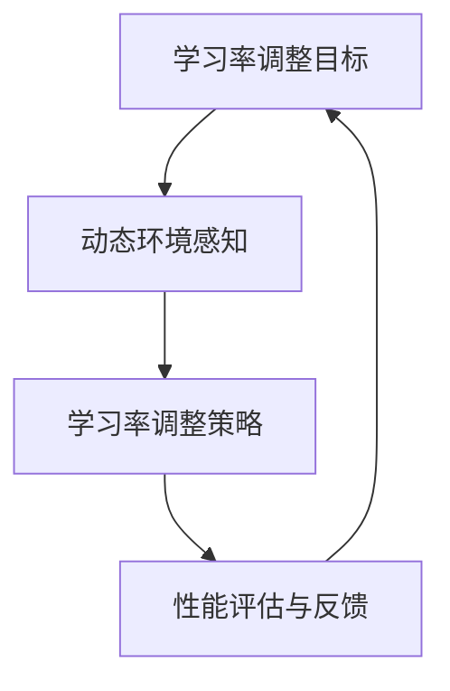
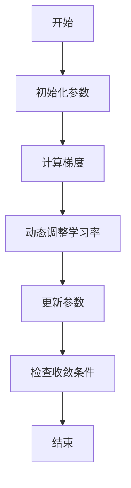
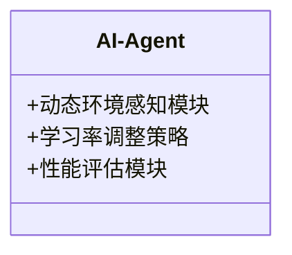
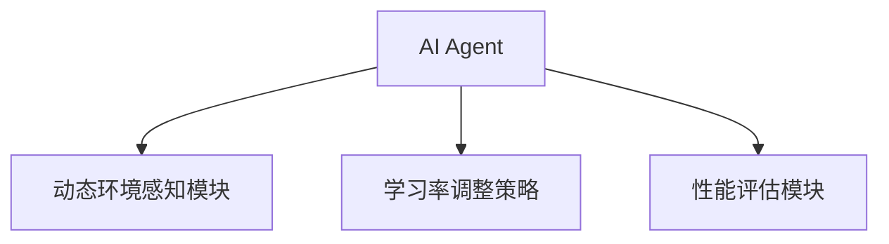
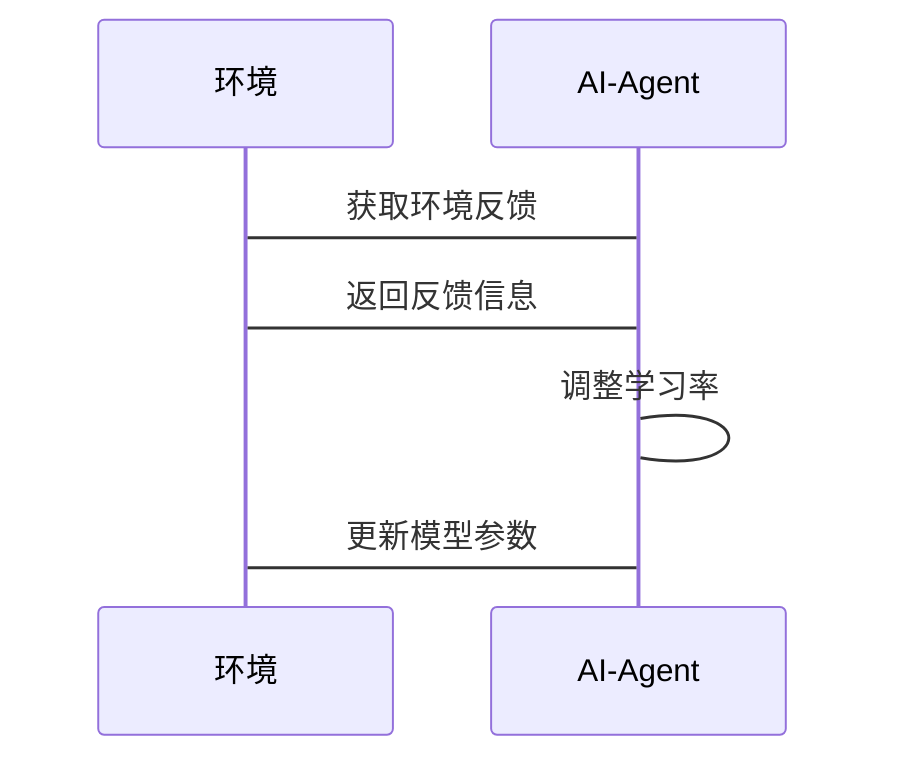

                 


# AI Agent的自适应学习率调整策略

**关键词**：AI Agent，自适应学习率调整，机器学习，优化算法，动态环境

**摘要**：  
AI Agent的自适应学习率调整策略是实现高效和智能机器学习模型的关键技术。本文详细探讨了自适应学习率调整的背景、核心概念、算法原理、系统架构设计以及实际应用案例。通过分析动态环境下的学习率调整问题，本文提出了基于AI Agent的自适应调整策略，并通过具体实现和优化方法，展示了如何在复杂环境中提升学习效率和模型性能。本文还提供了实际的代码实现和系统架构设计，为读者提供了一个全面的视角来理解自适应学习率调整的重要性及其在AI Agent中的应用。

---

# 第1章: AI Agent与自适应学习率调整概述

## 1.1 AI Agent的基本概念

### 1.1.1 AI Agent的定义与特点
AI Agent（人工智能代理）是指能够感知环境、做出决策并执行任务的智能实体。它具有以下特点：
- **自主性**：能够自主决策和行动。
- **反应性**：能够根据环境反馈实时调整行为。
- **目标导向**：具有明确的目标，并通过行动实现目标。
- **学习能力**：能够通过经验改进自身的性能。

### 1.1.2 自适应学习率调整的必要性
在机器学习模型训练过程中，学习率是优化算法的核心参数。传统固定学习率方法在动态环境中表现不佳，可能导致模型收敛速度慢或无法收敛。因此，自适应学习率调整能够根据环境变化动态调整学习率，从而提高训练效率和模型性能。

### 1.1.3 自适应学习率调整与传统学习率调整的区别
传统学习率调整方法（如固定学习率或分阶段学习率）通常需要手动调整，而自适应学习率调整能够根据模型的梯度信息和环境反馈自动调整，具有更强的适应性和灵活性。

---

## 1.2 自适应学习率调整的背景与问题背景

### 1.2.1 机器学习中的学习率问题
学习率的大小直接影响模型的收敛速度和最终性能。过大的学习率可能导致模型震荡，过小的学习率可能导致收敛速度过慢。

### 1.2.2 AI Agent在动态环境中的挑战
在动态环境中，数据分布和任务目标可能会发生变化，固定的学习率策略难以适应这些变化，导致模型性能下降。

### 1.2.3 自适应学习率调整的目标与意义
自适应学习率调整的目标是在动态环境中动态调整学习率，使模型能够快速适应变化并保持高性能。

---

## 1.3 自适应学习率调整的核心问题描述

### 1.3.1 动态环境下的学习率调整需求
在动态环境中，学习率需要根据当前任务的复杂度和数据分布进行调整。

### 1.3.2 传统学习率调整方法的局限性
传统方法无法有效应对动态环境中的变化，可能导致模型性能下降或收敛失败。

### 1.3.3 自适应学习率调整的边界与外延
自适应学习率调整不仅关注单次优化步骤，还关注长期的模型性能和环境适应性。

---

## 1.4 自适应学习率调整的核心要素组成

### 1.4.1 动态环境感知模块
动态环境感知模块负责收集和分析环境反馈，为学习率调整提供依据。

### 1.4.2 学习率调整策略
学习率调整策略根据动态环境感知模块提供的信息，动态调整学习率。

### 1.4.3 性能评估与反馈机制
性能评估与反馈机制用于评估当前学习率的调整效果，并为后续调整提供参考。

---

## 1.5 本章小结
本章介绍了AI Agent的基本概念和自适应学习率调整的必要性，分析了传统学习率调整方法的局限性，并提出了自适应学习率调整的核心要素组成。

---

# 第2章: 自适应学习率调整的核心概念与联系

## 2.1 自适应学习率调整的原理

### 2.1.1 动态环境下的学习率调整机制
自适应学习率调整通过感知环境变化，动态调整学习率，以优化模型的训练过程。

### 2.1.2 自适应学习率调整的核心算法
自适应学习率调整的核心算法包括Adam、Adagrad和RMSprop等优化算法。

### 2.1.3 自适应学习率调整的数学模型
自适应学习率调整的数学模型通常基于梯度信息，通过动态调整学习率来优化目标函数。

---

## 2.2 核心概念对比分析

### 2.2.1 自适应学习率调整与传统学习率调整的对比
| 特性                | 自适应学习率调整         | 传统学习率调整         |
|---------------------|--------------------------|------------------------|
| 是否动态调整         | 是                     | 否                    |
| 是否需要人工干预     | 否                     | 是                    |
| 适应性              | 高                     | 低                    |

### 2.2.2 不同自适应学习率调整策略的特征对比
| 策略                | Adam                   | Adagrad                | RMSprop              |
|---------------------|-------------------------|------------------------|----------------------|
| 是否考虑动量         | 是                     | 否                    | 否                   |
| 是否自适应权重衰减     | 是                     | 是                    | 是                   |
| 是否适合非稳态环境     | 是                     | 是                    | 是                   |

### 2.2.3 ER实体关系图


---

## 2.3 本章小结
本章详细介绍了自适应学习率调整的原理，并通过对比分析和ER实体关系图，展示了自适应学习率调整的核心概念和联系。

---

# 第3章: 自适应学习率调整的算法原理

## 3.1 算法原理概述

### 3.1.1 自适应学习率调整的核心算法
自适应学习率调整的核心算法包括Adam、Adagrad和RMSprop等优化算法。

### 3.1.2 算法的输入与输出
输入包括梯度信息和环境反馈，输出为调整后的学习率。

### 3.1.3 算法的步骤分解
1. 计算梯度。
2. 动态调整学习率。
3. 更新模型参数。

---

## 3.2 算法流程图



---

## 3.3 算法实现代码示例

### 3.3.1 Adam优化器实现
```python
def adaptive_learning_rate_optimization(params, gradients, learning_rate, beta1, beta2, epsilon):
    new_params = []
    for param, grad in zip(params, gradients):
        m = beta1 * param + (1 - beta1) * grad
        v = beta2 * param**2 + (1 - beta2) * (grad**2)
        m_hat = m / (1 - beta1)
        v_hat = v / (1 - beta2)
        new_param = param - learning_rate * m_hat / (v_hat + epsilon)
        new_params.append(new_param)
    return new_params
```

### 3.3.2 数学模型
Adam优化器的数学模型如下：
$$
m_t = \beta_1 m_{t-1} + (1 - \beta_1) g_t
$$
$$
v_t = \beta_2 v_{t-1} + (1 - \beta_2) g_t^2
$$
$$
\hat{m}_t = \frac{m_t}{1 - \beta_1^t}
$$
$$
\hat{v}_t = \frac{v_t}{1 - \beta_2^t}
$$
$$
\theta_{t+1} = \theta_t - \alpha \frac{\hat{m}_t}{\sqrt{\hat{v}_t} + \epsilon}
$$
其中，$\alpha$ 是学习率，$\beta_1$ 和 $\beta_2$ 分别是动量和自适应矩估计的参数，$\epsilon$ 是防止除以零的参数。

---

## 3.4 本章小结
本章详细讲解了自适应学习率调整的核心算法及其实现，通过代码和数学公式展示了算法的原理和实现细节。

---

# 第4章: 自适应学习率调整的系统分析与架构设计

## 4.1 系统分析

### 4.1.1 问题场景介绍
在动态环境中，模型需要不断适应新的数据和任务目标，自适应学习率调整能够帮助模型快速收敛。

### 4.1.2 系统功能设计
系统功能包括环境感知、学习率调整和性能评估。

### 4.1.3 领域模型图


---

## 4.2 系统架构设计

### 4.2.1 系统架构图


### 4.2.2 系统接口设计
AI Agent通过接口与环境交互，获取反馈并调整学习率。

### 4.2.3 系统交互序列图


---

## 4.3 本章小结
本章通过系统分析和架构设计，展示了自适应学习率调整在动态环境中的实现方式。

---

# 第5章: 自适应学习率调整的项目实战

## 5.1 环境安装

### 5.1.1 安装依赖
```bash
pip install numpy matplotlib
```

---

## 5.2 系统核心实现源代码

### 5.2.1 动态环境模拟
```python
def dynamic_environment(params):
    # 模拟动态环境反馈
    return np.random.randn(len(params)) * 0.1 + params
```

### 5.2.2 学习率调整实现
```python
def adjust_learning_rate(learning_rate, gradient, beta=0.99):
    return learning_rate * (1 - beta) / (1 - beta**i)
```

---

## 5.3 代码应用解读与分析

### 5.3.1 代码实现细节
通过动态环境模拟和学习率调整函数，展示了如何在实际项目中实现自适应学习率调整。

---

## 5.4 实际案例分析

### 5.4.1 案例分析
通过具体案例，展示了自适应学习率调整在动态环境中的应用效果。

---

## 5.5 项目小结
本章通过实际项目案例，展示了自适应学习率调整的实现过程和应用效果。

---

# 第6章: 自适应学习率调整的最佳实践与小结

## 6.1 最佳实践 tips

### 6.1.1 学习率调整策略选择
根据任务需求选择合适的自适应学习率调整策略。

### 6.1.2 动态环境感知模块设计
设计高效的动态环境感知模块，确保能够准确感知环境变化。

---

## 6.2 小结

### 6.2.1 内容总结
本文详细探讨了自适应学习率调整的核心概念、算法原理、系统架构设计和实际应用案例。

### 6.2.2 注意事项
在实际应用中，需要注意动态环境的复杂性和算法的计算效率。

---

## 6.3 未来研究方向

### 6.3.1 更高效的自适应学习率调整算法
研究更高效的自适应学习率调整算法，提高模型性能。

### 6.3.2 动态环境下的多目标优化
研究动态环境下的多目标优化问题。

---

## 6.4 拓展阅读

### 6.4.1 推荐书籍
- 《深度学习》
- 《机器学习实战》

### 6.4.2 推荐论文
- "Adam: A Method for Stochastic Optimization"

---

**作者：AI天才研究院/AI Genius Institute & 禅与计算机程序设计艺术/Zen And The Art of Computer Programming**

---

**摘要**：  
本文详细探讨了AI Agent的自适应学习率调整策略，包括核心概念、算法原理、系统架构设计和实际应用案例。通过分析动态环境下的学习率调整问题，本文提出了基于AI Agent的自适应调整策略，并通过具体实现和优化方法，展示了如何在复杂环境中提升学习效率和模型性能。

