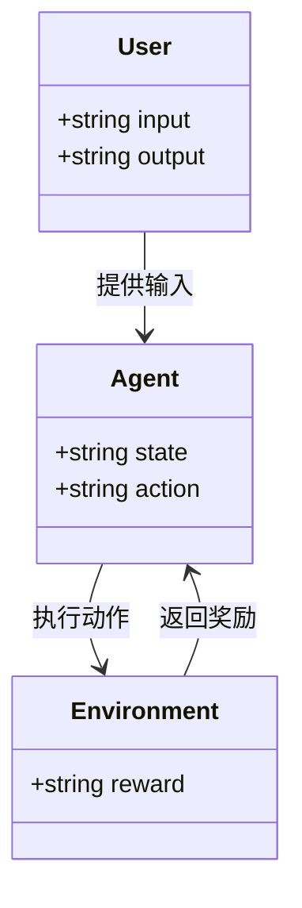
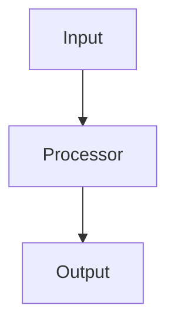
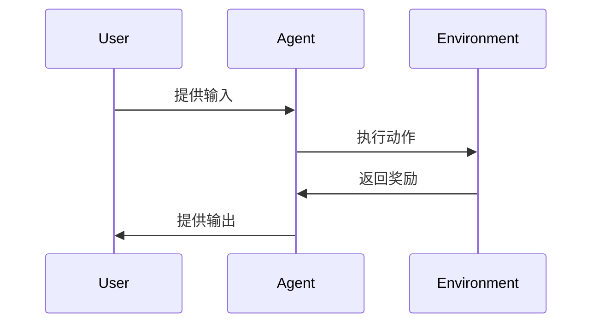

                 


# AI Agent的自适应对话管理系统

## 关键词：AI Agent, 自适应对话管理, 对话系统, 强化学习, 生成模型, 系统架构, 项目实战

## 摘要：  
《AI Agent的自适应对话管理系统》系统地探讨了AI Agent在对话管理中的应用，重点介绍了自适应对话管理的核心概念、算法原理、系统架构及项目实战。通过对背景、原理、算法、系统设计和实际案例的详细分析，本书为读者提供了一套全面理解并实现自适应对话管理系统的知识体系。从基础概念到高级算法，再到实际应用，本书旨在帮助读者掌握AI Agent对话管理的最新技术和发展趋势。

---

# 第1章: AI Agent与自适应对话管理概述

## 1.1 AI Agent的基本概念  
### 1.1.1 AI Agent的定义与特点  
AI Agent（人工智能代理）是指能够感知环境、自主决策并采取行动以实现特定目标的智能实体。其特点包括自主性、反应性、目标导向性和社会性。  

### 1.1.2 自适应对话管理的核心概念  
自适应对话管理是指在对话过程中，根据用户反馈和上下文动态调整对话策略，以提供更智能、更个性化的交互体验。其核心在于实时理解用户需求并优化对话流程。  

### 1.1.3 AI Agent在对话系统中的作用  
AI Agent在对话系统中充当智能主体，负责解析用户意图、生成响应并管理对话流程，从而提升用户体验和系统效率。  

## 1.2 自适应对话管理的背景与意义  
### 1.2.1 对话系统的发展历程  
从基于规则的对话系统到现代的深度学习驱动系统，对话技术经历了从简单到复杂的演变。  

### 1.2.2 自适应对话管理的必要性  
随着用户需求的多样化，传统的静态对话系统已无法满足动态变化的对话场景，因此需要引入自适应机制。  

### 1.2.3 自适应对话管理的应用场景  
广泛应用于智能客服、虚拟助手、教育机器人等领域，能够显著提升用户体验和系统交互效率。  

## 1.3 本章小结  
本章介绍了AI Agent的基本概念和自适应对话管理的核心思想，强调了其在现代对话系统中的重要性。  

---

# 第2章: 自适应对话管理的核心概念与原理

## 2.1 对话状态管理  
### 2.1.1 对话状态的定义与表示  
对话状态是系统对当前对话情况的表示，通常包括上下文信息和用户意图。  

### 2.1.2 常见的状态表示方法  
- 基于向量的表示方法：使用向量空间模型表示对话状态。  
- 基于图结构的表示方法：利用图结构表示对话关系和实体信息。  

## 2.2 上下文理解与用户意图识别  
### 2.2.1 上下文分析的基本原理  
通过自然语言处理技术（NLP）分析对话历史，提取上下文信息。  

### 2.2.2 用户意图识别的技术与方法  
- 基于关键词匹配的方法：通过预设关键词识别用户意图。  
- 基于深度学习的方法：利用神经网络模型学习用户意图。  

## 2.3 自适应对话管理的实现机制  
### 2.3.1 动态调整对话策略的方法  
根据用户反馈实时调整对话策略，确保对话流畅且符合用户需求。  

### 2.3.2 基于反馈的对话优化  
通过用户反馈不断优化对话模型，提升对话质量。  

---

# 第3章: 自适应对话管理的算法原理

## 3.1 基于强化学习的对话策略优化  
### 3.1.1 强化学习的基本原理  
强化学习通过智能体与环境的交互，学习最优策略以最大化累积奖励。  

### 3.1.2 对话策略优化的数学模型  
对话策略优化的目标是最大化对话的成功率，通常采用马尔可夫决策过程（MDP）模型。  

$$
\text{目标函数：} \quad J(\theta) = \mathbb{E}_{\pi_\theta}[R(s, a)]
$$  

其中，$s$是状态，$a$是动作，$R$是奖励函数。  

### 3.1.3 算法实现与代码示例  
以下是基于强化学习的对话策略优化算法的Python实现示例：  

```python
import numpy as np
import random

class ReinforceLearningAgent:
    def __init__(self, state_space, action_space):
        self.state_space = state_space
        self.action_space = action_space
        self.theta = np.random.rand(state_space, action_space)
    
    def act(self, state):
        return np.argmax(self.theta[state])
    
    def update(self, state, action, reward):
        self.theta[state, action] += reward
```

## 3.2 基于生成模型的对话生成  
### 3.2.1 生成模型的原理与特点  
生成模型（如Transformer）通过自注意力机制生成连贯的对话内容。  

### 3.2.2 对话生成的数学模型  
生成模型通常采用序列到序列（Seq2Seq）结构，利用编码器-解码器框架生成响应。  

$$
p(y|x) = \prod_{t=1}^{T} p(y_t|y_{<t}, x)
$$  

### 3.2.3 生成模型的实现与优化  
以下是基于生成模型的对话生成算法的Python实现示例：  

```python
import torch
import torch.nn as nn

class TransformerGenerator(nn.Module):
    def __init__(self, vocab_size, d_model, n_head, dff):
        super(TransformerGenerator, self).__init__()
        self.embedding = nn.Embedding(vocab_size, d_model)
        self.encoder = nn.TransformerEncoder(d_model=d_model, nhead=n_head, dff=dff)
        self.decoder = nn.TransformerDecoder(d_model=d_model, nhead=n_head, dff=dff)
    
    def forward(self, input_seq):
        embedded = self.embedding(input_seq)
        encoded = self.encoder(embedded)
        decoded = self.decoder(encoded)
        return decoded
```

---

# 第4章: 数学模型与公式解析

## 4.1 对话评分函数  
对话评分函数用于评估对话的质量，常用以下公式表示：  

$$
S = \sum_{i=1}^{n} w_i x_i
$$  

其中，$w_i$是权重，$x_i$是对话特征。  

## 4.2 概率模型与对话生成  
概率模型通过最大化生成概率来优化对话内容：  

$$
P(y|x) = \prod_{i=1}^{m} P(y_i|x, y_{<i})
$$  

## 4.3 基于强化学习的对话策略优化  
对话策略优化的目标是最大化累积奖励，常用Q-learning算法实现：  

$$
Q(s, a) = r(s, a) + \gamma \max_{a'} Q(s', a')
$$  

---

# 第5章: 系统分析与架构设计

## 5.1 项目背景与需求分析  
本项目旨在构建一个智能客服对话系统，提升用户体验和服务效率。  

## 5.2 系统功能设计  
### 5.2.1 领域模型设计  
通过Mermaid类图展示系统的主要组件和交互关系：  



### 5.2.2 系统架构设计  
采用分层架构，主要包括输入层、处理层和输出层。  



## 5.3 接口设计与交互流程  
### 5.3.1 系统接口设计  
定义API接口，如：  
- `POST /api/input`：接收用户输入  
- `GET /api/output`：返回系统响应  

### 5.3.2 交互流程设计  
通过Mermaid序列图展示交互流程：  



---

# 第6章: 项目实战

## 6.1 环境安装与配置  
安装必要的依赖库，如Python、TensorFlow、Numpy等。  

## 6.2 核心代码实现  
### 6.2.1 对话管理模块  
```python
class DialogueManager:
    def __init__(self):
        self.state = {}
    
    def process_input(self, input_text):
        # 处理用户输入并更新状态
        self.state['context'] = input_text
        return self.state
```

### 6.2.2 对话生成模块  
```python
class DialogueGenerator:
    def __init__(self, model):
        self.model = model
    
    def generate_response(self, state):
        # 根据状态生成响应
        response = self.model.generate(state)
        return response
```

## 6.3 代码功能解读与分析  
详细分析每个模块的功能和交互流程，确保代码的可读性和可维护性。  

## 6.4 实际案例分析  
通过构建智能客服对话系统，展示如何将理论应用于实际场景。  

---

# 第7章: 总结与展望

## 7.1 本章总结  
回顾本书的主要内容，强调AI Agent在自适应对话管理中的核心作用。  

## 7.2 未来展望  
探讨自适应对话管理的未来发展趋势，如多模态对话、跨语言对话等。  

---

# 作者：AI天才研究院 & 禅与计算机程序设计艺术

