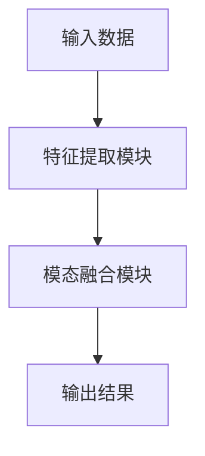
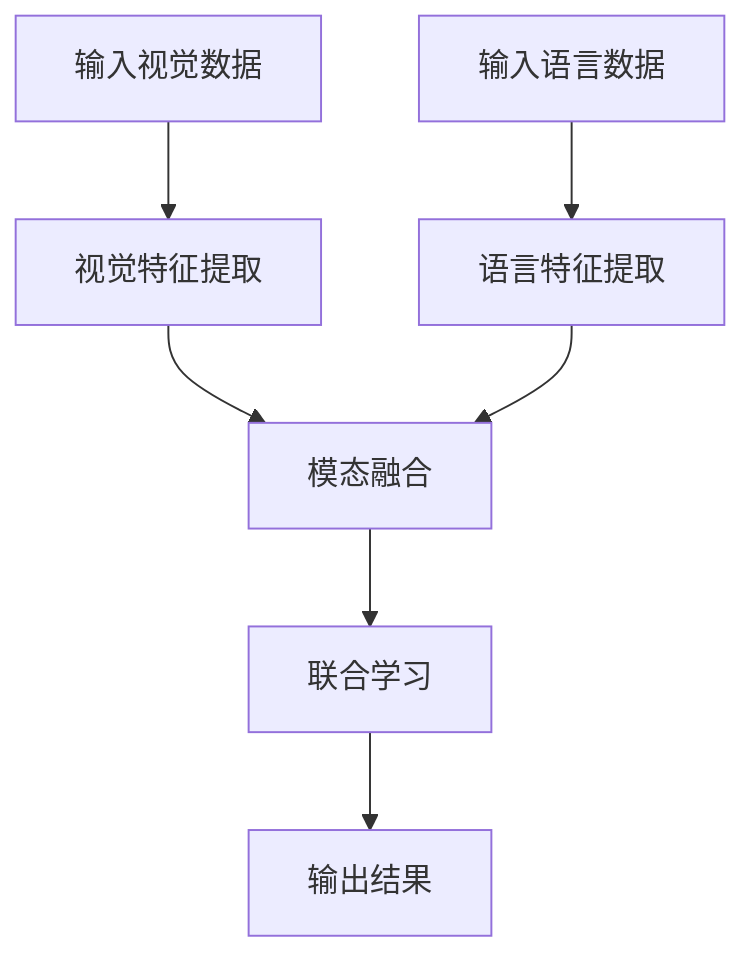
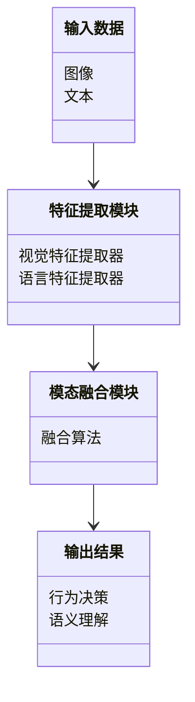

                 


# AI Agent的视觉-语言联合学习实现

> 关键词：AI Agent, 视觉-语言联合学习, 多模态学习, 模态融合, 深度学习, 计算机视觉, 自然语言处理

> 摘要：本文详细探讨了AI Agent在视觉-语言联合学习中的实现方法，从背景、核心概念、算法原理、系统架构到项目实战，全面解析了多模态学习的关键技术与应用。文章通过丰富的案例和详细的代码实现，帮助读者理解如何构建高效的视觉-语言联合学习系统。

---

# 第一部分: AI Agent的视觉-语言联合学习背景与基础

## 第1章: AI Agent与视觉-语言联合学习概述

### 1.1 问题背景与目标

#### 1.1.1 多模态学习的必要性
在现实世界中，信息往往是多模态的，例如图像、文本、语音等。单一模态的数据往往无法提供足够的信息来完成复杂的任务。通过结合多个模态的数据，AI Agent可以更好地理解和处理复杂场景中的问题。

#### 1.1.2 AI Agent的核心需求
AI Agent需要具备理解、推理和决策的能力。为了实现这些能力，AI Agent需要能够处理多种类型的数据，并从中提取有用的信息。

#### 1.1.3 视觉-语言联合学习的目标
视觉-语言联合学习的目标是让AI Agent能够同时理解和处理视觉和语言信息，从而在复杂的场景中做出更准确的判断和决策。

### 1.2 问题描述与解决思路

#### 1.2.1 视觉与语言数据的特点
- 视觉数据：图像、视频等，具有空间信息和丰富的细节。
- 语言数据：文本、语音等，具有语义信息和上下文关系。

#### 1.2.2 联合学习的核心问题
如何有效地将视觉和语言信息进行融合，提取有用的特征，并进行准确的学习和推理。

#### 1.2.3 解决方案的初步思路
- 提取视觉和语言的特征。
- 将特征进行融合，形成统一的表示。
- 基于融合的表示进行学习和推理。

### 1.3 边界与外延

#### 1.3.1 与其他多模态任务的区别
- 视觉-语言联合学习专注于视觉和语言的结合，而其他多模态任务可能涉及更多的模态，如音频、触觉等。
- 视觉-语言联合学习的目标是实现跨模态的理解和推理，而其他任务可能更关注单一模态的优化。

#### 1.3.2 与单一模态任务的联系
视觉-语言联合学习基于视觉和语言的单模态任务，通过结合两者的特征，实现更复杂的任务。

#### 1.3.3 未来发展的可能方向
- 更高效的特征融合方法。
- 更强的跨模态推理能力。
- 更广泛的应用场景。

### 1.4 核心概念结构

#### 1.4.1 涵盖的主要概念
- 多模态学习：同时处理多种模态的数据，提取跨模态特征。
- 视觉-语言联合学习：结合视觉和语言信息，实现跨模态的理解和推理。
- AI Agent：具备感知、推理和决策能力的智能体。

#### 1.4.2 各概念之间的关系
- 多模态学习是视觉-语言联合学习的基础。
- 视觉-语言联合学习是AI Agent实现复杂任务的核心技术。
- AI Agent通过视觉-语言联合学习，能够更好地理解环境并做出决策。

#### 1.4.3 系统的核心要素组成
- 数据输入：视觉和语言数据的获取与预处理。
- 特征提取：对视觉和语言数据进行特征提取。
- 模态融合：将视觉和语言特征进行融合，形成统一的表示。
- 学习与推理：基于融合的特征进行学习和推理，输出结果。

---

## 第2章: 视觉-语言联合学习的核心概念与联系

### 2.1 多模态学习的基本原理

#### 2.1.1 多模态数据的特征提取
- 视觉特征提取：使用CNN、Transformer等模型提取图像的特征。
- 语言特征提取：使用BERT、GPT等模型提取文本的特征。

#### 2.1.2 不同模态数据的关联性分析
- 视觉和语言数据之间存在语义上的关联，可以通过跨模态注意力机制进行建模。

#### 2.1.3 跨模态信息的融合方式
- 晚融合：在特征提取之后进行融合。
- 早融合：在特征提取的过程中进行融合。

### 2.2 视觉-语言模型的属性对比

| 模型属性 | 视觉模型 | 语言模型 |
|----------|----------|----------|
| 输入数据 | 图像、视频 | 文本、语音 |
| 输出特征 | 视觉特征向量 | 语言特征向量 |
| 应用场景 | 图像分类、目标检测 | 文本分类、语义理解 |

### 2.3 系统架构的ER实体关系图



---

## 第3章: 视觉-语言联合学习的算法原理

### 3.1 算法流程



### 3.2 算法实现代码示例

```python
import torch
from torch import nn

class VisualLanguageModel(nn.Module):
    def __init__(self, visual_dim, language_dim):
        super().__init__()
        self.visual_proj = nn.Linear(visual_dim, 512)
        self.language_proj = nn.Linear(language_dim, 512)
        self融合层 = nn.Linear(1024, 512)
        self.output = nn.Linear(512, output_dim)
        
    def forward(self, visual_features, language_features):
        visual_proj = self.visual_proj(visual_features)
        language_proj = self.language_proj(language_features)
        fused = torch.cat([visual_proj, language_proj], dim=-1)
       融合输出 = self.融合层(fused)
        output = self.output(融合输出)
        return output
```

### 3.3 数学模型与公式

视觉特征和语言特征的融合公式：
$$
fused\_feature = \sigma(W_v \cdot visual\_feature + W_l \cdot language\_feature + b)
$$
其中，$\sigma$ 表示sigmoid函数，$W_v$ 和 $W_l$ 是视觉和语言的权重矩阵，$b$ 是偏置项。

---

## 第4章: 系统分析与架构设计方案

### 4.1 问题场景介绍

AI Agent需要在复杂的场景中处理视觉和语言信息，例如智能助手、机器人等。

### 4.2 系统功能设计



### 4.3 系统架构设计


### 4.4 系统接口设计

- 输入接口：接收视觉和语言数据。
- 输出接口：输出融合后的特征或决策结果。

### 4.5 系统交互设计

```mermaid
sequenceDiagram
    participant 用户
    participant 系统
    用户 -> 系统: 提供视觉和语言数据
    系统 -> 特征提取模块: 提取特征
    特征提取模块 -> 模态融合模块: 融合特征
    模态融合模块 -> 系统: 输出结果
    用户 <- 系统: 返回结果
```

---

## 第5章: 项目实战

### 5.1 环境安装

```bash
pip install torch torchvision transformers
```

### 5.2 系统核心实现

```python
import torch
from torch import nn
from torchvision import models

class VisualLanguageModel(nn.Module):
    def __init__(self, visual_dim, language_dim, output_dim):
        super().__init__()
        self.visual_proj = nn.Linear(visual_dim, 512)
        self.language_proj = nn.Linear(language_dim, 512)
        self融合层 = nn.Linear(1024, 512)
        self.output = nn.Linear(512, output_dim)
        
    def forward(self, visual_features, language_features):
        visual_proj = self.visual_proj(visual_features)
        language_proj = self.language_proj(language_features)
        fused = torch.cat([visual_proj, language_proj], dim=-1)
       融合输出 = self.融合层(fused)
        output = self.output(融合输出)
        return output
```

### 5.3 代码应用解读与分析

- 特征提取：使用预训练的视觉模型提取图像特征，使用BERT等语言模型提取文本特征。
- 融合：将视觉和语言特征进行拼接或加权融合。
- 输出：基于融合的特征进行分类或回归。

### 5.4 实际案例分析

案例：图像描述生成
- 输入：一张图像。
- 输出：对图像内容的描述文本。

### 5.5 项目小结

通过项目实战，我们可以看到视觉-语言联合学习在实际应用中的潜力和挑战。关键在于如何高效地融合多模态特征，并在实际任务中取得良好的效果。

---

## 第6章: 最佳实践 tips、小结、注意事项、拓展阅读

### 6.1 小结

本文详细探讨了AI Agent的视觉-语言联合学习实现，从背景、核心概念、算法原理到系统架构和项目实战，全面解析了多模态学习的关键技术与应用。

### 6.2 注意事项

- 数据质量：确保输入数据的多样性和代表性。
- 模型选择：根据具体任务选择合适的模型和算法。
- 融合方式：尝试不同的融合方式，找到最优解。

### 6.3 拓展阅读

- 《多模态学习：理论与应用》
- 《视觉-语言联合学习的前沿研究》
- 《深度学习中的模态融合方法》

---

作者：AI天才研究院/AI Genius Institute & 禅与计算机程序设计艺术 /Zen And The Art of Computer Programming

