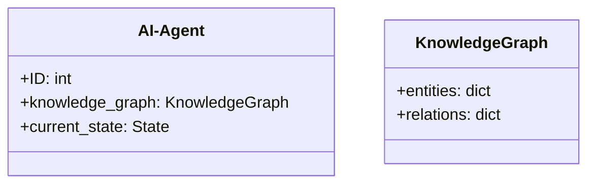
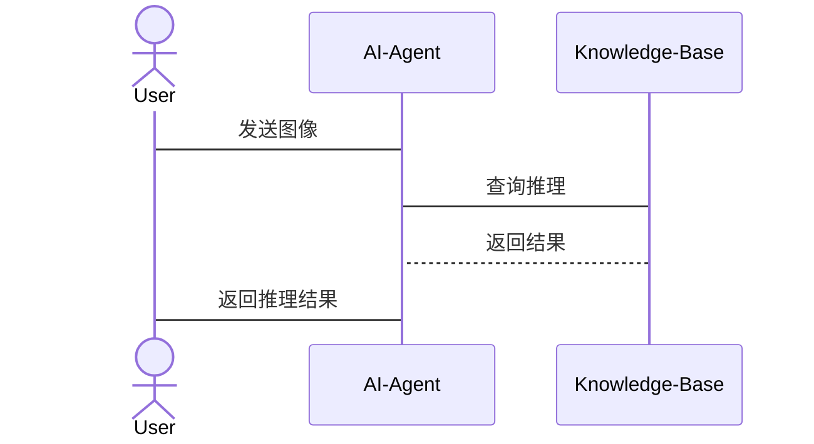

                 


# AI Agent的视觉常识推理能力开发

> 关键词：AI Agent，视觉常识推理，知识图谱，计算机视觉，自然语言处理

> 摘要：本文详细探讨了AI Agent在视觉常识推理能力开发的关键技术，包括核心概念、算法原理、系统架构以及项目实战，旨在为开发者提供从理论到实践的全面指导。

---

# 第1章: AI Agent与视觉常识推理概述

## 1.1 问题背景与概念

### 1.1.1 AI Agent的基本概念
AI Agent（智能体）是指能够感知环境、自主决策并采取行动的实体。它能够理解上下文、执行任务并与其他系统或人类交互。

### 1.1.2 视觉常识推理的定义
视觉常识推理是指AI Agent能够基于视觉信息（如图像、视频）理解和推断场景中的常识，如物体之间的关系、场景合理性等。

### 1.1.3 问题的边界与外延
- **边界**：主要关注基于视觉信息的常识推理，不涉及听觉、触觉等其他感官信息。
- **外延**：涉及计算机视觉、自然语言处理、知识图谱等多个领域。

## 1.2 核心概念与联系

### 1.2.1 核心概念原理
- **视觉信息处理**：AI Agent通过视觉传感器（如摄像头）获取图像信息。
- **常识推理**：基于知识库（如知识图谱）进行推理，判断场景中的逻辑关系。

### 1.2.2 概念属性特征对比表
| 概念 | 属性 | 特征 |
|------|------|------|
| AI Agent | 智能性 | 自主决策、学习能力 |
| 视觉常识推理 | 数据来源 | 图像、视频 |
| 知识图谱 | 结构化 | 实体-关系-实体 |

### 1.2.3 ER实体关系图
```mermaid
er
actor AI-Agent {
    [ID]
    [感知数据]
    [推理结果]
}
关联：
AI-Agent --> 知识图谱
```

---

# 第2章: AI Agent视觉常识推理的核心算法

## 2.1 视觉推理模型

### 2.1.1 视觉推理模型的原理
视觉推理模型通过处理图像数据，提取特征并结合先验知识进行推理。

### 2.1.2 模型的数学公式
图像表示为矩阵$X$，推理过程可表示为：
$$
P(Y|X) = \prod_{i=1}^{n} P(y_i|y_{i-1}, X)
$$

### 2.1.3 案例分析
假设图像中有猫和狗，模型推理出猫在左边，狗在右边。

## 2.2 知识图谱构建

### 2.2.1 知识图谱的构建方法
- 数据抽取：从文本或图像中提取实体和关系。
- 数据融合：整合多个数据源。
- 数据存储：使用图数据库（如Neo4j）存储。

### 2.2.2 知识图谱的表示形式
常用三元组表示：
$$
(A, R, B)
$$
其中，$A$是头实体，$R$是关系，$B$是尾实体。

### 2.2.3 知识图谱的推理算法
- 基于规则的推理：如SPARQL查询。
- 基于机器学习的推理：如神经符号推理。

---

# 第3章: 视觉推理算法的实现

## 3.1 视觉推理算法流程

### 3.1.1 数据预处理
- 图像归一化、特征提取。

### 3.1.2 特征提取
使用CNN提取图像特征，表示为向量。

### 3.1.3 推理过程
结合知识图谱进行推理，输出结果。

## 3.2 算法实现代码

### 3.2.1 环境安装
```bash
pip install tensorflow keras matplotlib
```

### 3.2.2 核心代码实现
```python
def process_image(image):
    # 图像预处理
    return features

def visual_reasoning(image, knowledge_graph):
    features = process_image(image)
    result = knowledge_graph.reason(features)
    return result
```

---

# 第4章: 系统分析与架构设计

## 4.1 问题场景介绍

### 4.1.1 问题背景
AI Agent需要通过视觉信息进行推理，完成特定任务。

### 4.1.2 问题分析
- 数据来源：图像、视频流。
- 知识库：知识图谱。

## 4.2 系统功能设计

### 4.2.1 领域模型设计


### 4.2.2 系统架构设计


## 4.3 系统交互设计

### 4.3.1 序列图设计


---

# 第5章: 项目实战

## 5.1 项目环境安装

### 5.1.1 开发环境配置
- 操作系统：Linux/Windows/MacOS
- 开发工具：PyCharm/VSCode

### 5.1.2 依赖库安装
```bash
pip install tensorflow==2.5.0 keras==2.5.0 neo4j-driver==5.0.0
```

## 5.2 核心代码实现

### 5.2.1 数据处理代码
```python
import tensorflow as tf
import tensorflow.keras as keras

def load_image(image_path):
    img = keras.preprocessing.image.load_image(image_path)
    img = keras.preprocessing.image.resize(img, (224, 224))
    img = keras.preprocessing.image.img_to_array(img)
    img = tf.keras.applications.mobilenet.preprocess_input(img)
    return img
```

### 5.2.2 推理算法代码
```python
def visual_reasoning(image, knowledge_graph):
    features = load_image(image)
    model = tf.keras.Model(inputs=model.inputs, outputs=model.output)
    prediction = model.predict(features)
    result = knowledge_graph.reason(features, prediction)
    return result
```

### 5.2.3 知识图谱构建代码
```python
from neo4j import GraphDatabase

class KnowledgeGraph:
    def __init__(self, uri):
        self.driver = GraphDatabase(uri)
    
    def add_entity(self, entity):
        # 添加实体到图数据库
        pass
    
    def add_relation(self, relation):
        # 添加关系到图数据库
        pass
    
    def query(self, query):
        # 查询知识图谱
        pass
```

## 5.3 案例分析

### 5.3.1 案例背景
假设图像中有一个杯子和一个桌子，AI Agent需要推理杯子在桌子上。

### 5.3.2 案例实现
使用知识图谱中的实体关系推理，确定杯子的位置。

### 5.3.3 案例总结
展示了视觉常识推理在实际场景中的应用。

---

# 第6章: 最佳实践与总结

## 6.1 最佳实践Tips

### 6.1.1 开发建议
- 使用预训练模型加速开发。
- 定期更新知识图谱。
- 优化算法性能。

## 6.2 总结
本文详细讲解了AI Agent视觉常识推理的开发过程，从概念到实践，为开发者提供了全面的指导。

## 6.3 注意事项
- 确保数据安全。
- 处理边缘情况。
- 定期测试和优化。

## 6.4 拓展阅读
- 《深度学习实战》
- 《知识图谱构建与应用》

---

作者：AI天才研究院

