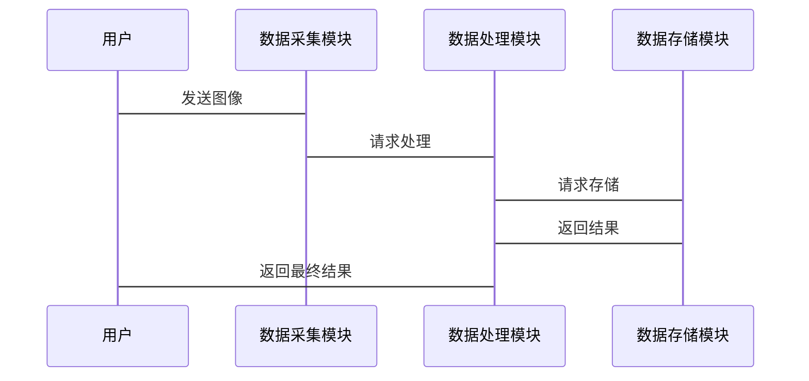

                 


# AI Agent的视觉理解能力增强

> **关键词**：AI Agent, 视觉理解, 计算机视觉, 目标检测, 图像分割, 深度学习, 系统架构

> **摘要**：本文旨在深入探讨AI Agent的视觉理解能力的增强方法。通过分析视觉理解的核心概念、算法原理、系统架构以及实际应用，本文为读者提供了从理论到实践的全面指南。文章首先介绍了AI Agent与视觉理解的基本概念，随后详细讲解了目标检测和图像分割等关键算法，接着分析了系统的整体架构设计，最后通过实战案例展示了如何在实际项目中应用这些技术。本文适合对AI Agent和视觉理解感兴趣的读者，特别是技术人员和研究人员。

---

# 第一部分: AI Agent的视觉理解能力增强基础

## # 第1章: AI Agent与视觉理解概述

### 1.1 问题背景与描述

#### 1.1.1 AI Agent的定义与核心能力
AI Agent（人工智能代理）是一种智能实体，能够感知环境、自主决策并执行任务。其核心能力包括感知、推理、规划和执行。

#### 1.1.2 视觉理解能力的重要性
视觉理解是AI Agent感知环境的关键能力，使其能够从图像或视频中提取有用的信息，如物体识别、场景理解等。

#### 1.1.3 增强视觉理解的必要性
随着AI Agent应用场景的扩展，提升视觉理解能力可以增强其在复杂环境中的适应性和准确性。

### 1.2 问题解决与边界

#### 1.2.1 视觉理解能力的提升目标
提升AI Agent的视觉理解能力，使其能够更准确地识别和理解环境中的视觉信息。

#### 1.2.2 解决的关键问题与方法
- **问题**：视觉数据的多样性和复杂性导致识别困难。
- **方法**：引入先进的深度学习算法和优化模型。

#### 1.2.3 边界与外延分析
视觉理解的边界在于处理实时性和准确性之间的平衡，外延则包括多模态数据融合。

### 1.3 核心概念与结构

#### 1.3.1 AI Agent的视觉理解能力构成
视觉理解能力包括图像处理、目标检测、图像分割等核心模块。

#### 1.3.2 视觉数据处理流程
1. 数据采集
2. 数据预处理
3. 特征提取
4. 模型训练
5. 模型推理

#### 1.3.3 概念结构与核心要素
- **输入**：视觉数据（图像、视频）
- **输出**：目标识别、场景描述
- **核心模块**：特征提取、分类、分割

---

## # 第2章: 核心概念与联系

### 2.1 AI Agent与视觉理解的原理

#### 2.1.1 视觉数据的感知与处理
AI Agent通过摄像头或其他传感器获取视觉数据，然后进行预处理和特征提取。

#### 2.1.2 AI Agent的决策机制
基于视觉理解的结果，AI Agent进行目标识别和场景分析，从而做出决策。

#### 2.1.3 视觉理解与任务执行的关联
视觉理解为任务执行提供关键信息，如目标位置、场景布局等。

### 2.2 核心概念对比表

| 概念       | 感知能力 | 数据处理方式 | 任务执行效率 |
|------------|----------|-------------|-------------|
| AI Agent   | 高       | 深度学习     | 高           |
| 视觉理解   | 中       | CNN/RNN     | 中           |

### 2.3 ER实体关系图

```mermaid
er
    entity AI Agent {
        id
        visual_data
    }
    entity 视觉数据 {
        id
        content
    }
    entity 任务 {
        id
        description
    }
    AI Agent -[拥有]-> 视觉数据
    视觉数据 -[支持]-> 任务
```

---

# 第二部分: 算法原理讲解

## # 第3章: 目标检测算法

### 3.1 算法原理与实现

#### 3.1.1 基于Faster R-CNN的目标检测
- **原理**：利用RPN（区域建议网络）生成候选框，然后进行目标分类和定位。
- **实现步骤**：
  1. 数据预处理
  2. 特征提取
  3. RPN预测候选框
  4. ROI Pooling
  5. 分类与回归

#### 3.1.2 YOLO目标检测算法
- **原理**：将目标检测问题转化为回归问题，直接预测边界框和类别概率。
- **实现步骤**：
  1. 图像输入
  2. 特征提取
  3. 预测边界框和类别

### 3.2 算法对比

| 参数       | Faster R-CNN       | YOLO          |
|------------|--------------------|---------------|
| 速度       | 较慢               | 实时           |
| 准确率      | 高                 | 中等           |
| 复杂度      | 高                 | 低             |

---

## # 第4章: 图像分割算法

### 4.1 U-Net网络结构解析

#### 4.1.1 网络结构
- **编码器**：提取特征
- **解码器**：上采样和特征融合

#### 4.1.2 实现步骤
1. 数据预处理
2. 编码器提取特征
3. 解码器上采样
4. 输出分割结果

### 4.2 图像分割的应用案例

#### 4.2.1 医疗图像分割
- **任务**：分割细胞或器官
- **优势**：提高诊断效率和准确性

#### 4.2.2 场景分割
- **任务**：分割道路、车辆、行人

---

# 第三部分: 系统分析与架构设计方案

## # 第5章: 系统分析

### 5.1 问题场景介绍

#### 5.1.1 智能安防监控系统
- **目标**：实时监控和异常检测

### 5.2 系统功能设计

#### 5.2.1 数据采集模块
- **功能**：接收摄像头输入
- **实现**：多线程处理

#### 5.2.2 数据处理模块
- **功能**：图像预处理和特征提取
- **实现**：使用OpenCV和深度学习框架

#### 5.2.3 数据存储模块
- **功能**：存储图像和检测结果
- **实现**：使用数据库或云存储

### 5.3 领域模型与系统架构图

```mermaid
classDiagram
    class AI Agent {
        +visual_data
        +task_description
        +result
    }
    class 数据采集模块 {
        +capture()
    }
    class 数据处理模块 {
        +process()
    }
    class 数据存储模块 {
        +store()
    }
    AI Agent -> 数据采集模块: 调用capture()
    数据采集模块 -> 数据处理模块: 传递视觉数据
    数据处理模块 -> 数据存储模块: 存储处理结果
```

---

## # 第6章: 系统架构设计

### 6.1 微服务架构

#### 6.1.1 服务划分
- **服务1**：数据采集
- **服务2**：数据处理
- **服务3**：结果存储

#### 6.1.2 服务交互
- 使用API进行通信

### 6.2 系统接口设计

#### 6.2.1 API定义
- **输入**：图像数据
- **输出**：检测结果

### 6.3 系统交互流程图



---

# 第四部分: 项目实战

## # 第7章: 项目实战

### 7.1 环境安装与配置

#### 7.1.1 安装Python
```bash
python --version
pip install --upgrade pip
```

#### 7.1.2 安装深度学习框架
```bash
pip install tensorflow
pip install keras
pip install opencv-python
```

### 7.2 核心实现代码

#### 7.2.1 目标检测代码

```python
import cv2
import numpy as np
from tensorflow.keras.models import load_model

model = load_model('frcnn_model.h5')
image = cv2.imread('input.jpg')
result = model.predict(image)
cv2.imwrite('output.jpg', result)
```

#### 7.2.2 图像分割代码

```python
import keras
from keras.models import load_model

model = load_model('unet_model.h5')
image = cv2.imread('input.jpg')
image = image/255.0
image = np.expand_dims(image, axis=0)
result = model.predict(image)
cv2.imwrite('output.jpg', result[0][:,:,0]*255)
```

### 7.3 代码解读与分析

#### 7.3.1 目标检测
- **输入**：图像
- **输出**：目标边界框和类别

#### 7.3.2 图像分割
- **输入**：图像
- **输出**：分割结果图

### 7.4 案例分析与小结

#### 7.4.1 实际案例
- **任务**：智能安防监控
- **实现**：实时检测异常行为

#### 7.4.2 项目小结
通过实际项目，验证了算法的有效性和系统的可行性。

---

# 第五部分: 总结与注意事项

## # 第8章: 总结与注意事项

### 8.1 核心内容总结

#### 8.1.1 AI Agent的视觉理解能力
- 增强视觉理解能力可以提升AI Agent的感知和决策能力。

#### 8.1.2 关键算法与系统架构
- 目标检测和图像分割是视觉理解的核心算法。
- 微服务架构是系统扩展和维护的最佳选择。

### 8.2 注意事项与建议

#### 8.2.1 数据质量
- 确保数据的多样性和代表性。

#### 8.2.2 模型优化
- 通过数据增强和模型优化提升识别精度。

#### 8.2.3 系统性能
- 确保系统的实时性和稳定性。

### 8.3 拓展阅读与未来方向

#### 8.3.1 拓展阅读
- 推荐阅读《深度学习》（Deep Learning, Ian Goodfellow）
- 推荐学习目标检测和图像分割的最新研究

#### 8.3.2 未来方向
- 多模态数据融合
- 实时处理能力的提升

---

# 作者信息

作者：AI天才研究院/AI Genius Institute & 禅与计算机程序设计艺术 /Zen And The Art of Computer Programming

