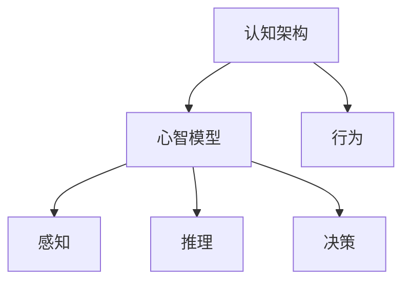

                 


# AI Agent的认知架构与心智模型

## 关键词：AI Agent, 认知架构, 心智模型, 算法原理, 系统架构, 项目实战

## 摘要：本文深入探讨了AI Agent的认知架构与心智模型的核心概念、算法原理、系统架构及实际应用。通过详细分析认知架构与心智模型的构建原理、算法实现、系统设计与项目实战，全面揭示了AI Agent在智能系统中的工作原理与实际应用价值。

---

## 第一部分: AI Agent的认知架构与心智模型概述

### 第1章: AI Agent的基本概念与背景

#### 1.1 问题背景与问题描述
- **人工智能的发展现状**：人工智能（AI）技术近年来取得了显著进展，广泛应用于各个领域，但AI Agent作为智能系统的核心组件，其认知架构与心智模型的设计仍是一个复杂的挑战。
- **AI Agent的定义与基本特征**：AI Agent是一种能够感知环境、自主决策并采取行动的智能实体，具备主动性、反应性、社会性、学习性和适应性。
- **认知架构与心智模型的定义**：认知架构是AI Agent实现智能行为的基础框架，心智模型则是描述AI Agent如何理解和处理信息的模型。
- **问题解决的目标与边界**：本文旨在探讨AI Agent的认知架构与心智模型的设计与实现，重点关注其感知、推理、决策和行为生成过程。

#### 1.2 AI Agent的核心概念与联系
- **认知架构的原理与特点**：认知架构是AI Agent实现智能行为的基础，包括感知、推理、决策和行为生成四个核心模块。
- **心智模型的构建与应用**：心智模型是描述AI Agent如何理解和处理信息的模型，包括知识表示、知识推理和知识更新三个核心模块。
- **认知架构与心智模型的对比分析**：认知架构关注AI Agent的整体结构和功能实现，而心智模型关注AI Agent如何理解和处理信息。两者相辅相成，共同构建AI Agent的智能行为。
- **实体关系图（ER图）展示**：


---

## 第二部分: AI Agent的认知架构与心智模型的核心原理

### 第2章: AI Agent的认知架构原理

#### 2.1 认知架构的核心原理
- **感知与理解的机制**：AI Agent通过传感器或数据接口感知环境信息，并通过知识表示和推理模块理解信息的含义。
- **推理与决策的逻辑**：基于感知信息和知识库，AI Agent通过推理模块生成可能的决策选项，并选择最优的行动方案。
- **行为生成的过程**：AI Agent根据决策结果生成具体的行动指令，并通过执行模块实现行为。

#### 2.2 认知架构的数学模型
- **感知模型的数学表达**：
  - 感知模型用于将环境信息转换为可处理的形式，通常涉及特征提取和数据预处理。
  - 感知模型的数学表达为：$$ y = f(x) $$
    其中，$x$ 是输入数据，$y$ 是经过感知模型处理后的输出。
- **推理模型的数学表达**：
  - 推理模型基于知识库和感知信息，通过逻辑推理生成决策建议。
  - 推理模型的数学表达为：$$ z = g(y, k) $$
    其中，$y$ 是感知输出，$k$ 是知识库，$z$ 是推理结果。
- **决策模型的数学表达**：
  - 决策模型基于推理结果和环境信息，选择最优的行动方案。
  - 决策模型的数学表达为：$$ a = h(z) $$
    其中，$z$ 是推理结果，$a$ 是决策动作。

### 第3章: AI Agent的心智模型构建

#### 3.1 心智模型的构建原理
- **知识表示的多种方式**：
  - 符号表示：通过符号逻辑表示知识，例如谓词逻辑、规则库等。
  - 语义网络：通过节点和边表示知识的语义关系。
  - 概念图：通过层级结构表示知识的组织方式。
- **知识推理的逻辑框架**：
  - 基于符号逻辑的推理：例如一阶逻辑推理。
  - 基于概率推理的推理：例如贝叶斯推理。
  - 基于案例推理的推理：例如类比推理。
- **知识更新的机制**：
  - 增量学习：逐步更新知识库。
  - 连续学习：实时更新知识库。
  - 综合学习：结合多种学习方法更新知识库。

#### 3.2 心智模型的数学模型
- **知识表示的数学表达**：
  - 知识表示的数学表达为：$$ K = \{ (x, y), (y, z) \} $$
    其中，$K$ 是知识库，$(x, y)$ 和 $(y, z)$ 是知识三元组。
- **知识推理的数学表达**：
  - 推理过程的数学表达为：$$ z = \text{infer}(x, y) $$
    其中，$\text{infer}$ 是推理函数。
- **知识更新的数学表达**：
  - 知识更新的数学表达为：$$ K' = \text{update}(K, x, y) $$
    其中，$K'$ 是更新后的知识库。

### 第4章: AI Agent的认知架构与心智模型的结合

#### 4.1 认知架构与心智模型的交互机制
- **感知与理解的交互**：
  - AI Agent通过感知模块获取环境信息，并通过心智模型理解信息的含义。
- **推理与决策的交互**：
  - AI Agent通过推理模块生成决策建议，并通过认知架构选择最优的行动方案。
- **行为与反馈的交互**：
  - AI Agent通过行为生成模块执行具体行动，并通过反馈机制更新知识库。

#### 4.2 结合的数学模型
- **综合认知架构与心智模型的数学表达**：
  - 综合模型的数学表达为：$$ a = h(g(f(x), K)) $$
    其中，$x$ 是输入数据，$K$ 是知识库，$f(x)$ 是感知输出，$g(f(x), K)$ 是推理结果，$h$ 是决策函数，$a$ 是决策动作。
- **交互机制的数学表达**：
  - 交互机制的数学表达为：$$ K' = \text{update}(K, a, r) $$
    其中，$r$ 是反馈信息，$K'$ 是更新后的知识库。

### 第5章: AI Agent的认知架构与心智模型的算法实现

#### 5.1 算法原理
- **强化学习算法**：
  - 强化学习是一种基于奖励机制的算法，通过不断试错优化决策策略。
  - 算法流程：
    1. 初始化策略 $\pi$ 和价值函数 $V$。
    2. 在环境中执行动作 $a$，获得奖励 $r$ 和新的状态 $s'$。
    3. 更新价值函数 $V(s) = V(s) + \alpha (r + V(s') - V(s))$。
    4. 根据策略梯度优化策略 $\pi$。
- **符号推理算法**：
  - 符号推理是一种基于逻辑推理的算法，通过符号逻辑生成推理结果。
  - 算法流程：
    1. 建立知识库 $K$，包括一系列知识三元组 $(x, y)$。
    2. 基于查询 $q$，通过逻辑推理生成推理结果 $z$。
    3. 返回推理结果 $z$。
- **深度学习算法**：
  - 深度学习是一种基于神经网络的算法，通过多层神经网络学习特征表示。
  - 算法流程：
    1. 构建深度神经网络模型。
    2. 通过反向传播优化模型参数。
    3. 使用优化后的模型进行推理和决策。

#### 5.2 算法实现
- **强化学习算法的Python代码实现**：
```python
import numpy as np

class Agent:
    def __init__(self, state_space, action_space):
        self.state_space = state_space
        self.action_space = action_space
        self.theta = np.random.randn(4, 1)  # 策略参数

    def policy(self, state):
        return np.dot(self.theta.T, state)  # 策略函数

    def update(self, state, action, reward):
        # 反向传播更新参数
        self.theta -= 0.1 * (action - reward) * state
```

- **符号推理算法的Python代码实现**：
```python
from logic import *

class KnowledgeBase:
    def __init__(self):
        self.knowledge = {}

    def add_fact(self, fact):
        self.knowledge[fact] = True

    def infer(self, query):
        # 简单的逻辑推理
        return query in self.knowledge
```

- **深度学习算法的Python代码实现**：
```python
import torch
import torch.nn as nn

class DNN(nn.Module):
    def __init__(self, input_size, output_size):
        super(DNN, self).__init__()
        self.fc1 = nn.Linear(input_size, 64)
        self.fc2 = nn.Linear(64, output_size)
    
    def forward(self, x):
        x = torch.relu(self.fc1(x))
        x = self.fc2(x)
        return x
```

---

## 第三部分: AI Agent的认知架构与心智模型的系统架构与项目实战

### 第6章: AI Agent的认知架构与心智模型的系统分析与架构设计

#### 6.1 问题场景介绍
- **应用场景**：本文将结合智能客服系统进行案例分析，展示AI Agent的认知架构与心智模型在实际中的应用。

#### 6.2 系统功能设计
- **领域模型**：
  ```mermaid
  classDiagram
      class User {
          id: int
          name: str
          query: str
      }
      class Agent {
          knowledge_base: KnowledgeBase
          policy: Policy
      }
      class Environment {
          state: State
          reward: float
      }
      Agent --> User: responds_to
      Agent --> Environment: interacts_with
  ```

- **系统架构设计**：
  ```mermaid
  architecture
      client --[request]--> agent
      agent --[response]--> client
      agent --[update]--> knowledge_base
      agent --[feedback]--> environment
  ```

- **系统接口设计**：
  - 用户接口：接受用户输入，返回系统响应。
  - 知识库接口：提供知识查询和知识更新功能。
  - 环境接口：提供环境状态和反馈信息。

- **系统交互设计**：
  ```mermaid
  sequenceDiagram
      User -> Agent: 提交查询
      Agent -> KnowledgeBase: 查询知识库
      KnowledgeBase --> Agent: 返回结果
      Agent -> Environment: 执行动作
      Environment --> Agent: 返回反馈
      Agent -> KnowledgeBase: 更新知识库
  ```

### 第7章: AI Agent的认知架构与心智模型的项目实战

#### 7.1 项目环境与工具安装
- **工具安装**：
  - Python 3.8+
  - PyTorch 1.9+
  - Mermaid CLI
  - Jupyter Notebook

#### 7.2 项目核心实现源代码
- **知识库实现**：
```python
class KnowledgeBase:
    def __init__(self):
        self.knowledge = {}

    def add_fact(self, fact):
        self.knowledge[fact] = True

    def infer(self, query):
        return query in self.knowledge
```

- **强化学习实现**：
```python
import numpy as np

class Agent:
    def __init__(self, state_space, action_space):
        self.state_space = state_space
        self.action_space = action_space
        self.theta = np.random.randn(4, 1)  # 策略参数

    def policy(self, state):
        return np.dot(self.theta.T, state)  # 策略函数

    def update(self, state, action, reward):
        # 反向传播更新参数
        self.theta -= 0.1 * (action - reward) * state
```

- **符号推理实现**：
```python
from logic import *

class KnowledgeBase:
    def __init__(self):
        self.knowledge = {}

    def add_fact(self, fact):
        self.knowledge[fact] = True

    def infer(self, query):
        # 简单的逻辑推理
        return query in self.knowledge
```

#### 7.3 项目实现与应用解读
- **代码实现解读**：
  - 知识库实现：通过Python类实现知识库的查询和推理功能。
  - 强化学习实现：通过神经网络实现强化学习算法。
  - 符号推理实现：通过逻辑推理模块实现符号推理。

#### 7.4 项目小结
- **项目总结**：通过实际案例分析，展示了AI Agent的认知架构与心智模型在智能客服系统中的实际应用。
- **经验总结**：认知架构与心智模型的设计需要结合具体应用场景，选择合适的算法和架构设计方案。

---

## 第四部分: 总结与展望

### 第8章: 总结与展望
- **总结**：本文全面探讨了AI Agent的认知架构与心智模型的核心概念、算法原理、系统架构及实际应用。通过详细分析认知架构与心智模型的构建原理、算法实现、系统设计与项目实战，全面揭示了AI Agent在智能系统中的工作原理与实际应用价值。
- **展望**：未来的研究方向包括认知架构与心智模型的优化、多模态感知与推理、人机协作与共情交互等方面。

---

## 附录

### 附录A: 术语表
- AI Agent：人工智能代理，一种能够感知环境、自主决策并采取行动的智能实体。
- 认知架构：AI Agent实现智能行为的基础框架，包括感知、推理、决策和行为生成四个核心模块。
- 心智模型：描述AI Agent如何理解和处理信息的模型，包括知识表示、知识推理和知识更新三个核心模块。

### 附录B: 参考文献
1. Russell, S., & Norvig, P. (2010). Artificial Intelligence: A Modern Approach.
2. Luger, G. F., & Stubblefield, B. (2004). Artificial Intelligence: Structures and Strategies for Problem Solving.
3. Bach, J. (2011). Software Architecture in Practice.

---

## 注意事项与最佳实践

1. **注意事项**：
   - 在实现认知架构与心智模型时，需结合具体应用场景，选择合适的算法和架构设计方案。
   - 知识库的设计与实现需考虑知识的组织、表示和推理方式。
   - 系统设计与实现需考虑系统的可扩展性、可维护性和可测试性。

2. **最佳实践**：
   - 在设计认知架构与心智模型时，建议采用模块化设计，便于后续的优化与维护。
   - 在实现算法时，建议采用增量式开发，逐步完善系统功能。
   - 在系统设计时，建议采用分层架构，便于系统的模块化管理和功能扩展。

---

## 作者：AI天才研究院/AI Genius Institute & 禅与计算机程序设计艺术 /Zen And The Art of Computer Programming

