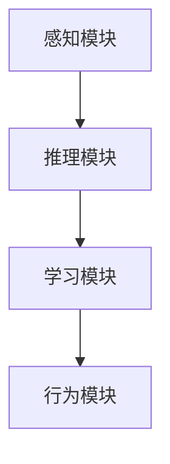
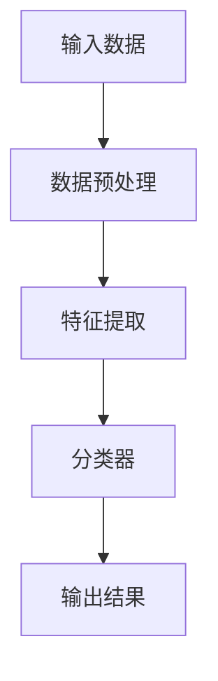
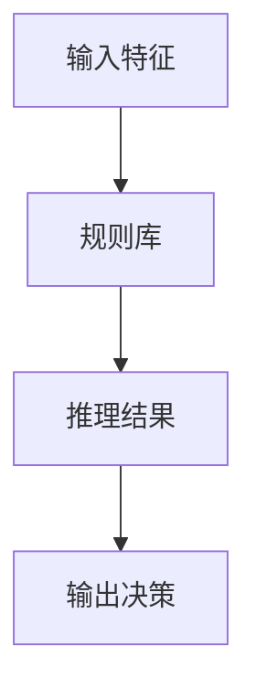
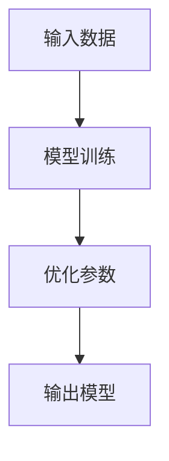
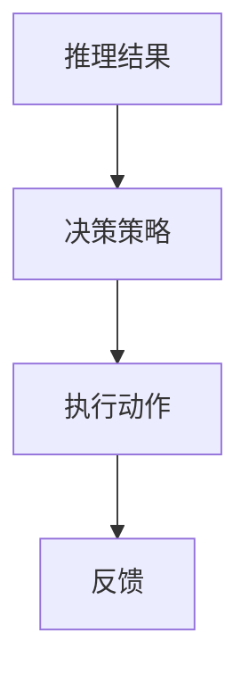
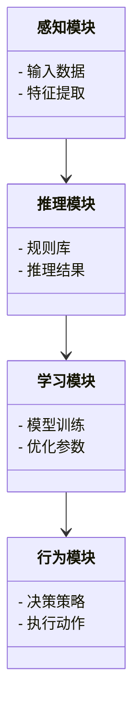
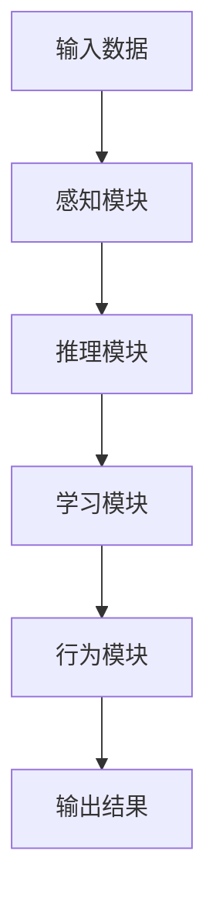
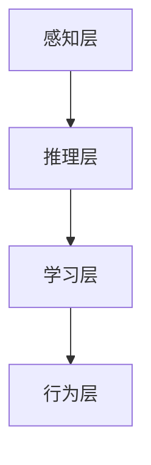
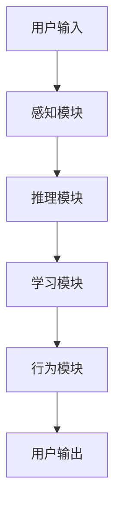

                 


# AI Agent的认知架构：模拟人类思维过程

> 关键词：AI Agent，认知架构，人类思维，智能系统，模拟推理，行为决策

> 摘要：本文将深入探讨AI Agent的认知架构，从基础概念到复杂系统的实现，结合人类思维过程的模拟，分析AI Agent如何通过认知架构实现类似人类的感知、推理、学习和决策能力。文章内容涵盖AI Agent的认知架构设计、核心算法原理、系统架构实现、项目实战案例以及最佳实践等，帮助读者全面理解AI Agent的认知架构及其应用。

---

# 第一部分: AI Agent的认知架构基础

# 第1章: AI Agent的认知架构概述

## 1.1 AI Agent的基本概念

### 1.1.1 什么是AI Agent
AI Agent（人工智能代理）是一种智能系统，能够感知环境、自主决策并采取行动以实现特定目标。它通过传感器获取信息，利用计算模型进行推理，并通过执行器与环境交互。

### 1.1.2 AI Agent的核心特征
- **自主性**：无需外部干预，自主决策。
- **反应性**：能够实时感知环境并做出反应。
- **目标导向性**：以实现预设目标为导向。
- **学习能力**：通过经验改进性能。

### 1.1.3 AI Agent与人类思维的对比
人类思维具有感知、推理、学习和决策的能力，AI Agent通过模拟这些过程实现类似人类的智能。

## 1.2 认知架构的基本概念

### 1.2.1 认知架构的定义
认知架构是AI Agent的核心结构，负责整合感知、推理、学习和行为决策等功能，模拟人类的认知过程。

### 1.2.2 认知架构的核心要素
- **感知模块**：负责获取环境信息。
- **推理模块**：负责逻辑推理和知识处理。
- **学习模块**：负责模型优化和知识更新。
- **行为决策模块**：负责制定并执行行动策略。

### 1.2.3 认知架构的分类与特点
认知架构可以分为基于规则的架构、基于模型的架构和基于学习的架构，各有优缺点。

## 1.3 AI Agent的认知架构与人类思维的联系

### 1.3.1 人类思维的模拟
AI Agent通过模拟人类的感知、推理和学习过程，实现类似人类的智能。

### 1.3.2 AI Agent的认知模型
认知模型是AI Agent模拟人类思维的核心，包括感知、推理、学习和决策四个模块。

### 1.3.3 认知架构的边界与外延
认知架构的边界在于其感知和决策能力，外延则包括与外部环境的交互。

## 1.4 本章小结

---

# 第2章: AI Agent的认知架构核心概念

## 2.1 感知模块

### 2.1.1 感知模块的功能与作用
感知模块负责从环境中获取信息，如图像、文本和语音。

### 2.1.2 感知模块的输入处理
输入处理包括数据预处理、特征提取和数据分类。

### 2.1.3 感知模块的特征提取
特征提取是通过卷积神经网络（CNN）等方法从数据中提取有用特征。

## 2.2 推理模块

### 2.2.1 推理模块的逻辑推理
逻辑推理包括基于规则的推理和基于模型的推理。

### 2.2.2 推理模块的规则库设计
规则库设计包括知识表示和规则推理。

### 2.2.3 推理模块的不确定性处理
不确定性处理方法包括概率推理和模糊逻辑推理。

## 2.3 学习模块

### 2.3.1 学习模块的定义与作用
学习模块负责通过数据优化模型参数。

### 2.3.2 监督学习与无监督学习
监督学习基于标记数据，无监督学习基于未标记数据。

### 2.3.3 强化学习与自适应学习
强化学习通过奖励机制优化决策策略。

## 2.4 行为模块

### 2.4.1 行为模块的定义与作用
行为模块负责根据推理结果制定行动策略。

### 2.4.2 行为决策的逻辑与策略
行为决策基于推理模块的输出，制定最优行动方案。

### 2.4.3 行为执行的控制与反馈
行为执行通过执行器与环境交互，并根据反馈调整策略。

## 2.5 本章小结

---

# 第3章: AI Agent的认知架构核心概念对比

### 3.1 感知模块与推理模块的对比

| 模块 | 功能 | 输入 | 输出 | 特点 |
|------|------|------|------|------|
| 感知模块 | 获取环境信息 | 原始数据 | 特征向量 | 数据处理 |
| 推理模块 | 逻辑推理 | 特征向量 | 推理结果 | 知识处理 |

### 3.2 学习模块与行为模块的对比

| 模块 | 功能 | 输入 | 输出 | 特点 |
|------|------|------|------|------|
| 学习模块 | 模型优化 | 数据 | 优化参数 | 自适应学习 |
| 行为模块 | 行为决策 | 推理结果 | 行动策略 | 目标导向 |

### 3.3 认知架构的ER实体关系图



---

# 第4章: AI Agent的认知架构算法原理

## 4.1 感知模块的算法实现

### 4.1.1 感知模块的流程



### 4.1.2 感知模块的Python代码实现

```python
import tensorflow as tf
from tensorflow.keras import layers

model = tf.keras.Sequential([
    layers.Conv2D(32, (3,3), activation='relu', input_shape=(224, 224, 3)),
    layers.MaxPooling2D((2,2)),
    layers.Conv2D(64, (3,3), activation='relu'),
    layers.MaxPooling2D((2,2)),
    layers.Flatten(),
    layers.Dense(128, activation='relu'),
    layers.Dense(10, activation='softmax')
])
```

### 4.1.3 感知模块的数学模型

$$
P(x|y) = \frac{P(y|x)P(x)}{P(y)}
$$

---

## 4.2 推理模块的算法实现

### 4.2.1 推理模块的流程



### 4.2.2 推理模块的Python代码实现

```python
def inference(rules, features):
    for rule in rules:
        if rule.preconditions(features):
            return rule.action(features)
    return default_action(features)
```

### 4.2.3 推理模块的数学模型

$$
\text{结果} = \sum_{i=1}^{n} w_i x_i
$$

---

## 4.3 学习模块的算法实现

### 4.3.1 学习模块的流程



### 4.3.2 学习模块的Python代码实现

```python
import numpy as np

def loss(y_true, y_pred):
    return np.mean((y_true - y_pred) ** 2)

def optimizer(loss, learning_rate=0.01):
    return tf.keras.optimizers.SGD(learning_rate)
```

### 4.3.3 学习模块的数学模型

$$
\text{损失函数} = \frac{1}{2m} \sum_{i=1}^{m} (y_i - \hat{y_i})^2
$$

---

## 4.4 行为模块的算法实现

### 4.4.1 行为模块的流程



### 4.4.2 行为模块的Python代码实现

```python
def execute_action(action):
    # 执行动作并返回反馈
    return feedback
```

### 4.4.3 行为模块的数学模型

$$
\text{奖励} = \sum_{t=1}^{T} r_t
$$

---

# 第5章: AI Agent的认知架构系统分析与架构设计

## 5.1 项目背景与目标

### 5.1.1 项目背景
本项目旨在设计一个基于认知架构的AI Agent，模拟人类思维过程。

### 5.1.2 项目目标
通过设计感知、推理、学习和行为决策模块，实现AI Agent的认知架构。

## 5.2 系统功能设计

### 5.2.1 系统功能模块



### 5.2.2 系统功能流程



## 5.3 系统架构设计

### 5.3.1 系统架构图



### 5.3.2 系统接口设计

- 感知层接口：提供特征提取功能。
- 推理层接口：提供逻辑推理功能。
- 学习层接口：提供模型优化功能。
- 行为层接口：提供决策执行功能。

## 5.4 系统交互流程

### 5.4.1 系统交互图



---

# 第6章: AI Agent的认知架构项目实战

## 6.1 项目环境搭建

### 6.1.1 环境需求
- 操作系统：Linux/Windows/MacOS
- Python版本：3.8+
- 依赖库：TensorFlow、Keras、PyTorch

### 6.1.2 环境安装

```bash
pip install tensorflow keras numpy
```

## 6.2 核心代码实现

### 6.2.1 感知模块实现

```python
import tensorflow as tf
from tensorflow.keras import layers

def build_perception_model(input_shape):
    model = tf.keras.Sequential([
        layers.Conv2D(32, (3,3), activation='relu', input_shape=input_shape),
        layers.MaxPooling2D((2,2)),
        layers.Conv2D(64, (3,3), activation='relu'),
        layers.MaxPooling2D((2,2)),
        layers.Flatten(),
        layers.Dense(128, activation='relu'),
        layers.Dense(10, activation='softmax')
    ])
    return model
```

### 6.2.2 推理模块实现

```python
def inference(rules, features):
    for rule in rules:
        if rule.preconditions(features):
            return rule.action(features)
    return default_action(features)
```

### 6.2.3 学习模块实现

```python
def loss(y_true, y_pred):
    return tf.reduce_mean((y_true - y_pred) ** 2)

def optimizer(loss, learning_rate=0.01):
    return tf.keras.optimizers.SGD(learning_rate)
```

### 6.2.4 行为模块实现

```python
def execute_action(action):
    # 执行动作并返回反馈
    return feedback
```

## 6.3 项目实战案例

### 6.3.1 案例分析
以图像识别任务为例，训练一个AI Agent识别手写数字。

### 6.3.2 代码实现

```python
import tensorflow as tf
from tensorflow.keras import layers

# 感知模块
def build_perception_model(input_shape):
    model = tf.keras.Sequential([
        layers.Conv2D(32, (3,3), activation='relu', input_shape=input_shape),
        layers.MaxPooling2D((2,2)),
        layers.Conv2D(64, (3,3), activation='relu'),
        layers.MaxPooling2D((2,2)),
        layers.Flatten(),
        layers.Dense(128, activation='relu'),
        layers.Dense(10, activation='softmax')
    ])
    return model

# 推理模块
def inference(rules, features):
    for rule in rules:
        if rule.preconditions(features):
            return rule.action(features)
    return default_action(features)

# 学习模块
def loss(y_true, y_pred):
    return tf.reduce_mean((y_true - y_pred) ** 2)

def optimizer(loss, learning_rate=0.01):
    return tf.keras.optimizers.SGD(learning_rate)

# 行为模块
def execute_action(action):
    # 执行动作并返回反馈
    return feedback
```

## 6.4 项目小结

---

# 第7章: AI Agent的认知架构最佳实践

## 7.1 最佳实践 Tips

### 7.1.1 系统设计建议
- 明确系统目标，合理划分模块。
- 选择合适的算法，优化系统性能。

### 7.1.2 开发注意事项
- 注意数据预处理，确保数据质量。
- 及时监控系统性能，优化模型参数。

## 7.2 本章小结

---

# 第8章: AI Agent的认知架构总结与展望

## 8.1 总结
AI Agent的认知架构通过模拟人类思维过程，实现感知、推理、学习和决策能力，具有广泛的应用前景。

## 8.2 展望
未来，随着AI技术的进步，AI Agent的认知架构将更加智能化和人性化，应用领域也将更加广泛。

---

# 作者：AI天才研究院/AI Genius Institute & 禅与计算机程序设计艺术 /Zen And The Art of Computer Programming

