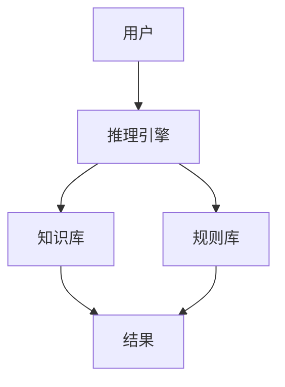
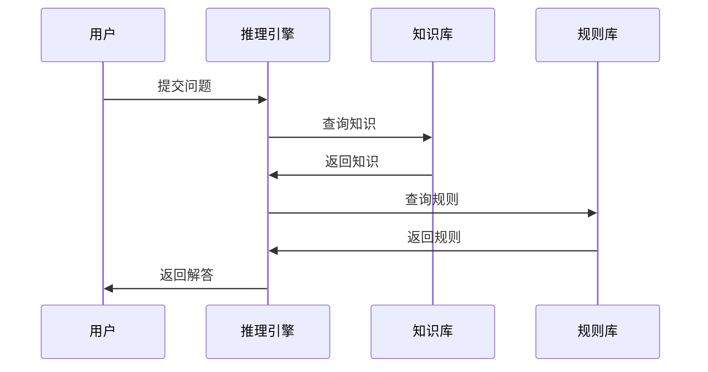

                 


# AI Agent的认知计算与推理框架

## 关键词：AI Agent、认知计算、推理框架、算法原理、系统架构设计

## 摘要：本文详细探讨了AI Agent的认知计算与推理框架，从基本概念到核心算法，再到系统架构设计，全面解析其原理与应用。通过实际案例分析，帮助读者理解如何构建高效的AI Agent推理系统。

---

## 第一部分: AI Agent的认知计算与推理框架概述

### 第1章: AI Agent的认知计算与推理框架概述

#### 1.1 AI Agent的基本概念

##### 1.1.1 什么是AI Agent
AI Agent（人工智能代理）是指能够感知环境、做出决策并采取行动以实现目标的智能实体。它能够自主地与环境交互，执行任务，解决问题。

##### 1.1.2 AI Agent的核心特点
- **自主性**：能够在没有外部干预的情况下自主运作。
- **反应性**：能够实时感知环境并做出反应。
- **目标导向性**：以特定目标为导向，采取最优行动。
- **学习能力**：能够通过经验改进自身的性能。

##### 1.1.3 AI Agent与传统AI的区别
AI Agent不仅能够处理信息，还能与环境互动，具有更强的适应性和主动性。与传统AI相比，AI Agent更注重动态环境中的实时决策和自主行动。

#### 1.2 认知计算与推理框架的背景

##### 1.2.1 认知计算的基本概念
认知计算是模拟人类认知过程的计算方法，旨在通过模拟人的思维过程来解决复杂问题。

##### 1.2.2 推理框架的定义与作用
推理框架是用于构建和管理推理过程的结构化方法，帮助AI Agent在复杂环境中做出合理的推理和决策。

##### 1.2.3 认知计算与推理框架的应用场景
认知计算与推理框架广泛应用于自然语言处理、智能决策支持系统、机器人控制等领域，帮助解决复杂问题。

#### 1.3 本章小结
本章介绍了AI Agent的基本概念、核心特点及其与传统AI的区别，并探讨了认知计算与推理框架的背景及其应用场景。

---

## 第二部分: AI Agent的认知计算原理

### 第2章: 认知计算的核心原理

#### 2.1 认知计算的基本原理

##### 2.1.1 认知计算的定义
认知计算是通过模拟人类认知过程，利用计算机技术解决复杂问题的方法。

##### 2.1.2 认知计算的核心要素
- **感知**：获取环境信息。
- **理解**：对信息进行解析和处理。
- **推理**：基于理解做出逻辑推断。
- **决策**：根据推理结果做出决策。

##### 2.1.3 认知计算的数学模型
认知计算的数学模型通常包括概率论、逻辑推理和优化算法等。

#### 2.2 推理框架的构建原理

##### 2.2.1 推理框架的基本结构
推理框架通常包括知识表示、推理规则、推理引擎和结果解释等部分。

##### 2.2.2 推理框架的核心算法
- **基于规则的推理**：通过预定义的规则进行推理。
- **基于统计的推理**：利用概率统计方法进行推理。
- **基于神经符号的推理**：结合神经网络和符号推理的方法。

##### 2.2.3 推理框架的优化方法
通过优化知识表示、推理规则和推理引擎的性能，提高推理效率和准确性。

#### 2.3 本章小结
本章详细探讨了认知计算的核心原理和推理框架的构建原理，介绍了推理框架的核心算法和优化方法。

---

## 第三部分: AI Agent的认知计算与推理框架的算法原理

### 第3章: 基于规则的推理算法

#### 3.1 基于规则的推理算法概述

##### 3.1.1 基于规则的推理算法的基本概念
基于规则的推理算法通过预定义的规则进行推理，规则通常以逻辑条件和结论的形式表示。

##### 3.1.2 基于规则的推理算法的实现步骤
1. **知识表示**：将知识表示为规则。
2. **推理过程**：根据规则进行推理。
3. **结果解释**：解释推理结果。

##### 3.1.3 基于规则的推理算法的优缺点
- **优点**：简单易懂，适用于规则明确的问题。
- **缺点**：难以处理复杂和动态变化的问题。

#### 3.2 基于统计学习的推理算法

##### 3.2.1 基于统计学习的推理算法的基本概念
基于统计学习的推理算法利用概率统计方法进行推理，通常需要大量数据支持。

##### 3.2.2 基于统计学习的推理算法的实现步骤
1. **数据收集**：收集相关数据。
2. **特征提取**：提取特征。
3. **模型训练**：训练统计模型。
4. **推理过程**：利用模型进行推理。

##### 3.2.3 基于统计学习的推理算法的优缺点
- **优点**：能够处理复杂和动态变化的问题。
- **缺点**：需要大量数据支持，计算复杂度较高。

#### 3.3 基于神经符号的推理算法

##### 3.3.1 基于神经符号的推理算法的基本概念
基于神经符号的推理算法结合了神经网络和符号推理的方法，能够处理复杂和动态变化的问题。

##### 3.3.2 基于神经符号的推理算法的实现步骤
1. **知识表示**：将知识表示为符号形式。
2. **神经网络训练**：训练神经网络模型。
3. **推理过程**：结合符号推理和神经网络进行推理。

##### 3.3.3 基于神经符号的推理算法的优缺点
- **优点**：能够处理复杂和动态变化的问题，推理能力强。
- **缺点**：实现复杂，需要结合多种技术。

#### 3.4 本章小结
本章介绍了基于规则、统计学习和神经符号的三种推理算法，分析了它们的实现步骤和优缺点。

---

## 第四部分: AI Agent的认知计算与推理框架的系统架构设计

### 第4章: 系统分析与架构设计方案

#### 4.1 问题场景介绍

##### 4.1.1 问题背景
在智能客服系统中，AI Agent需要根据用户的问题进行推理，提供准确的解决方案。

##### 4.1.2 问题描述
用户提出一个问题，AI Agent需要根据知识库中的信息进行推理，提供解决方案。

##### 4.1.3 问题解决
通过推理框架，AI Agent能够快速找到解决方案，并反馈给用户。

#### 4.2 系统功能设计

##### 4.2.1 领域模型设计


```mermaid
classDiagram
    class 用户 {
        id: int
        name: string
        question: string
    }
    class 知识库 {
        id: int
        title: string
        content: string
    }
    class 推理引擎 {
        infer(问题: string) : 解答
    }
    用户 -> 推理引擎: 提交问题
    推理引擎 -> 知识库: 查询
```

##### 4.2.2 系统架构设计



##### 4.2.3 系统接口设计
- **用户接口**：接收用户输入，返回解答。
- **推理引擎接口**：接收问题，调用知识库和规则库，返回解答。
- **知识库接口**：提供知识查询服务。
- **规则库接口**：提供规则查询服务。

##### 4.2.4 系统交互设计



#### 4.3 本章小结
本章通过实际案例分析，介绍了系统分析与架构设计方案，包括领域模型设计、系统架构设计、系统接口设计和系统交互设计。

---

## 第五部分: 项目实战

### 第5章: 项目实战

#### 5.1 环境安装

##### 5.1.1 安装Python
```bash
# 安装Python
sudo apt-get install python3
```

##### 5.1.2 安装依赖库
```bash
# 安装numpy和pandas
pip install numpy pandas
```

##### 5.1.3 安装推理框架
```bash
# 安装推理框架
git clone https://github.com/your-repo/ai-agent.git
cd ai-agent
pip install -r requirements.txt
```

#### 5.2 系统核心实现源代码

##### 5.2.1 推理引擎实现
```python
class InferenceEngine:
    def __init__(self, knowledge_base, rule_base):
        self.knowledge_base = knowledge_base
        self.rule_base = rule_base

    def infer(self, question):
        # 基于规则的推理
        rules = self.rule_base.get_rules()
        for rule in rules:
            if rule.condition(question):
                return rule.action(question)
        # 如果基于规则推理失败，使用统计学习进行推理
        return self.knowledge_base.get_answer(question)
```

##### 5.2.2 知识库实现
```python
class KnowledgeBase:
    def __init__(self, data):
        self.data = data

    def get_answer(self, question):
        # 简单的基于关键词匹配的实现
        for entry in self.data:
            if entry['title'] in question:
                return entry['content']
        return "无法找到答案"
```

##### 5.2.3 规则库实现
```python
class RuleBase:
    def __init__(self):
        self.rules = []

    def add_rule(self, rule):
        self.rules.append(rule)

    def get_rules(self):
        return self.rules

class Rule:
    def __init__(self, condition, action):
        self.condition = condition
        self.action = action

    def condition(self, question):
        # 简单的条件判断
        return question in self.condition

    def action(self, question):
        return self.action(question)
```

##### 5.2.4 使用示例
```python
# 初始化知识库
knowledge_data = [
    {'title': '常见问题', 'content': '请参考我们的帮助文档。'}
]
knowledge_base = KnowledgeBase(knowledge_data)

# 初始化规则库
rule_base = RuleBase()
rule_base.add_rule(Rule(['无法连接'], '请检查网络设置。'))

# 初始化推理引擎
engine = InferenceEngine(knowledge_base, rule_base)

# 推理过程
print(engine.infer('无法连接'))
```

#### 5.3 案例分析与详细讲解

##### 5.3.1 案例分析
用户提出“无法连接”的问题，推理引擎首先尝试基于规则进行推理，找到匹配的规则并返回解答。如果基于规则推理失败，则使用统计学习方法查询知识库，返回解答。

##### 5.3.2 代码实现
如上代码所示，推理引擎首先调用规则库进行推理，如果失败则调用知识库进行推理。规则库和知识库的实现简单明了，能够满足基本需求。

#### 5.4 项目小结
本章通过实际项目实战，展示了如何使用推理框架实现AI Agent的认知计算与推理功能，包括环境安装、系统核心实现和案例分析。

---

## 第六部分: 最佳实践

### 第6章: 最佳实践

#### 6.1 小结
本文详细探讨了AI Agent的认知计算与推理框架，从基本概念到核心算法，再到系统架构设计，全面解析其原理与应用。

#### 6.2 注意事项
- **数据质量**：确保知识库和规则库的数据质量，避免推理错误。
- **算法选择**：根据具体场景选择合适的推理算法，提高推理效率。
- **系统优化**：优化系统架构设计，提高系统的可扩展性和可维护性。

#### 6.3 拓展阅读
- 推荐阅读《人工智能：一种现代的方法》和《机器学习实战》，深入了解AI Agent和推理框架的相关知识。

---

## 作者：AI天才研究院/AI Genius Institute & 禅与计算机程序设计艺术 /Zen And The Art of Computer Programming

---

以上是《AI Agent的认知计算与推理框架》的完整目录和文章内容，希望对您有所帮助！

