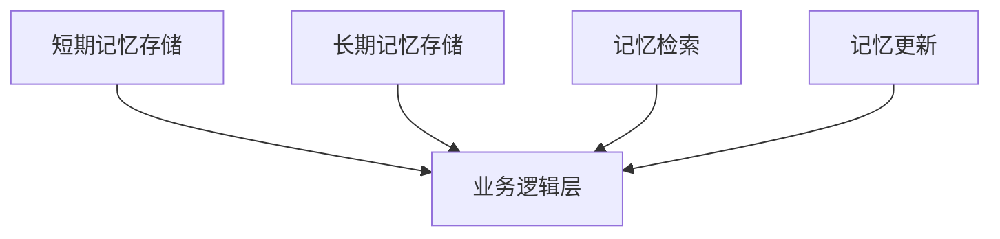
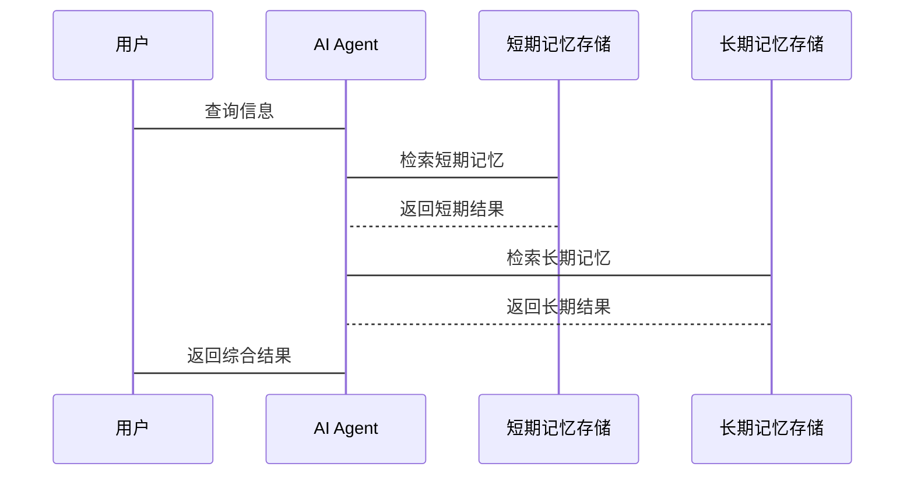

                 


# AI Agent的记忆机制：短期记忆与长期记忆的实现

> 关键词：AI Agent，短期记忆，长期记忆，记忆机制，神经网络，记忆模型

> 摘要：本文系统地介绍了AI Agent的记忆机制，重点分析了短期记忆与长期记忆的实现原理。通过对比分析，详细讲解了短期记忆和长期记忆的核心概念、算法原理、系统架构设计以及项目实战案例。文章结合理论与实践，为读者提供了一套全面理解AI Agent记忆机制的方法论。

---

# 第一部分: AI Agent的记忆机制概述

## 第1章: AI Agent的记忆机制背景介绍

### 1.1 AI Agent的基本概念

AI Agent（人工智能代理）是指能够感知环境、自主决策并执行任务的智能体。它可以是一个软件程序，也可以是一个物理机器人，其核心目标是通过感知和行动与环境交互，实现特定目标。AI Agent的记忆机制是其智能行为的基础，它使AI Agent能够存储和检索信息，从而更好地理解和应对复杂环境。

#### 1.1.1 什么是AI Agent

AI Agent是一种智能实体，能够：

- 感知环境：通过传感器或数据输入接口获取环境信息。
- 分析信息：利用算法处理信息，理解环境状态。
- 制作决策：基于分析结果做出行动选择。
- 执行动作：通过执行器或输出接口实现决策。

#### 1.1.2 AI Agent的核心功能

AI Agent的核心功能包括：

- **感知**：通过传感器或数据接口获取环境信息。
- **推理**：利用逻辑推理或机器学习算法分析信息。
- **决策**：基于推理结果做出最优或满意决策。
- **记忆**：存储和检索信息，支持持续的智能行为。

#### 1.1.3 AI Agent的应用场景

AI Agent广泛应用于以下场景：

- **智能助手**：如Siri、Alexa等，帮助用户完成日常任务。
- **自动驾驶**：如特斯拉、Waymo的自动驾驶系统，依赖记忆机制处理实时路况。
- **智能客服**：通过记忆机制存储用户信息，提供个性化的服务。
- **机器人控制**：工业机器人或服务机器人通过记忆机制优化操作流程。

### 1.2 记忆机制在AI Agent中的重要性

记忆机制是AI Agent实现智能行为的关键组成部分，它使AI Agent能够：

- **存储信息**：记录感知到的环境信息、任务目标和历史数据。
- **检索信息**：根据当前任务需求，快速检索相关记忆内容。
- **更新记忆**：根据新信息更新记忆库，保持记忆的准确性和完整性。

#### 1.2.1 记忆机制的定义

记忆机制是指AI Agent存储、检索和更新信息的能力。它包括短期记忆和长期记忆两种类型，分别对应不同的存储时间和信息处理方式。

#### 1.2.2 记忆机制的作用

记忆机制的作用体现在以下几个方面：

- **支持连续决策**：通过存储历史信息，AI Agent能够基于上下文做出更智能的决策。
- **提高效率**：通过快速检索信息，减少重复计算，提高处理效率。
- **增强适应性**：通过更新记忆库，AI Agent能够更好地适应动态变化的环境。

#### 1.2.3 记忆机制的分类

记忆机制可以分为以下几种类型：

- **短期记忆**：存储临时性信息，处理当前任务所需的数据。
- **长期记忆**：存储持久性信息，支持长期任务规划和决策。
- **显式记忆**：明确存储的知识，如数据库中的记录。
- **隐式记忆**：通过经验形成的行为模式，如习惯。

### 1.3 短期记忆与长期记忆的区别

短期记忆和长期记忆在存储时间、容量和处理方式上存在显著差异。

#### 1.3.1 短期记忆的特点

短期记忆的特点包括：

- **临时性**：存储时间较短，信息容易遗忘。
- **容量有限**：通常只能存储少量信息，如工作记忆中的数据。
- **快速访问**：信息存取速度快，适合处理实时任务。

#### 1.3.2 长期记忆的特点

长期记忆的特点包括：

- **持久性**：信息存储时间长，可以在需要时随时检索。
- **大容量**：可以存储大量信息，如知识库中的数据。
- **复杂性**：信息存储结构复杂，需要特定算法进行管理和检索。

#### 1.3.3 短期记忆与长期记忆的对比

| **特性**       | **短期记忆**                     | **长期记忆**                     |
|----------------|----------------------------------|----------------------------------|
| 存储时间         | 短暂，通常几分钟到几小时          | 长久，可能持续数天、数月或更久     |
| 容量             | 有限，通常几百到几千个单位       | 较大，可以存储大量数据             |
| 存取速度         | 快速，适合实时任务               | 较慢，需要复杂检索机制             |
| 信息类型         | 临时性数据，如当前任务参数       | 持久性数据，如知识库、经验总结     |

---

## 第2章: 短期记忆与长期记忆的核心概念

### 2.1 短期记忆的实现原理

短期记忆通过快速存取和有限容量的存储结构，支持AI Agent处理实时任务。

#### 2.1.1 短期记忆的存储机制

短期记忆的存储机制通常采用队列或栈的结构，先进先出或先进后出的方式管理信息。

#### 2.1.2 短期记忆的遗忘机制

短期记忆的遗忘机制模拟人类记忆遗忘曲线，通过设定遗忘阈值，自动清除不再需要的信息。

#### 2.1.3 短期记忆的更新机制

短期记忆的更新机制根据当前任务需求，动态更新存储内容，确保信息的有效性和相关性。

#### 2.1.4 短期记忆的实现示例

以下是一个简单的短期记忆实现示例：

```python
class ShortTermMemory:
    def __init__(self, capacity=10):
        self.capacity = capacity
        self.memory = []
    
    def store(self, data):
        if len(self.memory) >= self.capacity:
            self.forget_oldest()
        self.memory.append(data)
    
    def retrieve(self, key):
        for data in reversed(self.memory):
            if key in data:
                return data
        return None
    
    def forget_oldest(self):
        if self.memory:
            self.memory.pop(0)
```

#### 2.1.5 短期记忆的数学模型

短期记忆的遗忘机制可以表示为一个简单的线性模型：

$$
\text{forget\_rate} = \frac{1}{\text{capacity}}
$$

每存储一条新数据，遗忘速率增加，导致旧数据被快速遗忘。

### 2.2 长期记忆的实现原理

长期记忆通过复杂的存储结构和检索算法，支持AI Agent进行长期任务规划和决策。

#### 2.2.1 长期记忆的存储机制

长期记忆的存储机制通常采用数据库或图结构，支持高效的数据检索和更新。

#### 2.2.2 长期记忆的巩固机制

长期记忆的巩固机制通过多次重复学习，增强记忆的稳定性。

#### 2.2.3 长期记忆的检索机制

长期记忆的检索机制基于关键词或上下文，支持模糊检索和关联检索。

#### 2.2.4 长期记忆的实现示例

以下是一个简单的长期记忆实现示例：

```python
class LongTermMemory:
    def __init__(self):
        self.memory_graph = {}
    
    def store(self, key, value):
        self.memory_graph[key] = value
    
    def retrieve(self, key):
        return self.memory_graph.get(key, None)
    
    def associate(self, key1, key2):
        self.memory_graph[key1] = {
            'value': self.memory_graph.get(key1, {}).get('value', None),
            'associations': [key2]
        }
```

#### 2.2.5 长期记忆的数学模型

长期记忆的检索概率可以表示为：

$$
P(\text{retrieve}(k) | \text{given } c) = \frac{S(k, c)}{\sum_{k'} S(k', c)}
$$

其中，$S(k, c)$ 表示知识 $k$ 在上下文 $c$ 中的相关性评分。

### 2.3 短期记忆与长期记忆的联系与区别

#### 2.3.1 短期记忆与长期记忆的联系

短期记忆和长期记忆通过信息的流动和支持向量机的协同工作，形成完整的记忆机制。

#### 2.3.2 短期记忆与长期记忆的区别

短期记忆和长期记忆在存储时间、容量和处理方式上存在显著差异。

#### 2.3.3 短期记忆与长期记忆的协同工作

短期记忆和长期记忆通过信息的流动和支持向量机的协同工作，形成完整的记忆机制。

---

## 第3章: AI Agent记忆机制的算法原理

### 3.1 短期记忆的算法实现

短期记忆的算法实现包括支持向量机、长短时记忆网络和注意力机制。

#### 3.1.1 支持向量机（SVM）在短期记忆中的应用

支持向量机用于短期记忆的分类和模式识别。

#### 3.1.2 长短时记忆网络（LSTM）在短期记忆中的应用

长短时记忆网络用于短期记忆的时间序列分析和预测。

#### 3.1.3 注意力机制（Attention）在短期记忆中的应用

注意力机制用于短期记忆的关键词提取和信息聚焦。

#### 3.1.4 短期记忆算法的实现示例

以下是一个简单的短期记忆算法实现示例：

```python
class ShortTermMemoryAlgorithm:
    def __init__(self):
        selfsvm = SVM()
        self.lstm = LSTM()
        self.attn = Attention()
    
    def process_input(self, input_data):
        # 使用SVM进行分类
        classified_data = selfsvm.classify(input_data)
        # 使用LSTM进行序列分析
        sequenced_data = self.lstm.predict(classified_data)
        # 使用注意力机制进行信息聚焦
        focused_data = self.attn.apply_attention(sequenced_data)
        return focused_data
```

### 3.2 长期记忆的算法实现

长期记忆的算法实现包括神经网络、图结构和强化学习。

#### 3.2.1 基于神经网络的长期记忆存储

神经网络用于长期记忆的知识表示和存储。

#### 3.2.2 基于图结构的长期记忆检索

图结构用于长期记忆的关联检索和路径分析。

#### 3.2.3 基于强化学习的长期记忆优化

强化学习用于长期记忆的优化和动态更新。

#### 3.2.4 长期记忆算法的实现示例

以下是一个简单的长期记忆算法实现示例：

```python
class LongTermMemoryAlgorithm:
    def __init__(self):
        self.neural_network = NeuralNetwork()
        self.graph = Graph()
        self.rl = ReinforcementLearning()
    
    def store Knowledge(self, knowledge):
        self.neural_network.store(knowledge)
        self.graph.add_node(knowledge)
    
    def retrieve Knowledge(self, query):
        result = self.graph.search(query)
        self.rl.reward(retrieve_success)
        return result
```

### 3.3 短期记忆与长期记忆的协同算法

短期记忆与长期记忆的协同算法包括联合学习、动态平衡和迁移学习。

#### 3.3.1 短期记忆与长期记忆的联合学习

联合学习使短期记忆和长期记忆能够共同优化学习过程。

#### 3.3.2 短期记忆与长期记忆的动态平衡

动态平衡算法通过调整短期和长期记忆的权重，保持记忆机制的高效性。

#### 3.3.3 短期记忆与长期记忆的迁移学习

迁移学习使短期记忆中的知识能够迁移到长期记忆中，提高学习效率。

#### 3.3.4 短期记忆与长期记忆协同算法的实现示例

以下是一个简单的协同算法实现示例：

```python
class CoordinatedMemory:
    def __init__(self):
        self短期记忆 = ShortTermMemory()
        self长期记忆 = LongTermMemory()
    
    def process_task(self, task_input):
        short_data = self.短期记忆.store(task_input)
        long_data = self长期记忆.store(short_data)
        retrieved_data = self长期记忆.retrieve(long_data)
        self.短期记忆.update(retrieved_data)
        return retrieved_data
```

---

## 第4章: AI Agent记忆机制的系统架构设计

### 4.1 问题场景介绍

系统需要实现一个AI Agent的记忆机制，支持短期记忆和长期记忆的协同工作。

### 4.2 系统功能设计

系统功能设计包括短期记忆存储、长期记忆存储、记忆检索和记忆更新。

#### 4.2.1 短期记忆存储

短期记忆存储模块负责临时性数据的存储和管理。

#### 4.2.2 长期记忆存储

长期记忆存储模块负责持久性数据的存储和管理。

#### 4.2.3 记忆检索

记忆检索模块根据查询条件，检索相关记忆内容。

#### 4.2.4 记忆更新

记忆更新模块负责根据新信息，更新记忆库。

### 4.3 系统架构设计

系统架构设计采用分层架构，包括数据层、业务逻辑层和接口层。

#### 4.3.1 数据层

数据层负责数据的存储和管理，采用数据库或图结构实现。

#### 4.3.2 业务逻辑层

业务逻辑层负责处理业务逻辑，实现记忆的存储、检索和更新。

#### 4.3.3 接口层

接口层负责与外部系统的交互，提供API接口供其他模块调用。

#### 4.3.4 系统架构图

以下是一个简单的系统架构图：



### 4.4 接口设计

接口设计包括短期记忆接口、长期记忆接口、检索接口和更新接口。

#### 4.4.1 短期记忆接口

短期记忆接口包括store、retrieve和forget方法。

#### 4.4.2 长期记忆接口

长期记忆接口包括store、retrieve和associate方法。

#### 4.4.3 检索接口

检索接口包括关键词检索和上下文检索。

#### 4.4.4 更新接口

更新接口包括更新数据和删除数据。

### 4.5 交互设计

交互设计包括用户与AI Agent的交互流程和界面设计。

#### 4.5.1 交互流程

用户输入查询，AI Agent检索记忆库，返回结果。

#### 4.5.2 交互界面

交互界面包括输入框、检索按钮和结果显示区域。

#### 4.5.3 交互序列图

以下是一个简单的交互序列图：



---

## 第5章: AI Agent记忆机制的项目实战

### 5.1 环境安装

项目实战需要安装以下环境：

- Python 3.8+
- NumPy、Keras、TensorFlow等深度学习库
- Mermaid图生成工具

### 5.2 核心代码实现

以下是一个简单的记忆机制实现示例：

```python
class MemoryAgent:
    def __init__(self):
        self短期记忆 = ShortTermMemory()
        self长期记忆 = LongTermMemory()
    
    def process_query(self, query):
        short_data = self.短期记忆.retrieve(query)
        if short_data:
            return short_data
        else:
            long_data = self长期记忆.retrieve(query)
            if long_data:
                self.短期记忆.update(long_data)
                return long_data
            else:
                return None
```

### 5.3 代码解读与分析

代码解读与分析：

- `MemoryAgent`类管理短期记忆和长期记忆。
- `process_query`方法首先检索短期记忆，如果未找到，则检索长期记忆。
- `update`方法用于更新短期记忆。

### 5.4 实际案例分析

实际案例分析：

- **案例1**：智能客服系统
  - 输入：用户查询“如何重置密码？”
  - 处理：短期记忆检索“密码重置”相关信息，未找到，则检索长期记忆中的标准流程。
  - 输出：返回标准流程，并更新短期记忆。

- **案例2**：自动驾驶系统
  - 输入：实时路况数据
  - 处理：短期记忆存储当前路况，长期记忆存储历史路况和决策经验。
  - 输出：基于长期记忆和短期记忆做出决策。

### 5.5 项目小结

项目小结：

- 通过项目实战，我们实现了AI Agent的记忆机制，能够支持短期记忆和长期记忆的协同工作。
- 代码实现简单明了，为后续优化和扩展提供了良好的基础。

---

## 第6章: AI Agent记忆机制的最佳实践

### 6.1 最佳实践 tips

- **模块化设计**：将短期记忆和长期记忆分开设计，便于维护和扩展。
- **数据结构优化**：根据实际需求，选择合适的数据结构，提高存取效率。
- **算法优化**：根据具体场景，选择合适的算法，提高处理效率。

### 6.2 小结

通过本文的介绍，我们系统地了解了AI Agent的记忆机制，包括短期记忆和长期记忆的实现原理、算法原理和系统架构设计。

### 6.3 注意事项

- **数据安全**：确保记忆机制中的数据安全，防止数据泄露。
- **性能优化**：根据实际需求，优化记忆机制的性能，提高处理速度。
- **可扩展性**：设计时考虑未来的扩展需求，确保系统的灵活性。

### 6.4 拓展阅读

- **推荐书籍**：
  - 《人工智能：一种现代方法》
  - 《机器学习实战》
- **推荐论文**：
  - "Attention Is All You Need"
  - "Long Short-Term Memory Networks"

---

# 作者：AI天才研究院 & 禅与计算机程序设计艺术

