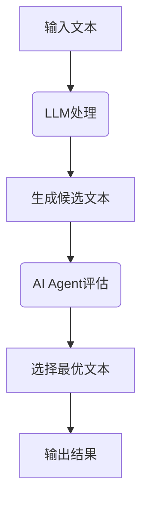
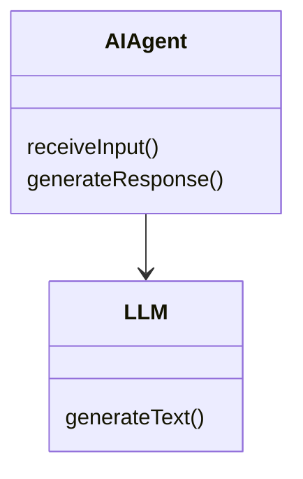
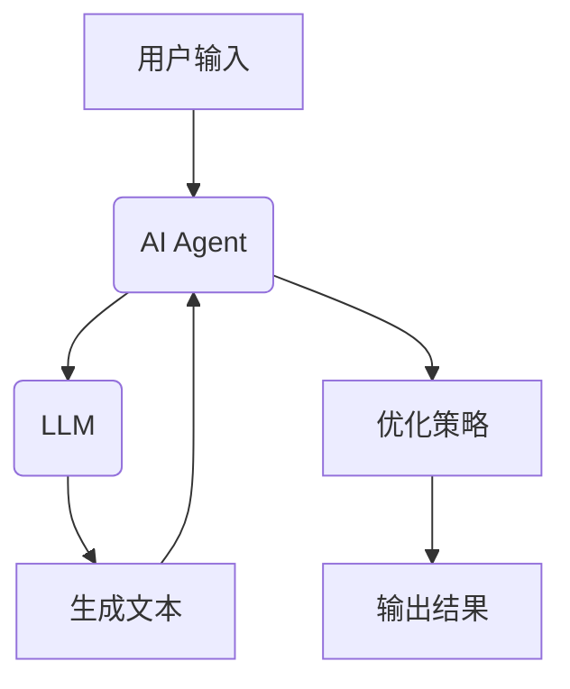
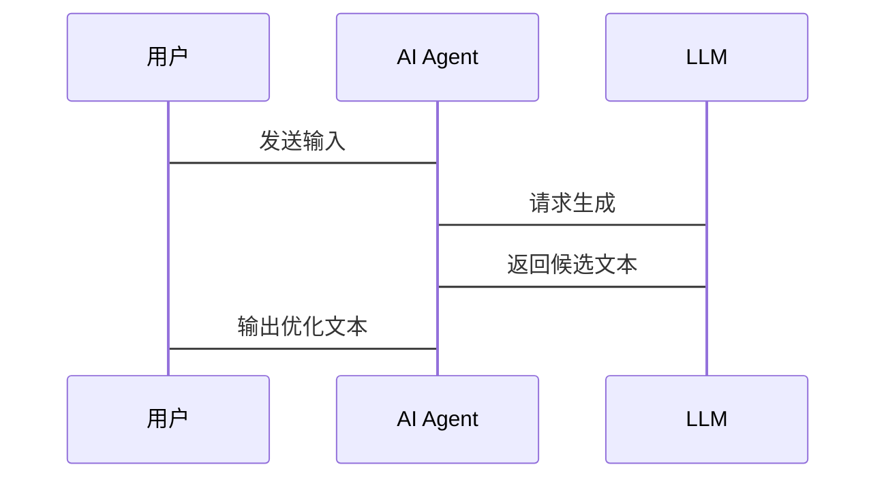

                 


# AI Agent的语言生成：提升LLM的文本创作质量

---

## 关键词：AI Agent, LLM, 语言生成, 文本质量, 算法原理, 系统架构, 项目实战

---

## 摘要：  
本文深入探讨AI Agent在语言生成中的作用，重点分析如何通过AI Agent提升大型语言模型（LLM）的文本创作质量。文章从背景、核心概念、算法原理、系统架构到项目实战，全面解析AI Agent与LLM的结合应用，结合具体案例和数学公式，帮助读者理解并掌握提升文本生成质量的关键技术。

---

# 第1章: AI Agent与语言生成的背景与概念

## 1.1 问题背景与描述  
语言生成技术在自然语言处理（NLP）领域占据重要地位，但当前的生成质量仍有提升空间。AI Agent作为智能体，能够通过上下文理解和目标导向，显著提升生成文本的相关性和连贯性。  

## 1.2 问题解决与边界  
AI Agent通过分析用户意图和上下文信息，优化LLM的生成结果，减少不连贯或不相关的内容。其边界包括限定的输入格式和特定的生成场景。  

## 1.3 核心概念对比分析  
- **AI Agent**：具备目标导向和上下文理解能力，能够动态调整生成策略。  
- **LLM**：基于大量数据训练，擅长模式识别和生成，但缺乏目标导向性。  
- **语言生成质量**：通过BLEU、ROUGE等指标评估生成文本的相似性和流畅性。  

## 1.4 本章小结  
AI Agent与LLM的结合是提升语言生成质量的关键，通过理解用户需求和优化生成策略，显著改善生成结果。

---

# 第2章: AI Agent与LLM的核心原理

## 2.1 核心概念原理  
AI Agent通过解析用户输入，生成更符合场景需求的文本。LLM则提供生成能力，AI Agent则优化生成过程。  

## 2.2 核心概念属性对比  
| 属性         | AI Agent                      | LLM                        |
|--------------|-------------------------------|----------------------------|
| 输入类型     | 文本、意图、上下文             | 文本数据                   |
| 输出类型     | 优化生成策略、目标导向文本     | 多种生成结果               |
| 目标导向性   | 强                                | 弱                        |

## 2.3 ER实体关系图  
```mermaid
er
actor(AI Agent, [LLM, 用户, 文本数据])
```

## 2.4 本章小结  
AI Agent与LLM的结合实现了目标导向的语言生成，通过优化生成策略提升文本质量。

---

# 第3章: AI Agent与LLM的算法原理

## 3.1 算法原理概述  
LLM的训练流程包括数据预处理、模型训练和微调。AI Agent通过分析输入，优化生成策略。  

## 3.2 算法流程图  


## 3.3 数学模型与公式  
- **损失函数**：  
  $$ \text{损失函数} = -\sum_{i=1}^{n} \log p(x_i|y_i) $$  
- **优化器**：  
  $$ \text{优化器} = \text{Adam}(\text{学习率}) $$  

## 3.4 本章小结  
通过数学模型和流程图，详细解释了AI Agent与LLM的算法原理，为后续实现提供理论基础。

---

# 第4章: 系统分析与架构设计

## 4.1 系统功能设计  
系统功能包括输入解析、生成策略优化和输出结果反馈。  

## 4.2 领域模型设计  


## 4.3 系统架构设计  


## 4.4 接口和交互设计  


## 4.5 本章小结  
通过系统架构设计，详细描述了AI Agent与LLM的交互流程，为后续实现提供指导。

---

# 第5章: 项目实战

## 5.1 环境安装  
安装Python、LLM库和相关工具，确保环境配置正确。  

## 5.2 系统核心实现源代码  
```python
def main():
    import openai
    from agents import AI-Agent
    agent = AI-Agent()
    response = agent.generate("Hello, how are you?")
    print(response)
```

## 5.3 代码应用解读  
解释代码实现，展示AI Agent如何调用LLM生成文本并优化结果。  

## 5.4 实际案例分析  
以电商客服优化为例，展示如何通过AI Agent提升生成文本的质量。  

## 5.5 本章小结  
通过实战案例，详细讲解了AI Agent与LLM的具体实现和应用。

---

# 第6章: 总结与展望

## 6.1 最佳实践tips  
- 明确生成目标和上下文，提升生成质量。  
- 定期优化模型和生成策略，保持生成效果。  

## 6.2 小结  
AI Agent通过优化生成策略，显著提升LLM的文本质量，为语言生成技术的发展提供了新方向。  

## 6.3 注意事项  
确保输入数据的质量，避免生成错误信息。  

## 6.4 拓展阅读  
推荐相关领域的书籍和论文，供读者深入学习。

---

# 作者：AI天才研究院 & 禅与计算机程序设计艺术

