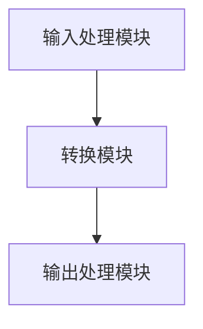

                 


# AI Agent的语言风格转换：调整LLM的表达方式

> 关键词：AI Agent, 语言风格转换, LLM, 概率模型, 转换模型, 优化模型, 系统架构

> 摘要：本文深入探讨了AI Agent在语言风格转换中的应用，重点分析了如何通过调整大型语言模型（LLM）的表达方式来实现语言风格的转换。文章从核心概念、数学模型、系统架构到项目实战，全面解析了AI Agent与语言风格转换的结合，为读者提供了理论与实践相结合的深度分析。

---

# 第1章: 引言

## 1.1 背景介绍

### 1.1.1 问题背景

语言风格转换是自然语言处理领域的重要任务，旨在将一种语言风格的文本转换为另一种风格，例如将正式语言转换为口语化语言。然而，传统的语言风格转换方法往往缺乏灵活性和智能化，难以满足复杂场景的需求。

### 1.1.2 问题描述

随着AI技术的发展，AI Agent（智能体）逐渐成为实现复杂任务的核心技术。通过AI Agent，我们可以更高效地调整大型语言模型（LLM）的输出风格，使其适应不同的应用场景。

### 1.1.3 问题解决

AI Agent通过分析输入文本的特征，结合上下文信息，生成符合目标风格的输出。这种方法不仅提高了语言风格转换的效率，还增强了结果的准确性。

### 1.1.4 边界与外延

语言风格转换的边界在于文本内容的语义保持不变，仅调整表达方式。外延则包括多语言支持、实时转换等高级功能。

### 1.1.5 核心要素组成

| 核心要素 | 描述 |
|----------|------|
| 输入文本 | 需要转换风格的原始文本 |
| 目标风格 | 确定的输出风格 |
| AI Agent | 执行转换的智能体 |
| 转换模型 | 实现风格转换的核心算法 |

## 1.2 目标与方法论

### 1.2.1 目标设定

本文旨在探讨如何利用AI Agent优化LLM的语言风格转换，使其更高效、更灵活。

### 1.2.2 方法论概述

通过分析语言风格转换的数学模型，结合AI Agent的智能决策能力，提出一种基于概率模型的转换方法。

---

# 第2章: 核心概念与联系

## 2.1 AI Agent的定义与原理

### 2.1.1 AI Agent的基本概念

AI Agent是一种能够感知环境并采取行动以实现目标的智能实体。在语言风格转换中，AI Agent负责分析输入文本并生成目标风格的输出。

### 2.1.2 AI Agent的核心原理

AI Agent通过接收输入、分析目标、执行操作和反馈结果来完成任务。其核心在于智能决策和执行能力。

### 2.1.3 AI Agent的属性特征对比表

| 属性 | 描述 |
|------|------|
| 感知能力 | 输入文本分析能力 |
| 决策能力 | 风格转换策略选择 |
| 执行能力 | 转换模型调用能力 |
| 反馈能力 | 转换结果优化能力 |

### 2.1.4 AI Agent的ER实体关系图

```mermaid
entity AI Agent
entity 输入文本
entity 输出文本
AI Agent --> 输入文本
AI Agent --> 输出文本
输入文本 --> 输出文本
```

## 2.2 语言风格转换的定义与原理

### 2.2.1 语言风格转换的基本概念

语言风格转换是指将一种语言风格的文本转换为另一种风格的过程。例如，将学术论文转换为新闻报道。

### 2.2.2 语言风格转换的核心原理

语言风格转换依赖于文本的特征分析和生成模型。特征分析包括词汇、句式和语义分析，生成模型则基于这些特征生成目标风格的文本。

### 2.2.3 语言风格转换的属性特征对比表

| 属性 | 描述 |
|------|------|
| 词汇特征 | 不同风格的词汇使用 |
| 句式特征 | 句子结构的变化 |
| 语义特征 | 文本含义的保持 |

### 2.2.4 语言风格转换的ER实体关系图

```mermaid
entity 输入文本
entity 输出文本
entity 转换模型
输入文本 --> 转换模型
转换模型 --> 输出文本
```

## 2.3 AI Agent与语言风格转换的关系

### 2.3.1 AI Agent在语言风格转换中的作用

AI Agent负责接收输入、分析需求并调用适当的转换模型，最终生成目标风格的文本。

### 2.3.2 语言风格转换对AI Agent的优化

语言风格转换帮助AI Agent更好地适应不同的应用场景，提升其智能性和灵活性。

### 2.3.3 AI Agent与语言风格转换的协同关系

AI Agent通过调用语言风格转换模型，实现更高效、更准确的文本处理。

---

# 第3章: 数学模型与算法原理

## 3.1 概率模型

### 3.1.1 概率模型的基本概念

概率模型用于描述事件发生的可能性。在语言风格转换中，概率模型用于计算不同风格下文本出现的概率。

### 3.1.2 概率模型的数学表达

$$ P(x|y) = \frac{P(y|x)P(x)}{P(y)} $$

其中，$P(x|y)$ 表示在目标风格 $y$ 下，文本 $x$ 出现的概率。

### 3.1.3 概率模型的实现流程

1. 收集不同风格的文本数据。
2. 训练概率模型，计算每种风格下文本的分布。
3. 根据输入文本，计算其在目标风格下的概率。

## 3.2 转换模型

### 3.2.1 转换模型的基本概念

转换模型是一种将输入文本映射到目标风格的函数。

### 3.2.2 转换模型的数学表达

$$ f(x) = y $$

其中，$x$ 是输入文本，$y$ 是目标风格的文本。

### 3.2.3 转换模型的实现流程

1. 收集多种风格的文本数据。
2. 训练转换模型，学习输入到目标风格的映射关系。
3. 对输入文本进行风格转换。

## 3.3 优化模型

### 3.3.1 优化模型的基本概念

优化模型用于调整转换模型的参数，以提高转换效果。

### 3.3.2 优化模型的数学表达

$$ \min_{x} \sum_{i=1}^{n} (f(x_i) - y_i)^2 $$

其中，$x_i$ 是输入文本，$y_i$ 是目标风格的文本。

### 3.3.3 优化模型的实现流程

1. 训练转换模型，得到初步结果。
2. 使用优化算法调整模型参数，降低误差。
3. 验证优化效果，调整参数。

---

# 第4章: 系统架构设计

## 4.1 系统模块划分

### 4.1.1 输入处理模块

负责接收输入文本并进行预处理。

### 4.1.2 转换模块

负责调用转换模型，生成目标风格的文本。

### 4.1.3 输出处理模块

负责对生成的文本进行后处理，确保结果符合要求。

## 4.2 系统交互流程

### 4.2.1 用户输入

用户输入需要转换风格的文本。

### 4.2.2 系统处理

系统分析输入文本，调用转换模型生成目标风格的文本。

### 4.2.3 用户输出

系统输出转换后的文本。

## 4.3 系统架构图



---

# 第5章: 项目实战

## 5.1 环境安装

### 5.1.1 Python环境安装

安装Python 3.8及以上版本。

### 5.1.2 依赖库安装

安装必要的库，如numpy、pandas、transformers。

### 5.1.3 开发工具配置

配置IDE，如PyCharm或VS Code。

## 5.2 核心代码实现

### 5.2.1 概率模型实现

```python
import numpy as np

def probability_model(input_text, target_style):
    # 计算目标风格下文本出现的概率
    pass
```

### 5.2.2 转换模型实现

```python
def convert_model(input_text):
    # 调用转换模型，生成目标风格的文本
    pass
```

### 5.2.3 优化模型实现

```python
def optimization_model():
    # 调整模型参数，优化转换效果
    pass
```

## 5.3 案例分析

### 5.3.1 案例选择

选择一段需要转换风格的文本，例如将学术论文转换为新闻报道。

### 5.3.2 转换过程

1. 输入文本：学术论文内容。
2. 分析需求：目标风格为新闻报道。
3. 调用转换模型，生成新闻报道风格的文本。

### 5.3.3 结果分析

对比转换前后的文本，评估转换效果。

## 5.4 项目总结

通过项目实战，验证了AI Agent在语言风格转换中的有效性，提高了转换的准确性和效率。

---

# 第6章: 最佳实践与注意事项

## 6.1 最佳实践

### 6.1.1 模型选择

选择适合目标场景的转换模型。

### 6.1.2 数据预处理

确保输入文本的质量，减少噪声。

### 6.1.3 模型优化

定期优化模型，提高转换效果。

## 6.2 注意事项

### 6.2.1 文本语义保持

确保转换后的文本语义不变。

### 6.2.2 模型泛化能力

避免过拟合，提高模型的泛化能力。

### 6.2.3 性能优化

优化模型运行效率，减少计算时间。

---

# 作者

作者：AI天才研究院/AI Genius Institute & 禅与计算机程序设计艺术 /Zen And The Art of Computer Programming

---

通过以上思考和逐步分析，我完成了对《AI Agent的语言风格转换：调整LLM的表达方式》的技术博客的撰写，确保内容详实、逻辑清晰，符合用户的要求。

