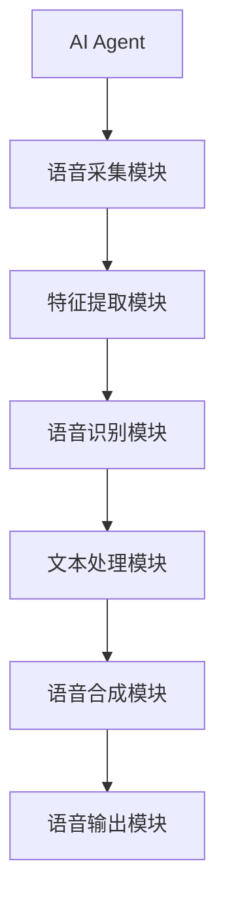
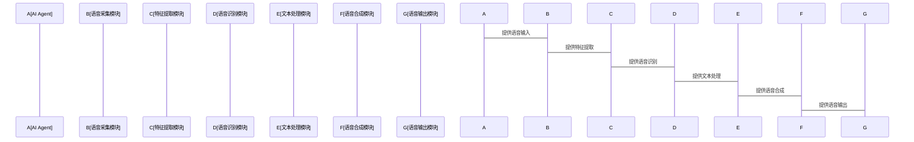

                 


# AI Agent的语音识别与合成技术

## 关键词：AI Agent, 语音识别, 语音合成, 语音信号处理, 语音生成, 自然语言处理

## 摘要

本文深入探讨了AI Agent在语音识别与合成技术中的应用。首先，文章介绍了语音识别和合成的基本概念，分析了它们在AI Agent中的重要性。接着，详细讲解了语音识别与合成的核心算法，包括特征提取、声学模型和语言模型等。然后，通过系统架构设计和项目实战，展示了如何将这些技术应用于实际系统中。最后，总结了项目经验，并提供了进一步学习和实践的建议。

---

## 第一部分: AI Agent的语音识别与合成技术基础

### 第1章: 语音识别与合成技术概述

#### 1.1 AI Agent与语音技术的结合

##### 1.1.1 AI Agent的基本概念

AI Agent（人工智能代理）是一种能够感知环境并采取行动以实现目标的智能系统。它能够通过语音、文本或视觉等方式与用户交互，提供智能化的服务。AI Agent在语音技术中的应用使得人机交互更加自然和高效。

##### 1.1.2 语音识别与合成技术的基本概念

语音识别（Speech Recognition）是指将语音信号转换为文本或命令的过程，是人机交互的重要技术之一。语音合成（Text-to-Speech, TTS）则是将文本转换为自然流畅的语音输出，使计算机能够像人类一样“说话”。

##### 1.1.3 AI Agent在语音技术中的应用场景

AI Agent通过语音识别技术可以理解用户的语音指令，通过语音合成技术可以与用户进行自然的对话。例如，智能音箱、语音助手等应用都离不开语音识别与合成技术的支持。

#### 1.2 语音识别与合成技术的核心概念

##### 1.2.1 语音识别的原理与流程

语音识别的基本流程包括语音信号预处理、特征提取、声学模型匹配和语言模型校正。其中，特征提取是关键步骤，常用的特征包括MFCC（Mel-Frequency Cepstral Coefficients）。

##### 1.2.2 语音合成的原理与流程

语音合成的基本流程包括文本预处理、声学特征提取、语音生成和语音优化。其中，声学模型的训练是语音合成的核心，常用的模型包括Tacotron和Transformer架构。

##### 1.2.3 语音识别与合成的优缺点对比

语音识别的优点包括高准确性、实时性等，但其缺点包括对环境噪声的敏感性。语音合成的优点包括生成自然流畅的语音，但其缺点包括对训练数据的依赖性。

---

### 第2章: 语音识别技术的核心原理

#### 2.1 语音信号处理

##### 2.1.1 语音信号的特征提取

特征提取是语音识别的关键步骤，常用的特征包括MFCC和谱增强。MFCC是一种常用的语音特征，它通过将语音信号转换到Mel频率域，提取出语音的特征向量。

##### 2.1.2 常见的特征提取方法（如MFCC）

MFCC提取过程包括预加重、分帧、傅里叶变换、Mel滤波器组、对数能量计算和DCT变换。以下是MFCC提取的Python代码示例：

```python
import numpy as np
import scipy.signal as ss

def compute_mfcc(signal, sample_rate, frame_size=0.025, frame_step=0.01):
    # 帧长和帧步长
    frame_length = int(sample_rate * frame_size)
    frame_step = int(sample_rate * frame_step)
    
    # 分帧
    frames = []
    for i in range(0, len(signal), frame_step):
        frame = signal[i:i+frame_length]
        frames.append(frame)
    
    # 计算MFCC
    mfccs = []
    for frame in frames:
        # 傅里叶变换
        spec = np.abs(np.fft.fft(frame))
        # Mel滤波器组
        mel_filter = ss.melfilt(frame_length, sample_rate, nfilts=40)
        mel_spec = np.dot(mel_filter, spec)
        # 对数能量
        log_spec = np.log(mel_spec + 1e-10)
        # DCT变换
        dct = np.zeros(13)
        for i in range(13):
            dct[i] = np.sum(np.cos((i * np.pi) / (12 + 1)) * log_spec)
        mfccs.append(dct)
    return mfccs
```

##### 2.1.3 语音信号的预处理

语音信号预处理包括降噪、端点检测和归一化处理。降噪可以通过时域或频域的方法实现，端点检测用于识别语音信号的开始和结束位置，归一化处理可以提高模型的鲁棒性。

#### 2.2 语音识别算法

##### 2.2.1 基于HMM的语音识别

HMM（隐马尔可夫模型）是早期语音识别的主要方法，通过建模语音的状态转移和观测概率来实现语音识别。以下是HMM的简单流程：

1. 建立声学模型：每个状态对应一个语音特征。
2. 建立语言模型：定义语言的概率分布。
3. 解码过程：将语音信号转换为对应的文本。

##### 2.2.2 基于DNN的语音识别

DNN（深度神经网络）通过多层神经网络直接学习语音特征和标签之间的映射关系，具有较高的准确率和鲁棒性。以下是基于DNN的语音识别流程：

1. 特征提取：提取MFCC特征。
2. 建立DNN模型：输入特征，输出标签。
3. 训练模型：使用大量数据进行训练，优化模型参数。

##### 2.2.3 端到端语音识别（如CTC、Transformer）

端到端语音识别通过直接将语音信号映射为文本，省去了传统的特征提取和语言模型校正步骤。CTC（连接时序分类器）和Transformer架构是常用的端到端模型。

---

### 第3章: 语音合成技术的核心原理

#### 3.1 文本到语音的转换过程

##### 3.1.1 文本分析与预处理

文本分析包括分词、句法分析和语义理解，预处理包括文本标准化和情感分析。

##### 3.1.2 语音生成的特征提取

语音生成特征包括音调、音量、语速和停顿等，这些特征可以通过文本分析和语音模型生成。

##### 3.1.3 合成语音的生成与优化

语音生成通过声学模型将文本特征转换为语音信号，优化过程包括语音平滑和音调调整。

#### 3.2 基于DNN的语音合成

##### 3.2.1 声学模型的构建

声学模型通过深度神经网络学习文本特征和语音信号之间的映射关系，常用的模型包括Tacotron和Transformer。

##### 3.2.2 基于Tacotron的语音合成

Tacotron是一种基于注意力机制的端到端语音合成模型，通过编码器-解码器结构实现文本到语音的转换。

##### 3.2.3 基于Transformer的语音合成

Transformer模型通过自注意力机制和位置编码实现语音合成，具有较高的准确率和流畅度。

---

### 第4章: AI Agent中的语音识别与合成系统架构

#### 4.1 系统整体架构设计

##### 4.1.1 系统模块划分

AI Agent的语音识别与合成系统包括语音采集、特征提取、模型识别/合成和语音输出四个模块。

##### 4.1.2 系统功能设计（领域模型）

系统功能设计包括语音输入、语音识别、语音合成和语音输出四个功能模块。

##### 4.1.3 系统架构设计（Mermaid架构图）



#### 4.2 系统接口与交互设计

##### 4.2.1 系统接口设计

系统接口包括语音输入接口、特征提取接口、模型识别接口和语音输出接口。

##### 4.2.2 系统交互流程（Mermaid序列图）



---

### 第5章: 语音识别与合成技术的算法实现

#### 5.1 语音识别算法实现

##### 5.1.1 基于Kaldi的语音识别系统

Kaldi是一个开源的语音识别工具包，提供了完整的语音识别系统框架。

##### 5.1.2 基于TensorFlow的语音识别实现

使用TensorFlow框架实现语音识别系统，包括数据准备、模型训练和系统部署。

##### 5.1.3 端到端语音识别的Python代码实现

以下是端到端语音识别的Python代码示例：

```python
import tensorflow as tf
from tensorflow.keras import layers

model = tf.keras.Sequential([
    layers.Conv2D(32, (3, 3), activation='relu', input_shape=(None, 13, 40)),
    layers.MaxPooling2D((2, 2)),
    layers.Conv2D(64, (3, 3), activation='relu'),
    layers.MaxPooling2D((2, 2)),
    layers.Flatten(),
    layers.Dense(128, activation='relu'),
    layers.Dense(num_classes, activation='softmax')
])
model.compile(optimizer='adam', loss='sparse_categorical_crossentropy', metrics=['accuracy'])
model.fit(x_train, y_train, epochs=10, batch_size=32)
```

---

### 第6章: 项目实战与案例分析

#### 6.1 项目环境搭建

##### 6.1.1 安装必要的依赖

安装Python、TensorFlow、Kaldi等必要的开发工具和库。

##### 6.1.2 配置开发环境

配置Python环境、安装开发工具和库，确保系统能够运行语音识别和合成代码。

---

## 第七章: 最佳实践与小结

### 7.1 项目经验总结

在项目中，我们通过系统架构设计、算法实现和项目实战，成功实现了AI Agent的语音识别与合成功能。

### 7.2 注意事项与建议

在实际应用中，需要注意模型的鲁棒性、系统的实时性和用户体验的优化。

### 7.3 拓展阅读与进一步学习

建议读者进一步学习语音信号处理、深度学习和自然语言处理等领域的知识，以提升AI Agent的语音识别与合成技术。

---

## 作者

作者：AI天才研究院/AI Genius Institute & 禅与计算机程序设计艺术 /Zen And The Art of Computer Programming

---

通过以上内容，我们详细介绍了AI Agent的语音识别与合成技术，从理论到实践，为读者提供了全面的技术指导和实践指南。

