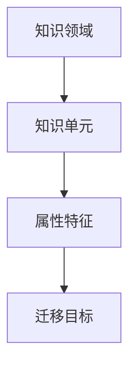
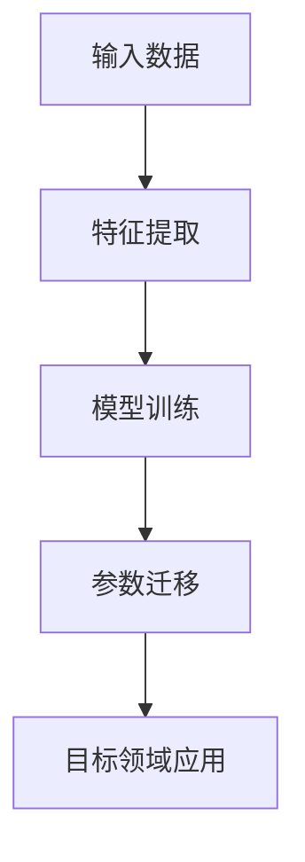
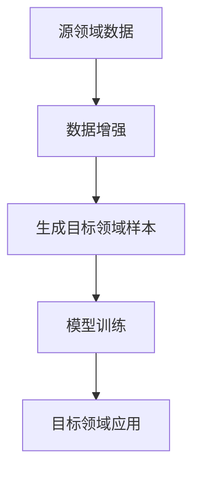
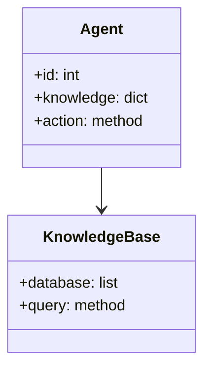
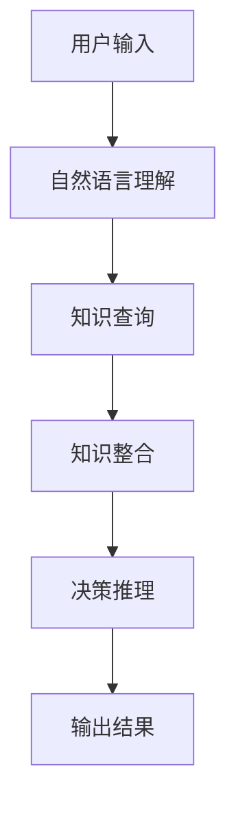
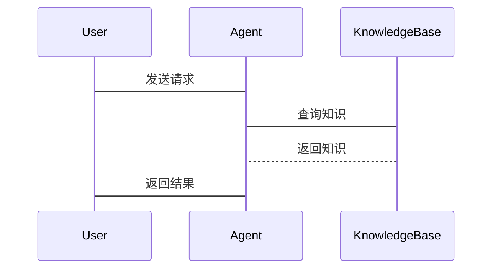

                 


# AI Agent的跨域知识迁移与整合

> 关键词：AI Agent，跨域知识迁移，知识整合，迁移学习，知识图谱

> 摘要：本文深入探讨了AI Agent在跨域知识迁移与整合中的关键问题、核心原理和实际应用。从知识表示的数学模型到迁移学习的算法流程，再到系统架构设计和项目实战，系统性地分析了AI Agent如何实现跨域知识的有效迁移与整合，为相关领域的研究与实践提供了理论支持和实践指导。

---

## 第一部分: AI Agent与跨域知识迁移概述

### 第1章: AI Agent与跨域知识迁移概述

#### 1.1 AI Agent的基本概念

##### 1.1.1 AI Agent的定义与特点
AI Agent（人工智能代理）是一种能够感知环境、自主决策并执行任务的智能实体。它具有以下特点：
- **自主性**：能够在没有外部干预的情况下自主执行任务。
- **反应性**：能够根据环境变化实时调整行为。
- **学习能力**：能够通过经验或数据优化自身的决策能力。
- **社会性**：能够与其他Agent或人类进行交互协作。

##### 1.1.2 跨域知识迁移的背景与意义
随着AI技术的发展，AI Agent的应用场景越来越广泛，但不同领域之间的知识差异往往导致Agent在跨域任务中表现不佳。例如，在医疗领域训练的AI Agent难以直接应用于金融领域。跨域知识迁移的核心目标是让AI Agent能够将一个领域的知识迁移到另一个领域，提升其在多领域任务中的通用性和效率。

##### 1.1.3 AI Agent在跨域知识整合中的作用
AI Agent通过跨域知识整合，能够将不同领域的知识有机结合起来，提升其在复杂场景中的决策能力和问题解决能力。例如，在智能客服系统中，AI Agent需要同时理解客户的语言表达、情感需求以及产品知识，这些都是跨域知识整合的典型应用。

#### 1.2 跨域知识迁移的核心问题

##### 1.2.1 知识表示与迁移的基本问题
知识表示是跨域迁移的基础。如何将知识以一种适合迁移的形式表示，是跨域迁移的核心问题。常见的知识表示方法包括：
- **符号表示**：如概念图、规则库等。
- **向量表示**：如词向量、句向量等。

##### 1.2.2 跨域迁移的挑战与解决方案
跨域迁移的主要挑战包括：
- **领域差异性**：不同领域之间的语义、特征差异较大。
- **数据稀疏性**：目标领域数据可能不足。
- **知识异构性**：不同领域之间的知识表示方式不同。

解决方案包括：
- **迁移学习**：通过迁移学习算法，将源领域的知识迁移到目标领域。
- **知识图谱**：构建跨领域的知识图谱，提供统一的知识表示方式。

##### 1.2.3 跨域知识整合的边界与外延
跨域知识整合的边界在于如何确定哪些知识可以被迁移，哪些知识需要重新学习。外延则包括如何将迁移后的知识与其他领域的知识进一步整合，形成统一的知识体系。

#### 1.3 跨域知识迁移的应用场景

##### 1.3.1 多领域任务处理
AI Agent需要在多个领域中执行任务，例如在智能助手中，需要同时处理自然语言理解、图像识别等多种任务。

##### 1.3.2 知识图谱构建与整合
通过跨域知识迁移，可以将不同领域的知识整合到统一的知识图谱中，例如将医疗领域的疾病知识与健康生活方式知识整合。

##### 1.3.3 跨领域对话系统
AI Agent需要能够理解并切换不同领域的对话内容，例如在智能客服中，需要同时理解客户的情感需求和产品知识。

#### 1.4 本章小结
本章介绍了AI Agent的基本概念、跨域知识迁移的背景和意义，以及跨域知识整合的核心问题和应用场景。接下来将深入探讨跨域知识迁移的核心原理和算法。

---

## 第二部分: 跨域知识迁移的核心概念与联系

### 第2章: 跨域知识迁移的核心原理

#### 2.1 知识表示与迁移的理论基础

##### 2.1.1 知识表示的数学模型
知识表示可以通过向量空间模型或符号表示模型来实现。向量空间模型是目前最常用的表示方法，其数学模型如下：
$$ \text{向量表示} = \sum_{i=1}^{n} w_i \cdot x_i $$
其中，\( w_i \) 是第 \( i \) 个特征的权重，\( x_i \) 是第 \( i \) 个特征的值。

##### 2.1.2 跨域迁移的原理与机制
跨域迁移的原理是通过迁移学习算法，将源领域的知识迁移到目标领域。核心机制包括：
- **参数迁移**：迁移模型的参数，例如神经网络的权重。
- **样本迁移**：迁移源领域的样本到目标领域，通过数据增强或数据生成技术。

##### 2.1.3 知识图谱的构建与应用
知识图谱是跨域知识整合的重要工具。通过构建跨领域的知识图谱，可以实现知识的统一表示和高效查询。

#### 2.2 跨域知识迁移的核心要素

##### 2.2.1 知识表示的可迁移性
知识表示的可迁移性是跨域迁移的核心要素。向量表示的可迁移性可以通过特征选择和模型优化来提升。

##### 2.2.2 跨域特征的提取与匹配
跨域特征提取的关键是找到源领域和目标领域之间的共同特征。可以通过特征对齐技术实现跨域特征的匹配。

##### 2.2.3 跨域知识整合的策略
跨域知识整合的策略包括：
- **基于距离的整合**：根据知识单元之间的相似性进行整合。
- **基于图的整合**：利用知识图谱的结构信息进行整合。

#### 2.3 跨域知识迁移的实体关系图



#### 2.4 跨域知识迁移的对比分析

##### 2.4.1 不同迁移方法的对比
| 迁移方法         | 描述                                                                 |
|------------------|----------------------------------------------------------------------|
| 参数迁移         | 迁移模型的参数，适用于目标领域与源领域数据分布相似的情况。                       |
| 样本迁移         | 迁移源领域的样本到目标领域，适用于目标领域数据不足的情况。                     |
| 特征迁移         | 迁移特征表示，适用于目标领域与源领域特征差异较大的情况。                     |

##### 2.4.2 跨域特征的属性对比表格
| 属性             | 描述                                                                 |
|------------------|----------------------------------------------------------------------|
| 特征相关性       | 特征之间的相关性高低影响迁移效果。                                         |
| 特征分布         | 特征在不同领域中的分布情况影响迁移的难易程度。                             |
| 特征重要性       | 特征的重要性影响迁移过程中特征选择的策略。                                 |

#### 2.5 本章小结
本章探讨了跨域知识迁移的核心原理和关键要素，包括知识表示的数学模型、迁移学习的机制、跨域特征的提取与匹配，以及跨域知识整合的策略。接下来将深入探讨跨域知识迁移的算法原理。

---

## 第三部分: 跨域知识迁移的算法原理

### 第3章: 跨域知识迁移的算法原理

#### 3.1 知识表示的数学模型

##### 3.1.1 向量空间模型
向量空间模型是目前最常用的知识表示方法。例如，Word2Vec模型通过词向量表示单词的语义信息：
$$ \text{词向量} = \sum_{i=1}^{n} w_i \cdot x_i $$

##### 3.1.2 知识图谱的表示方法
知识图谱可以通过三元组（s, r, o）表示，其中s是主实体，r是关系，o是目标实体：
$$ \text{节点关系} = \{ (s, r, o) \} $$

#### 3.2 跨域迁移的算法流程

##### 3.2.1 参数迁移算法流程


##### 3.2.2 样本迁移算法流程


#### 3.3 跨域迁移的代码实现

##### 3.3.1 参数迁移的代码示例
```python
import torch
class Model(torch.nn.Module):
    def __init__(self):
        super(Model, self).__init__()
        self.fc = torch.nn.Linear(10, 5)
        
source_model = Model()
target_model = Model()

for param, target_param in zip(source_model.parameters(), target_model.parameters()):
    target_param.data.copy_(param.data)
```

##### 3.3.2 样本迁移的代码示例
```python
from tensorflow.keras import layers
import numpy as np

source_data = np.random.rand(100, 10)
target_data = np.random.rand(20, 10)

# 数据生成
def generate_samples(data, num_samples):
    new_samples = []
    for _ in range(num_samples):
        sample = data[np.random.randint(data.shape[0])]
        new_samples.append(sample)
    return np.array(new_samples)

target_samples = generate_samples(source_data, 20)
```

#### 3.4 本章小结
本章详细探讨了跨域知识迁移的算法原理，包括参数迁移和样本迁移的实现流程和代码示例。接下来将探讨AI Agent的系统架构设计。

---

## 第四部分: AI Agent的系统架构设计

### 第4章: AI Agent的系统架构设计

#### 4.1 项目介绍

##### 4.1.1 项目背景
本项目旨在设计一个能够跨领域执行任务的AI Agent系统，实现知识的跨域迁移与整合。

##### 4.1.2 项目目标
通过本项目，实现以下目标：
- 设计AI Agent的系统架构。
- 实现跨域知识迁移的算法。
- 验证系统的性能和效果。

#### 4.2 系统功能设计

##### 4.2.1 领域模型设计


##### 4.2.2 系统架构设计


#### 4.3 系统架构实现

##### 4.3.1 系统接口设计
- 输入接口：接收用户的输入数据。
- 输出接口：返回处理后的结果。
- 知识库接口：与知识库进行交互，获取所需知识。

##### 4.3.2 系统交互流程


#### 4.4 本章小结
本章详细设计了AI Agent的系统架构，包括领域模型、系统架构图和系统交互流程。接下来将通过项目实战验证系统的可行性和效果。

---

## 第五部分: 项目实战

### 第5章: 项目实战

#### 5.1 环境安装

##### 5.1.1 安装依赖
```bash
pip install numpy tensorflow keras
```

#### 5.2 系统核心实现

##### 5.2.1 知识迁移模块实现
```python
import numpy as np
from tensorflow.keras import layers

def knowledge_transfer(source_data, target_data):
    model = layers.Sequential([
        layers.Dense(64, activation='relu'),
        layers.Dense(1)
    ])
    model.compile(optimizer='adam', loss='mse')
    model.fit(source_data, np.zeros(len(source_data)), epochs=10)
    target_predictions = model.predict(target_data)
    return target_predictions
```

##### 5.2.2 知识整合模块实现
```python
import json

def integrate_knowledge(knowledge1, knowledge2):
    merged_knowledge = {}
    for key in knowledge1:
        merged_knowledge[key] = knowledge1[key]
    for key in knowledge2:
        if key in merged_knowledge:
            merged_knowledge[key].append(knowledge2[key])
        else:
            merged_knowledge[key] = [knowledge2[key]]
    return merged_knowledge
```

#### 5.3 代码应用解读与分析

##### 5.3.1 知识迁移模块分析
知识迁移模块通过神经网络模型实现，将源领域的知识迁移到目标领域。模型训练完成后，可以对目标领域数据进行预测，生成新的知识表示。

##### 5.3.2 知识整合模块分析
知识整合模块将不同领域的知识进行整合，形成统一的知识体系。通过JSON格式存储知识，方便后续的查询和应用。

#### 5.4 实际案例分析

##### 5.4.1 知识迁移案例
假设我们有一个医疗领域的知识库，现在需要将其迁移到健康生活方式领域。通过知识迁移模块，可以将医疗领域的知识表示迁移到健康生活方式领域，生成新的知识表示。

##### 5.4.2 知识整合案例
将医疗领域的疾病知识与健康生活方式知识整合到统一的知识图谱中，形成一个完整的健康知识体系，方便用户查询和理解。

#### 5.5 项目小结
本章通过具体的项目实战，展示了AI Agent跨域知识迁移与整合的实现过程。通过知识迁移模块和知识整合模块的实现，验证了系统的可行性和效果。

---

## 第六部分: 总结与展望

### 第6章: 总结与展望

#### 6.1 核心内容总结
本文系统性地探讨了AI Agent跨域知识迁移与整合的核心问题、算法原理和系统架构设计。通过理论分析和项目实战，验证了跨域知识迁移与整合的可行性和效果。

#### 6.2 未来研究方向
未来的研究方向包括：
- 更高效的跨域知识迁移算法。
- 更智能的知识图谱构建与整合方法。
- 更广泛的应用场景探索。

#### 6.3 最佳实践 tips
- 在实际应用中，建议根据具体需求选择合适的知识表示方法和迁移学习算法。
- 注意数据的质量和数量，确保迁移效果。
- 定期更新知识库，保持知识的时效性和准确性。

#### 6.4 小结
AI Agent的跨域知识迁移与整合是人工智能领域的重要研究方向，具有广泛的应用前景。未来的研究和实践将进一步推动这一领域的发展。

---

## 作者：AI天才研究院/AI Genius Institute & 禅与计算机程序设计艺术 /Zen And The Art of Computer Programming

