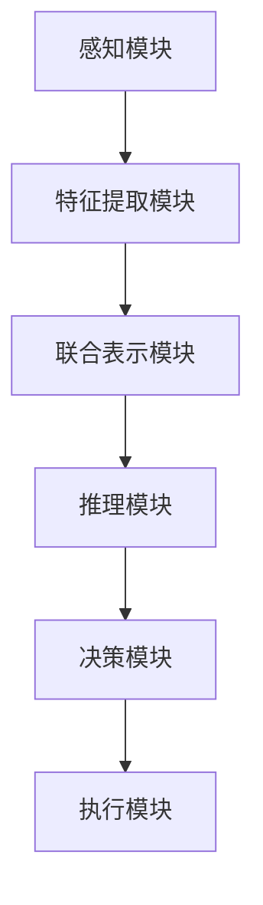

                 


# AI Agent的跨模态学习与推理实现

## 关键词：AI Agent, 跨模态学习, 推理, 多模态数据, 人工智能, 系统架构

## 摘要：AI Agent的跨模态学习与推理实现

在人工智能领域，AI Agent（智能体）通过跨模态学习和推理技术，能够处理多种类型的数据，并基于这些数据进行复杂的逻辑推理，从而做出决策和执行任务。本文将从AI Agent的基本概念、跨模态学习的核心原理、算法实现、系统架构设计、项目实战以及未来展望等多个方面进行深入探讨，全面解析AI Agent在跨模态学习与推理中的实现细节和技术要点。

---

## 第一部分：AI Agent的跨模态学习与推理概述

### 1.1 AI Agent的基本概念

AI Agent是一种能够感知环境、自主决策并执行任务的智能实体。它具备以下核心特征：
- **自主性**：能够在没有外部干预的情况下独立运作。
- **反应性**：能够根据环境的变化实时调整行为。
- **目标导向性**：通过设定目标来指导其行动。
- **社会能力**：能够与其他Agent或人类进行交互和协作。

AI Agent的应用场景广泛，包括智能助手、自动驾驶、机器人控制等。

### 1.2 跨模态学习的必要性

在现实世界中，数据往往以多种模态形式存在，例如文本、图像、语音、视频等。跨模态学习（Multimodal Learning）是指同时利用多种模态的数据来提升模型的性能和理解能力。通过跨模态学习，AI Agent能够更好地理解和处理复杂场景中的信息，从而做出更准确的推理和决策。

### 1.3 跨模态学习与推理的关系

跨模态学习为推理提供了多源信息的支持，而推理则是跨模态学习的延伸和应用。通过推理，AI Agent能够基于多模态数据进行逻辑分析和判断，从而实现更高级的智能行为。

---

## 第二部分：跨模态学习的核心概念

### 2.1 跨模态数据处理

#### 2.1.1 多模态数据的表示方法

跨模态数据处理的第一步是将不同模态的数据转化为统一的表示形式。常见的表示方法包括：
- **向量表示**：将文本、图像等数据转换为向量形式，以便进行数学运算。
- **符号表示**：使用符号逻辑对数据进行表示，便于推理过程。

#### 2.1.2 跨模态数据融合技术

跨模态数据融合技术旨在将不同模态的数据结合起来，以提高模型的性能。常见的融合方法包括：
- **早期融合**：在数据预处理阶段将不同模态的数据进行融合。
- **晚期融合**：在特征提取后对不同模态的特征进行融合。

#### 2.1.3 跨模态数据对齐问题

跨模态数据对齐是指将不同模态的数据对准到同一语义空间中，以便更好地进行信息融合。常见的对齐方法包括：
- **基于相似度的对齐**：通过计算不同模态数据之间的相似度来实现对齐。
- **基于距离的对齐**：通过最小化模态间数据的距离来实现对齐。

### 2.2 联合表示学习

#### 2.2.1 联合表示的基本概念

联合表示学习是指将不同模态的数据共同表示为一个统一的向量空间，以便模型能够同时利用多种模态的信息。

#### 2.2.2 联合表示学习的算法

常见的联合表示学习算法包括：
- **多模态编码器**：将不同模态的数据分别编码为向量，然后通过聚合操作得到联合表示。
- **对比学习**：通过最大化不同模态数据之间的相似性来实现联合表示。

#### 2.2.3 联合表示在跨模态推理中的应用

联合表示为跨模态推理提供了基础，使得模型能够基于多模态数据进行推理和判断。

### 2.3 跨模态推理机制

#### 2.3.1 基于符号逻辑的推理

基于符号逻辑的推理通过使用符号逻辑规则进行推理，适用于知识图谱等结构化数据。

#### 2.3.2 基于概率推理的方法

基于概率推理的方法通过计算事件发生的概率来进行推理，适用于不确定性的场景。

---

## 第三部分：跨模态学习与推理的算法原理

### 3.1 多模态编码器

#### 3.1.1 多模态编码器的定义

多模态编码器是一种能够同时处理多种模态数据的编码器，通常由多个分支组成，每个分支负责处理一种模态的数据。

#### 3.1.2 多模态编码器的实现

多模态编码器的实现通常包括以下步骤：
1. 对每种模态的数据进行特征提取。
2. 对提取的特征进行聚合操作，得到联合表示。
3. 对联合表示进行编码，得到最终的向量表示。

#### 3.1.3 多模态编码器的数学模型

多模态编码器的数学模型可以表示为：
$$
H = f_{\text{modality}}(x_i) \\
h = g(H)
$$
其中，$x_i$ 表示第 $i$ 种模态的数据，$f_{\text{modality}}$ 表示该模态的特征提取函数，$g$ 表示聚合函数。

### 3.2 对比学习

#### 3.2.1 对比学习的定义

对比学习是一种通过最大化正样本相似性和最小化负样本相似性来学习表征的技术。

#### 3.2.2 对比学习的实现

对比学习的实现通常包括以下步骤：
1. 对每种模态的数据进行编码，得到向量表示。
2. 计算不同模态数据之间的相似度。
3. 使用损失函数进行优化，最大化正样本相似性，最小化负样本相似性。

#### 3.2.3 对比学习的数学模型

对比学习的数学模型可以表示为：
$$
L = -\log \frac{\exp(s(x_i, x_j))}{\sum_{k \neq j} \exp(s(x_i, x_k))}
$$
其中，$s(x_i, x_j)$ 表示第 $i$ 种模态和第 $j$ 种模态数据之间的相似度。

### 3.3 注意力机制

#### 3.3.1 注意力机制的定义

注意力机制是一种用于聚焦重要信息的技术，广泛应用于自然语言处理和计算机视觉领域。

#### 3.3.2 注意力机制的实现

注意力机制的实现通常包括以下步骤：
1. 对输入数据进行编码，得到查询、键和值向量。
2. 计算查询和键向量之间的相似度。
3. 根据相似度对值向量进行加权求和，得到最终的注意力输出。

#### 3.3.3 注意力机制的数学模型

注意力机制的数学模型可以表示为：
$$
\alpha_i = \text{softmax}(q \cdot k_i) \\
h = \sum_{i=1}^n \alpha_i v_i
$$
其中，$q$ 表示查询向量，$k_i$ 表示第 $i$ 个键向量，$v_i$ 表示第 $i$ 个值向量。

---

## 第四部分：跨模态学习与推理的系统架构设计

### 4.1 系统架构设计

AI Agent的跨模态学习与推理系统通常包括以下几个模块：
1. **感知模块**：负责采集和处理多模态数据。
2. **特征提取模块**：对感知模块获取的数据进行特征提取。
3. **联合表示模块**：将不同模态的特征进行融合，得到联合表示。
4. **推理模块**：基于联合表示进行推理，得出结论。
5. **决策模块**：根据推理结果做出决策，并执行相应的动作。

### 4.2 系统交互流程

1. **数据采集**：AI Agent通过传感器、摄像头等设备采集多模态数据。
2. **特征提取**：对采集到的数据进行特征提取，得到每种模态的特征向量。
3. **联合表示**：将不同模态的特征向量进行融合，得到联合表示。
4. **推理**：基于联合表示进行推理，得出结论。
5. **决策与执行**：根据推理结果做出决策，并执行相应的动作。

### 4.3 系统架构图



---

## 第五部分：跨模态学习与推理的项目实战

### 5.1 项目背景

本项目旨在实现一个能够处理文本和图像数据的AI Agent，使其能够基于多模态数据进行推理和决策。

### 5.2 项目实现

#### 5.2.1 环境配置

```bash
pip install numpy
pip install matplotlib
pip install tensorflow
```

#### 5.2.2 核心代码实现

```python
import numpy as np
import tensorflow as tf

# 定义多模态编码器
class MultimodalEncoder:
    def __init__(self):
        self.text_encoder = TextEncoder()
        self.image_encoder = ImageEncoder()
    
    def encode(self, text, image):
        text_features = self.text_encoder.encode(text)
        image_features = self.image_encoder.encode(image)
        # 聚合特征
        combined_features = tf.keras.layers.concatenate([text_features, image_features])
        return combined_features

# 定义对比学习模型
class ContrastiveLearner:
    def __init__(self):
        self.encoder = MultimodalEncoder()
        self.temperature = 0.1
    
    def compute_loss(self, x1, x2):
        # 编码数据
        z1 = self.encoder.encode(x1)
        z2 = self.encoder.encode(x2)
        # 计算相似度
        similarity = tf.reduce_sum(z1 * z2, axis=-1)
        similarity = similarity / self.temperature
        # 计算损失
        loss = -tf.log(tf.nn.softmax(similarity))
        return loss

    def train(self, x1, x2, optimizer):
        with tf.GradientTape() as tape:
            loss = self.compute_loss(x1, x2)
        gradients = tape.gradient(loss, self.encoder.trainable_weights)
        optimizer.apply_gradients(zip(gradients, self.encoder.trainable_weights))
```

#### 5.2.3 系统功能

1. **数据采集**：通过摄像头采集图像数据，通过麦克风采集语音数据。
2. **特征提取**：使用预训练的模型对图像和语音数据进行特征提取。
3. **联合表示**：将图像和语音的特征向量进行融合，得到联合表示。
4. **推理**：基于联合表示进行推理，得出结论。
5. **决策与执行**：根据推理结果做出决策，并执行相应的动作。

### 5.3 应用案例

假设我们有一个AI Agent，能够基于图像和文本数据进行推理。当用户输入一张图像和一段文本时，AI Agent能够根据图像和文本的信息进行推理，并给出相应的回答。

---

## 第六部分：跨模态学习与推理的高级主题与应用展望

### 6.1 自适应学习

自适应学习是指模型能够根据环境的变化动态调整其学习策略。在跨模态学习中，自适应学习能够帮助AI Agent更好地适应不同场景下的数据分布。

### 6.2 在线推理

在线推理是指模型能够在实时场景中进行推理，适用于需要快速响应的应用场景。

### 6.3 跨模态知识图谱

跨模态知识图谱是一种将多种模态的数据整合到一个知识图谱中的技术，能够帮助AI Agent更好地理解和推理多源信息。

### 6.4 应用展望

随着技术的不断发展，跨模态学习与推理将在更多领域得到广泛应用，例如智能助手、自动驾驶、智能医疗等。

---

## 第七部分：附录

### 7.1 参考资料

1. **论文**：《Multimodal Learning with Deep Neural Networks》
2. **书籍**：《Deep Learning》

### 7.2 工具包与API接口

1. **TensorFlow**：Google的深度学习框架。
2. **PyTorch**：Facebook的深度学习框架。
3. **OpenCV**：计算机视觉工具包。

---

## 作者：AI天才研究院/AI Genius Institute & 禅与计算机程序设计艺术/Zen And The Art of Computer Programming

---

以上是《AI Agent的跨模态学习与推理实现》的技术博客文章的完整目录和内容概述，涵盖了从基础概念到算法实现，再到系统设计和项目实战的各个方面。

