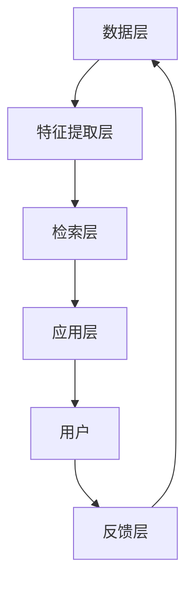

                 


# AI Agent的跨模态检索能力开发

---

## 关键词：AI Agent, 跨模态检索, 多模态数据, 机器学习, 智能检索

---

## 摘要

随着人工智能技术的快速发展，AI Agent（智能体）逐渐成为实现智能化系统的核心技术。在实际应用场景中，AI Agent需要具备处理和检索多模态数据的能力，即跨模态检索能力。本文将从AI Agent的基本概念出发，深入分析跨模态检索的核心原理、算法实现、系统架构设计以及实际开发中的关键问题，通过案例分析和代码实现，帮助读者全面理解AI Agent的跨模态检索能力开发。

---

# 第1章 AI Agent与跨模态检索概述

## 1.1 AI Agent的基本概念

### 1.1.1 AI Agent的定义与特点

AI Agent（人工智能代理）是指能够感知环境、自主决策并执行任务的智能实体。与传统程序不同，AI Agent具备以下特点：

1. **自主性**：能够在没有外部干预的情况下独立运行。
2. **反应性**：能够实时感知环境变化并做出响应。
3. **目标导向性**：具备明确的目标，并通过行为选择实现目标。
4. **学习能力**：能够通过数据和经验不断优化自身的性能。

### 1.1.2 AI Agent的核心能力

AI Agent的核心能力包括以下几个方面：

1. **感知能力**：通过传感器或数据接口获取环境信息。
2. **决策能力**：基于感知信息做出最优决策。
3. **执行能力**：通过执行机构或API实现目标。
4. **学习能力**：通过机器学习算法优化自身的性能。

### 1.1.3 跨模态检索的定义与背景

跨模态检索是指在不同数据模态（如文本、图像、语音、视频等）之间进行信息检索的过程。例如，用户可以通过输入一段文本描述，检索与之相关的图像或视频内容。跨模态检索的核心在于建立不同模态数据之间的关联关系。

---

## 1.2 跨模态检索的背景与意义

### 1.2.1 跨模态检索的定义

跨模态检索是多模态计算的核心任务之一，旨在通过一种模态的信息检索另一种模态的相关数据。例如，通过输入一段文本，检索与之相关的图像或视频内容。

### 1.2.2 跨模态检索的核心问题

跨模态检索的核心问题包括：

1. **模态差异性**：不同模态的数据具有不同的特征空间，如何建立它们之间的映射关系是关键。
2. **语义一致性**：如何确保检索结果与查询内容在语义上保持一致。
3. **检索效率**：在大规模数据集上实现高效的检索能力。

### 1.2.3 跨模态检索在AI Agent中的应用

在AI Agent中，跨模态检索能力可以广泛应用于以下场景：

1. **智能搜索**：通过文本查询检索相关图像或视频。
2. **智能推荐**：根据用户输入的文本推荐相关的产品或内容。
3. **人机交互**：通过语音或图像输入实现更自然的交互方式。

---

## 1.3 本章小结

本章从AI Agent的基本概念出发，介绍了其核心能力和目标导向性。随后，重点阐述了跨模态检索的定义、核心问题以及在AI Agent中的应用场景。通过本章的学习，读者可以初步理解AI Agent的跨模态检索能力的重要性及其在实际应用中的潜力。

---

# 第2章 跨模态检索的核心概念

## 2.1 跨模态检索的关键技术

### 2.1.1 多模态数据的表示方法

多模态数据的表示方法是跨模态检索的核心技术之一。常见的表示方法包括：

1. **模态嵌入**：将不同模态的数据映射到一个共同的特征空间。
2. **联合学习**：通过联合学习模型同时优化多种模态的特征表示。
3. **多模态融合**：将多种模态的信息进行融合，形成更丰富的特征表示。

### 2.1.2 跨模态相似度计算

跨模态相似度计算是衡量不同模态数据之间相关性的关键步骤。常用的相似度计算方法包括：

1. **余弦相似度**：衡量两个向量在方向上的相似程度。
2. **欧氏距离**：衡量两个向量在空间中的距离。
3. **对比学习**：通过学习数据之间的相似性或差异性来优化特征表示。

### 2.1.3 跨模态检索的评价指标

跨模态检索的评价指标用于衡量检索系统的效果。常用的评价指标包括：

1. **准确率（Precision）**：检索结果中相关项的比例。
2. **召回率（Recall）**：检索结果中相关项的比例。
3. **F1分数**：准确率和召回率的调和平均值。
4. **平均倒置位置（MAP）**：平均检索结果中相关项的位置。

---

## 2.2 跨模态检索的实现流程

### 2.2.1 数据预处理

数据预处理是跨模态检索的第一步，主要包括以下内容：

1. **数据清洗**：去除噪声数据，确保数据质量。
2. **数据对齐**：将不同模态的数据对齐到同一时间或空间参考系。
3. **数据增强**：通过数据增强技术（如旋转、裁剪等）提高数据的多样性。

### 2.2.2 特征提取

特征提取是将多模态数据转换为特征向量的过程。常用的特征提取方法包括：

1. **基于深度学习的特征提取**：如使用卷积神经网络（CNN）提取图像特征，使用循环神经网络（RNN）提取文本特征。
2. **基于词嵌入的特征提取**：如使用Word2Vec或BERT模型提取文本特征。
3. **基于自监督学习的特征提取**：通过自监督学习任务（如对比学习）优化特征表示。

### 2.2.3 相似度计算与排序

在特征提取的基础上，计算不同模态数据之间的相似度，并对检索结果进行排序。常用的相似度计算方法包括：

1. **余弦相似度**：衡量两个向量在方向上的相似程度。
2. **欧氏距离**：衡量两个向量在空间中的距离。
3. **对比学习**：通过学习数据之间的相似性或差异性来优化特征表示。

---

## 2.3 跨模态检索的核心要素对比

### 2.3.1 数据模态对比

不同模态的数据具有不同的特征空间，以下是几种常见模态的对比：

| 模态类型 | 特征维度 | 优点 | 缺点 |
|----------|----------|------|------|
| 文本      | 词向量、句向量 | 表达能力强 | 易受语义歧义影响 |
| 图像      | 像素、特征向量 | 特征清晰 | 易受光照、视角影响 |
| 语音      | 频率、时域特征 | 实时性高 | 易受噪声影响 |

### 2.3.2 特征表示对比

不同特征表示方法的优缺点对比：

| 特征表示方法 | 优点 | 缺点 |
|--------------|------|------|
| 模态嵌入      | 易于对齐 | 易受模态差异影响 |
| 联合学习      | 融合多模态信息 | 实现复杂 |
| 多模态融合    | 特征丰富 | 计算开销高 |

### 2.3.3 检索算法对比

常用检索算法的对比：

| 检索算法 | 优点 | 缺点 |
|----------|------|------|
| 基于余弦相似度 | 实现简单 | 易受数据分布影响 |
| 基于欧氏距离 | 考虑数据分布 | 实现复杂 |
| 对比学习     | 优化特征表示 | 需要大量标注数据 |

---

## 2.4 本章小结

本章详细介绍了跨模态检索的核心概念，包括关键技术、实现流程以及核心要素的对比。通过本章的学习，读者可以理解跨模态检索的基本原理及其在实际应用中的挑战。

---

# 第3章 跨模态检索的算法原理

## 3.1 跨模态检索的数学模型

### 3.1.1 多模态嵌入模型

多模态嵌入模型通过将不同模态的数据映射到一个共同的特征空间，实现跨模态检索。常用的多模态嵌入模型包括：

1. **双塔模型**：将不同模态的数据分别映射到两个独立的嵌入空间，通过对比学习优化两个嵌入空间的对齐。
2. **单塔模型**：将所有模态的数据映射到同一个嵌入空间，简化检索过程。

### 3.1.2 对比学习模型

对比学习是一种通过学习数据之间的相似性或差异性来优化特征表示的方法。常用的对比学习模型包括：

1. **InfoNCE**：通过最大化正样本的相似性来优化特征表示。
2. **SimCLR**：通过对比损失函数优化特征表示。

### 3.1.3 图结构模型

图结构模型通过构建图结构将不同模态的数据连接起来，实现跨模态检索。常用的图结构模型包括：

1. **异构图网络**：将不同模态的数据节点连接起来，通过图卷积网络（GCN）优化特征表示。
2. **知识图谱嵌入**：通过知识图谱将不同模态的数据关联起来，优化特征表示。

---

## 3.2 跨模态检索的算法流程

### 3.2.1 数据输入与预处理

跨模态检索的算法流程如下：

1. **数据输入**：接收多种模态的数据输入，如文本、图像等。
2. **数据预处理**：对输入数据进行清洗、对齐和增强。
3. **特征提取**：通过深度学习模型提取数据的特征向量。
4. **相似度计算**：计算不同模态数据之间的相似度。
5. **检索与排序**：根据相似度对检索结果进行排序，输出最终结果。

### 3.2.2 特征提取与表示

特征提取与表示是跨模态检索的核心步骤，常用的特征提取方法包括：

1. **文本特征提取**：使用BERT模型提取文本的句向量。
2. **图像特征提取**：使用ResNet模型提取图像的特征向量。
3. **语音特征提取**：使用Mel-Frequency Cepstral Coefficients（MFCC）提取语音特征。

### 3.2.3 相似度计算与检索

在特征提取的基础上，计算不同模态数据之间的相似度，并根据相似度对检索结果进行排序。常用的相似度计算方法包括：

1. **余弦相似度**：
$$ \text{余弦相似度} = \frac{\mathbf{u} \cdot \mathbf{v}}{|\mathbf{u}| \cdot |\mathbf{v}|} $$
2. **欧氏距离**：
$$ \text{欧氏距离} = \sqrt{\sum_{i=1}^{n} (u_i - v_i)^2} $$

---

## 3.3 跨模态检索的数学公式

### 3.3.1 对比学习的损失函数

对比学习的损失函数用于优化特征表示的相似性。常用的对比学习损失函数包括：

1. **InfoNCE损失**：
$$ \mathcal{L} = -\frac{1}{N}\sum_{i=1}^{N} \log \frac{\exp(\mathbf{q}_i^\top \mathbf{k}_i)}{\sum_{j=1}^{N} \exp(\mathbf{q}_i^\top \mathbf{k}_j)}} $$

2. **SimCLR损失**：
$$ \mathcal{L} = -\mathbb{E}_{i,j}[\log \text{Sim}(\mathbf{q}_i, \mathbf{k}_j)] $$

其中，$\text{Sim}(\mathbf{q}_i, \mathbf{k}_j) = \frac{\mathbf{q}_i^\top \mathbf{k}_j}{|\mathbf{q}_i| \cdot |\mathbf{k}_j|}$ 表示余弦相似度。

---

## 3.4 本章小结

本章从数学模型的角度详细介绍了跨模态检索的核心算法，包括多模态嵌入模型、对比学习模型以及图结构模型。通过本章的学习，读者可以理解跨模态检索的算法实现及其数学原理。

---

# 第4章 跨模态检索的系统分析与架构设计

## 4.1 系统功能设计

跨模态检索系统的功能设计包括以下几个方面：

1. **数据输入与预处理**：接收多种模态的数据输入，并进行清洗、对齐和增强。
2. **特征提取与表示**：通过深度学习模型提取数据的特征向量。
3. **相似度计算与检索**：计算不同模态数据之间的相似度，并根据相似度对检索结果进行排序。
4. **结果输出与反馈**：输出检索结果，并根据用户反馈优化检索性能。

### 4.1.1 系统功能模块

跨模态检索系统的功能模块包括：

- 数据输入模块
- 数据预处理模块
- 特征提取模块
- 相似度计算模块
- 检索结果排序模块
- 结果输出模块

### 4.1.2 功能模块的交互流程

跨模态检索系统的交互流程如下：

1. 用户输入查询请求。
2. 数据输入模块接收输入数据，并将其传递给数据预处理模块。
3. 数据预处理模块对输入数据进行清洗、对齐和增强。
4. 特征提取模块对预处理后的数据进行特征提取，生成特征向量。
5. 相似度计算模块计算不同模态数据之间的相似度。
6. 检索结果排序模块根据相似度对检索结果进行排序。
7. 结果输出模块输出最终的检索结果。

---

## 4.2 系统架构设计

### 4.2.1 系统架构设计

跨模态检索系统的架构设计包括以下几个部分：

- **数据层**：存储多模态数据，如文本、图像、语音等。
- **特征提取层**：通过深度学习模型提取数据的特征向量。
- **检索层**：计算不同模态数据之间的相似度，并根据相似度对检索结果进行排序。
- **应用层**：输出检索结果，并提供用户反馈接口。

### 4.2.2 系统架构图

以下是一个跨模态检索系统的架构图：



---

## 4.3 系统接口设计

跨模态检索系统的接口设计包括以下几个方面：

1. **数据输入接口**：接收多种模态的数据输入。
2. **特征提取接口**：对输入数据进行特征提取。
3. **相似度计算接口**：计算不同模态数据之间的相似度。
4. **检索结果排序接口**：根据相似度对检索结果进行排序。
5. **结果输出接口**：输出最终的检索结果。

---

## 4.4 本章小结

本章从系统架构设计的角度详细介绍了跨模态检索系统的功能模块、交互流程以及架构图。通过本章的学习，读者可以理解跨模态检索系统的整体设计及其各部分的协同工作方式。

---

# 第5章 跨模态检索的项目实战

## 5.1 项目背景与目标

### 5.1.1 项目背景

本项目旨在开发一个支持跨模态检索的AI Agent系统，能够通过文本查询检索相关图像或视频内容。

### 5.1.2 项目目标

通过本项目，读者可以掌握以下技能：

1. **数据预处理**：清洗、对齐和增强多模态数据。
2. **特征提取**：使用深度学习模型提取文本和图像的特征向量。
3. **相似度计算**：计算文本与图像之间的相似度。
4. **检索与排序**：根据相似度对检索结果进行排序。

---

## 5.2 项目开发环境

### 5.2.1 环境配置

以下是项目开发环境的配置要求：

1. **操作系统**：Linux/MacOS/Windows
2. **Python版本**：3.6+
3. **深度学习框架**：TensorFlow/PyTorch
4. **文本处理库**：nltk/spacy
5. **图像处理库**：OpenCV
6. **模型权重**：预训练的BERT模型和ResNet模型

---

## 5.3 系统核心实现

### 5.3.1 数据预处理

以下是数据预处理的代码实现：

```python
import numpy as np
from tensorflow.keras.preprocessing import text
from tensorflow.keras.preprocessing import sequence

# 文本数据预处理
def preprocess_text(text, max_length=512):
    tokenizer = text.Tokenizer(num_words=10000)
    tokenizer.fit_on_texts([text])
    text_sequences = tokenizer.texts_to_sequences([text])[0]
    text_sequences = sequence.pad_sequences([text_sequences], maxlen=max_length)
    return text_sequences

# 图像数据预处理
def preprocess_image(image_path):
    import cv2
    image = cv2.imread(image_path)
    image = cv2.resize(image, (224, 224))
    image = image / 255.0
    return image
```

### 5.3.2 特征提取

以下是特征提取的代码实现：

```python
import tensorflow as tf
from tensorflow.keras.layers import Dense, GlobalAveragePooling2D
from tensorflow.keras.applications import ResNet50

# 文本特征提取
def extract_text_features(text, model):
    text_sequences = preprocess_text(text)
    text_features = model.predict(text_sequences)
    return text_features

# 图像特征提取
def extract_image_features(image, model):
    image = preprocess_image(image)
    image = tf.expand_dims(image, axis=0)
    image_features = model.predict(image)
    return image_features

# 加载预训练模型
text_model = tf.keras.Sequential([
    tf.keras.layers.Dense(128, activation='relu'),
    tf.keras.layers.Dense(64, activation='relu'),
    tf.keras.layers.Dense(32, activation='relu')
])

image_model = ResNet50(weights='imagenet', include_top=False)
image_model = tf.keras.Sequential([
    image_model,
    GlobalAveragePooling2D(),
    Dense(128, activation='relu'),
    Dense(64, activation='relu'),
    Dense(32, activation='relu')
])
```

### 5.3.3 相似度计算与检索

以下是相似度计算与检索的代码实现：

```python
import numpy as np

def compute_similarity(text_features, image_features):
    text_features = text_features.reshape(-1)
    image_features = image_features.reshape(-1)
    similarity = np.dot(text_features, image_features) / (np.linalg.norm(text_features) * np.linalg.norm(image_features))
    return similarity

def retrieve_results(text_features, image_features, threshold=0.5):
    similarities = compute_similarity(text_features, image_features)
    results = []
    for i, similarity in enumerate(similarities):
        if similarity > threshold:
            results.append(i)
    return results
```

---

## 5.4 项目总结

通过本项目，读者可以掌握跨模态检索的核心技术，包括数据预处理、特征提取、相似度计算与检索。同时，通过实际代码实现，读者可以加深对跨模态检索算法的理解。

---

# 第6章 跨模态检索开发中的最佳实践

## 6.1 关键技术总结

### 6.1.1 数据预处理

数据预处理是跨模态检索的第一步，主要包括数据清洗、对齐和增强。数据预处理的好坏直接影响检索系统的性能。

### 6.1.2 特征提取

特征提取是跨模态检索的核心步骤，常用的特征提取方法包括模态嵌入、联合学习和多模态融合。在实际开发中，需要根据具体场景选择合适的特征提取方法。

### 6.1.3 相似度计算

相似度计算是跨模态检索的关键步骤，常用的相似度计算方法包括余弦相似度、欧氏距离和对比学习。在实际开发中，需要根据具体需求选择合适的相似度计算方法。

---

## 6.2 开发中的注意事项

### 6.2.1 数据质量

数据质量是跨模态检索系统性能的关键因素。在实际开发中，需要确保输入数据的质量，避免噪声数据对检索结果的影响。

### 6.2.2 模型优化

模型优化是跨模态检索系统性能优化的核心。在实际开发中，需要通过数据增强、模型调参等方式优化模型性能。

### 6.2.3 系统效率

系统效率是跨模态检索系统实用性的关键因素。在实际开发中，需要通过优化算法、减少计算复杂度等方式提高系统效率。

---

## 6.3 小结

通过本章的学习，读者可以掌握跨模态检索开发中的关键技术与注意事项，为实际项目开发提供宝贵的参考。

---

# 作者：AI天才研究院/AI Genius Institute & 禅与计算机程序设计艺术 /Zen And The Art of Computer Programming

---

希望这篇技术博客能够帮助读者全面理解AI Agent的跨模态检索能力开发的核心技术与实际应用。

