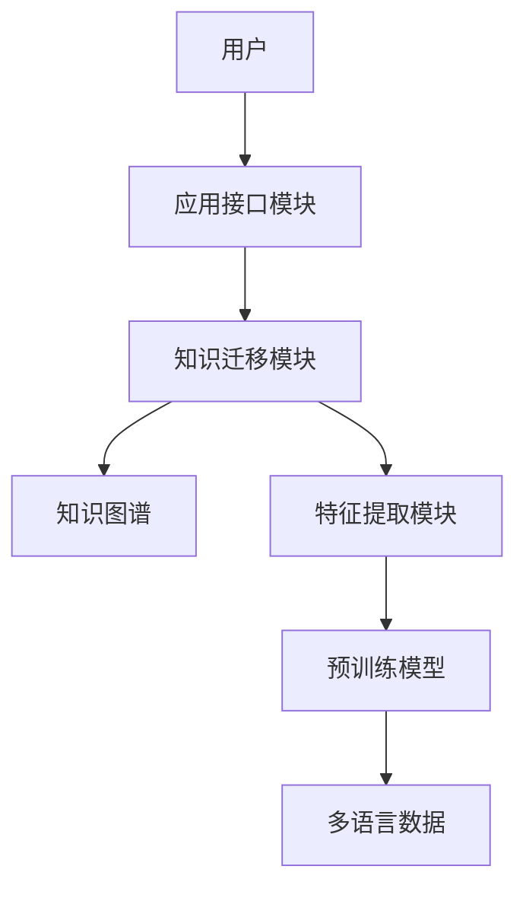

                 


# AI Agent的跨语言知识迁移技术

## 关键词：AI Agent，跨语言知识迁移，多语言模型，知识图谱，迁移学习

## 摘要：  
AI Agent的跨语言知识迁移技术是一种利用机器学习和自然语言处理技术，使得AI代理能够理解和迁移不同语言之间的知识，从而实现多语言环境下知识共享与应用的技术。本文将从背景、核心概念、算法原理、系统架构、项目实战到最佳实践等方面，全面解析AI Agent的跨语言知识迁移技术，为读者提供深入的技术解读和实践指导。

---

# 第一部分: AI Agent的跨语言知识迁移技术背景介绍

## 第1章: AI Agent与跨语言知识迁移概述

### 1.1 AI Agent的基本概念

#### 1.1.1 AI Agent的定义与特点
AI Agent（人工智能代理）是指能够感知环境、自主决策并执行任务的智能体。AI Agent的核心特点包括：
- **自主性**：能够在无外部干预的情况下自主运行。
- **反应性**：能够实时感知环境并做出响应。
- **目标导向性**：基于目标驱动行为和决策。
- **学习能力**：通过数据和经验不断优化自身性能。

#### 1.1.2 AI Agent的核心功能与应用场景
AI Agent的核心功能包括：
- **信息处理**：从多源异构数据中提取、分析和理解信息。
- **知识表示**：将知识以结构化形式存储并进行推理。
- **决策与执行**：基于知识和环境反馈做出决策并执行任务。

AI Agent的应用场景广泛，包括智能客服、智能助手、机器人控制、推荐系统等。

#### 1.1.3 跨语言知识迁移的背景与意义
随着全球化的发展，AI Agent需要在多语言环境下工作，跨语言知识迁移技术成为关键。通过跨语言知识迁移，AI Agent能够理解不同语言之间的语义关联，实现知识的共享与复用，从而提升多语言环境下的智能水平。

### 1.2 跨语言知识迁移的背景与意义

#### 1.2.1 多语言环境下的知识共享需求
在多语言环境下，知识往往分散在不同语言的资源中。跨语言知识迁移技术能够将这些分散的知识进行整合和共享，避免重复劳动和信息孤岛。

#### 1.2.2 跨语言知识迁移的技术挑战
跨语言知识迁移面临以下技术挑战：
- **语言差异**：不同语言的语法、词汇和语义差异可能导致知识难以直接迁移。
- **数据稀疏性**：某些语言的数据量有限，导致迁移效果受限。
- **模型适应性**：需要设计能够适应多种语言的模型架构和算法。

#### 1.2.3 跨语言知识迁移的应用价值
跨语言知识迁移技术的应用价值体现在以下几个方面：
- **提升多语言AI系统的性能**：通过跨语言知识迁移，AI系统能够更好地理解多种语言的语义，提升准确性。
- **降低开发成本**：跨语言知识迁移可以减少重复开发多语言模型的工作量。
- **支持全球化应用**：跨语言知识迁移技术为AI Agent在全球化应用中的跨语言交互提供了技术支撑。

## 第2章: 跨语言知识迁移的核心概念与联系

### 2.1 跨语言知识迁移的基本原理

#### 2.1.1 知识表示与跨语言映射
知识表示是跨语言知识迁移的基础。通过将知识表示为一种通用的形式（如向量或符号），可以实现不同语言之间的知识对齐。跨语言映射的目标是将一种语言的知识表示映射到另一种语言，使得两种语言的知识可以相互关联和利用。

#### 2.1.2 跨语言特征提取与对齐
跨语言特征提取是通过自然语言处理技术（如词嵌入、句法分析）从不同语言中提取特征，并通过对比学习等方法实现特征对齐。特征对齐的关键在于找到不同语言中具有相似语义的特征。

#### 2.1.3 知识图谱的构建与迁移
知识图谱是一种结构化的知识表示形式，能够将实体及其关系以图的形式表示。跨语言知识迁移可以通过构建多语言知识图谱，将不同语言的知识整合到一个统一的知识图谱中，实现知识的跨语言共享。

### 2.2 核心概念对比与ER实体关系图

#### 2.2.1 跨语言知识迁移的核心概念对比表
以下是对跨语言知识迁移中几个核心概念的对比：

| 概念       | 特征描述                                                                 |
|------------|--------------------------------------------------------------------------|
| 知识表示     | 将知识以某种形式（如向量、符号）表示，以便计算机理解和处理。                     |
| 跨语言映射   | 将一种语言的知识表示映射到另一种语言，实现跨语言关联。                         |
| 知识图谱     | 结构化的知识表示形式，包含实体及其关系。                                     |
| 对比学习     | 通过对比不同语言的特征，实现特征对齐和知识迁移。                             |

#### 2.2.2 知识迁移的ER实体关系图
以下是一个简单的ER实体关系图，展示了跨语言知识迁移中的核心实体及其关系：

```mermaid
er
    actor: 用户
    knowledge_base: 知识库
    language_model: 多语言模型
    migration_module: 知识迁移模块
    relationship: 关联
    actor --> knowledge_base: 查询知识
    knowledge_base --> language_model: 提供语言支持
    knowledge_base --> migration_module: 提供知识源
    language_model --> migration_module: 提供语言特征
    migration_module --> knowledge_base: 返回迁移后知识
```

---

# 第二部分: 跨语言知识迁移的核心算法与技术实现

## 第3章: 跨语言知识迁移的算法原理

### 3.1 跨语言知识迁移的核心算法

#### 3.1.1 基于预训练模型的迁移方法
预训练模型（如BERT、GPT）是跨语言知识迁移的重要工具。通过利用预训练模型的多语言能力，可以实现跨语言特征提取和语义对齐。

#### 3.1.2 对比学习与知识对齐
对比学习是一种有效的特征对齐方法。通过将不同语言的特征表示映射到同一空间，并计算特征之间的相似性，可以实现知识的跨语言对齐。

#### 3.1.3 知识图谱的构建与推理
知识图谱的构建是跨语言知识迁移的关键步骤。通过从多语言数据中提取实体及其关系，并建立统一的知识图谱，可以实现跨语言知识的共享与推理。

### 3.2 跨语言知识迁移的数学模型与公式

#### 3.2.1 对比学习的目标函数
对比学习的目标是最小化同一类别的特征表示之间的距离，最大化不同类别特征表示之间的距离。目标函数可以表示为：

$$ L = -\sum_{i,j} \log(\text{sim}(x_i, x_j)) $$

其中，$x_i$ 和 $x_j$ 分别是两种不同语言的特征表示，$\text{sim}$ 表示相似度计算函数。

#### 3.2.2 知识图谱的构建模型
知识图谱的构建可以通过图嵌入模型（如TransE、TransH）来实现。TransE模型的损失函数可以表示为：

$$ L = \sum_{(h,r,t) \in \text{train}} \left\| h + r - t \right\|^2 $$

其中，$h$ 是头实体的嵌入向量，$r$ 是关系的嵌入向量，$t$ 是尾实体的嵌入向量。

---

## 第4章: 跨语言知识迁移的系统架构与实现

### 4.1 跨语言知识迁移系统的功能模块

#### 4.1.1 数据预处理模块
数据预处理模块负责对多语言数据进行清洗、分词、标注等预处理操作，为后续的特征提取和知识迁移提供高质量的数据。

#### 4.1.2 特征提取模块
特征提取模块利用预训练模型提取多语言特征表示，并通过对比学习实现特征对齐。

#### 4.1.3 知识迁移模块
知识迁移模块负责将特征表示映射到知识图谱，并构建统一的多语言知识图谱。

#### 4.1.4 应用接口模块
应用接口模块提供API接口，供上层应用调用跨语言知识迁移功能。

### 4.2 跨语言知识迁移系统的架构图



---

## 第5章: 跨语言知识迁移技术的项目实战

### 5.1 项目环境与工具安装

#### 5.1.1 环境配置
建议使用Python 3.8及以上版本，安装以下工具：
- `transformers`：用于加载预训练模型。
- `networkx`：用于构建知识图谱。
- `scikit-learn`：用于对比学习和特征处理。

#### 5.1.2 安装依赖
在终端中运行以下命令安装依赖：
```bash
pip install transformers networkx scikit-learn
```

### 5.2 核心代码实现

#### 5.2.1 数据预处理代码
```python
from transformers import AutoTokenizer, AutoModel
import torch

# 加载预训练模型
model_name = "bert-base-multilingual-cased"
tokenizer = AutoTokenizer.from_pretrained(model_name)
model = AutoModel.from_pretrained(model_name)

# 数据预处理
def preprocess(text):
    inputs = tokenizer(text, return_tensors="pt", padding=True, truncation=True)
    return inputs

text = "This is a test sentence."
inputs = preprocess(text)
```

#### 5.2.2 对比学习与特征对齐代码
```python
import torch.nn as nn
import torch.optim as optim

# 对比学习模型
class Contrastive Learner:
    def __init__(self, encoder, temperature=0.1):
        self.encoder = encoder
        self.temperature = temperature
        self.loss_fn = nn.CrossEntropyLoss()

    def forward(self, x1, x2):
        # 计算特征表示
        h1 = self.encoder(x1)
        h2 = self.encoder(x2)
        # 计算相似度
        similarity = torch.mm(h1, h2.t())
        # 对比学习目标函数
        target = torch.arange(len(h1), device=h1.device).long()
        loss = self.loss_fn(similarity, target)
        return loss

    def step(self, x1, x2, optimizer):
        optimizer.zero_grad()
        loss = self.forward(x1, x2)
        loss.backward()
        optimizer.step()
        return loss.item()

# 初始化优化器
optimizer = optim.Adam(model.parameters(), lr=1e-5)
learner = ContrastiveLearner(model)

# 开始训练
for batch in batches:
    optimizer.zero_grad()
    loss = learner(batch.x1, batch.x2)
    optimizer.step()
```

---

## 第6章: 跨语言知识迁移技术的最佳实践与小结

### 6.1 最佳实践

#### 6.1.1 数据质量的重要性
数据质量直接影响跨语言知识迁移的效果。建议使用高质量的多语言数据，并进行充分的数据清洗和预处理。

#### 6.1.2 模型选择与调优
选择合适的预训练模型，并根据实际任务进行模型调优。对于小样本数据，可以采用数据增强技术提升模型性能。

#### 6.1.3 知识图谱的构建与维护
构建高质量的知识图谱是跨语言知识迁移成功的关键。需要定期更新和维护知识图谱，以确保知识的准确性和完整性。

### 6.2 小结

跨语言知识迁移技术是AI Agent在多语言环境下实现智能交互的重要技术。通过本文的介绍，读者可以深入了解跨语言知识迁移的核心概念、算法原理和系统架构，并通过项目实战掌握其实现方法。未来，随着多语言自然语言处理技术的不断发展，跨语言知识迁移技术将在更多领域得到广泛应用。

---

## 作者：AI天才研究院/AI Genius Institute & 禅与计算机程序设计艺术 /Zen And The Art of Computer Programming

