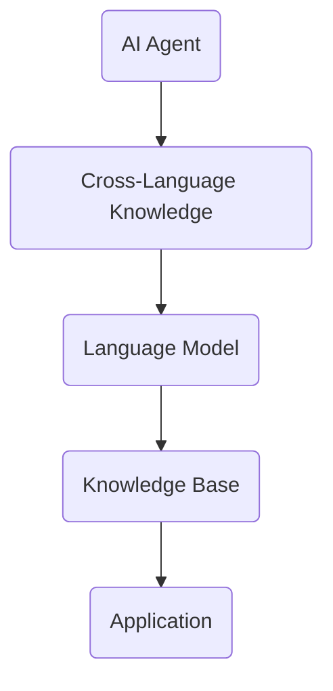

                 

# AI Agent的跨语言知识迁移技术

> 关键词：AI Agent, 跨语言知识迁移, 知识图谱, 自然语言处理, 迁移学习, 多语言模型

> 摘要：AI Agent作为人工智能领域的重要技术，其跨语言知识迁移能力是实现多语言环境下智能体高效知识处理的关键。本文详细探讨了AI Agent在跨语言知识迁移中的核心概念、算法原理、系统架构以及实际应用，通过理论与实践相结合的方式，为读者提供全面的技术解析。

---

# 第1章: AI Agent与跨语言知识迁移的背景介绍

## 1.1 问题背景与问题描述

### 1.1.1 AI Agent的基本概念
AI Agent（人工智能代理）是指在计算机系统中能够感知环境并采取行动以实现目标的智能实体。AI Agent可以通过传感器接收信息，利用推理和决策能力执行任务，并通过效应器与环境交互。例如，智能音箱、推荐系统和自动驾驶中的决策模块都是典型的AI Agent应用。

### 1.1.2 跨语言知识迁移的核心问题
在多语言环境下，AI Agent需要处理来自不同语言的知识和信息。由于不同语言的语法、语义和文化背景差异，直接应用单一语言模型会导致知识断层和信息损失。例如，在跨语言对话系统中，用户可能使用多种语言提问，AI Agent需要能够理解并准确回答，这就需要跨语言知识迁移技术的支持。

### 1.1.3 当前技术的痛点与挑战
当前AI Agent在跨语言知识迁移中面临以下痛点：
1. **知识表示的多样性**：不同语言的知识表示方式不同，如何统一表示是一个挑战。
2. **跨语言推理的复杂性**：跨语言推理需要同时处理多种语言的语义信息，增加了计算复杂度。
3. **数据稀缺性**：某些小语种的数据量有限，如何在数据不足的情况下实现有效的知识迁移是难点。

---

## 1.2 问题解决思路与技术路线

### 1.2.1 跨语言知识迁移的目标
跨语言知识迁移的目标是实现知识在不同语言之间的无缝转换和共享，使得AI Agent能够理解和运用多语言知识。

### 1.2.2 AI Agent在跨语言中的作用
AI Agent在跨语言知识迁移中的作用包括：
1. **知识抽取**：从多语言文本中提取通用知识。
2. **跨语言映射**：将一种语言的知识映射到另一种语言。
3. **知识整合**：将不同语言的知识整合到统一的知识图谱中。

### 1.2.3 技术实现的总体思路
1. **多语言语料库构建**：收集和整理多语言文本数据。
2. **知识抽取与表示**：利用NLP技术从多语言文本中提取知识并表示为通用形式。
3. **跨语言映射算法设计**：开发算法实现不同语言知识之间的映射。
4. **知识整合与推理**：将跨语言知识整合到统一的知识图谱中，并支持跨语言推理。

---

## 1.3 边界与外延

### 1.3.1 跨语言知识迁移的边界
1. **语言范围**：限定在特定语言范围内，如中英文双语场景。
2. **知识深度**：仅支持浅层知识迁移，不涉及复杂语义推理。
3. **应用场景**：限于特定领域，如客服、教育和电子商务。

### 1.3.2 AI Agent能力的限制
1. **计算资源限制**：大规模跨语言知识迁移需要大量计算资源。
2. **语料质量**：依赖高质量的多语言语料库。
3. **文化差异**：无法完全消除语言背后的文化差异影响。

### 1.3.3 相关领域的关联与区别
跨语言知识迁移与机器翻译、跨语言检索和多语言模型有区别，但都涉及多语言处理。其区别在于，跨语言知识迁移更关注知识的共享和整合，而不仅仅是语言的转换。

---

## 1.4 核心概念结构与组成

### 1.4.1 AI Agent的组成要素
AI Agent的组成要素包括：
1. **感知模块**：接收多语言输入并解析。
2. **知识库**：存储多语言知识。
3. **推理引擎**：进行跨语言推理。
4. **决策模块**：基于推理结果做出决策。

### 1.4.2 跨语言知识迁移的核心要素
1. **多语言语料库**：提供跨语言知识的基础数据。
2. **知识抽取模型**：从多语言文本中提取知识。
3. **跨语言映射算法**：实现知识的跨语言转换。
4. **知识图谱**：存储和整合跨语言知识。

### 1.4.3 两者的相互关系
AI Agent通过感知模块接收多语言输入，利用跨语言知识迁移技术在知识库中进行跨语言推理，最终通过决策模块输出结果。跨语言知识迁移是AI Agent实现多语言能力的核心技术。

---

## 1.5 本章小结
本章从背景出发，详细介绍了AI Agent和跨语言知识迁移的核心概念、目标、技术路线及其相互关系。通过分析当前技术的痛点与挑战，为后续章节的深入探讨奠定了基础。

---

# 第2章: AI Agent与跨语言知识迁移的核心概念

## 2.1 核心概念原理

### 2.1.1 AI Agent的基本原理
AI Agent通过感知环境、处理信息和采取行动来实现目标。其核心原理包括：
1. **感知**：通过传感器接收多语言输入。
2. **推理**：基于知识库进行跨语言推理。
3. **决策**：根据推理结果做出最优决策。
4. **执行**：通过效应器执行行动。

### 2.1.2 跨语言知识迁移的实现机制
跨语言知识迁移的实现机制包括：
1. **知识抽取**：从多语言文本中提取实体、关系和事件。
2. **跨语言映射**：将一种语言的知识映射到另一种语言。
3. **知识整合**：将不同语言的知识整合到统一的知识图谱中。

### 2.1.3 两者的结合方式
AI Agent与跨语言知识迁移的结合方式包括：
1. **嵌入式结合**：将跨语言知识迁移技术嵌入AI Agent的核心模块。
2. **模块化结合**：将跨语言知识迁移作为一个独立模块与AI Agent集成。

---

## 2.2 核心概念属性对比

### 表2-1: AI Agent与跨语言知识迁移的属性对比

| 属性         | AI Agent                          | 跨语言知识迁移                     |
|--------------|-----------------------------------|------------------------------------|
| 核心功能      | 感知、推理、决策、执行           | 知识抽取、映射、整合               |
| 输入          | 多语言输入                       | 多语言文本数据                     |
| 输出          | 多语言输出                       | 统一知识图谱                       |
| 技术难点      | 多语言推理与决策                | 跨语言知识表示与映射               |
| 应用场景      | 多语言对话、推荐系统、智能助手   | 跨语言检索、知识共享、多语言NLP   |

---

## 2.3 ER实体关系图

---

## 2.4 本章小结
本章详细探讨了AI Agent与跨语言知识迁移的核心概念及其相互关系，通过属性对比和实体关系图，帮助读者更好地理解两者的结合方式和技术实现。

---

接下来，我将继续撰写后续章节的内容，涵盖算法原理、系统架构、项目实战和最佳实践。通过理论与实践相结合的方式，为读者提供全面的技术解析。

