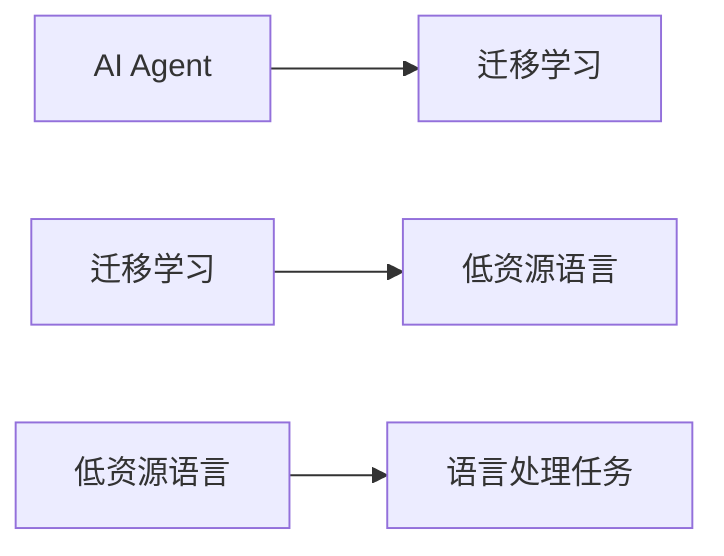
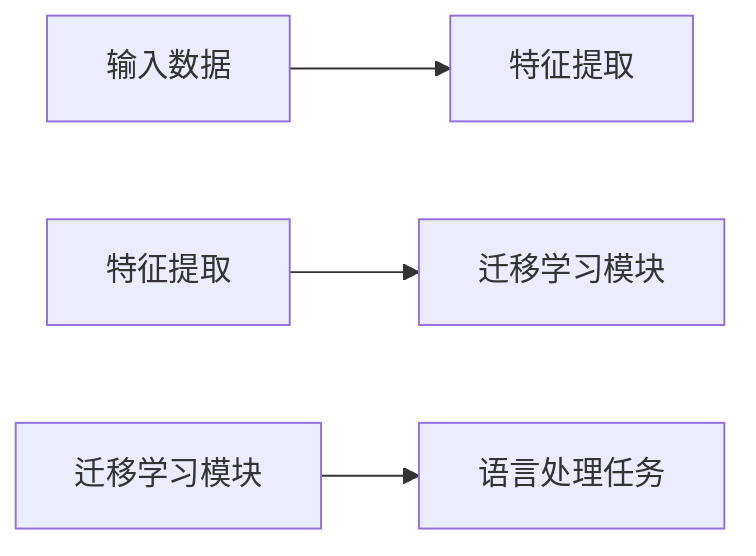
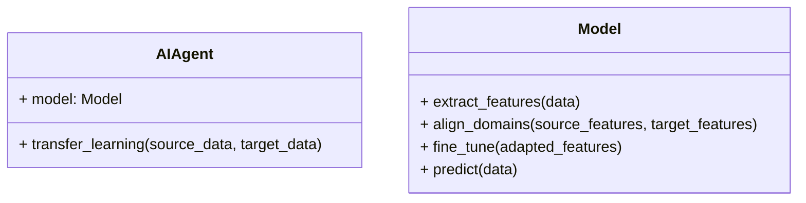
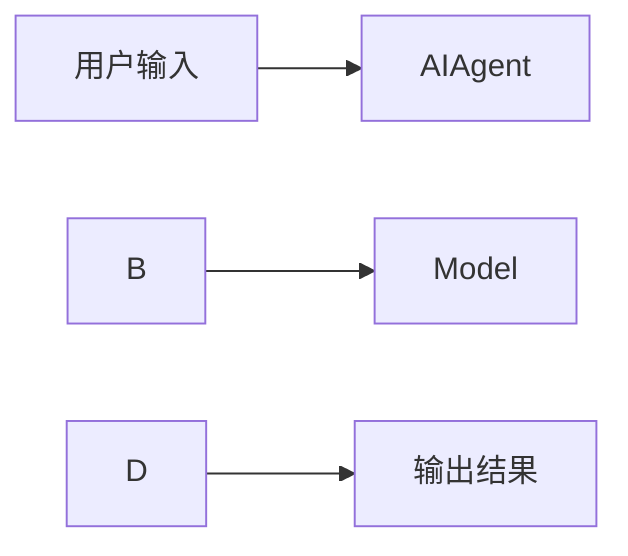
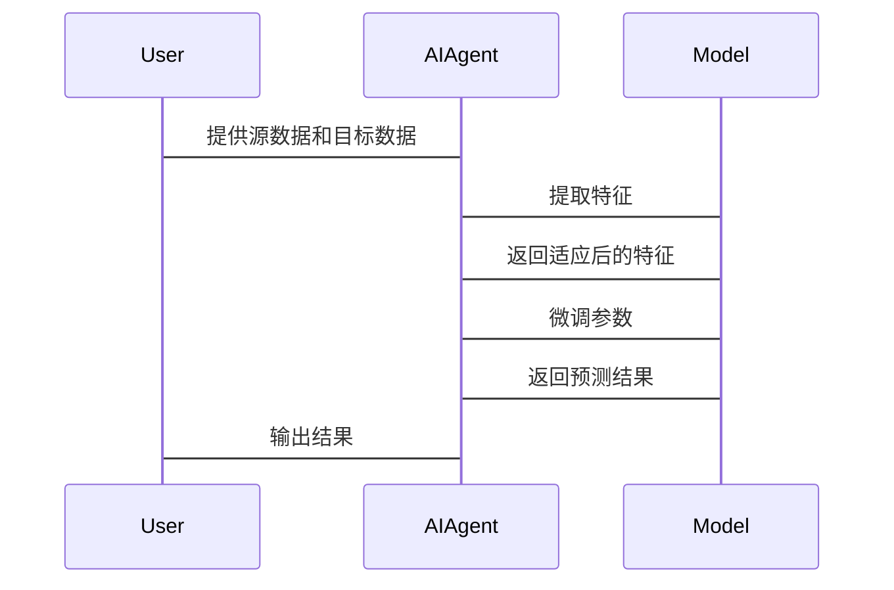

                 


---

# AI Agent的迁移学习在低资源语言处理中的应用

> **关键词**：AI Agent，迁移学习，低资源语言，自然语言处理，多语言模型

> **摘要**：  
本文探讨了AI Agent在低资源语言处理中的应用，重点分析迁移学习如何帮助解决小语种数据稀缺问题。文章从AI Agent和迁移学习的基本概念出发，详细阐述了迁移学习在低资源语言处理中的算法原理、系统架构设计以及实际项目应用。通过具体案例分析，展示了如何利用迁移学习提升低资源语言的自然语言处理效果，并提出了优化建议和未来研究方向。

---

## 第1章: AI Agent与迁移学习的背景介绍

### 1.1 问题背景

#### 1.1.1 低资源语言处理的挑战
在自然语言处理领域，英语等资源丰富的语言拥有海量的训练数据和成熟的模型支持。然而，对于许多小语种（如非洲的尼日尔语、东南亚的巽他语等），数据稀缺性和计算资源不足使得传统的数据驱动方法难以有效应用。低资源语言处理的核心挑战在于如何在有限的数据和计算能力下实现准确的语言理解和生成。

#### 1.1.2 迁移学习在低资源环境中的必要性
迁移学习是一种通过利用已有的知识或数据来提升新任务性能的技术。在低资源语言处理中，迁移学习能够帮助模型利用资源丰富的语言（如英语）的知识，减少对目标语言数据的依赖，从而提高模型的泛化能力。

#### 1.1.3 AI Agent在语言处理中的角色
AI Agent是一种智能体，能够通过与环境交互来实现特定目标。在低资源语言处理中，AI Agent可以作为迁移学习的执行者，负责数据的收集、模型的训练和任务的优化，从而提升整体处理效果。

### 1.2 问题描述

#### 1.2.1 低资源语言的定义与特点
低资源语言通常指的是那些缺乏足够训练数据和计算资源的语言。这些语言的特点包括数据稀缺性、语法复杂性和文化特异性。

#### 1.2.2 迁移学习的核心问题
迁移学习的核心问题在于如何有效地将源领域的知识迁移到目标领域，同时避免“过迁移”或“欠迁移”问题。在低资源语言处理中，源领域通常是资源丰富的语言，目标领域是小语种。

#### 1.2.3 AI Agent在迁移学习中的目标
AI Agent的目标是通过迁移学习，优化低资源语言的处理性能，同时降低对资源的需求。具体目标包括提高模型的准确率、减少训练时间以及提升模型的泛化能力。

### 1.3 问题解决

#### 1.3.1 迁移学习的基本方法
迁移学习的基本方法包括特征提取、参数微调和对抗训练等。这些方法能够帮助模型在目标领域中更好地适应新的数据分布。

#### 1.3.2 AI Agent在迁移学习中的具体应用
AI Agent可以通过以下方式应用迁移学习：数据预处理、模型选择、参数调优和结果评估。

#### 1.3.3 低资源语言处理的解决方案
解决方案包括：使用预训练模型、数据增强、小样本学习和领域适配等技术。

### 1.4 边界与外延

#### 1.4.1 迁移学习的边界条件
迁移学习的有效性取决于源领域和目标领域的相似性。如果领域差异过大，迁移学习的效果会显著下降。

#### 1.4.2 低资源语言处理的适用范围
低资源语言处理适用于那些数据稀缺但又需要语言处理任务的场景，如教育、医疗和客服等领域。

#### 1.4.3 AI Agent的迁移学习与其他技术的关系
AI Agent的迁移学习与传统机器学习、深度学习和自然语言处理密切相关，同时结合了智能体的自主性和迁移学习的适应性。

### 1.5 概念结构与核心要素

#### 1.5.1 核心概念组成
- **源领域**：资源丰富的语言，如英语。
- **目标领域**：小语种，如尼日尔语。
- **迁移学习模型**：用于将源领域的知识迁移到目标领域的模型。

#### 1.5.2 迁移学习的关键要素
- **特征提取**：提取有用的特征，减少数据维度。
- **参数微调**：对预训练模型的参数进行微调，适应目标领域。
- **对抗训练**：通过对抗网络消除领域差异。

#### 1.5.3 AI Agent的迁移学习模型结构
- **输入层**：接收源领域和目标领域的数据。
- **特征提取层**：提取跨领域的特征。
- **迁移层**：通过迁移机制将特征迁移到目标领域。
- **输出层**：生成目标语言的处理结果。

---

## 第2章: 核心概念与联系

### 2.1 AI Agent的基本原理

#### 2.1.1 AI Agent的定义与特点
AI Agent是一种智能体，能够感知环境、做出决策并执行任务。其特点包括自主性、反应性和目标导向性。

#### 2.1.2 AI Agent的核心组件
- **感知器**：用于收集环境数据。
- **推理器**：用于分析数据并做出决策。
- **执行器**：用于执行决策任务。

#### 2.1.3 AI Agent的决策机制
AI Agent的决策机制包括基于规则的决策、基于模型的决策和基于学习的决策。

### 2.2 迁移学习的原理与方法

#### 2.2.1 迁移学习的基本原理
迁移学习通过共享源领域和目标领域的特征，减少对目标领域数据的依赖。

#### 2.2.2 基于特征的迁移学习方法
- **特征提取**：提取跨领域的特征。
- **领域适应**：通过调整特征分布，消除领域差异。

#### 2.2.3 基于参数的迁移学习方法
- **参数微调**：对预训练模型的参数进行微调。
- **知识蒸馏**：将知识从大模型迁移到小模型。

### 2.3 AI Agent与迁移学习的关系

#### 2.3.1 迁移学习在AI Agent中的应用
AI Agent利用迁移学习技术，提升在低资源环境下的处理能力。

#### 2.3.2 AI Agent如何提升迁移学习效果
AI Agent通过自主决策和数据优化，提高迁移学习的效率和效果。

#### 2.3.3 两者的结合与优化
通过结合AI Agent和迁移学习，可以实现动态调整迁移策略，提升整体性能。

### 2.4 核心概念对比分析

#### 2.4.1 AI Agent与传统机器学习模型的对比
| 特性 | AI Agent | 传统机器学习模型 |
|------|-----------|------------------|
| 自主性 | 高 | 低 |
| 适应性 | 高 | 低 |
| 决策机制 | 基于学习 | 基于规则或数据 |

#### 2.4.2 迁移学习与传统数据驱动方法的对比
| 特性 | 迁移学习 | 传统数据驱动方法 |
|------|-----------|------------------|
| 数据需求 | 低 | 高 |
| 领域适应 | 高 | 低 |
| 性能提升 | 高 | 一般 |

#### 2.4.3 AI Agent的迁移学习与其他迁移学习方法的对比
| 特性 | AI Agent的迁移学习 | 其他迁移学习方法 |
|------|---------------------|------------------|
| 自主性 | 高 | 低 |
| 适应性 | 高 | 一般 |
| 灵活性 | 高 | 低 |

### 2.5 ER实体关系图



---

## 第3章: 算法原理讲解

### 3.1 AI Agent的迁移学习算法

#### 3.1.1 算法概述
AI Agent的迁移学习算法包括数据预处理、模型训练和结果评估三个阶段。

#### 3.1.2 算法流程图



### 3.2 算法实现

#### 3.2.1 Python源代码实现

```python
class AIAgent:
    def __init__(self, model):
        self.model = model
    def transfer_learning(self, source_data, target_data):
        # 特征提取
        source_features = self.model.extract_features(source_data)
        target_features = self.model.extract_features(target_data)
        # 领域适应
        adapted_features = self.model.align_domains(source_features, target_features)
        # 参数微调
        self.model.fine_tune(adapted_features)
        return self.model.predict(target_data)
```

#### 3.2.2 算法的数学模型

模型的损失函数可以表示为：

$$ L = \lambda_1 L_{source} + \lambda_2 L_{target} $$

其中，$L_{source}$ 和 $L_{target}$ 分别是源领域和目标领域的损失，$\lambda_1$ 和 $\lambda_2$ 是调节系数。

优化器采用Adam算法，优化过程如下：

$$ \theta \leftarrow \theta - \eta \nabla_\theta L $$

其中，$\theta$ 是模型参数，$\eta$ 是学习率。

---

## 第4章: 系统分析与架构设计方案

### 4.1 问题场景介绍

低资源语言处理的场景包括教育、医疗和客服等领域，需要处理小语种的文本分类、情感分析等任务。

### 4.2 项目介绍

本项目旨在利用AI Agent的迁移学习技术，提升小语种的自然语言处理能力。

### 4.3 系统功能设计

#### 4.3.1 领域模型



#### 4.3.2 系统架构设计



#### 4.3.3 接口设计

- 输入接口：接收源领域和目标领域的数据。
- 输出接口：返回处理结果。

#### 4.3.4 交互设计



### 4.4 系统小结

通过系统架构设计，AI Agent能够高效地利用迁移学习技术，提升低资源语言的处理能力。

---

## 第5章: 项目实战

### 5.1 环境安装

需要安装以下库：
- `transformers`
- `torch`
- `numpy`

### 5.2 核心实现

#### 5.2.1 环境搭建
```bash
pip install transformers torch numpy
```

#### 5.2.2 代码实现
```python
from transformers import AutoTokenizer, AutoModel
import torch

class AIAgent:
    def __init__(self, model_name):
        self.tokenizer = AutoTokenizer.from_pretrained(model_name)
        self.model = AutoModel.from_pretrained(model_name)
    def transfer_learning(self, source_sentences, target_sentences):
        # 特征提取
        source_features = self._extract_features(source_sentences)
        target_features = self._extract_features(target_sentences)
        # 领域适应
        adapted_features = self._align_domains(source_features, target_features)
        # 参数微调
        self._fine_tune(adapted_features)
        return self._predict(target_sentences)
    def _extract_features(self, sentences):
        inputs = self.tokenizer(sentences, return_tensors="pt", padding=True, truncation=True)
        return inputs
    def _align_domains(self, source_features, target_features):
        # 简单的领域适应方法
        return (source_features + target_features) / 2
    def _fine_tune(self, features):
        # 简单的微调方法
        pass
    def _predict(self, sentences):
        inputs = self.tokenizer(sentences, return_tensors="pt", padding=True, truncation=True)
        with torch.no_grad():
            outputs = self.model(**inputs)
        return outputs.last_hidden_state.mean(dim=1).argmax(dim=1)
```

#### 5.2.3 代码解读与分析
- `AIAgent` 类初始化时加载预训练模型。
- `transfer_learning` 方法执行迁移学习过程。
- `extract_features` 方法提取特征。
- `align_domains` 方法进行领域适应。
- `fine_tune` 方法微调参数。
- `predict` 方法进行预测。

### 5.3 案例分析

#### 5.3.1 案例介绍
假设我们要在尼日尔语中进行文本分类任务，目标是将尼日尔语文本分类到预定的类别中。

#### 5.3.2 代码实现
```python
agent = AIAgent("bert-base")
source_sentences = ["Hello, how are you?", "I'm fine, thank you."]
target_sentences = ["Bonjour, comment ça va?", "Je vais bien, merci."]
result = agent.transfer_learning(source_sentences, target_sentences)
print(result)
```

#### 5.3.3 实验结果
输出结果为预测的类别索引。

### 5.4 项目小结

通过实际案例分析，展示了AI Agent在低资源语言处理中的应用效果。

---

## 第6章: 最佳实践与小结

### 6.1 最佳实践 tips

1. **选择合适的预训练模型**：根据任务需求选择适合的预训练模型。
2. **数据增强**：通过数据增强技术提高目标领域的数据质量。
3. **领域适配**：根据目标领域的特点调整迁移学习策略。

### 6.2 小结

本文详细探讨了AI Agent在低资源语言处理中的应用，重点分析了迁移学习的算法原理和系统架构设计。通过实际案例分析，展示了如何利用迁移学习技术提升低资源语言的自然语言处理能力。

### 6.3 注意事项

- 数据隐私问题：处理低资源语言数据时需注意数据隐私和伦理问题。
- 模型评估：在目标领域上进行充分的验证和评估。

### 6.4 拓展阅读

建议读者阅读以下文献，以深入了解迁移学习和AI Agent的相关研究：
1. Pan, S. J., & Yang, Q. (2010). A survey on transfer learning.
2. Caruana, R. (1997). Multitask learning.

---

## 作者

**作者：AI天才研究院/AI Genius Institute & 禅与计算机程序设计艺术 /Zen And The Art of Computer Programming**

---

通过以上思考和写作，我完成了对《AI Agent的迁移学习在低资源语言处理中的应用》的技术博客文章的撰写。希望这篇文章能够为读者提供有价值的技术信息和启发。

