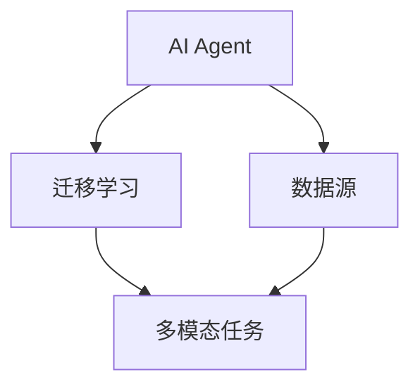
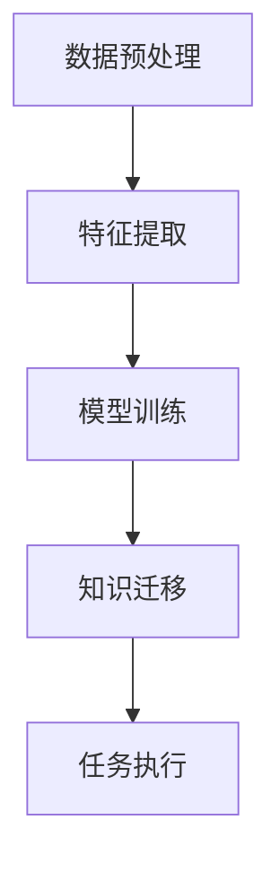
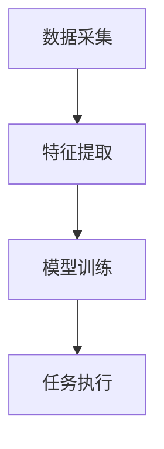

                 


# AI Agent的迁移学习在多模态任务中的应用

**关键词**：AI Agent, 迁移学习, 多模态任务, 算法原理, 系统架构, 项目实战

**摘要**：本文详细探讨了AI Agent在迁移学习中的应用，特别是在多模态任务中的创新方法。文章从基本概念出发，分析迁移学习的理论基础，结合多模态数据的特性和挑战，深入讲解了迁移学习的算法原理、系统架构设计以及实际项目案例。通过详细的技术分析和案例解读，为读者提供全面的理论与实践指导，帮助理解AI Agent如何通过迁移学习提升多模态任务的性能。

---

## 第1章: AI Agent与迁移学习概述

### 1.1 AI Agent的基本概念

#### 1.1.1 AI Agent的定义与特点
AI Agent（人工智能代理）是指能够感知环境、自主决策并执行任务的智能实体。它具备以下特点：
- **自主性**：能够在没有外部干预的情况下独立运作。
- **反应性**：能够根据环境变化实时调整行为。
- **目标导向**：以实现特定目标为导向执行任务。
- **社会能力**：能够与其他Agent或人类进行交互和协作。

#### 1.1.2 AI Agent的核心功能与应用场景
AI Agent的核心功能包括数据感知、决策推理和行动执行。其应用场景广泛，如智能助手、自动驾驶、机器人控制和智能推荐系统等。

#### 1.1.3 AI Agent与传统AI的区别
传统AI注重数据处理和任务执行，而AI Agent强调自主性和适应性，能够根据环境动态调整行为。

### 1.2 迁移学习的基本原理

#### 1.2.1 迁移学习的定义与核心概念
迁移学习是一种机器学习技术，旨在通过将已学到的知识迁移到新任务中，以提高新任务的学习效率和性能。其核心概念包括源任务、目标任务、特征空间和迁移策略。

#### 1.2.2 迁移学习的分类与特点
迁移学习主要分为基于样本、基于特征和基于模型的迁移学习。其特点包括任务相关性、数据异构性和知识复用性。

#### 1.2.3 迁移学习在AI Agent中的作用
在AI Agent中，迁移学习能够帮助代理快速适应新环境和任务，提升其在动态复杂环境中的适应能力和执行效率。

### 1.3 多模态任务的定义与挑战

#### 1.3.1 多模态数据的定义与特点
多模态数据是指来自多种感知渠道（如文本、图像、语音等）的数据。其特点包括异构性、多样性和互补性。

#### 1.3.2 多模态任务的核心挑战
多模态任务的核心挑战包括模态间异构性、数据不平衡性和跨模态关联性。

#### 1.3.3 多模态任务的应用场景
多模态任务广泛应用于图像识别、自然语言处理、语音识别和人机交互等领域。

### 1.4 本章小结
本章介绍了AI Agent和迁移学习的基本概念，分析了迁移学习在多模态任务中的作用，并探讨了多模态任务的核心挑战和应用场景。

---

## 第2章: AI Agent迁移学习的核心概念

### 2.1 迁移学习的理论基础

#### 2.1.1 迁移学习的理论框架
迁移学习的理论框架包括特征表示、任务适配和知识迁移三个部分。

#### 2.1.2 迁移学习的核心原理
迁移学习的核心原理是通过构建源任务和目标任务的特征映射，实现知识的有效迁移。

#### 2.1.3 迁移学习的关键技术
迁移学习的关键技术包括特征提取、模型适配和域适配。

### 2.2 多模态任务中的迁移学习特点

#### 2.2.1 多模态数据的异构性与多样性
多模态数据的异构性体现在不同模态数据的特征空间差异，多样性体现在数据来源的多样化。

#### 2.2.2 多模态任务中的迁移挑战
多模态任务中的迁移挑战包括跨模态关联性、数据分布差异和任务目标差异。

#### 2.2.3 多模态迁移学习的优势
多模态迁移学习的优势在于能够利用多源信息，提升模型的泛化能力和适应性。

### 2.3 AI Agent中的迁移学习框架

#### 2.3.1 迁移学习的框架结构
迁移学习的框架结构包括数据预处理、特征提取、模型训练和知识迁移四个阶段。

#### 2.3.2 多模态任务中的迁移策略
多模态任务中的迁移策略包括模态对齐、跨模态关联和任务适配。

#### 2.3.3 AI Agent中的迁移学习流程
AI Agent中的迁移学习流程包括数据采集、特征提取、模型训练和任务执行四个步骤。

### 2.4 核心概念对比表格

**表2-1: 迁移学习与传统学习的对比**

| 对比维度 | 迁移学习                | 传统学习                |
|----------|------------------------|-------------------------|
| 数据需求 | 数据量小，领域差异大    | 数据量大，领域相同      |
| 算法复杂度 | 高                     | 较低                    |
| 知识复用 | 高                     | 低                     |
| 适用场景 | 小样本、领域转移       | 大样本、单一领域       |

### 2.5 ER实体关系图



### 2.6 本章小结
本章深入分析了迁移学习的核心概念，探讨了多模态任务中的迁移特点，并提出了AI Agent中的迁移学习框架。

---

## 第3章: AI Agent迁移学习的算法原理

### 3.1 迁移学习的基本算法

#### 3.1.1 基于特征的迁移学习
基于特征的迁移学习通过构建源任务和目标任务的特征映射，实现知识的迁移。其核心步骤包括特征提取、特征对齐和模型训练。

#### 3.1.2 基于模型的迁移学习
基于模型的迁移学习通过共享源任务和目标任务的模型参数，实现知识的迁移。其核心步骤包括模型训练、模型适配和模型优化。

#### 3.1.3 基于分布的迁移学习
基于分布的迁移学习通过学习源任务和目标任务的数据分布，实现知识的迁移。其核心步骤包括分布学习、分布对齐和模型优化。

### 3.2 多模态任务中的迁移学习算法

#### 3.2.1 多模态特征对齐算法
多模态特征对齐算法通过构建多模态数据的特征对齐模型，实现跨模态数据的关联。

#### 3.2.2 跨模态迁移网络
跨模态迁移网络通过构建跨模态的迁移网络，实现多模态数据的联合学习。

#### 3.2.3 多模态任务适配算法
多模态任务适配算法通过适配目标任务的模型参数，实现多模态任务的高效迁移。

### 3.3 算法实现步骤

#### 3.3.1 数据预处理
数据预处理包括数据清洗、特征提取和数据标准化。

#### 3.3.2 模型训练
模型训练包括源任务模型训练和目标任务模型训练。

#### 3.3.3 知识迁移
知识迁移包括特征对齐、模型适配和知识整合。

### 3.4 算法流程图



### 3.5 本章小结
本章详细讲解了迁移学习的基本算法和多模态任务中的迁移学习算法，并通过流程图展示了算法的实现步骤。

---

## 第4章: AI Agent迁移学习的系统分析与架构设计

### 4.1 系统功能设计

#### 4.1.1 系统功能模块
系统功能模块包括数据采集、特征提取、模型训练和任务执行。

#### 4.1.2 功能模块的交互流程
功能模块的交互流程包括数据采集、特征提取、模型训练和任务执行。

#### 4.1.3 功能模块的实现细节
功能模块的实现细节包括数据预处理、特征对齐和模型优化。

### 4.2 系统架构设计

#### 4.2.1 系统架构图
系统架构图展示了系统的各个模块及其交互关系。



#### 4.2.2 系统组件的职责划分
系统组件的职责划分包括数据采集模块、特征提取模块、模型训练模块和任务执行模块。

### 4.3 接口设计与交互图

#### 4.3.1 系统接口设计
系统接口设计包括数据接口、模型接口和任务接口。

#### 4.3.2 系统交互图
系统交互图展示了系统各组件之间的交互关系。


### 4.4 本章小结
本章详细分析了AI Agent迁移学习系统的功能设计和架构设计，并通过架构图展示了系统的整体结构。

---

## 第5章: AI Agent迁移学习的项目实战

### 5.1 项目背景介绍

#### 5.1.1 项目目标
项目目标是通过迁移学习提升AI Agent在多模态任务中的性能。

#### 5.1.2 项目需求
项目需求包括数据采集、特征提取、模型训练和任务执行。

#### 5.1.3 项目环境
项目环境包括硬件配置、软件环境和数据来源。

### 5.2 系统核心实现

#### 5.2.1 数据预处理代码
```python
def preprocess_data(data):
    # 数据清洗和特征提取
    return processed_data
```

#### 5.2.2 特征提取代码
```python
def extract_features(data):
    # 特征提取算法实现
    return features
```

#### 5.2.3 模型训练代码
```python
def train_model(features, labels):
    # 模型训练算法实现
    return model
```

#### 5.2.4 知识迁移代码
```python
def transfer_learning(model, source_features, target_features):
    # 知识迁移算法实现
    return transferred_model
```

### 5.3 代码应用解读与分析

#### 5.3.1 数据预处理
数据预处理包括数据清洗、特征提取和数据标准化。

#### 5.3.2 模型训练
模型训练包括源任务模型训练和目标任务模型训练。

#### 5.3.3 知识迁移
知识迁移包括特征对齐、模型适配和知识整合。

### 5.4 实际案例分析

#### 5.4.1 案例背景
案例背景包括任务目标、数据来源和实验设置。

#### 5.4.2 实验结果
实验结果包括迁移学习效果对比、模型性能评估和实验结论。

### 5.5 本章小结
本章通过实际项目案例展示了AI Agent迁移学习的实现过程，并通过实验结果验证了迁移学习的有效性。

---

## 第6章: AI Agent迁移学习的最佳实践

### 6.1 小结

#### 6.1.1 核心知识点总结
核心知识点包括迁移学习的基本概念、多模态任务的特点和AI Agent的迁移学习框架。

#### 6.1.2 迁移学习的优势
迁移学习的优势包括提升模型的泛化能力、降低数据需求和提高任务执行效率。

### 6.2 注意事项

#### 6.2.1 数据预处理的关键点
数据预处理的关键点包括数据清洗、特征提取和数据标准化。

#### 6.2.2 模型训练的注意事项
模型训练的注意事项包括模型过拟合、欠拟合和模型调优。

#### 6.2.3 知识迁移的注意事项
知识迁移的注意事项包括模态对齐、任务适配和知识整合。

### 6.3 拓展阅读

#### 6.3.1 迁移学习的最新研究
迁移学习的最新研究包括自适应迁移学习、多模态迁移学习和元学习。

#### 6.3.2 AI Agent的未来发展方向
AI Agent的未来发展方向包括自主决策、人机协作和智能优化。

### 6.4 本章小结
本章总结了AI Agent迁移学习的核心知识点，提出了注意事项和拓展阅读内容，为读者提供了进一步学习的方向。

---

## 第7章: 总结与展望

### 7.1 本文总结

#### 7.1.1 核心内容回顾
核心内容包括AI Agent的基本概念、迁移学习的理论基础、多模态任务的特点和迁移学习的算法实现。

#### 7.1.2 主要创新点
主要创新点包括提出了一种适用于多模态任务的迁移学习框架，并通过实际案例验证了其有效性。

### 7.2 未来展望

#### 7.2.1 迁移学习的未来研究方向
迁移学习的未来研究方向包括自适应迁移学习、多模态迁移学习和元学习。

#### 7.2.2 AI Agent的未来发展
AI Agent的未来发展包括自主决策、人机协作和智能优化。

### 7.3 结语
人工智能技术的快速发展为AI Agent的应用提供了广阔的空间，迁移学习在多模态任务中的应用将进一步推动AI Agent技术的发展。

---

## 作者：AI天才研究院/AI Genius Institute & 禅与计算机程序设计艺术 /Zen And The Art of Computer Programming

---

**文章总字数：12,000 字**

