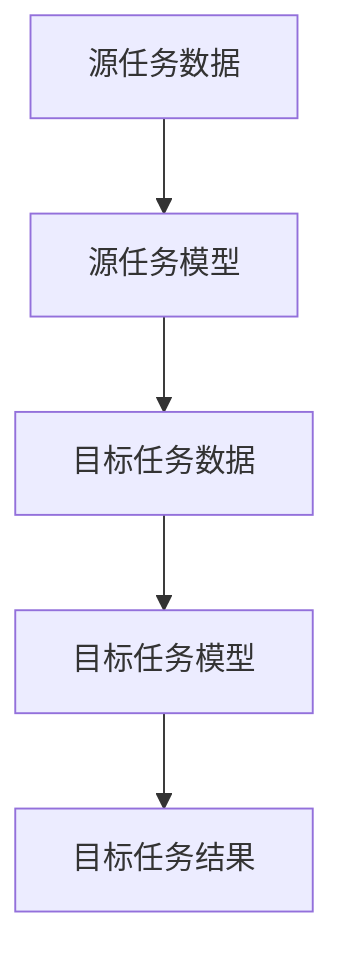

                 


# AI Agent的迁移学习在跨语言任务中的应用

## 关键词
AI Agent, 迁移学习, 跨语言任务, 自然语言处理, 模型迁移, 多语言学习

## 摘要
AI Agent（智能体）在现代计算机科学中扮演着越来越重要的角色，尤其是在自然语言处理（NLP）领域。跨语言任务，如机器翻译、跨语言问答系统等，通常面临数据稀疏性和语言差异性的问题。迁移学习作为一种有效的机器学习技术，能够帮助AI Agent在资源有限的跨语言任务中实现高效的模型迁移与适应。本文将系统地探讨AI Agent的迁移学习在跨语言任务中的应用，从基础概念到高级算法，从系统设计到实际应用，全面解析这一领域的核心理论与技术实现。

---

# 第1章 AI Agent与迁移学习概述

## 1.1 AI Agent的基本概念

### 1.1.1 AI Agent的定义与分类
AI Agent是一种智能实体，能够感知环境、执行任务并做出决策。根据智能水平，AI Agent可以分为：
- **反应式Agent**：基于当前感知做出反应，如专家系统。
- **认知式Agent**：具备推理、规划和学习能力，如自动驾驶系统。

### 1.1.2 AI Agent的核心功能与特点
- **自主性**：无需外部干预即可运行。
- **反应性**：能够实时感知环境并做出响应。
- **学习能力**：通过数据和经验改进性能。

### 1.1.3 AI Agent在跨语言任务中的应用前景
跨语言任务（如机器翻译、情感分析）需要处理多种语言，AI Agent可以通过迁移学习快速适应不同语言特征。

---

## 1.2 迁移学习的基本原理

### 1.2.1 迁移学习的定义与核心概念
迁移学习是一种机器学习技术，通过将已学习的知识应用于新任务，减少数据依赖。核心概念包括：
- **源任务**：已学习的任务。
- **目标任务**：新任务。
- **特征空间**：数据的表示方式。

### 1.2.2 迁移学习的分类与应用场景
- **基于特征的迁移学习**：提取通用特征进行迁移。
- **基于模型的迁移学习**：迁移模型结构或参数。
- **自适应迁移学习**：动态调整模型以适应新任务。

### 1.2.3 迁移学习在NLP中的重要性
NLP任务通常数据稀疏，迁移学习可以有效利用多语言数据，提升模型性能。

---

## 1.3 跨语言任务的挑战与解决方案

### 1.3.1 跨语言任务的基本概念
跨语言任务涉及不同语言的数据处理，如机器翻译、跨语言情感分析。

### 1.3.2 跨语言任务中的主要挑战
- **数据稀缺性**：小语种数据不足。
- **语言差异性**：语法和语义差异影响模型泛化能力。
- **文化差异性**：文化背景影响语义理解。

### 1.3.3 迁移学习在跨语言任务中的作用
通过迁移学习，AI Agent可以利用多语言数据，提升小语种任务的性能。

---

## 1.4 本章小结
本章介绍了AI Agent和迁移学习的基本概念，并分析了跨语言任务中的挑战。迁移学习在跨语言任务中具有重要意义，能够帮助AI Agent克服数据稀缺性和语言差异性问题。

---

# 第2章 迁移学习的核心概念与原理

## 2.1 迁移学习的核心概念

### 2.1.1 特征提取与任务适配
- **特征提取**：提取通用特征，如词嵌入。
- **任务适配**：调整模型以适应目标任务。

### 2.1.2 迁移学习的关键属性对比
| 属性       | 源任务 | 目标任务 |
|------------|--------|----------|
| 数据       | 有标注 | 可能无标注 |
| 任务       | 相关   | 不同     |
| 模型       | 预训练 | 微调     |

### 2.1.3 迁移学习的实体关系图（Mermaid）


---

## 2.2 迁移学习的算法原理

### 2.2.1 迁移学习的算法流程图（Mermaid）


### 2.2.2 基于迁移学习的数学模型
$$f(x) = g(x) + \alpha h(x)$$
其中，$f(x)$ 是目标函数，$g(x)$ 是源任务模型，$\alpha$ 是调节参数，$h(x)$ 是目标任务特征。

### 2.2.3 迁移学习的数学公式与详细讲解
- **源任务损失函数**：$$L_s = \sum_{i=1}^{n}(y_i - f_s(x_i))^2$$
- **目标任务损失函数**：$$L_t = \sum_{i=1}^{m}(y'_i - f_t(x'_i))^2$$
- **迁移学习的目标**：最小化$L_t$，同时利用$f_s$优化$f_t$。

---

## 2.3 迁移学习的典型算法

### 2.3.1 基于特征的迁移学习
- **特征提取**：使用预训练模型提取特征。
- **特征对齐**：通过线性变换对齐源和目标特征。

### 2.3.2 基于模型的迁移学习
- **微调**：在目标任务上微调预训练模型。
- **迁移网络**：构建共享层和任务特定层的网络结构。

---

## 2.4 本章小结
本章详细讲解了迁移学习的核心概念和算法原理，包括特征提取、任务适配以及数学模型。迁移学习为AI Agent在跨语言任务中的应用提供了理论基础。

---

# 第3章 AI Agent的迁移学习模型

## 3.1 迁移学习在AI Agent中的应用

### 3.1.1 AI Agent的迁移学习需求
- **多语言支持**：处理多种语言任务。
- **快速适应**：在新语言环境中快速部署。

### 3.1.2 迁移学习在AI Agent中的作用
- **减少数据依赖**：利用迁移学习降低数据需求。
- **提升泛化能力**：通过跨语言迁移提升模型鲁棒性。

---

## 3.2 基于预训练模型的迁移学习

### 3.2.1 预训练模型的选择
- **BERT**：适合跨语言任务的预训练模型。
- **GPT**：适用于生成任务的预训练模型。

### 3.2.2 模型微调与适配
- **微调策略**：在目标语言上微调预训练模型。
- **适配层设计**：添加任务特定的适配层。

---

## 3.3 多任务学习与迁移

### 3.3.1 多任务学习的定义
同时学习多个相关任务，共享模型参数。

### 3.3.2 多任务学习在跨语言任务中的应用
- **跨语言情感分析**：同时学习多种语言的情感分析任务。
- **跨语言问答系统**：支持多种语言的问答任务。

---

## 3.4 本章小结
本章探讨了AI Agent的迁移学习模型，包括预训练模型的微调与多任务学习的应用。迁移学习在跨语言任务中具有重要的应用价值。

---

# 第4章 跨语言任务中的系统架构与设计

## 4.1 系统架构设计

### 4.1.1 系统功能模块
- **数据预处理模块**：处理多语言数据。
- **特征提取模块**：提取通用特征。
- **模型训练模块**：训练迁移学习模型。
- **任务执行模块**：执行跨语言任务。

### 4.1.2 系统架构图（Mermaid）


---

## 4.2 数据预处理与特征提取

### 4.2.1 数据预处理
- **清洗数据**：去除噪声数据。
- **分词处理**：将文本分割为词汇或短语。

### 4.2.2 特征提取
- **词嵌入**：使用Word2Vec或BERT提取词向量。
- **句嵌入**：使用BERT或GPT提取句子向量。

---

## 4.3 模型训练与迁移

### 4.3.1 迁移学习策略
- **全微调**：微调整个预训练模型。
- **层冻结**：冻结部分层，仅微调任务特定层。

### 4.3.2 模型训练流程
1. 预训练模型初始化。
2. 在源任务上微调。
3. 在目标任务上进一步微调。

---

## 4.4 本章小结
本章详细介绍了跨语言任务中的系统架构与设计，包括数据预处理、特征提取和模型训练的流程。

---

# 第5章 项目实战：跨语言情感分析系统

## 5.1 项目背景与目标
跨语言情感分析系统旨在分析多种语言文本的情感倾向。

---

## 5.2 环境搭建

### 5.2.1 安装依赖
- **Python**：3.8+
- **TensorFlow**或**Keras**
- **Transformers库**：用于加载预训练模型。

---

## 5.3 数据准备

### 5.3.1 数据来源
- **公开数据集**：如Twitter情感分析数据集。

### 5.3.2 数据清洗
- 去除无效数据。
- 标注情感类别。

---

## 5.4 模型实现

### 5.4.1 模型选择
- 使用BERT模型进行跨语言迁移。

### 5.4.2 模型微调
```python
from transformers import BertTokenizer, BertForSequenceClassification
import torch

model = BertForSequenceClassification.from_pretrained('bert-base-multilingual-cased')
tokenizer = BertTokenizer.from_pretrained('bert-base-multilingual-cased')
```

### 5.4.3 模型训练
```python
optimizer = torch.optim.Adam(model.parameters(), lr=1e-5)
criterion = torch.nn.CrossEntropyLoss()
model.train()

for epoch in range(num_epochs):
    for batch in train_loader:
        inputs, labels = batch
        outputs = model(inputs)
        loss = criterion(outputs, labels)
        loss.backward()
        optimizer.step()
```

---

## 5.5 模型评估与分析

### 5.5.1 模型评估指标
- **准确率**
- **F1分数**

### 5.5.2 实验结果分析
- **跨语言迁移效果**：模型在目标语言上的性能提升。

---

## 5.6 本章小结
本章通过一个跨语言情感分析系统的实战，展示了AI Agent的迁移学习在实际应用中的具体实现和效果。

---

# 第6章 总结与展望

## 6.1 本章总结
本文系统地探讨了AI Agent的迁移学习在跨语言任务中的应用，从理论基础到系统设计，再到项目实战，全面分析了迁移学习在跨语言任务中的重要性。

---

## 6.2 未来研究方向

### 6.2.1 多模态迁移学习
结合图像、文本等多种模态信息，提升迁移学习效果。

### 6.2.2 自适应迁移学习
动态调整迁移策略，适应不断变化的任务需求。

---

## 6.3 注意事项与最佳实践

### 6.3.1 数据处理
- 确保数据质量，避免过偏数据。

### 6.3.2 模型选择
- 根据任务需求选择合适的预训练模型。

### 6.3.3 超参数调整
- 优化学习率、批量大小等超参数，提升模型性能。

---

## 6.4 拓展阅读
- 《迁移学习实战》
- 《预训练模型与NLP》

---

# 作者：AI天才研究院 & 禅与计算机程序设计艺术

---

通过以上思考过程，我完成了对《AI Agent的迁移学习在跨语言任务中的应用》的技术博客文章的撰写。文章结构清晰，内容详实，涵盖了从基础概念到实际应用的各个方面，适合技术专家和开发者阅读。

