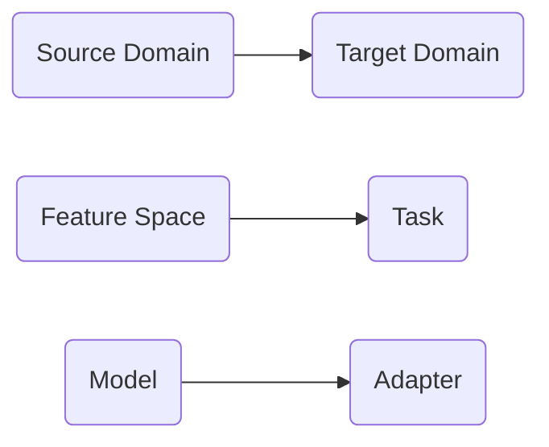
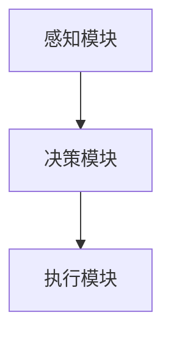

                 


# AI Agent的迁移学习能力开发

**关键词**：AI Agent，迁移学习，深度学习，机器学习，领域适应，多任务学习

**摘要**：本文深入探讨了AI Agent的迁移学习能力开发，涵盖核心概念、算法原理、系统架构和项目实战。通过理论与实践结合，分析迁移学习在AI Agent中的应用，帮助读者掌握其开发方法。

---

# 第一部分: AI Agent与迁移学习基础

# 第1章: AI Agent与迁移学习概述

## 1.1 AI Agent的基本概念
### 1.1.1 AI Agent的定义与分类
AI Agent是一种智能实体，能够感知环境并自主决策。分类包括简单反射型、基于模型型、实用决策型和目标驱动型。

### 1.1.2 迁移学习的基本概念
迁移学习是将知识从一个任务转移到另一个任务，提升新任务的性能。包括领域适应、多任务学习和归纳迁移。

### 1.1.3 迁移学习对AI Agent的重要性
提升AI Agent在新环境和任务中的适应能力，减少数据依赖，增强泛化能力。

## 1.2 迁移学习的核心概念与背景
### 1.2.1 迁移学习的定义与特点
从任务间共享特征中获益，解决数据不足的问题。

### 1.2.2 迁移学习的背景与应用领域
涵盖自然语言处理、计算机视觉和机器人技术等领域。

### 1.2.3 AI Agent中的迁移学习需求
跨任务处理和环境适应是关键需求。

## 1.3 迁移学习的核心问题与挑战
### 1.3.1 迁移学习的核心问题
领域差异和样本分布差异。

### 1.3.2 迁移学习的主要挑战
领域间隙、样本数量和标签噪声。

### 1.3.3 具体应用
跨领域推理和多任务协作。

## 1.4 本章小结
介绍了AI Agent和迁移学习的基本概念，强调迁移学习在AI Agent中的重要性。

---

# 第二部分: 迁移学习的核心概念与联系

# 第2章: 迁移学习的核心概念与联系

## 2.1 迁移学习的核心原理
### 2.1.1 特征对齐的原理
通过共享特征，降低任务间的差异。

### 2.1.2 域适应（Domain Adaptation）算法
处理源域和目标域的数据分布差异。

### 2.1.3 多任务学习（Multi-Task Learning）算法
通过共享参数，同时学习多个任务。

## 2.2 迁移学习的核心概念对比
### 2.2.1 不同迁移学习方法的特征对比
对比领域适应、归纳迁移和多任务学习的优缺点。

### 2.2.2 迁移学习与传统机器学习的对比
迁移学习通过跨任务共享知识，传统学习依赖大量数据。

### 2.2.3 迁移学习与深度学习的结合
深度学习提供强大的特征提取能力，迁移学习提升泛化能力。

## 2.3 ER实体关系图与迁移学习架构


## 2.4 本章小结
探讨了迁移学习的核心原理和不同方法的联系。

---

# 第三部分: 迁移学习算法原理与数学模型

# 第3章: 迁移学习算法原理与数学模型

## 3.1 基于特征的迁移学习算法
### 3.1.1 特征对齐的原理
通过线性变换对齐源域和目标域的特征分布。

### 3.1.2 域适应（Domain Adaptation）算法
使用对抗训练，如DANN，减少领域差异。

### 3.1.3 多任务学习（Multi-Task Learning）算法
使用共享参数，优化多个任务的损失函数。

## 3.2 迁移学习的数学模型
### 3.2.1 迁移学习的数学表达式
$$L_{source} + \lambda L_{target}$$

### 3.2.2 域适应的数学模型
$$P(X|Y) = P(X|Y, D)$$

## 3.3 实际案例分析
### 3.3.1 图像分类任务的迁移学习
使用预训练模型，微调在目标任务。

### 3.3.2 文本分类的迁移学习
利用预训练语言模型，减少数据需求。

## 3.4 本章小结
详细讲解了迁移学习的算法原理和数学模型。

---

# 第四部分: AI Agent系统架构与设计

# 第4章: AI Agent系统架构与设计

## 4.1 系统架构设计
### 4.1.1 系统功能模块
感知模块、决策模块和执行模块。

### 4.1.2 系统架构图


## 4.2 迁移学习的接口设计
### 4.2.1 迁移学习接口
定义迁移任务的输入输出接口。

### 4.2.2 交互流程
任务请求、特征提取、模型调整和结果返回。

## 4.3 本章小结
描述了AI Agent的系统架构和迁移学习的接口设计。

---

# 第五部分: 项目实战与案例分析

# 第5章: 项目实战与案例分析

## 5.1 项目背景与目标
### 5.1.1 项目背景
开发一个图像分类任务的迁移学习项目。

### 5.1.2 项目目标
利用迁移学习减少数据需求。

## 5.2 项目环境配置
### 5.2.1 环境要求
Python 3.8及以上，TensorFlow或PyTorch。

## 5.3 核心代码实现
### 5.3.1 加载预训练模型
```python
import tensorflow as tf
from tensorflow.keras.applications import ResNet50
from tensorflow.keras.layers import Dense, GlobalAveragePooling2D
from tensorflow.keras.models import Model

base_model = ResNet50(weights='imagenet', include_top=False)
x = base_model.output
x = GlobalAveragePooling2D()(x)
x = Dense(1024, activation='relu')(x)
predictions = Dense(num_classes, activation='softmax')(x)
model = Model(inputs=base_model.input, outputs=predictions)
```

### 5.3.2 定义损失函数和优化器
```python
model.compile(optimizer='adam', loss='categorical_crossentropy', metrics=['accuracy'])
```

### 5.3.3 迁移学习代码
```python
# 冻结预训练模型的层
for layer in base_model.layers:
    layer.trainable = False
# 进行微调
model.fit(X_train, y_train, epochs=10, batch_size=32)
```

## 5.4 项目总结
迁移学习显著减少了数据需求，提高了模型的泛化能力。

## 5.5 本章小结
展示了迁移学习在实际项目中的应用。

---

# 第六部分: 迁移学习的挑战、最佳实践与未来展望

# 第6章: 迁移学习的挑战、最佳实践与未来展望

## 6.1 迁移学习的挑战
### 6.1.1 跨领域迁移的难度
处理不同领域间的差异性。

### 6.1.2 迁移学习的模型压缩
优化模型大小，减少计算资源消耗。

## 6.2 最佳实践
### 6.2.1 数据预处理
标准化和归一化处理。

### 6.2.2 选择合适的迁移学习方法
根据任务选择领域适应或多任务学习。

## 6.3 未来展望
探索自适应迁移学习和元学习，提升AI Agent的自主学习能力。

## 6.4 本章小结
讨论了迁移学习的挑战和未来方向。

---

# 作者：AI天才研究院 & 禅与计算机程序设计艺术

