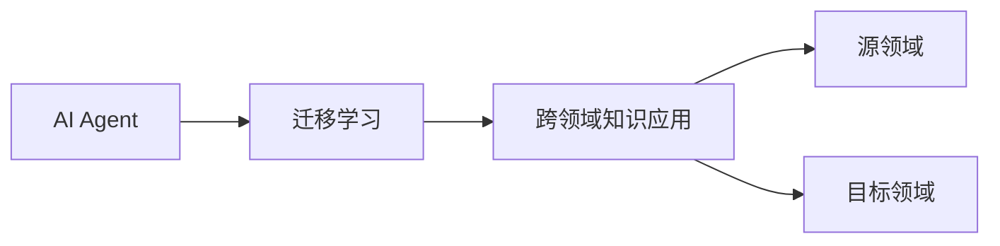
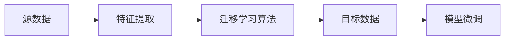
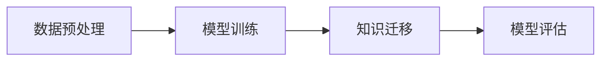
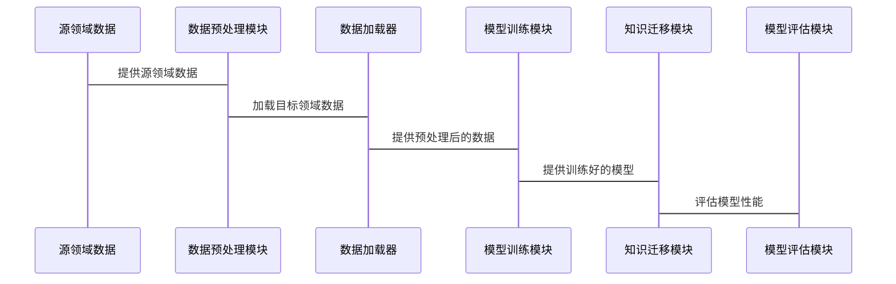

                 


# AI Agent的迁移学习：跨领域知识应用

## 关键词
AI Agent、迁移学习、跨领域知识、机器学习、知识迁移、深度学习

## 摘要
本文深入探讨AI Agent在迁移学习中的应用，特别是跨领域知识的应用。通过分析迁移学习的原理、算法实现、系统设计以及实际案例，展示了如何利用迁移学习提升AI Agent在不同领域的适应性和性能。文章结构清晰，内容详实，旨在为读者提供全面的技术指导和实践参考。

---

# 第一部分: AI Agent的迁移学习基础

## 第1章: AI Agent与迁移学习概述

### 1.1 AI Agent的基本概念
#### 1.1.1 什么是AI Agent
AI Agent（人工智能代理）是指能够感知环境、自主决策并采取行动以实现特定目标的智能实体。它可以是一个软件程序、机器人或其他智能系统。

#### 1.1.2 AI Agent的特点与类型
- **特点**：智能性、自主性、反应性、社交性。
- **类型**：基于规则的代理、基于模型的代理、基于学习的代理。

#### 1.1.3 AI Agent的应用场景
- 智能助手（如Siri、Alexa）
- 智能推荐系统
- 自动驾驶
- 智能客服

### 1.2 迁移学习的基本概念
#### 1.2.1 迁移学习的定义
迁移学习是一种机器学习技术，通过将一个领域学到的知识应用到另一个相关领域，以提高学习效率和性能。

#### 1.2.2 迁移学习的核心思想
利用源领域和目标领域之间的相似性，将源领域的知识迁移到目标领域，减少目标领域的数据需求。

#### 1.2.3 迁移学习与传统机器学习的区别
- 数据依赖性：传统学习需要大量目标领域数据，迁移学习减少对目标数据的依赖。
- 知识复用：迁移学习可以复用源领域的知识，提高学习效率。

### 1.3 跨领域知识应用的背景
#### 1.3.1 跨领域知识应用的必要性
现实世界中的问题往往涉及多个领域，单一领域的模型难以应对跨领域的问题。

#### 1.3.2 跨领域知识应用的挑战
- 数据分布差异
- 领域间特征差异
- 过度依赖领域特定特征

#### 1.3.3 跨领域知识应用的现状
迁移学习在自然语言处理、计算机视觉等领域取得了显著进展，但在跨领域知识应用方面仍需进一步研究。

---

## 第2章: 迁移学习的核心概念与联系

### 2.1 迁移学习的原理
#### 2.1.1 数据迁移
通过数据预处理或数据生成技术，将源领域的数据转换为目标领域的数据。

#### 2.1.2 任务迁移
将源领域学到的任务策略迁移到目标领域，直接应用于目标任务。

#### 2.1.3 模型迁移
利用源领域训练好的模型，在目标领域进行微调或适配。

### 2.2 核心概念对比表
| 概念 | 描述 |
|------|------|
| 数据迁移 | 数据预处理或生成技术 |
| 任务迁移 | 任务策略的直接迁移 |
| 模型迁移 | 利用源领域模型进行微调 |

### 2.3 ER实体关系图


---

# 第二部分: 迁移学习的算法原理

## 第3章: 迁移学习的算法实现

### 3.1 基于特征的迁移学习
#### 3.1.1 特征提取
使用通用特征提取器，提取源领域和目标领域的共同特征。

#### 3.1.2 基于最大均值差异的迁移学习
通过最大化源领域和目标领域的均值差异，增强特征的可区分性。

### 3.2 基于模型的迁移学习
#### 3.2.1 迁移卷积神经网络（CNN）
使用预训练的CNN模型，在目标领域进行微调。

#### 3.2.2 对抗迁移学习
使用生成对抗网络（GAN）进行领域适应，通过对抗训练减少领域分布差异。

### 3.3 算法流程图


### 3.4 Python实现示例
```python
import torch
import torch.nn as nn
import torch.optim as optim

class迁移学习模型(nn.Module):
    def __init__(self):
        super(迁移学习模型, self).__init__()
        self.feature_extractor = nn.Sequential(
            nn.Conv2d(1, 32, kernel_size=5, stride=1, padding=2),
            nn.ReLU(),
            nn.MaxPool2d(kernel_size=2, stride=2),
            nn.Conv2d(32, 64, kernel_size=5, stride=1, padding=2),
            nn.ReLU(),
            nn.MaxPool2d(kernel_size=2, stride=2)
        )
        self.classifier = nn.Sequential(
            nn.Linear(64*2*2, 100),
            nn.ReLU(),
            nn.Linear(100, 10)
        )

    def forward(self, x):
        features = self.feature_extractor(x)
        features_flat = features.view(features.size(0), -1)
        output = self.classifier(features_flat)
        return output

# 初始化模型和优化器
model = 迁移学习模型()
optimizer = optim.Adam(model.parameters(), lr=0.001)
criterion = nn.CrossEntropyLoss()

# 训练循环
for epoch in range(num_epochs):
    for batch_features, batch_labels in 数据加载器:
        outputs = model(batch_features)
        loss = criterion(outputs, batch_labels)
        optimizer.zero_grad()
        loss.backward()
        optimizer.step()
```

---

## 第4章: 系统分析与架构设计

### 4.1 系统功能模块
#### 4.1.1 数据预处理模块
对源领域和目标领域的数据进行清洗、归一化处理。

#### 4.1.2 模型训练模块
基于迁移学习算法，训练模型并进行微调。

#### 4.1.3 知识迁移模块
将源领域知识迁移到目标领域，并进行评估和优化。

### 4.2 系统架构设计


### 4.3 系统接口设计
- 数据接口：数据预处理模块与数据加载器的接口。
- 模型接口：迁移学习模型与优化器的接口。

### 4.4 交互流程


---

## 第5章: 项目实战

### 5.1 环境搭建
- 安装Python和必要的库（如PyTorch、numpy等）。

### 5.2 核心代码实现
```python
# 数据预处理代码
def preprocess_data(data):
    # 数据清洗和归一化处理
    pass

# 数据加载代码
def load_data(batch_size):
    dataloader = DataLoader(train_dataset, batch_size=batch_size, shuffle=True)
    return dataloader

# 模型训练代码
def train_model(model, dataloader, optimizer, criterion, num_epochs):
    for epoch in range(num_epochs):
        for batch_features, batch_labels in dataloader:
            outputs = model(batch_features)
            loss = criterion(outputs, batch_labels)
            optimizer.zero_grad()
            loss.backward()
            optimizer.step()
    return model

# 知识迁移代码
def knowledge_transfer(source_model, target_dataloader, target_criterion):
    # 使用对抗训练进行领域适应
    pass
```

### 5.3 案例分析
通过具体案例分析迁移学习在自然语言处理中的应用，展示如何将源领域的语言模型迁移到目标领域。

---

## 第6章: 总结与展望

### 6.1 总结
本文详细探讨了AI Agent的迁移学习，特别是跨领域知识的应用。通过算法实现和系统设计，展示了迁移学习在提升AI Agent性能中的重要作用。

### 6.2 展望
未来的研究方向包括更高效的迁移学习算法、多领域知识迁移以及迁移学习的可解释性问题。

### 6.3 最佳实践 tips
- 数据预处理是关键，确保数据质量和一致性。
- 选择合适的迁移学习算法，根据具体任务调整模型结构。
- 定期评估模型性能，进行优化和调整。

---

作者：AI天才研究院 & 禅与计算机程序设计艺术

