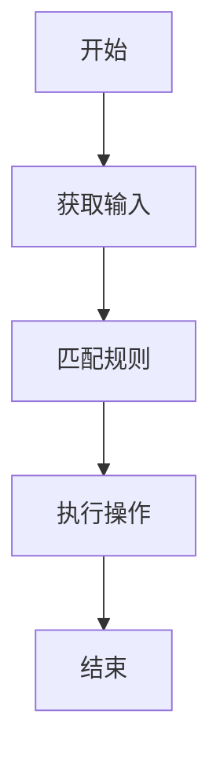
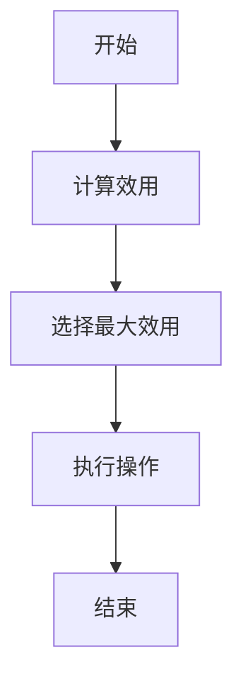
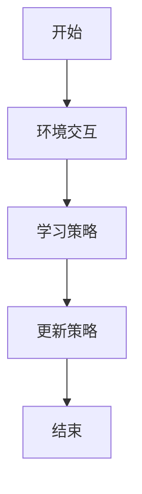
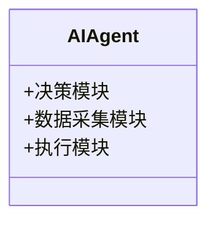
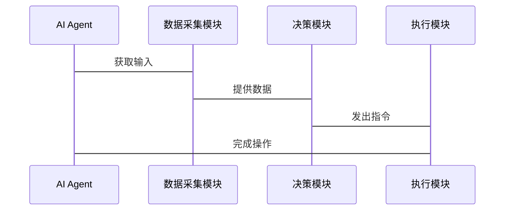
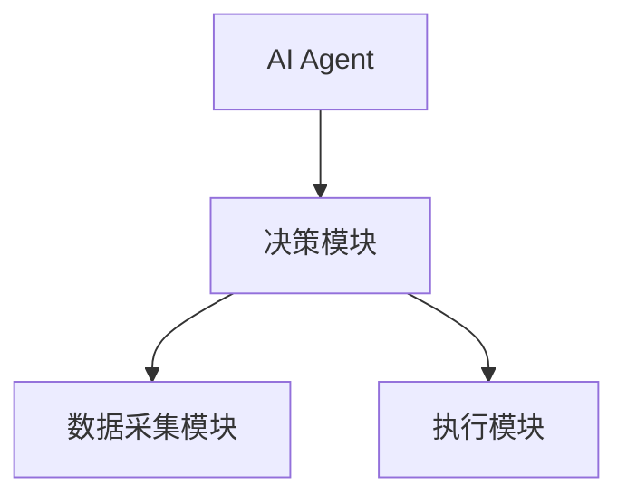

                 


# AI Agent的道德决策框架：伦理AI实践

## 关键词：
AI Agent, 道德决策, 伦理AI, 决策算法, 系统架构, 项目实战

## 摘要：
本文系统地探讨了AI Agent在道德决策方面的理论与实践。首先介绍了AI Agent的基本概念和道德决策的重要性，随后详细讲解了AI Agent的决策机制，包括基于规则、效用和学习的决策系统。接着分析了道德决策框架的核心要素，并通过Mermaid流程图展示了算法的实现流程。最后通过一个自动驾驶中的伦理决策案例，详细讲解了项目实现的全过程，包括环境安装、核心代码和案例分析。本文旨在为AI Agent的道德决策提供全面的理论指导和实践参考。

---

# 第1章: AI Agent与道德决策概述

## 1.1 AI Agent的基本概念

### 1.1.1 AI Agent的定义与分类
AI Agent（人工智能代理）是指能够感知环境、自主决策并采取行动以实现特定目标的智能实体。AI Agent可以分为以下几类：
- **反应式Agent**：基于当前感知做出反应，不依赖历史信息。
- **认知式Agent**：具备复杂推理和规划能力，能够处理不确定性。
- **学习式Agent**：通过数据学习改进决策能力。

### 1.1.2 AI Agent的核心特征
AI Agent的核心特征包括：
- **自主性**：能够自主决策。
- **反应性**：能够感知环境并实时调整行为。
- **目标导向**：所有行为旨在实现特定目标。
- **学习能力**：能够通过经验改进决策能力。

### 1.1.3 道德决策在AI Agent中的重要性
道德决策是AI Agent在复杂环境中做出正确选择的关键。例如，在自动驾驶汽车中，AI Agent需要在紧急情况下做出符合伦理的选择，如优先保护乘客还是路人。

## 1.2 道德决策的背景与挑战

### 1.2.1 道德决策的定义与核心问题
道德决策是指在涉及伦理问题的情况下，选择最优行为的过程。核心问题包括：
- **利益冲突**：如何在不同利益之间进行权衡。
- **不确定性**：如何在信息不完全的情况下做出决策。
- **责任归属**：如何确定决策的责任主体。

### 1.2.2 AI Agent在道德决策中的独特性
AI Agent的道德决策需要考虑以下特点：
- **可解释性**：决策过程需要透明，便于人类理解和审查。
- **可编程性**：道德准则可以通过程序化的方式实现。
- **可学习性**：通过数据和经验优化道德决策能力。

### 1.2.3 当前技术面临的伦理挑战
当前AI Agent在道德决策中面临的主要挑战包括：
- **算法偏见**：训练数据中的偏见可能影响决策。
- **透明性不足**：复杂的算法难以解释。
- **责任问题**：当AI Agent做出错误决策时，责任归属不清。

## 1.3 本书的研究目标与结构安排

### 1.3.1 本书的核心目标
本书旨在探讨AI Agent在道德决策中的理论与实践，提供一套完整的道德决策框架，并通过实际案例展示其应用。

### 1.3.2 目录结构与内容概览
本书分为五章：
- 第1章：AI Agent与道德决策概述。
- 第2章：AI Agent的决策机制。
- 第3章：道德决策框架的核心要素。
- 第4章：道德决策算法原理。
- 第5章：系统分析与架构设计。

### 1.3.3 读者对象与学习方法
本书适合AI开发人员、伦理学家和相关领域的研究者阅读。建议读者在阅读过程中结合实际案例，深入理解理论知识。

---

# 第2章: AI Agent的决策机制

## 2.1 基于规则的决策系统

### 2.1.1 规则的定义与特点
规则是基于预先定义的条件和动作进行决策的机制。例如，在自动驾驶中，当检测到紧急情况时，系统会触发预设的紧急制动规则。

### 2.1.2 规则的冲突解决机制
在规则冲突时，需要通过优先级排序或权重分配来确定最优规则。例如，优先保护乘客的规则可能具有更高的优先级。

### 2.1.3 规则在道德决策中的应用
规则在道德决策中的应用需要考虑伦理准则的可编程性。例如，可以将“优先保护弱势群体”转化为具体的规则。

## 2.2 基于效用的决策系统

### 2.2.1 效用函数的定义与构建
效用函数是一种衡量决策价值的函数。例如，在自动驾驶中，效用函数可以表示为：$$ U = \alpha \cdot \text{保护乘客} + \beta \cdot \text{保护路人} $$

### 2.2.2 效用函数的优化方法
效用函数的优化可以通过强化学习或遗传算法实现。例如，可以通过调整权重 $\alpha$ 和 $\beta$ 来优化效用函数。

### 2.2.3 效用函数在道德决策中的应用
效用函数在道德决策中的应用需要考虑伦理准则的权重分配。例如，在自动驾驶中，如何平衡保护乘客和保护路人的权重。

## 2.3 基于学习的决策系统

### 2.3.1 基于强化学习的决策
强化学习通过奖惩机制优化决策策略。例如，自动驾驶汽车可以通过模拟环境中的行为，学习如何在紧急情况下做出最优决策。

### 2.3.2 基于监督学习的决策
监督学习通过标注数据训练分类器。例如，可以使用监督学习训练AI Agent在交通场景中识别红绿灯。

### 2.3.3 基于生成模型的决策
生成模型（如GAN）可以生成新的决策方案。例如，AI Agent可以通过生成模型模拟不同决策的后果。

## 2.4 本章小结

---

# 第3章: 道德决策框架的核心要素

## 3.1 道德决策框架的定义与属性

### 3.1.1 道德决策框架的定义
道德决策框架是一种用于指导AI Agent在道德困境中做出决策的结构化方法。

### 3.1.2 道德决策框架的属性特征对比
| 属性 | 描述 |
|------|------|
| 可解释性 | 决策过程必须透明 |
| 可编程性 | 道德准则可以转化为程序 |
| 可学习性 | 通过数据优化决策 |

### 3.1.3 道德决策框架的ER实体关系图
```mermaid
erd
  actor(AI Agent)
  actor has a relationship with decision_rule
  decision_rule has a relationship with ethical_principle
```

## 3.2 道德决策框架的组成部分

### 3.2.1 价值观与伦理准则
AI Agent的道德决策需要基于明确的伦理准则，例如：
- 尊重人权
- 最小化伤害
- 公平分配资源

### 3.2.2 决策规则与优先级
决策规则需要明确优先级。例如：
1. 优先保护人类生命
2. 在同等情况下，优先保护弱势群体

### 3.2.3 风险评估与责任分配
AI Agent需要评估决策的风险，并明确责任分配。例如，在自动驾驶中，责任可能由制造商、车主或保险公司共同承担。

## 3.3 道德决策框架的实现步骤

### 3.3.1 问题分析与目标设定
明确道德决策问题，并设定决策目标。

### 3.3.2 数据收集与特征提取
收集相关数据，并提取特征。例如，在自动驾驶中，收集交通场景数据。

### 3.3.3 模型训练与验证
训练模型，并验证其决策能力。

## 3.4 本章小结

---

# 第4章: 道德决策算法原理

## 4.1 基于规则的道德决策算法

### 4.1.1 算法原理与流程


### 4.1.2 算法实现的Python代码
```python
def rule_based_decision(input):
    for rule in rules:
        if rule.applies_to(input):
            return rule.action
    return default_action
```

### 4.1.3 算法的优缺点分析
优点：简单易懂，可解释性高。缺点：难以处理复杂场景。

## 4.2 基于效用的道德决策算法

### 4.2.1 效用函数的构建与优化


### 4.2.2 算法的数学模型与公式
$$ U = \sum_{i=1}^{n} w_i \cdot x_i $$

### 4.2.3 算法的实现与应用案例
```python
def utility_based_decision(features, weights):
    return max(features.dot(weights))
```

## 4.3 基于学习的道德决策算法

### 4.3.1 强化学习在道德决策中的应用


### 4.3.2 监督学习在道德决策中的应用
```python
model = RandomForestClassifier()
model.fit(X, y)
```

### 4.3.3 生成模型在道德决策中的应用
```python
generator = GAN()
generator.train(X)
```

## 4.4 本章小结

---

# 第5章: 系统分析与架构设计

## 5.1 系统功能需求分析

### 5.1.1 系统目标与功能模块
系统目标：实现AI Agent的道德决策框架。
功能模块：
- 数据采集模块
- 决策模块
- 执行模块

### 5.1.2 系统功能的领域模型


### 5.1.3 系统功能的交互流程


## 5.2 系统架构设计方案

### 5.2.1 问题场景介绍
AI Agent需要在复杂环境中做出道德决策，例如自动驾驶中的紧急情况处理。

### 5.2.2 系统架构设计mermaid架构图


### 5.2.3 系统接口设计
- 决策模块接口：接收输入，返回决策结果。
- 数据采集模块接口：采集数据，返回给决策模块。

### 5.2.4 系统交互mermaid序列图


## 5.3 本章小结

---

# 第6章: 项目实战

## 6.1 环境安装与配置

### 6.1.1 安装Python环境
```bash
python --version
pip install numpy
pip install scikit-learn
pip install matplotlib
```

### 6.1.2 安装AI框架
```bash
pip install tensorflow
pip install keras
pip install gym
```

## 6.2 核心代码实现

### 6.2.1 基于规则的决策系统
```python
class RuleBasedAgent:
    def __init__(self, rules):
        self.rules = rules
    def decide(self, input):
        for rule in self.rules:
            if rule.match(input):
                return rule.action
        return default_action
```

### 6.2.2 基于效用的决策系统
```python
class UtilityBasedAgent:
    def __init__(self, weights):
        self.weights = weights
    def decide(self, features):
        return np.argmax(features.dot(self.weights))
```

### 6.2.3 基于学习的决策系统
```python
class ReinforcementLearningAgent:
    def __init__(self, env):
        self.env = env
        self.model = ...
    def learn(self):
        for _ in range(epochs):
            self.model.train()
```

## 6.3 案例分析与实现解读

### 6.3.1 自动驾驶中的伦理决策
案例背景：自动驾驶汽车在紧急情况下需要决定优先保护乘客还是路人。

实现步骤：
1. 定义伦理准则：优先保护人类生命。
2. 设计决策规则：在紧急情况下，优先选择伤害较小的行动。
3. 实现决策算法：基于规则或效用的决策系统。

### 6.3.2 其他应用场景
- 医疗AI：在诊断和治疗方案选择中做出道德决策。
- 金融AI：在投资决策中平衡风险和收益。

## 6.4 项目小结

---

# 第7章: 最佳实践与总结

## 7.1 最佳实践 tips

### 7.1.1 道德决策框架的设计原则
- 简洁性：框架应尽可能简单。
- 可解释性：决策过程必须透明。
- 可学习性：框架应支持数据驱动的优化。

### 7.1.2 道德决策框架的实现注意事项
- 避免算法偏见：确保训练数据的多样性。
- 确保可解释性：避免使用复杂的黑箱模型。
- 定期更新：根据新的伦理准则优化框架。

## 7.2 本书小结

### 7.2.1 核心内容回顾
- AI Agent的决策机制
- 道德决策框架的核心要素
- 道德决策算法的实现方法
- 系统架构设计与项目实战

### 7.2.2 未来展望
- 道德决策的动态优化
- 多 Agent 协作的道德决策
- 道德决策的跨领域应用

## 7.3 注意事项

### 7.3.1 开发中的常见问题
- 数据偏见：如何确保训练数据的公平性。
- 模型透明性：如何提高模型的可解释性。
- 责任归属：如何明确AI Agent的决策责任。

## 7.4 拓展阅读

### 7.4.1 推荐书单
- 《道德机器》（Moral Machines）
- 《AI伦理学》（AI Ethics）
- 《强化学习导论》（Reinforcement Learning: An Introduction）

### 7.4.2 推荐资源
- OpenAI的伦理决策框架
- MIT Media Lab的道德算法研究

---

# 作者：AI天才研究院/AI Genius Institute & 禅与计算机程序设计艺术 /Zen And The Art of Computer Programming

