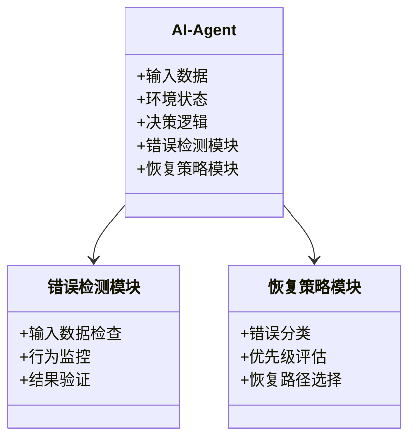
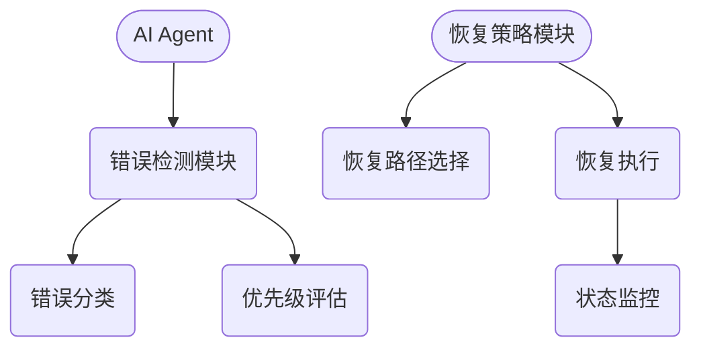
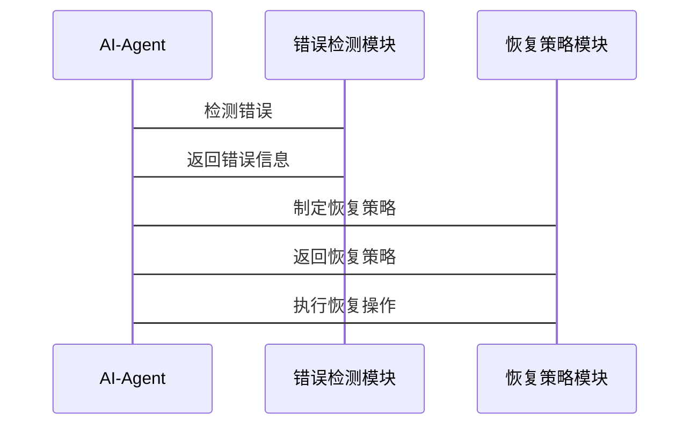

                 


# AI Agent的错误处理与恢复机制设计

> 关键词：AI Agent，错误处理，恢复机制，算法原理，系统架构

> 摘要：AI Agent作为人工智能的核心组件，在实际应用中面临各种复杂的错误和异常情况。本文系统地探讨了AI Agent的错误处理与恢复机制的设计原则、算法实现、系统架构以及实际应用案例。通过分析错误检测与分类、恢复策略制定、数学模型构建等关键问题，本文为AI Agent的稳定运行提供了理论支持和实践指导。

---

## 第一章: AI Agent的背景与概念

### 1.1 AI Agent的基本概念

#### 1.1.1 AI Agent的定义
AI Agent（人工智能代理）是指能够感知环境、自主决策并执行任务的智能实体。它可以是一个软件程序、一个机器人，或者任何能够与环境交互的智能系统。AI Agent的核心特征包括自主性、反应性、目标导向性和学习能力。

#### 1.1.2 AI Agent的核心特征
- **自主性**：AI Agent能够在没有外部干预的情况下独立运行。
- **反应性**：能够感知环境变化并实时调整行为。
- **目标导向性**：所有行为都围绕实现特定目标展开。
- **学习能力**：通过经验改进性能和决策能力。

#### 1.1.3 AI Agent的分类与应用场景
AI Agent可以根据功能和应用场景分为以下几类：
1. **基于规则的AI Agent**：通过预定义的规则进行决策，适用于规则明确的场景。
2. **基于模型的AI Agent**：依赖于数学模型进行推理和决策，适用于复杂问题。
3. **基于学习的AI Agent**：通过机器学习算法不断优化决策策略，适用于数据驱动的场景。

应用场景包括自动驾驶、智能助手、推荐系统、机器人控制等领域。

### 1.2 错误处理与恢复机制的重要性

#### 1.2.1 AI Agent运行中的常见问题
AI Agent在运行过程中可能会遇到以下问题：
1. **输入数据错误**：数据缺失、噪声或格式错误。
2. **环境动态变化**：环境状态突然变化导致决策失效。
3. **系统复杂性**：复杂系统中各组件之间的交互可能导致意外错误。

#### 1.2.2 错误处理与恢复机制的必要性
错误处理与恢复机制是确保AI Agent稳定运行的关键。通过及时检测和纠正错误，可以避免系统崩溃或产生错误决策，从而提高系统的可靠性和用户体验。

#### 1.2.3 错误处理的边界与外延
错误处理的边界包括：
1. **错误检测范围**：确定哪些错误需要处理。
2. **恢复范围**：决定恢复机制的深度和广度。
3. **错误处理的成本**：权衡处理错误的时间和资源消耗。

---

## 第二章: AI Agent的错误处理与恢复机制的背景

### 2.1 AI Agent在实际应用中的挑战

#### 2.1.1 数据输入的不确定性
AI Agent的决策高度依赖输入数据，但数据可能存在噪声、缺失或不一致的情况。

#### 2.1.2 环境动态变化的影响
环境的动态变化可能导致AI Agent的决策策略失效，需要快速调整或重新学习。

#### 2.1.3 系统复杂性带来的问题
复杂系统的组件之间可能存在耦合关系，错误可能在系统中产生连锁反应。

### 2.2 错误处理与恢复机制的演进

#### 2.2.1 传统错误处理方法的局限性
传统方法主要依赖预定义的规则，难以应对复杂场景下的多种错误。

#### 2.2.2 AI驱动的错误处理创新
基于机器学习的错误处理方法能够自适应地调整策略，提高系统的鲁棒性。

#### 2.2.3 恢复机制的智能化发展
智能化恢复机制能够根据错误的性质和上下文信息，动态选择最优的恢复策略。

---

## 第三章: AI Agent错误处理与恢复的核心概念

### 3.1 错误检测与识别

#### 3.1.1 错误检测的算法原理
错误检测算法通常包括以下步骤：
1. **输入数据检查**：验证输入数据的完整性、一致性和合法性。
2. **行为监控**：实时跟踪AI Agent的行为，发现异常模式。
3. **结果验证**：对决策结果进行验证，确保符合预期。

#### 3.1.2 错误分类的标准与方法
错误可以按照以下标准进行分类：
- **错误类型**：分为语法错误、逻辑错误、运行时错误等。
- **错误严重性**：分为致命错误、严重错误、一般错误等。

#### 3.1.3 错误优先级的评估模型
错误优先级评估模型需要考虑以下因素：
1. **错误的影响范围**：错误对系统整体运行的影响程度。
2. **错误的发生频率**：错误在特定场景下的出现概率。
3. **错误的修复成本**：修复错误所需的时间和资源。

### 3.2 恢复机制的设计原则

#### 3.2.1 恢复策略的制定原则
恢复策略的制定需要遵循以下原则：
1. **最少干预原则**：尽量采用最小的干预措施恢复系统。
2. **可追溯性原则**：记录恢复过程中的关键信息，便于后续分析。
3. **自适应性原则**：根据错误的特性和上下文动态调整恢复策略。

#### 3.2.2 恢复路径的选择逻辑
恢复路径的选择需要综合考虑以下因素：
1. **恢复成本**：选择恢复成本最小的路径。
2. **恢复时间**：优先选择恢复时间最短的路径。
3. **恢复效果**：确保恢复后的系统状态尽可能接近预期。

#### 3.2.3 恢复过程的监控与反馈
恢复过程需要实时监控，确保恢复操作的正确性和有效性。同时，需要建立反馈机制，将恢复结果上报给监控系统。

---

## 第四章: 错误处理与恢复机制的数学模型

### 4.1 错误检测的概率模型

#### 4.1.1 错误概率计算公式
$$ P(error) = \frac{E}{N} $$
其中，$E$表示错误发生次数，$N$表示总尝试次数。

#### 4.1.2 错误检测的贝叶斯模型
$$ P(error|x) = \frac{P(x|error)P(error)}{P(x)} $$
其中，$x$表示观测数据，$P(x|error)$表示在错误发生的情况下观测到数据$x$的概率，$P(error)$表示错误发生的先验概率。

### 4.2 恢复机制的优化算法

#### 4.2.1 基于强化学习的恢复策略
$$ R = \sum_{t} \gamma^t r_t $$
其中，$R$表示奖励总和，$\gamma$表示折扣因子，$r_t$表示时间$t$的奖励值。

#### 4.2.2 基于马尔可夫决策过程的状态转移
$$ P(s'|s,a) = \text{状态转移概率} $$
其中，$s$表示当前状态，$a$表示动作，$s'$表示转移后的状态，$P(s'|s,a)$表示从状态$s$采取动作$a$后转移到状态$s'$的概率。

---

## 第五章: 错误处理与恢复机制的系统架构设计

### 5.1 问题场景介绍
AI Agent在实际应用中可能遇到多种错误，例如输入数据错误、环境动态变化导致的决策失效等。这些问题需要通过高效的错误处理与恢复机制来解决。

### 5.2 系统功能设计

#### 5.2.1 领域模型设计
以下是AI Agent错误处理与恢复系统的领域模型类图：



### 5.3 系统架构设计

#### 5.3.1 系统架构设计
以下是AI Agent错误处理与恢复系统的架构图：



### 5.4 系统交互设计

#### 5.4.1 系统交互流程
以下是AI Agent错误处理与恢复系统的交互序列图：



---

## 第六章: 项目实战

### 6.1 环境安装与配置

```bash
pip install numpy scikit-learn
```

### 6.2 系统核心实现源代码

#### 6.2.1 错误检测模块实现
```python
def detect_error(input_data):
    # 检查输入数据的完整性
    if not input_data:
        return "Input data is empty"
    # 检查输入数据的合法性
    if not isinstance(input_data, dict):
        return "Input data is not a dictionary"
    # 验证数据格式
    for key, value in input_data.items():
        if not isinstance(key, str) or not isinstance(value, (int, float, str)):
            return f"Invalid data format for key: {key}"
    return None
```

#### 6.2.2 恢复策略模块实现
```python
def recovery_strategy(error_type, context):
    # 根据错误类型和上下文选择恢复策略
    if error_type == "input_error":
        return "reset_input"
    elif error_type == "environment_error":
        return "adapt_behavior"
    elif error_type == "system_error":
        return "rollback"
    else:
        return "unknown_error"
```

### 6.3 案例分析与详细解读

#### 6.3.1 案例分析
假设AI Agent在自动驾驶场景中检测到传感器数据异常，错误检测模块会返回“传感器数据错误”，然后恢复策略模块会选择“切换到备用传感器”作为恢复策略。

#### 6.3.2 详细解读
1. **错误检测**：传感器数据异常被检测到。
2. **错误分类**：属于“环境错误”。
3. **策略选择**：选择“切换到备用传感器”进行恢复。
4. **恢复执行**：AI Agent执行备用传感器的数据采集，直到主传感器恢复正常。

---

## 第七章: 最佳实践与小结

### 7.1 最佳实践

1. **数据质量控制**：确保输入数据的准确性和完整性。
2. **恢复策略多样性**：设计多种恢复策略以应对不同类型的错误。
3. **动态调整机制**：根据系统状态动态调整错误处理策略。

### 7.2 小结

本文系统地探讨了AI Agent的错误处理与恢复机制的设计原则、算法实现、系统架构以及实际应用案例。通过分析错误检测与分类、恢复策略制定、数学模型构建等关键问题，本文为AI Agent的稳定运行提供了理论支持和实践指导。

### 7.3 注意事项

1. **错误处理的边界**：明确错误处理的范围和优先级。
2. **恢复策略的多样性**：避免过度依赖单一恢复策略。
3. **系统监控**：持续监控系统状态，及时发现和处理潜在问题。

### 7.4 拓展阅读

1. **强化学习在恢复机制中的应用**：研究如何利用强化学习进一步优化恢复策略。
2. **边缘计算与错误处理**：探索在边缘计算环境下如何设计高效的错误处理机制。

---

作者：AI天才研究院 & 禅与计算机程序设计艺术

