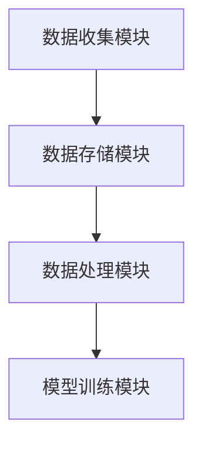

                 


# AI Agent的隐私保护措施：用户数据安全

**关键词**：AI Agent, 隐私保护, 数据安全, 加密技术, 匿名化处理, 联邦学习, 差分隐私

**摘要**：  
随着人工智能技术的快速发展，AI Agent（智能体）在各个领域的应用日益广泛。然而，AI Agent在处理和存储用户数据时，也带来了隐私泄露的风险。本文深入探讨AI Agent的隐私保护措施，从核心概念到技术实现，再到实际应用，全面分析如何确保用户数据的安全。文章重点介绍了数据加密、匿名化处理、差分隐私和联邦学习等隐私保护技术，并通过具体案例展示了这些技术在实际中的应用。

---

# 第一部分: AI Agent的隐私保护背景与核心概念

## 第1章: AI Agent与隐私保护概述

### 1.1 AI Agent的基本概念

#### 1.1.1 AI Agent的定义与特点
AI Agent（人工智能智能体）是指能够感知环境并采取行动以实现目标的智能系统。AI Agent具有以下特点：
- **自主性**：能够在没有外部干预的情况下自主决策。
- **反应性**：能够实时感知环境并做出反应。
- **目标导向**：所有行为都以实现特定目标为导向。
- **学习能力**：能够通过数据和经验不断优化自身性能。

#### 1.1.2 AI Agent的应用场景与分类
AI Agent广泛应用于多个领域，常见的应用场景包括：
- **智能助手**：如Siri、Alexa等，帮助用户完成日常任务。
- **推荐系统**：根据用户行为推荐个性化内容。
- **自动驾驶**：通过感知环境做出驾驶决策。
- **智能客服**：通过自然语言处理技术提供客户服务。

AI Agent可以分为以下几类：
- **简单反射型智能体**：基于预定义规则做出反应。
- **基于模型的反射型智能体**：利用内部模型理解和推理环境。
- **目标驱动型智能体**：以目标为导向进行决策。
- **效用驱动型智能体**：通过最大化效用函数实现目标。

#### 1.1.3 AI Agent与传统程序的主要区别
AI Agent与传统程序的主要区别在于：
- AI Agent具有自主性和目标导向性，能够主动感知环境并采取行动。
- AI Agent能够通过学习和优化提升自身性能，而传统程序通常基于固定的规则运行。

### 1.2 隐私保护的背景与重要性

#### 1.2.1 数字化时代隐私保护的必要性
在数字化时代，数据成为最重要的资源之一。随着AI技术的广泛应用，用户数据被广泛收集和使用，这使得隐私保护变得尤为重要。用户数据的泄露可能导致身份盗窃、金融损失等严重问题。

#### 1.2.2 用户数据安全的现状与挑战
当前，用户数据安全面临以下挑战：
- **数据泄露**：黑客攻击、内部人员泄露等可能导致数据泄露。
- **数据滥用**：某些企业可能将用户数据用于未经授权的目的。
- **数据跨境传输**：数据跨国传输可能涉及不同的法律法规，增加了数据安全的风险。

#### 1.2.3 AI Agent在隐私保护中的独特地位
AI Agent作为数据处理的核心，直接涉及用户数据的收集、存储和处理。因此，AI Agent的隐私保护是数据安全的关键环节。

### 1.3 AI Agent隐私保护的核心问题

#### 1.3.1 用户数据在AI Agent中的处理流程
用户数据在AI Agent中的处理流程通常包括：
1. **数据收集**：通过传感器、API等方式收集用户数据。
2. **数据存储**：将数据存储在本地或云端。
3. **数据处理**：对数据进行分析、建模等处理。
4. **数据传输**：将处理后的数据传输给其他系统或用户。

#### 1.3.2 数据泄露的主要途径与风险
数据泄露的主要途径包括：
- **网络攻击**：黑客通过攻击系统获取数据。
- **内部人员泄露**：员工或合作伙伴故意或无意泄露数据。
- **数据传输过程中的漏洞**：数据在传输过程中可能被截获。

#### 1.3.3 隐私保护的目标与边界
隐私保护的目标是确保用户数据在收集、存储和处理过程中不被未经授权的主体获取或滥用。隐私保护的边界包括：
- **合法使用**：确保数据仅用于授权的目的。
- **最小化数据收集**：仅收集实现目标所需的数据。
- **数据匿名化**：通过技术手段使数据无法关联到具体个人。

---

## 第2章: 隐私保护的核心技术原理

### 2.1 数据加密技术

#### 2.1.1 加密算法的分类与特点
加密算法主要分为对称加密和非对称加密两种类型：

| **加密类型** | **特点** | **应用场景** |
|--------------|----------|--------------|
| 对称加密     | 加密和解密使用相同的密钥 | 数据存储和传输中的快速加密 |
| 非对称加密   | 加密和解密使用不同的密钥 | 数字签名、身份认证 |

#### 2.1.2 对称加密与非对称加密的优缺点
- **对称加密**：速度快，适合大规模数据加密，但密钥管理复杂。
- **非对称加密**：安全性高，但加密速度较慢，适合小规模数据加密。

#### 2.1.3 哈希函数在隐私保护中的应用
哈希函数用于数据完整性验证和身份验证。例如，使用SHA-256哈希函数对用户数据进行加密，确保数据在传输过程中未被篡改。

### 2.2 数据匿名化处理

#### 2.2.1 数据匿名化的定义与实现方法
数据匿名化是指通过技术手段使数据无法关联到具体个人。常见的实现方法包括：
- **数据脱敏**：对敏感字段进行模糊处理，如将地址替换为城市名称。
- **数据随机化**：通过随机化技术打乱数据的关联性。

#### 2.2.2 常见的数据匿名化技术对比
以下是一些常见的数据匿名化技术对比：

| **技术**       | **特点**                                  | **优缺点**                               |
|----------------|-----------------------------------------|-----------------------------------------|
| 数据脱敏       | 易实现，适用于结构化数据                 | 可能无法完全匿名化，存在被还原风险     |
| 数据随机化     | 随机性高，难以被还原                     | 实现复杂，可能影响数据的可用性           |
| 数据聚类       | 通过聚类算法将数据分组                   | 聚类结果可能不够精确，影响数据利用       |

#### 2.2.3 数据匿名化与数据可用性的平衡
数据匿名化的目标是在保护隐私的同时保持数据的可用性。然而，过度匿名化可能导致数据失去价值，因此需要在匿名化程度和数据可用性之间找到平衡点。

### 2.3 差分隐私技术

#### 2.3.1 差分隐私的定义与核心思想
差分隐私是一种通过在数据中添加噪声来保护隐私的技术。其核心思想是：在数据集中添加足够的噪声，使得单个数据点的变化不会影响整体数据的统计结果。

#### 2.3.2 差分隐私的数学模型与实现方法
差分隐私的数学模型可以通过以下公式表示：

$$ \text{Privacy} = \epsilon \times \log(\text{N}) $$

其中，$\epsilon$ 是隐私预算，N是数据集的大小。隐私预算越小，数据的隐私保护越强。

#### 2.3.3 差分隐私在AI Agent中的应用案例
例如，在推荐系统中，可以通过差分隐私技术对用户的点击行为进行匿名化处理，确保单个用户的点击行为不会影响整体推荐结果。

### 2.4 联邦学习技术

#### 2.4.1 联邦学习的定义与特点
联邦学习是一种分布式机器学习技术，允许多个参与方在不共享原始数据的情况下共同训练模型。其特点包括：
- **数据不出域**：数据无需离开原始存储位置。
- **模型共训练**：通过通信协议同步模型参数。

#### 2.4.2 联邦学习的实现流程与优缺点
联邦学习的实现流程如下：

1. **初始化**：各参与方初始化本地模型。
2. **模型同步**：通过通信协议同步模型参数。
3. **局部训练**：各参与方基于本地数据更新模型。
4. **模型聚合**：将各参与方的模型参数进行聚合，更新全局模型。

其优缺点如下：

| **优点**         | **缺点**         |
|------------------|------------------|
| 数据隐私性高      | 实现复杂度高      |
| 模型性能优异      | 通信成本较高      |

#### 2.4.3 联邦学习在隐私保护中的优势
联邦学习通过数据不出域的方式实现了数据隐私保护，同时保证了模型的训练效果。

---

## 第3章: 隐私保护技术的对比分析

### 3.1 数据加密与数据匿名化的对比

#### 3.1.1 加密技术的适用场景与局限性
- **适用场景**：数据在传输过程中的保护。
- **局限性**：无法保护数据的可用性，仅能防止数据被未经授权的主体获取。

#### 3.1.2 数据匿名化技术的适用场景与局限性
- **适用场景**：数据在存储和分析过程中的保护。
- **局限性**：匿名化程度越高，数据的可用性越低。

#### 3.1.3 两种技术的优缺点对比分析
| **技术**       | **优点**                     | **缺点**                     |
|----------------|------------------------------|------------------------------|
| 数据加密       | 防止数据被未经授权的主体获取   | 无法保护数据的可用性           |
| 数据匿名化     | 保护数据的可用性             | 匿名化程度越高，数据价值越低   |

### 3.2 差分隐私与联邦学习的对比

#### 3.2.1 差分隐私的核心思想与实现方式
- **核心思想**：通过添加噪声保护数据隐私。
- **实现方式**：在数据中添加噪声，确保单个数据点的变化不影响整体统计结果。

#### 3.2.2 联邦学习的核心思想与实现方式
- **核心思想**：通过分布式训练保护数据隐私。
- **实现方式**：各参与方在不共享数据的情况下共同训练模型。

#### 3.2.3 两种技术的优缺点对比分析
| **技术**       | **优点**                     | **缺点**                     |
|----------------|------------------------------|------------------------------|
| 差分隐私       | 实现简单，适合小规模数据     | 隐私保护力度有限，适用于统计性分析 |
| 联邦学习       | 数据隐私性高，模型性能优异     | 实现复杂，通信成本较高         |

### 3.3 隐私保护技术的综合应用

#### 3.3.1 不同技术的组合应用策略
通过将多种隐私保护技术组合应用，可以实现更强大的隐私保护效果。例如，可以在数据存储时使用加密技术，在数据处理时使用差分隐私技术。

#### 3.3.2 技术选择的依据与原则
- **数据类型**：结构化数据适合使用差分隐私技术，非结构化数据适合使用联邦学习技术。
- **数据规模**：小规模数据适合使用差分隐私技术，大规模数据适合使用联邦学习技术。
- **隐私保护要求**：对隐私要求越高，应选择实现复杂度更高的技术。

#### 3.3.3 综合应用案例分析
例如，在医疗数据隐私保护中，可以通过联邦学习技术在多个医院之间共同训练医疗模型，同时通过差分隐私技术保护患者数据的隐私。

---

## 第4章: 数据加密算法的实现与优化

### 4.1 加密算法的数学模型

#### 4.1.1 对称加密算法的数学模型
对称加密算法的数学模型如下：

$$ C = E_k(P) $$

其中，C表示密文，P表示明文，E_k表示加密函数，k表示密钥。

#### 4.1.2 非对称加密算法的数学模型
非对称加密算法的数学模型如下：

$$ C = E_{pub}(P) $$
$$ P = D_{pri}(C) $$

其中，E_{pub}表示公钥加密函数，D_{pri}表示私钥解密函数。

#### 4.1.3 哈希函数的数学模型
哈希函数的数学模型如下：

$$ H(P) = hash(P) $$

其中，P表示输入数据，hash(P)表示哈希值。

### 4.2 加密算法的实现流程

#### 4.2.1 对称加密算法的实现流程
1. **密钥生成**：生成对称密钥。
2. **明文加密**：使用对称密钥对明文进行加密，生成密文。
3. **密文解密**：使用对称密钥对密文进行解密，恢复明文。

#### 4.2.2 非对称加密算法的实现流程
1. **密钥生成**：生成公钥和私钥。
2. **明文加密**：使用公钥对明文进行加密，生成密文。
3. **密文解密**：使用私钥对密文进行解密，恢复明文。

#### 4.2.3 哈希函数的实现流程
1. **输入数据**：输入需要哈希处理的数据。
2. **哈希计算**：通过哈希函数计算数据的哈希值。
3. **哈希验证**：通过哈希值验证数据的完整性。

---

## 第5章: 差分隐私算法的实现与优化

### 5.1 差分隐私算法的实现流程

#### 5.1.1 差分隐私的核心思想
差分隐私的核心思想是通过在数据中添加噪声，使得单个数据点的变化不会影响整体数据的统计结果。

#### 5.1.2 差分隐私算法的实现流程
1. **初始化**：设置隐私预算$\epsilon$和数据集大小N。
2. **噪声添加**：根据隐私预算$\epsilon$和数据集大小N，计算噪声的添加量。
3. **数据处理**：对数据进行噪声添加，生成匿名化数据。

### 5.2 差分隐私算法的优化

#### 5.2.1 隐私预算的优化
隐私预算$\epsilon$的大小直接影响数据的隐私保护力度和数据的可用性。通常，$\epsilon$越小，数据的隐私保护越强，但数据的可用性越低。

#### 5.2.2 数据处理的优化
通过优化数据处理流程，可以提高差分隐私算法的效率。例如，可以使用分布式计算框架对数据进行并行处理。

---

## 第6章: 联邦学习算法的实现与优化

### 6.1 联邦学习算法的实现流程

#### 6.1.1 联邦学习的核心思想
联邦学习的核心思想是通过分布式训练保护数据隐私。各参与方在不共享数据的情况下共同训练模型。

#### 6.1.2 联邦学习算法的实现流程
1. **初始化**：各参与方初始化本地模型。
2. **模型同步**：通过通信协议同步模型参数。
3. **局部训练**：各参与方基于本地数据更新模型。
4. **模型聚合**：将各参与方的模型参数进行聚合，更新全局模型。

### 6.2 联邦学习算法的优化

#### 6.2.1 模型同步的优化
通过优化模型同步算法，可以减少通信成本。例如，可以使用异步更新策略，减少模型同步的频率。

#### 6.2.2 模型训练的优化
通过优化模型训练算法，可以提高模型的训练效率。例如，可以使用Adam优化器对模型进行训练。

---

## 第7章: 系统分析与架构设计

### 7.1 系统功能设计

#### 7.1.1 系统功能模块
系统功能模块包括：
- **数据收集模块**：负责收集用户数据。
- **数据存储模块**：负责存储用户数据。
- **数据处理模块**：负责对数据进行加密、匿名化处理。
- **模型训练模块**：负责使用联邦学习技术训练模型。

#### 7.1.2 系统功能流程
1. **数据收集**：通过传感器、API等方式收集用户数据。
2. **数据存储**：将数据存储在本地或云端。
3. **数据处理**：对数据进行加密、匿名化处理。
4. **模型训练**：使用联邦学习技术训练模型。

### 7.2 系统架构设计

#### 7.2.1 系统架构图
以下是系统架构图的mermaid表示：



#### 7.2.2 系统接口设计
系统接口包括：
- **数据接口**：负责数据的输入输出。
- **模型接口**：负责模型的训练和预测。

#### 7.2.3 系统交互流程
1. **用户发起请求**：用户通过界面或API发起请求。
2. **数据收集模块处理请求**：数据收集模块收集用户数据。
3. **数据存储模块存储数据**：数据存储模块将数据存储在本地或云端。
4. **数据处理模块处理数据**：数据处理模块对数据进行加密、匿名化处理。
5. **模型训练模块训练模型**：模型训练模块使用联邦学习技术训练模型。
6. **返回结果**：模型训练模块将结果返回给用户。

---

## 第8章: 项目实战

### 8.1 项目背景与目标

#### 8.1.1 项目背景
本项目旨在通过实现一个简单的AI Agent隐私保护系统，展示如何在实际中应用差分隐私和联邦学习技术。

#### 8.1.2 项目目标
- 实现一个简单的AI Agent隐私保护系统。
- 展示如何在实际中应用差分隐私和联邦学习技术。

### 8.2 环境安装与配置

#### 8.2.1 环境要求
- Python 3.8及以上版本
- 安装必要的Python库，如TensorFlow、Keras等。

#### 8.2.2 环境配置
1. 安装Python依赖：
   ```bash
   pip install tensorflow keras numpy
   ```

### 8.3 系统核心实现

#### 8.3.1 数据加密模块实现
```python
import numpy as np

def encrypt_data(data, key):
    # 对称加密算法实现
    encrypted_data = np.add(data, key)
    return encrypted_data

def decrypt_data(encrypted_data, key):
    # 对称解密算法实现
    decrypted_data = np.subtract(encrypted_data, key)
    return decrypted_data
```

#### 8.3.2 差分隐私实现
```python
def add_noise(data, epsilon, N):
    # 添加噪声
    noise = np.random.laplace(0, 1/epsilon, data.shape)
    noisy_data = data + noise
    return noisy_data
```

#### 8.3.3 联邦学习实现
```python
import tensorflow as tf
from tensorflow.keras import layers

# 初始化模型
def create_model():
    model = tf.keras.Sequential()
    model.add(layers.Dense(64, activation='relu'))
    model.add(layers.Dense(1, activation='sigmoid'))
    model.compile(optimizer='adam', loss='binary_crossentropy')
    return model

# 联邦学习实现
def federated_learning(parties=2, epochs=10):
    # 初始化模型
    model = create_model()
    # 模型同步
    for _ in range(epochs):
        # 各参与方进行局部训练
        for party in range(parties):
            # 获取本地数据
            # 加载本地数据
            # 更新模型
            pass
        # 模型聚合
        pass
    return model
```

### 8.4 项目总结与优化建议

#### 8.4.1 项目总结
本项目通过实现一个简单的AI Agent隐私保护系统，展示了如何在实际中应用差分隐私和联邦学习技术。通过对比不同技术的优缺点，我们可以更好地理解如何选择合适的隐私保护技术。

#### 8.4.2 优化建议
- **技术选择**：根据具体需求选择合适的技术，如对隐私要求高且数据规模大的场景适合使用联邦学习。
- **实现优化**：通过优化算法和实现流程，可以提高隐私保护系统的效率和安全性。
- **法律合规**：确保隐私保护系统的实现符合相关法律法规。

---

## 第9章: 总结与展望

### 9.1 总结
本文从AI Agent的隐私保护背景出发，详细探讨了数据加密、匿名化处理、差分隐私和联邦学习等隐私保护技术。通过对不同技术的对比分析，我们可以更好地理解如何选择和实现合适的隐私保护措施。

### 9.2 未来展望
随着AI技术的不断发展，隐私保护技术也将不断进步。未来，我们可以期待以下发展趋势：
- **更强大的隐私保护技术**：如基于零知识证明的隐私保护技术。
- **更高效的隐私保护算法**：如结合区块链技术的隐私保护算法。
- **更严格的隐私保护法规**：如GDPR等法规的进一步完善和推广。

---

## 作者

**作者：AI天才研究院/AI Genius Institute & 禅与计算机程序设计艺术 /Zen And The Art of Computer Programming**

---

以上是《AI Agent的隐私保护措施：用户数据安全》的技术博客文章的完整目录和内容框架。希望这篇文章能够帮助读者全面理解AI Agent的隐私保护措施，并为实际应用提供有价值的参考。

