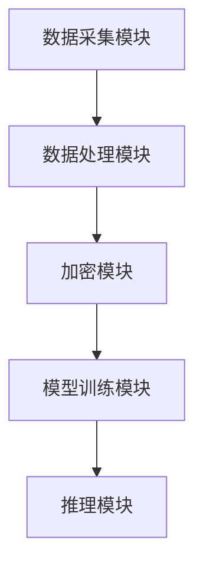

                 


# AI Agent的隐私保护：数据匿名化与加密

---

## 关键词：AI Agent、隐私保护、数据匿名化、数据加密、安全隐私、智能系统

---

## 摘要：  
随着人工智能技术的快速发展，AI Agent（智能体）在各个领域的应用越来越广泛。然而，AI Agent在处理海量数据时，隐私保护问题也随之而来。数据匿名化与加密技术作为保护隐私的核心手段，是确保AI Agent安全运行的关键。本文将从AI Agent的基本原理出发，深入探讨数据匿名化与加密技术在隐私保护中的应用，结合实际案例和系统设计，为读者提供全面的技术解析。

---

## 第1章：AI Agent与隐私保护的背景

### 1.1 AI Agent的基本概念  
AI Agent（人工智能代理）是一种能够感知环境、自主决策并执行任务的智能实体。它可以是一个软件程序、一个机器人，甚至是嵌入在设备中的算法。AI Agent的核心能力包括知识表示、行为推理和智能决策。  

#### 1.1.1 AI Agent的定义与分类  
- **定义**：AI Agent是一个能够与环境交互、感知信息、并根据目标做出决策的智能系统。  
- **分类**：  
  - **简单反射型**：基于预定义规则做出反应。  
  - **基于模型的反射型**：利用内部模型感知环境并做出决策。  
  - **目标驱动型**：以特定目标为导向，主动规划行动。  
  - **实用驱动型**：以效用最大化为目标，权衡多任务优先级。  

#### 1.1.2 AI Agent的应用场景  
- 智能助手（如Siri、Alexa）  
- 自动驾驶汽车  
- 智能客服系统  
- 智慧城市中的环境监测与管理  

#### 1.1.3 隐私保护的重要性  
AI Agent在处理数据时，可能会接触到用户的敏感信息（如位置、健康数据、交易记录等）。如果这些数据没有得到妥善保护，可能导致隐私泄露、身份盗窃或其他安全风险。因此，隐私保护是AI Agent设计中的核心问题之一。

---

### 1.2 数据匿名化与加密技术  
数据匿名化与加密是保护隐私的两大核心技术。  

#### 1.2.1 数据匿名化的概念  
数据匿名化是指通过技术手段将数据中的敏感信息脱敏或隐藏，使得无法通过匿名化后的数据反推出个人身份。  

#### 1.2.2 数据加密的基本原理  
数据加密是通过数学算法将明文转换为密文的过程。加密可以分为对称加密和非对称加密两种类型。  

#### 1.2.3 隐私保护的必要性  
- 遵守法律法规（如GDPR、CCPA等）。  
- 保护用户信任。  
- 避免数据滥用。  

---

## 第2章：AI Agent的核心原理  

### 2.1 AI Agent的定义与类型  
AI Agent的核心原理包括感知环境、知识表示、推理决策和执行行动。  

#### 2.1.1 知识表示  
知识表示是AI Agent理解世界的基础。常见的知识表示方法包括符号逻辑、语义网络和本体论。  

#### 2.1.2 行为推理  
行为推理是AI Agent根据知识和环境信息做出决策的过程。常用算法包括逻辑推理、概率推理和启发式推理。  

#### 2.1.3 智能决策  
智能决策是AI Agent的核心能力，涉及多目标优化、风险评估和效用计算。  

#### 2.1.4 系统架构  
AI Agent的系统架构通常包括感知层、知识层、推理层和执行层。  

---

### 2.2 数据隐私保护的基本概念  

#### 2.2.1 数据生命周期  
数据的生命周期包括采集、存储、处理、共享和销毁。  

#### 2.2.2 隐私模型  
隐私模型是描述数据隐私特性的数学模型，常见的隐私模型包括k-anonymity、l-diversity和δ-privacy。  

#### 2.2.3 隐私风险  
隐私风险是指数据在处理过程中可能被泄露或滥用的风险。  

---

## 第3章：数据匿名化的原理与方法  

### 3.1 数据匿名化的概念  

#### 3.1.1 数据脱敏  
数据脱敏是指通过技术手段将敏感数据进行变形或隐藏，使其无法被还原。  

#### 3.1.2 k-anonymity  
k-anonymity是一种常见的数据匿名化方法，确保数据集中每个记录的特征组合至少有k个相同的记录。  

#### 3.1.3 数据匿名化的挑战  
- 信息损失：匿名化可能导致数据的可用性下降。  
- 攻击者的技术进步：匿名化技术可能被高级攻击者破解。  

---

### 3.2 数据匿名化的主要方法  

#### 3.2.1 k-anonymity  
k-anonymity通过将数据进行泛化处理，使得每个记录的特征组合至少有k个相同的记录。  

#### 3.2.2 l-diversity  
l-diversity是在k-anonymity的基础上，进一步确保每个记录的特征组合在多个方面具有多样性。  

#### 3.2.3 混淆技术  
混淆技术通过添加噪声或随机化数据，使得攻击者无法准确还原原始数据。  

---

## 第4章：数据加密技术  

### 4.1 加密算法分类  

#### 4.1.1 对称加密  
对称加密是一种使用同一密钥进行加密和解密的算法，常见的算法包括AES和DES。  

#### 4.1.2 非对称加密  
非对称加密是使用公钥和私钥进行加密和解密的算法，常见的算法包括RSA和椭圆曲线加密。  

#### 4.1.3 密码学哈希  
密码学哈希是一种将任意长度的输入映射为固定长度的哈希值的技术，常用于数据完整性验证和签名。  

---

### 4.2 加密在数据隐私中的应用  

#### 4.2.1 数据加密的流程  
1. 数据预处理：对数据进行标准化或归一化处理。  
2. 加密：使用加密算法对数据进行加密。  
3. 解密：使用密钥对数据进行解密。  

#### 4.2.2 加密的安全性评估  
- 加密强度：算法的安全性取决于密钥长度和算法复杂度。  
- 攻击模型：考虑密钥是否被泄露、是否被侧信道攻击等因素。  

---

## 第5章：AI Agent中的隐私保护框架  

### 5.1 隐私保护框架的概念  

#### 5.1.1 隐私保护框架的设计原则  
- 最小化原则：只收集必要的数据。  
- 同步保护原则：在数据的全生命周期中进行保护。  
- 可追溯原则：确保数据泄露可追溯。  

---

### 5.2 隐私保护框架的实现  

#### 5.2.1 数据预处理  
- 数据清洗：去除无关数据。  
- 数据脱敏：对敏感数据进行脱敏处理。  

#### 5.2.2 模型训练  
- 隐私保护机制：在模型训练过程中加入隐私保护机制，如 federated learning。  
- 数据加密：对训练数据进行加密处理。  

#### 5.2.3 推理与存储  
- 隐私保护推理：在推理过程中保护数据隐私。  
- 数据加密存储：对存储的数据进行加密保护。  

---

## 第6章：AI Agent隐私保护的系统架构  

### 6.1 系统功能设计  

#### 6.1.1 系统功能模块  
- 数据采集模块：负责采集原始数据。  
- 数据处理模块：负责数据的清洗和脱敏。  
- 加密模块：负责对数据进行加密处理。  
- 模型训练模块：负责训练AI Agent的核心模型。  
- 推理模块：负责基于模型进行推理和决策。  

---

### 6.2 系统架构设计  

#### 6.2.1 系统架构图  


---

## 第7章：AI Agent隐私保护的项目实战  

### 7.1 环境搭建  

#### 7.1.1 工具安装  
- 安装Python和相关库（如numpy、pandas、scikit-learn）。  
- 安装加密库（如cryptography）。  

#### 7.1.2 数据集准备  
- 下载公开数据集（如公开的医疗数据集）。  
- 数据清洗和预处理。  

---

### 7.2 核心实现  

#### 7.2.1 数据脱敏实现  
```python
def anonymize_data(dataframe):
    # 对敏感列进行脱敏处理
    sensitive_columns = ['name', 'address', 'phone']
    for col in sensitive_columns:
        dataframe[col] = dataframe[col].apply(lambda x: '***' + x[-4:])
    return dataframe
```

#### 7.2.2 数据加密实现  
```python
from cryptography.fernet import Fernet

# 生成密钥
key = Fernet.generate_key()
cipher = Fernet(key)

# 加密数据
encrypted_data = cipher.encrypt(dataframe.to_csv(index=False).encode())
```

---

## 第8章：案例分析与优化  

### 8.1 案例分析  
以医疗数据的AI Agent隐私保护为例，分析数据匿名化和加密技术的实际应用。  

#### 8.1.1 案例背景  
医疗数据包含患者的敏感信息，如病史、诊断结果等。  

#### 8.1.2 案例分析  
- 数据匿名化：对患者的姓名、地址和电话进行脱敏处理。  
- 数据加密：使用AES算法对医疗数据进行加密存储。  

---

### 8.2 优化建议  

#### 8.2.1 技术优化  
- 使用更强大的匿名化技术（如差分隐私）。  
- 采用更高效的加密算法（如AES-256）。  

#### 8.2.2 管理优化  
- 制定严格的访问控制政策。  
- 定期进行隐私保护培训。  

---

## 结论与展望  

### 9.1 结论  
AI Agent的隐私保护是人工智能技术发展中的重要问题。数据匿名化与加密技术是保护隐私的核心手段，但其应用需要结合具体的场景和需求。  

### 9.2 未来展望  
随着AI技术的不断发展，隐私保护技术也将不断创新。未来的研究方向包括：  
- 更高效的匿名化技术。  
- 更安全的加密算法。  
- 更智能的隐私保护框架。  

---

## 作者：AI天才研究院/AI Genius Institute & 禅与计算机程序设计艺术 /Zen And The Art of Computer Programming

