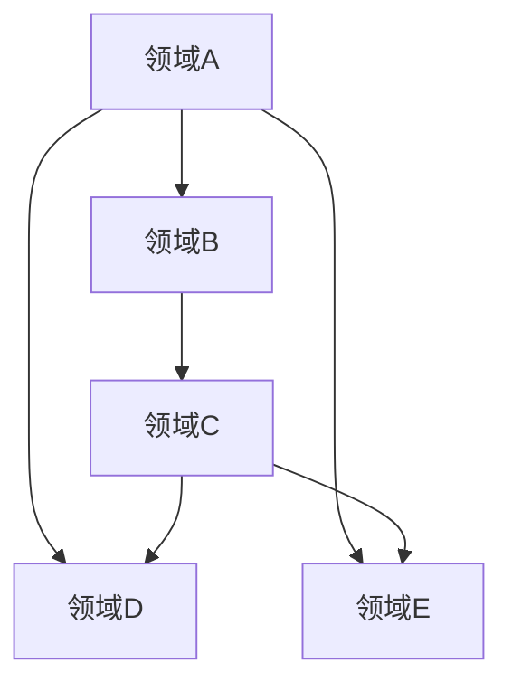
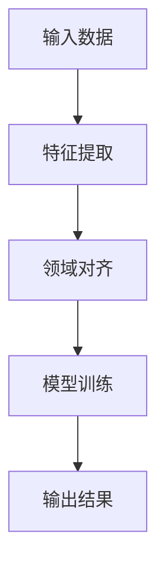

                 


# AI Agent的非监督域适应：跨领域泛化

## 关键词：AI Agent，非监督学习，域适应，跨领域泛化，算法原理

## 摘要：  
本文深入探讨了AI Agent在非监督域适应中的跨领域泛化能力，分析了其核心概念、算法原理和系统架构。通过详细阐述数学模型、系统设计和项目实战，结合最佳实践，为读者提供了全面的理解和实用的指导。

---

## 第一部分：AI Agent的非监督域适应背景与核心概念

### 第1章：问题背景与问题描述

#### 1.1 领域适应的背景与意义  
- **背景**：AI Agent在不同领域间的任务泛化需求日益增长。  
- **意义**：非监督域适应能够提升AI Agent的适应能力和泛化能力。  

#### 1.2 AI Agent的跨领域泛化需求  
- **核心任务**：处理多领域任务。  
- **应用场景**：医疗、金融、教育等。  

#### 1.3 非监督域适应的边界与外延  
- **边界条件**：数据分布差异、任务差异。  
- **适用场景**：无标签数据丰富的领域。  

---

## 第二部分：非监督域适应的核心概念与联系

### 第2章：核心概念与原理

#### 2.1 域适应的基本原理  
- **领域差异**：数据分布的差异。  
- **非监督域适应**：无需标签，通过特征对齐实现。  

#### 2.2 非监督学习的关键特征  
- **无标签数据**：处理方法多样。  
- **优点**：适应性强。  

#### 2.3 核心概念的ER实体关系图  



---

## 第三部分：非监督域适应的算法原理

### 第3章：算法原理与数学模型

#### 3.1 非监督域适应的核心算法  
- **对抗训练**：通过生成对抗网络实现领域对齐。  
- **数学模型**：定义损失函数。  

#### 3.2 算法流程图  



#### 3.3 算法的数学模型与公式  

$$\text{损失函数} = \mathbb{E}_{x \sim D_s}[f(x)] + \mathbb{E}_{x \sim D_t}[g(x)]$$  

---

## 第四部分：系统分析与架构设计

### 第4章：系统架构设计

#### 4.1 系统功能设计  
- **功能模块**：特征提取、领域对齐、模型训练。  

#### 4.2 系统架构图  


---

## 第五部分：项目实战

### 第5章：项目实战与案例分析

#### 5.1 环境安装  
- 安装Python、TensorFlow等库。  

#### 5.2 核心代码实现  

```python
def domain_adaptation():
    import tensorflow as tf
    # 定义特征提取模型
    feature_extractor = tf.keras.Sequential([
        tf.keras.layers.Dense(64, activation='relu'),
        tf.keras.layers.Dense(32, activation='relu')
    ])
    # 定义对抗网络
    discriminator = tf.keras.Sequential([
        tf.keras.layers.Dense(64, activation='relu'),
        tf.keras.layers.Dense(1, activation='sigmoid')
    ])
    # 定义损失函数
    loss_function = tf.keras.losses.BinaryCrossentropy()
    return feature_extractor, discriminator, loss_function
```

---

## 第六部分：最佳实践

### 第6章：总结与展望

#### 6.1 本章小结  
- 非监督域适应的核心概念和算法实现。  

#### 6.2 注意事项  
- 数据质量对结果影响重大。  

#### 6.3 拓展阅读  
- 生成对抗网络、迁移学习。  

---

## 作者：AI天才研究院/AI Genius Institute & 禅与计算机程序设计艺术 /Zen And The Art of Computer Programming

---

这篇文章详细探讨了AI Agent在非监督域适应中的跨领域泛化能力，结合了理论分析和实际案例，为读者提供了全面的理解和实践指导。

