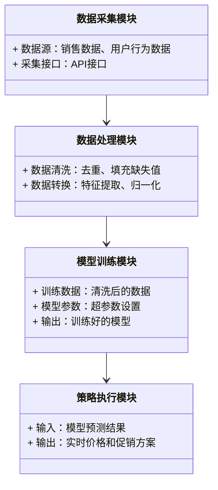
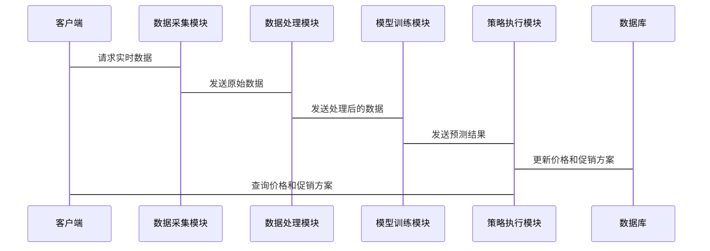

                 


# AI Agent辅助产品定价与促销策略制定的方法

> **关键词**：AI Agent，产品定价，促销策略，机器学习，动态定价，个性化促销

> **摘要**：本文详细探讨了AI Agent在产品定价与促销策略制定中的应用方法。通过分析AI Agent的核心概念、算法原理、系统架构设计以及实际项目实战，本文为读者提供了一种全新的视角来理解如何利用AI技术优化定价与促销策略。文章从背景介绍、核心概念、算法原理、系统设计、项目实战等多维度展开，结合实际案例和代码实现，全面解析了AI Agent在定价与促销中的优势与应用方法。

---

# 第一部分: AI Agent辅助产品定价与促销策略概述

## 第1章: AI Agent与产品定价概述

### 1.1 AI Agent的基本概念

#### 1.1.1 AI Agent的定义
AI Agent（人工智能代理）是指能够感知环境、自主决策并执行任务的智能实体。它能够通过数据驱动的方式，帮助人类完成复杂决策任务。AI Agent的核心在于其智能化和自动化能力，能够在动态环境中实时调整策略。

#### 1.1.2 AI Agent的核心特征
1. **自主性**：AI Agent能够自主决策，无需人工干预。
2. **反应性**：能够实时感知环境变化并做出响应。
3. **学习能力**：通过机器学习算法不断优化决策模型。
4. **可解释性**：决策过程需要清晰可追溯，便于分析和改进。

#### 1.1.3 AI Agent与传统定价策略的区别
传统定价策略通常依赖人工经验或静态模型，而AI Agent能够基于实时数据和动态市场变化，快速调整定价策略。AI Agent通过机器学习模型优化定价决策，能够在复杂场景下实现更精准的定价。

### 1.2 产品定价与促销策略的基本原理

#### 1.2.1 产品定价的基本概念
产品定价是指确定产品在市场中的价格，以实现利润最大化或市场份额目标。定价策略需要考虑成本、市场需求、竞争环境等多个因素。

#### 1.2.2 促销策略的基本原理
促销策略是指通过折扣、赠品、优惠券等方式，吸引消费者购买产品或服务。促销策略的核心在于精准识别目标用户，并通过优惠活动提升销量或品牌认知度。

#### 1.2.3 传统定价与促销策略的局限性
1. **数据依赖性**：传统策略往往依赖历史数据，难以实时调整。
2. **主观性**：定价和促销策略容易受到人为经验的影响，缺乏客观性。
3. **反应速度慢**：面对市场变化，传统策略难以快速调整。

### 1.3 AI Agent在定价与促销中的应用前景

#### 1.3.1 AI Agent在定价中的优势
1. **实时数据处理**：能够快速响应市场变化。
2. **精准预测**：通过机器学习模型实现精准的销售预测和定价优化。
3. **动态调整**：能够在实时监控中动态调整定价策略。

#### 1.3.2 AI Agent在促销中的优势
1. **精准目标定位**：通过用户行为分析，精准识别目标用户群体。
2. **个性化优惠推荐**：基于用户特征和偏好，提供个性化促销方案。
3. **实时反馈优化**：根据用户反馈实时调整促销策略。

#### 1.3.3 AI Agent在定价与促销中的结合应用
通过AI Agent的整合应用，企业可以实现定价与促销策略的协同优化。AI Agent不仅能够帮助企业在定价上实现精准决策，还能够通过促销活动提升销量，实现利润最大化。

---

## 第2章: AI Agent辅助定价与促销的核心概念

### 2.1 AI Agent辅助定价的核心概念

#### 2.1.1 数据驱动的定价模型
数据驱动的定价模型基于历史销售数据、市场趋势和用户行为数据，利用机器学习算法生成动态定价策略。这种模型能够根据市场需求变化实时调整价格。

#### 2.1.2 基于机器学习的定价策略
基于机器学习的定价策略通过训练模型，预测产品在不同价格点下的销量和利润，从而找到最优定价点。这种方法能够帮助企业在竞争激烈的市场中保持价格优势。

#### 2.1.3 动态定价与预测模型
动态定价是一种基于实时市场数据和用户行为的定价方法。AI Agent通过动态定价模型，能够实时调整价格以应对市场波动。

### 2.2 AI Agent辅助促销的核心概念

#### 2.2.1 基于用户行为分析的促销策略
基于用户行为分析的促销策略通过分析用户的购买记录、浏览行为和偏好，制定个性化的促销方案。这种方法能够提高促销活动的转化率和用户满意度。

#### 2.2.2 基于市场趋势的促销优化
通过分析市场趋势和竞争对手的定价策略，AI Agent能够帮助企业制定更具竞争力的促销策略。这种方法能够帮助企业快速响应市场变化，抢占先机。

#### 2.2.3 个性化促销策略的实现方法
个性化促销策略通过细分市场和用户画像，制定针对性的促销方案。AI Agent能够根据用户特征和需求，推荐最合适的促销活动。

### 2.3 AI Agent在定价与促销中的核心联系

#### 2.3.1 数据共享与模型整合
定价和促销策略的制定需要共享数据和模型，以实现协同优化。AI Agent能够将定价和促销策略整合到一个统一的系统中，实现数据的高效利用。

#### 2.3.2 动态调整与实时反馈
AI Agent能够实时监控市场变化和用户反馈，动态调整定价和促销策略。这种方法能够帮助企业快速响应市场变化，提升决策效率。

#### 2.3.3 用户行为分析与策略优化
通过分析用户行为数据，AI Agent能够优化定价和促销策略，提高用户转化率和满意度。这种方法能够帮助企业实现精准营销和个性化服务。

---

## 第3章: AI Agent辅助定价与促销的算法原理

### 3.1 基于机器学习的定价模型

#### 3.1.1 数据预处理与特征提取
数据预处理包括清洗数据、标准化和归一化处理。特征提取则是从原始数据中提取有用的特征，例如销量、价格、时间等。

#### 3.1.2 常见定价算法
1. **线性回归模型**：用于预测价格与销量的关系。
2. **随机森林模型**：用于分类和回归任务，能够处理非线性关系。
3. **XGBoost模型**：基于梯度提升的算法，能够处理复杂的数据关系。

#### 3.1.3 深度学习模型在定价中的应用
深度学习模型（如神经网络）能够处理高维数据和复杂模式，适用于复杂的定价场景。例如，利用LSTM模型预测未来价格趋势。

#### 3.1.4 算法实现步骤
1. 数据清洗与特征提取
2. 模型训练与调参
3. 模型评估与优化
4. 在线预测与实时调整

### 3.2 基于机器学习的促销优化算法

#### 3.2.1 用户行为分析
通过分析用户的点击流数据、购买记录和偏好，构建用户画像。例如，使用协同过滤算法推荐相似产品的促销方案。

#### 3.2.2 市场趋势预测
利用时间序列分析（如ARIMA模型）预测未来的市场趋势，帮助制定促销策略。

#### 3.2.3 个性化促销方案生成
通过聚类分析将用户分为不同的群体，针对每个群体设计不同的促销方案。例如，利用K-means算法进行用户分群。

### 3.3 动态定价与预测模型

#### 3.3.1 动态定价模型的实现
动态定价模型基于实时数据进行价格调整。例如，利用实时销售数据和库存信息，动态调整产品价格。

#### 3.3.2 预测模型的数学公式
动态定价模型的预测公式可以表示为：
$$
P(t) = \beta_0 + \beta_1 \cdot D(t) + \beta_2 \cdot S(t) + \epsilon
$$
其中，$P(t)$ 表示时间 $t$ 的价格，$D(t)$ 表示市场需求，$S(t)$ 表示库存状态，$\epsilon$ 是误差项。

#### 3.3.3 算法实现步骤
1. 实时数据采集
2. 数据预处理与特征提取
3. 模型训练与预测
4. 实时价格调整

---

## 第4章: 系统分析与架构设计方案

### 4.1 问题场景介绍
我们假设一个电子商务平台需要优化其定价和促销策略。通过引入AI Agent，平台可以实时调整价格和促销方案，以提高销量和利润。

### 4.2 系统功能设计

#### 4.2.1 系统功能模块
1. 数据采集模块：实时采集销售数据、用户行为数据和市场趋势数据。
2. 数据处理模块：清洗、转换和存储数据。
3. 模型训练模块：训练定价和促销优化模型。
4. 策略执行模块：根据模型预测结果调整价格和促销方案。
5. 实时监控模块：监控系统运行状态和效果。

#### 4.2.2 系统功能设计的ER类图


### 4.3 系统架构设计

#### 4.3.1 系统架构设计图


#### 4.3.2 系统交互流程


---

## 第5章: 项目实战

### 5.1 环境安装与配置

#### 5.1.1 安装Python环境
```bash
python --version
pip install numpy pandas scikit-learn xgboost
```

#### 5.1.2 安装机器学习库
```bash
pip install scikit-learn
pip install xgboost
pip install matplotlib
pip install joblib
```

### 5.2 核心算法实现

#### 5.2.1 定价模型的实现
```python
import numpy as np
import pandas as pd
from sklearn.model_selection import train_test_split
from sklearn.ensemble import RandomForestRegressor
from sklearn.metrics import mean_squared_error

# 数据加载与处理
data = pd.read_csv('pricing_data.csv')
X = data[['feature1', 'feature2', 'feature3']]
y = data['target']

# 数据分割
X_train, X_test, y_train, y_test = train_test_split(X, y, test_size=0.2, random_state=42)

# 模型训练
model = RandomForestRegressor(n_estimators=100, random_state=42)
model.fit(X_train, y_train)

# 模型预测
y_pred = model.predict(X_test)
print('均方误差:', mean_squared_error(y_test, y_pred))
```

#### 5.2.2 促销策略优化的实现
```python
import numpy as np
import pandas as pd
from sklearn.cluster import KMeans
from sklearn.preprocessing import StandardScaler

# 数据加载与处理
data = pd.read_csv('promotion_data.csv')
X = data[['feature1', 'feature2', 'feature3']]
scaler = StandardScaler()
X_scaled = scaler.fit_transform(X)

# 聚类分析
model = KMeans(n_clusters=3, random_state=42)
model.fit(X_scaled)

# 预测簇
clusters = model.predict(X_scaled)
data['cluster'] = clusters
```

### 5.3 案例分析与详细解读

#### 5.3.1 定价策略的案例分析
假设我们有一个电子产品销售数据集，通过随机森林模型预测价格，结果如下：
```python
# 预测结果
y_pred = model.predict(X_test)
print('预测价格:', y_pred[:5])
print('实际价格:', y_test[:5].values)
```
通过对比预测价格和实际价格，可以看出模型的预测准确性。

#### 5.3.2 促销策略的案例分析
通过K-means聚类模型，将用户分为3个簇，分别制定不同的促销方案：
```python
# 簇0：高价值用户，提供折扣优惠
# 簇1：中等价值用户，提供赠品
# 簇2：低价值用户，提供免费试用
```

---

## 第6章: 总结与展望

### 6.1 总结
本文详细探讨了AI Agent在产品定价与促销策略制定中的应用方法。通过分析AI Agent的核心概念、算法原理、系统架构设计以及实际项目实战，我们展示了如何利用AI技术优化定价与促销策略。

### 6.2 未来展望
随着AI技术的不断发展，AI Agent在定价与促销中的应用将更加广泛。未来的研究方向包括：
1. **更复杂的定价模型**：如强化学习在动态定价中的应用。
2. **更个性化的促销策略**：通过深度学习模型实现更加精准的用户画像和个性化推荐。
3. **实时反馈与自适应优化**：通过实时数据反馈，实现更加灵活和高效的策略调整。

---

**作者**：AI天才研究院/AI Genius Institute & 禅与计算机程序设计艺术/Zen And The Art of Computer Programming

