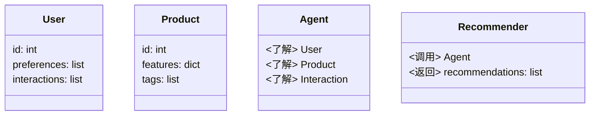
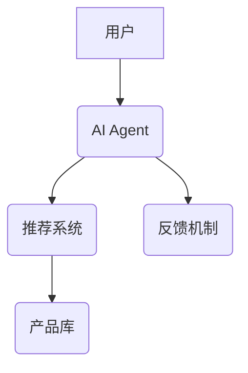

                 


# AI Agent辅助企业产品推荐与个性化服务

**关键词**：AI Agent, 企业推荐系统, 个性化服务, 机器学习, 人工智能

**摘要**：本文详细探讨了AI Agent在企业产品推荐和个性化服务中的应用，分析了传统推荐系统的局限性，介绍了AI Agent的核心原理、算法实现、系统架构设计，以及如何通过实际案例实现AI Agent辅助的企业推荐系统。文章内容涵盖从理论到实践的各个方面，为技术从业者提供了全面的指导和深入的见解。

---

# 第1章: AI Agent的基本概念与背景介绍

## 1.1 问题背景

### 1.1.1 传统企业推荐系统的局限性

传统的企业推荐系统主要依赖协同过滤、基于内容的推荐或混合推荐方法，存在以下问题：

- **数据稀疏性**：当用户数量较少时，协同过滤效果不佳。
- **冷启动问题**：新用户或新产品的推荐效果差。
- **动态性差**：难以实时适应用户偏好变化。

### 1.1.2 个性化服务的需求增长

随着市场竞争加剧，用户对个性化服务的需求日益增长，企业需要更精准的推荐策略来提升用户体验和转化率。

### 1.1.3 AI Agent的引入动机

引入AI Agent可以解决传统推荐系统的局限性，通过动态学习和自适应推荐提升用户体验。

## 1.2 问题描述

### 1.2.1 企业产品推荐的核心问题

企业推荐系统需要解决如何基于用户行为、偏好和产品特征进行精准推荐的问题。

### 1.2.2 用户个性化需求的多样性

用户的需求多样化，不同用户对产品的偏好差异大，传统推荐系统难以满足所有用户的需求。

### 1.2.3 现有推荐系统的不足

现有推荐系统在实时性、动态适应性和个性化深度上存在不足，无法满足复杂的企业推荐需求。

## 1.3 问题解决

### 1.3.1 AI Agent的解决方案

AI Agent通过实时学习和动态调整推荐策略，提供个性化服务。

### 1.3.2 AI Agent在推荐系统中的优势

- 实时性：能够快速响应用户需求变化。
- 自适应性：根据用户行为动态调整推荐策略。
- 深度个性化：结合用户特征和行为数据，提供更精准的推荐。

### 1.3.3 AI Agent与传统推荐系统的对比

| 对比维度       | AI Agent推荐系统 | 传统推荐系统 |
|----------------|------------------|--------------|
| 数据处理       | 实时动态学习     | 离线批量处理 |
| 精准度         | 更高             | 较低         |
| 适应性         | 更强             | 较弱         |

## 1.4 边界与外延

### 1.4.1 AI Agent的应用边界

AI Agent适用于需要动态调整和实时响应的推荐场景，如电商、金融等领域。

### 1.4.2 个性化服务的范围界定

个性化服务包括产品推荐、内容推荐、服务推荐等多种形式，需根据具体场景进行定制。

### 1.4.3 与其他技术的关联

AI Agent结合NLP、深度学习等技术，提升推荐系统的性能和用户体验。

## 1.5 概念结构与核心要素

### 1.5.1 AI Agent的组成要素

- **感知模块**：收集用户行为和反馈数据。
- **学习模块**：分析数据并生成推荐策略。
- **决策模块**：根据策略生成推荐结果。
- **执行模块**：将推荐结果输出给用户。

### 1.5.2 个性化服务的核心要素

- **用户特征**：用户的基本信息、行为数据。
- **产品特征**：产品的属性、标签。
- **推荐策略**：基于算法生成的推荐规则。

### 1.5.3 推荐系统的整体架构

推荐系统的整体架构包括数据采集、数据处理、推荐算法、结果展示和反馈优化五个部分。

---

# 第2章: AI Agent的核心概念与原理

## 2.1 核心概念原理

### 2.1.1 AI Agent的基本原理

AI Agent通过感知、学习、决策和执行四个步骤实现推荐功能。

### 2.1.2 个性化推荐的算法原理

个性化推荐算法包括协同过滤、基于内容的推荐和深度学习推荐。

### 2.1.3 产品推荐的逻辑流程

产品推荐的逻辑流程包括数据采集、特征提取、算法选择、结果输出和反馈优化。

## 2.2 核心概念属性对比

### 2.2.1 不同推荐算法的对比表格

| 算法类型       | 协同过滤 | 基于内容的推荐 | 深度学习推荐 |
|----------------|----------|----------------|-------------|
| 数据需求       | 用户行为 | 产品属性       | 用户行为+产品属性 |
| 优点           | 管理简单 | 内容解释性高     | 高准确性     |
| 缺点           | 数据稀疏 | 计算复杂度高     | 训练时间长   |

### 2.2.2 AI Agent与传统推荐系统的对比

AI Agent在实时性和个性化深度上优于传统推荐系统。

### 2.2.3 不同个性化服务的特征分析

不同个性化服务的特征包括数据来源、推荐算法、反馈机制等。

## 2.3 ER实体关系图

```mermaid
er
actor: 用户
agent: AI Agent
product: 产品
preference: 用户偏好
interaction: 用户与AI Agent的交互
```

---

# 第3章: AI Agent的算法原理与实现

## 3.1 推荐系统算法原理

### 3.1.1 基于协同过滤的推荐算法

协同过滤算法基于用户相似性进行推荐。

### 3.1.2 基于内容的推荐算法

内容推荐算法基于产品特征进行推荐。

### 3.1.3 基于深度学习的推荐算法

深度学习推荐算法利用神经网络进行推荐。

## 3.2 对话式交互算法

### 3.2.1 基于NLP的对话生成

使用NLP技术生成自然语言对话。

### 3.2.2 基于强化学习的对话优化

通过强化学习优化对话策略。

### 3.2.3 对话历史的处理与分析

分析对话历史以提升推荐准确性。

## 3.3 算法实现代码

### 3.3.1 协同过滤算法实现

```python
def collaborative_filtering(user_matrix):
    # 计算用户相似度
    similarity = cosine_similarity(user_matrix)
    # 找到最相似的用户
    similar_users = np.argsort(similarity, axis=0)
    return similar_users
```

### 3.3.2 基于深度学习的推荐模型

```python
class DeepLearningModel(tf.keras.Model):
    def __init__(self, user_embedding_dim, product_embedding_dim):
        super(DeepLearningModel, self).__init__()
        self.user_embeddings = tf.keras.layers.Embedding(...)
        self.product_embeddings = tf.keras.layers.Embedding(...)
        self.dnn = tf.keras.Sequential([...])
    
    def call(self, inputs):
        user_ids, product_ids = inputs
        user_embeddings = self.user_embeddings(user_ids)
        product_embeddings = self.product_embeddings(product_ids)
        concatenated = tf.concat([user_embeddings, product_embeddings], axis=-1)
        output = self.dnn(concatenated)
        return output
```

## 3.4 算法优化与调优

### 3.4.1 参数调整

调整模型参数以优化推荐效果。

### 3.4.2 模型评估

使用准确率、召回率和F1值评估模型性能。

### 3.4.3 实验对比

通过实验对比不同算法的性能差异。

---

# 第4章: AI Agent的系统架构设计

## 4.1 系统功能设计

### 4.1.1 领域模型



### 4.1.2 功能模块

- **用户模块**：处理用户信息和偏好。
- **产品模块**：处理产品信息和特征。
- **推荐模块**：实现推荐算法。
- **交互模块**：处理用户与AI Agent的交互。

## 4.2 系统架构设计

### 4.2.1 系统架构图



### 4.2.2 接口设计

- **用户接口**：API用于获取推荐结果。
- **产品接口**：API用于获取产品信息。
- **反馈接口**：API用于收集用户反馈。

## 4.3 系统实现细节

### 4.3.1 系统交互流程

1. 用户向AI Agent发送请求。
2. AI Agent分析用户需求。
3. 推荐系统生成推荐结果。
4. 用户接收推荐结果并进行反馈。
5. 反馈机制优化推荐策略。

### 4.3.2 实现代码示例

```python
def system_interaction(user_input):
    # 分析用户输入
    user_feature = extract_features(user_input)
    # 调用推荐系统
    recommendations = get_recommendations(user_feature)
    # 返回推荐结果
    return recommendations
```

---

# 第5章: AI Agent的项目实战

## 5.1 环境安装

### 5.1.1 Python环境配置

安装Python 3.8以上版本。

### 5.1.2 依赖库安装

安装必要的库，如scikit-learn、tensorflow、mermaid等。

## 5.2 核心代码实现

### 5.2.1 数据预处理

```python
import pandas as pd
data = pd.read_csv('user_data.csv')
```

### 5.2.2 模型训练

```python
from sklearn.model_selection import train_test_split
X_train, X_test = train_test_split(data)
```

### 5.2.3 推荐结果展示

```python
def display_recommendations(recommendations):
    for product in recommendations:
        print(product.name, product.price)
```

## 5.3 代码解读与分析

### 5.3.1 代码结构

代码包括数据加载、预处理、模型训练和结果展示四个部分。

### 5.3.2 代码优化

优化代码性能和可读性。

## 5.4 实际案例分析

### 5.4.1 案例背景

以电商为例，介绍如何应用AI Agent进行产品推荐。

### 5.4.2 案例实现

详细描述案例的实现过程，包括数据处理、模型选择和结果展示。

## 5.5 小结

总结项目实战的经验和教训，提出改进建议。

---

# 第6章: 总结与展望

## 6.1 总结

AI Agent在企业推荐系统中的应用价值显著，能够提升用户体验和企业收益。

## 6.2 展望

未来AI Agent将与更多先进技术结合，如区块链和边缘计算，进一步提升推荐系统的性能。

## 6.3 最佳实践

建议企业在实施AI Agent时，注重数据质量和模型优化。

## 6.4 小结

再次强调AI Agent的重要性，并鼓励读者深入研究和实践。

---

# 第7章: 附录

## 7.1 术语表

列出文章中涉及的专业术语及其解释。

## 7.2 参考文献

列出参考的文献和资料。

---

**作者：AI天才研究院/AI Genius Institute & 禅与计算机程序设计艺术 /Zen And The Art of Computer Programming**

---

通过以上目录和内容，您可以逐步展开每个部分的详细内容，确保文章结构清晰、逻辑严谨，帮助读者深入理解AI Agent在企业产品推荐与个性化服务中的应用。

