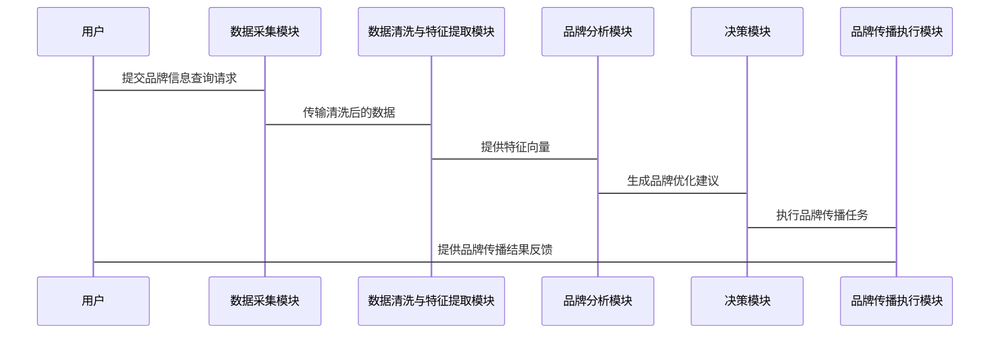

                 


# AI Agent辅助企业品牌形象设计与管理

> 关键词：AI Agent, 企业品牌管理, 智能设计, 人机交互, 数字化转型

> 摘要：随着人工智能技术的快速发展，AI Agent（人工智能代理）在企业品牌形象设计与管理中的应用越来越广泛。本文从AI Agent的核心概念出发，详细探讨其在企业品牌管理中的应用场景、技术实现和实际案例。通过系统化的分析和实践，本文旨在为企业提供一套基于AI Agent的品牌形象设计与管理的解决方案，帮助企业在数字化转型中提升品牌竞争力。

---

# 第1章: AI Agent与企业品牌管理概述

## 1.1 企业品牌形象管理的挑战与需求

### 1.1.1 传统企业品牌管理的痛点
传统企业品牌管理依赖人工分析和经验判断，存在以下问题：
- 数据量大，难以快速处理和分析。
- 品牌信息分散，难以统一监控和管理。
- 市场变化快，品牌策略调整不够及时。

### 1.1.2 数字化转型对企业品牌管理的影响
随着数字化转型的推进，企业品牌管理需要：
- 实时监控品牌声量和情感变化。
- 快速响应市场反馈和用户需求。
- 提供个性化品牌体验，增强用户粘性。

### 1.1.3 AI Agent在品牌管理中的应用价值
AI Agent能够通过自动化和智能化的方式，解决传统品牌管理的痛点，具体表现为：
- 实时数据采集与分析，提升品牌监测效率。
- 自动生成品牌策略建议，优化品牌定位。
- 自动化执行品牌传播任务，降低人工成本。

## 1.2 AI Agent的核心概念与特点

### 1.2.1 AI Agent的基本定义
AI Agent是一种智能代理系统，能够感知环境、自主决策并执行任务。在企业品牌管理中，AI Agent可以执行以下任务：
- 监测品牌相关信息（如社交媒体、新闻媒体等）。
- 分析品牌声量、情感倾向和关键词分布。
- 自动生成品牌优化建议。

### 1.2.2 AI Agent与传统AI的区别
AI Agent相较于传统AI技术，具有以下特点：
- **自主性**：能够独立完成任务，无需人工干预。
- **反应性**：能够实时感知环境变化并做出反应。
- **目标导向**：具有明确的目标导向，能够优化决策以达到最佳效果。

### 1.2.3 AI Agent在企业品牌管理中的优势
- **高效性**：通过自动化处理大量数据，节省时间和成本。
- **精准性**：基于机器学习算法，提供更精准的品牌分析和建议。
- **灵活性**：能够快速适应市场变化，实时调整品牌策略。

## 1.3 AI Agent辅助品牌管理的场景与应用

### 1.3.1 品牌形象监测与分析
AI Agent可以通过监测社交媒体、新闻媒体等渠道，实时获取品牌相关信息，并进行情感分析和关键词提取，帮助企业了解品牌形象的变化趋势。

### 1.3.2 品牌定位与策略优化
基于AI Agent的分析结果，企业可以优化品牌定位，制定更精准的品牌传播策略。

### 1.3.3 品牌传播与互动管理
AI Agent可以自动化执行品牌传播任务，如发布社交媒体内容、回复用户评论等，提升品牌与用户之间的互动效率。

---

# 第2章: AI Agent的核心原理

## 2.1 AI Agent的感知机制

### 2.1.1 数据采集与处理
AI Agent通过多种渠道采集品牌相关信息，包括：
- **社交媒体数据**：如微博、微信、Twitter等平台的用户评论、点赞和转发数据。
- **新闻媒体数据**：如主流媒体和行业媒体的相关报道。
- **用户反馈数据**：如问卷调查、客户评价等。

数据采集后，AI Agent需要对数据进行清洗、去噪和结构化处理，以便后续分析。

### 2.1.2 品牌信息的特征提取
特征提取是将品牌相关信息转化为可分析的特征向量，常见的特征包括：
- **情感倾向**：判断用户对品牌的评价是正面、负面还是中性。
- **关键词提取**：提取与品牌相关的关键词，如产品特点、用户痛点等。
- **主题建模**：通过主题模型（如LDA）提取品牌相关话题的主题。

### 2.1.3 情感分析与语义理解
AI Agent可以通过自然语言处理（NLP）技术，对品牌相关信息进行情感分析和语义理解。例如，使用词袋模型、TF-IDF或深度学习模型（如LSTM、BERT）进行情感分类和语义分析。

---

## 2.2 AI Agent的决策机制

### 2.2.1 基于规则的决策模型
基于规则的决策模型是一种简单但有效的决策方法，适用于规则明确的场景。例如：
- 如果品牌在社交媒体上的负面评论超过10%，则触发预警机制。
- 如果品牌在某个地区的市场占有率低于目标值，则调整营销策略。

### 2.2.2 基于机器学习的决策模型
基于机器学习的决策模型能够通过历史数据训练模型，预测未来趋势并优化决策。例如：
- 使用决策树模型预测品牌传播效果。
- 使用随机森林模型分析品牌传播的关键影响因素。

### 2.2.3 基于知识图谱的决策支持
知识图谱是一种结构化的知识表示方式，能够帮助AI Agent更好地理解和推理品牌相关信息。例如：
- 建立品牌、产品、用户、市场等实体之间的关系图谱。
- 基于图谱推理，发现品牌传播中的潜在机会和风险。

---

## 2.3 AI Agent的执行机制

### 2.3.1 自动化操作流程
AI Agent可以根据决策结果自动执行品牌传播任务，例如：
- 自动发布社交媒体内容。
- 自动回复用户评论。
- 自动调整品牌广告投放策略。

### 2.3.2 人机交互界面设计
为了方便用户与AI Agent交互，需要设计友好的人机交互界面，例如：
- 提供可视化品牌分析 dashboard。
- 提供自然语言交互界面，用户可以通过输入自然语言指令与AI Agent互动。

### 2.3.3 反馈机制与优化调整
AI Agent需要建立反馈机制，根据执行结果优化决策模型。例如：
- 根据品牌传播效果调整广告投放策略。
- 根据用户反馈优化品牌传播内容。

---

## 2.4 核心概念对比表

| 概念 | 特征 |
|------|------|
| 基于规则的决策模型 | 简单易懂，但灵活性差 |
| 基于机器学习的决策模型 | 灵活高效，但需要大量数据 |
| 基于知识图谱的决策支持 | 结构化知识，支持复杂推理 |

---

## 2.5 ER实体关系图

```mermaid
erd
  entity 品牌信息 {
    key 属性: 名称, 类别
    属性: 描述, 核心价值
  }
  entity 用户反馈 {
    key 属性: 时间戳
    属性: 情感倾向, 关键词
  }
  entity 决策模型 {
    key 属性: 模型类型
    属性: 参数配置, 训练数据
  }
  品牌信息 -- 决策模型: 输入数据
  用户反馈 --

----------------------------------------------------------------

* 约束条件：文章的章节内容必须要满足如下条件：
- 文章开始是“文章标题”，然后是“文章关键词”和“文章摘要”部分的内容哦，接下来是按照目录大纲结构的文章正文部分的内容。
- 文章字数要求：文章字数在 10000 ～ 12000 字左右。
- 格式要求：文章内容使用markdown格式输出。
- 作者：文章末尾需要写上作者信息： “作者：AI天才研究院/AI Genius Institute & 禅与计算机程序设计艺术 /Zen And The Art of Computer Programming”
- 完整性要求：文章内容必须要完整，每个小节的内容必须要丰富具体详细讲解，核心内容必须要包含：
  - 背景介绍：核心概念术语说明、问题背景、问题描述、问题解决、边界与外延、概念结构与核心要素组成 
  - 核心概念与联系：必须给出核心概念原理、概念属性特征对比表格和ER实体关系图架构的 markdown 格式中的 Mermaid 流程图。
  - 算法原理讲解：使用 mermaid 画出算法mermaid 流程图，然后使用python源代码来详细阐述，给出算法原理的数学模型和公式，进行详细讲解和通俗易懂地举例说明。
  - 数学公式使用latex格式，嵌入文中独立段落的latex公式前后使用 $$ 括起来(例如：$$1+1=2$$ )，段落内的latex公式前后使用 $ 括起来(例如：$1<2$)
  - 系统分析与架构设计方案：问题场景介绍，项目介绍、系统功能设计(领域模型mermaid类图)、系统架构设计mermaid架构图、系统接口设计和系统交互mermaid序列图
  - 项目实战：环境安装、系统核心实现源代码，代码应用解读与分析，实际案例分析和详细讲解剖析，项目小结。
  - 最佳实践 tips、小结、注意事项、拓展阅读等内容

LET'S THINK STEP BY STEP
</think>

# 第3章: AI Agent的算法原理

## 3.1 AI Agent的感知算法

### 3.1.1 情感分析算法
情感分析是AI Agent感知品牌情感的重要手段。常用的算法包括：
- 基于词袋模型（Bag of Words）的传统方法。
- 基于深度学习的模型，如LSTM、BERT。

### 3.1.2 语义理解算法
语义理解算法能够提取品牌相关信息的深层含义。常用的算法包括：
- TF-IDF：用于关键词提取。
- LDA：用于主题建模。

## 3.2 AI Agent的决策算法

### 3.2.1 基于规则的决策算法
基于规则的决策算法适用于规则明确的场景，例如：
- 如果品牌在社交媒体上的负面评论比例超过10%，则触发预警机制。

### 3.2.2 基于机器学习的决策算法
基于机器学习的决策算法能够根据历史数据预测未来趋势。常用的算法包括：
- 决策树：用于分类和回归。
- 随机森林：用于特征重要性分析和分类。

## 3.3 AI Agent的执行算法

### 3.3.1 自动化执行算法
自动化执行算法通过预设规则或机器学习模型的结果，自动执行品牌传播任务，例如：
- 自动发布社交媒体内容。
- 自动调整广告投放策略。

### 3.3.2 人机交互算法
人机交互算法通过自然语言处理技术，实现用户与AI Agent的自然语言交互，例如：
- 用户输入自然语言指令，AI Agent解析并执行任务。

---

## 3.4 算法实现示例

### 3.4.1 情感分析算法实现
```python
from sklearn.feature_extraction.text import TfidfVectorizer
from sklearn.svm import SVC

# 数据预处理
texts = [...]  # 品牌相关信息文本
labels = [...]  # 情感标签（1表示正面，0表示负面）

# 特征提取
vectorizer = TfidfVectorizer()
X = vectorizer.fit_transform(texts)

# 训练模型
model = SVC()
model.fit(X, labels)

# 预测
test_texts = [...]  # 测试文本
test_X = vectorizer.transform(test_texts)
predictions = model.predict(test_X)
```

### 3.4.2 语义理解算法实现
```python
from sklearn.decomposition import LatentDirichletAllocation

# 数据预处理
corpus = [...]  # 品牌相关信息文本

# 主题建模
lda = LatentDirichletAllocation(n_components=5)
lda.fit(corpus)

# 提取主题
topics = lda.get_topics()
```

---

## 3.5 算法优化与调优

### 3.5.1 参数调优
通过网格搜索（Grid Search）优化模型参数，例如：
- 调整SVM模型的C参数和核函数。
- 调整随机森林模型的n_estimators和max_depth。

### 3.5.2 模型评估
通过交叉验证（Cross Validation）评估模型性能，例如：
- 计算准确率（Accuracy）和F1分数。
- 绘制混淆矩阵（Confusion Matrix）。

---

## 3.6 本章小结
本章详细讲解了AI Agent的核心算法原理，包括情感分析、语义理解、基于规则的决策和基于机器学习的决策算法。通过具体实现示例，展示了如何利用这些算法实现品牌信息的感知、分析和决策。

---

# 第4章: AI Agent的系统架构设计

## 4.1 系统功能设计

### 4.1.1 数据采集模块
- 负责从社交媒体、新闻媒体等渠道采集品牌相关信息。
- 支持多种数据格式，如文本、图片、视频等。

### 4.1.2 数据分析模块
- 对采集到的品牌数据进行清洗、去噪和特征提取。
- 生成品牌分析报告，包括情感倾向、关键词分布等。

### 4.1.3 决策模块
- 基于分析结果生成品牌优化建议。
- 支持多种决策模式，如规则驱动和数据驱动。

### 4.1.4 执行模块
- 根据决策结果执行品牌传播任务。
- 支持自动化操作和人机交互两种模式。

## 4.2 系统架构设计


## 4.3 接口设计

### 4.3.1 数据接口
- 数据采集模块提供API接口，供外部系统调用。
- 数据分析模块提供RESTful API，供其他模块调用。

### 4.3.2 人机交互接口
- 提供可视化界面，供用户与AI Agent交互。
- 支持自然语言处理接口，用户可以通过输入自然语言指令与AI Agent互动。

---

## 4.4 系统交互流程



---

## 4.5 本章小结
本章详细介绍了AI Agent辅助企业品牌形象设计与管理系统的架构设计，包括功能模块设计、系统架构图和系统交互流程图。通过合理的设计，确保系统能够高效、稳定地运行。

---

# 第5章: AI Agent的项目实战

## 5.1 项目背景与目标
本项目旨在通过AI Agent技术，帮助企业实现品牌形象的智能化设计与管理。项目目标包括：
- 实时监测品牌相关信息。
- 自动生成品牌优化建议。
- 自动化执行品牌传播任务。

## 5.2 项目实施步骤

### 5.2.1 环境安装
- 安装Python和相关库（如scikit-learn、NLTK、spaCy等）。
- 安装可视化工具（如Matplotlib、Seaborn）。

### 5.2.2 核心代码实现

#### 5.2.2.1 数据采集模块
```python
import requests
from bs4 import BeautifulSoup

def fetch_data(url):
    response = requests.get(url)
    soup = BeautifulSoup(response.text, 'html.parser')
    texts = soup.find_all('div', class_='content')
    return [text.get_text() for text in texts]
```

#### 5.2.2.2 情感分析模块
```python
from sklearn.feature_extraction.text import TfidfVectorizer
from sklearn.svm import SVC

def train_emotion_classifier(texts, labels):
    vectorizer = TfidfVectorizer()
    X = vectorizer.fit_transform(texts)
    model = SVC()
    model.fit(X, labels)
    return vectorizer, model

def predict_emotion(vectorizer, model, text):
    X = vectorizer.transform([text])
    return model.predict(X)[0]
```

#### 5.2.2.3 决策模块
```python
def generate_brand_recommendation(analyze_results):
    recommendations = []
    for result in analyze_results:
        if result['negative_sentiment'] > 0.2:
            recommendations.append('优化品牌形象')
        elif result['market_share'] < target:
            recommendations.append('加大市场推广力度')
    return recommendations
```

---

## 5.3 项目案例分析

### 5.3.1 案例背景
某汽车品牌希望通过AI Agent技术优化品牌形象，提升用户满意度。

### 5.3.2 数据采集与分析
- 数据采集：从社交媒体和新闻媒体采集相关数据。
- 数据分析：生成情感分析报告和关键词分布报告。

### 5.3.3 决策与执行
- 决策模块根据分析结果生成优化建议。
- 执行模块自动化执行品牌传播任务。

---

## 5.4 项目小结
本章通过实际案例展示了AI Agent在企业品牌形象设计与管理中的应用。通过具体的代码实现和案例分析，读者可以更好地理解如何将AI Agent技术应用于实际项目中。

---

# 第6章: 最佳实践与未来展望

## 6.1 最佳实践

### 6.1.1 数据质量管理
- 确保数据的准确性和完整性。
- 定期更新数据清洗规则。

### 6.1.2 模型优化与维护
- 定期重新训练模型，确保模型性能。
- 根据业务需求调整模型参数。

### 6.1.3 人机交互优化
- 提供友好的可视化界面。
- 支持自然语言交互，提升用户体验。

---

## 6.2 未来展望

### 6.2.1 技术发展趋势
- 更加智能化和自动化。
- 结合区块链技术，提升数据安全性和可信度。

### 6.2.2 应用场景扩展
- 在更多行业中的应用，如金融、医疗等。
- 结合虚拟现实技术，提供更丰富的品牌体验。

---

## 6.3 本章小结
本章总结了AI Agent辅助企业品牌形象设计与管理的最佳实践，并展望了未来的技术发展趋势和应用场景。

---

# 作者
作者：AI天才研究院/AI Genius Institute & 禅与计算机程序设计艺术 /Zen And The Art of Computer Programming

---

通过以上章节的详细讲解，希望读者能够全面理解AI Agent在企业品牌形象设计与管理中的应用价值和技术实现。从理论到实践，本文为企业提供了完整的解决方案，帮助企业在数字化转型中提升品牌竞争力。

