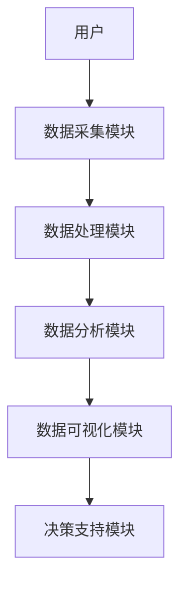

                 


# AI Agent辅助企业商业智能与数据驱动决策

## 关键词：
AI Agent, 商业智能, 数据驱动决策, 企业智能系统, 人工智能, 数据分析

## 摘要：
本文详细探讨了AI Agent在企业商业智能与数据驱动决策中的应用。通过分析AI Agent的核心原理、算法实现、系统架构，结合实际案例，展示了如何利用AI Agent提升企业的决策效率和智能化水平。文章从背景介绍、核心概念、算法原理到系统设计、项目实战，全面解析了AI Agent在企业中的应用价值与技术实现。

---

# 第一部分：AI Agent与企业商业智能概述

## 第1章：AI Agent的基本概念与商业智能

### 1.1 AI Agent的定义与特点

#### 1.1.1 AI Agent的定义
AI Agent（人工智能代理）是指能够感知环境、自主决策并执行任务的智能实体。它能够通过传感器获取信息，利用算法处理数据，并通过执行器与环境交互。

#### 1.1.2 AI Agent的核心特点
- **自主性**：能够自主决策，无需人工干预。
- **反应性**：能够实时感知环境并做出响应。
- **学习能力**：通过机器学习不断优化自身的决策能力。
- **协作性**：能够与其他AI Agent或系统协同工作。

#### 1.1.3 AI Agent与传统软件的区别
- 传统软件依赖于固定的逻辑和规则，而AI Agent能够自主学习和适应环境。
- 传统软件无法处理复杂和不确定的环境，而AI Agent能够通过数据驱动的方式进行决策。

### 1.2 商业智能的背景与现状

#### 1.2.1 商业智能的定义
商业智能（Business Intelligence, BI）是指通过数据分析、数据挖掘和数据可视化等技术，帮助企业从数据中提取有价值的信息，支持决策的过程。

#### 1.2.2 商业智能的发展历程
- **早期阶段**：基于报表和简单的数据分析。
- **发展阶段**：引入数据挖掘和预测分析。
- **当前阶段**：结合大数据和人工智能技术，实现智能化决策。

#### 1.2.3 当前商业智能的主要技术与工具
- **数据采集**：ETL（抽取、转换、加载）工具。
- **数据分析**：SQL、Python、R等编程语言。
- **数据可视化**：Tableau、Power BI、ECharts等工具。
- **机器学习**：Scikit-learn、TensorFlow、PyTorch等框架。

### 1.3 AI Agent在企业中的应用前景

#### 1.3.1 AI Agent的潜在应用领域
- **销售预测**：通过历史销售数据预测未来销售趋势。
- **客户分层**：根据客户行为数据进行客户分层和精准营销。
- **供应链优化**：通过实时监控供应链数据优化库存管理。
- **风险控制**：通过数据分析识别潜在风险并制定应对策略。

#### 1.3.2 企业采用AI Agent的优势
- **提高决策效率**：通过自动化数据分析和预测，缩短决策时间。
- **优化资源配置**：通过智能化分配资源，降低成本。
- **支持创新业务模式**：通过数据驱动的方式支持新业务的快速上线。

#### 1.3.3 AI Agent应用的挑战与机遇
- **挑战**：数据隐私、算法可解释性、计算资源需求等。
- **机遇**：提升企业竞争力，推动业务创新。

---

## 第2章：数据驱动决策的核心理念

### 2.1 数据驱动决策的定义

#### 2.1.1 数据驱动决策的基本概念
数据驱动决策是指通过数据分析和挖掘，利用数据支持决策的过程。与传统的经验决策不同，数据驱动决策更加依赖于数据和模型的支持。

### 2.2 数据驱动决策的实现过程

#### 2.2.1 数据采集与处理
- **数据采集**：从各种数据源（数据库、API、文件等）获取数据。
- **数据清洗**：去除噪声数据，处理缺失值。
- **数据转换**：将数据转换为适合分析的形式（如标准化、归一化）。

#### 2.2.2 数据分析与建模
- **数据分析**：通过统计分析、数据可视化等方式探索数据。
- **模型训练**：使用机器学习算法（如回归、分类、聚类等）建立预测模型。
- **模型评估**：通过交叉验证、ROC曲线等方法评估模型性能。

#### 2.2.3 数据可视化与决策支持
- **数据可视化**：通过图表（如柱状图、折线图、散点图等）展示数据分析结果。
- **决策支持**：基于数据分析结果提供决策建议。

### 2.3 数据驱动决策在企业中的价值

#### 2.3.1 提高决策效率
通过自动化数据分析和预测，缩短决策时间。

#### 2.3.2 优化资源配置
通过智能化分配资源，降低成本。

#### 2.3.3 支持创新业务模式
通过数据驱动的方式支持新业务的快速上线。

---

# 第二部分：AI Agent的核心原理与技术

## 第3章：AI Agent的感知与决策模块

### 3.1 感知模块的核心原理

#### 3.1.1 数据采集与处理
- **数据采集**：通过传感器或API获取环境数据。
- **数据清洗**：去除噪声数据，处理缺失值。
- **数据转换**：将数据转换为适合分析的形式。

#### 3.1.2 信息融合与特征提取
- **信息融合**：将多源数据进行融合，提高数据的准确性和完整性。
- **特征提取**：通过主成分分析（PCA）等方法提取数据的关键特征。

#### 3.1.3 感知模型的训练与优化
- **模型训练**：使用深度学习模型（如卷积神经网络、循环神经网络）进行训练。
- **模型优化**：通过调整超参数（如学习率、批量大小）优化模型性能。

### 3.2 决策模块的算法原理

#### 3.2.1 基于规则的决策算法
- **规则定义**：通过预定义的规则（如If-Else语句）进行决策。
- **规则执行**：根据当前环境数据匹配规则，执行相应的决策。

#### 3.2.2 基于机器学习的决策算法
- **分类算法**：如逻辑回归、支持向量机（SVM）用于分类决策。
- **回归算法**：如线性回归用于预测性决策。

#### 3.2.3 基于强化学习的决策算法
- **强化学习框架**：通过与环境交互，学习最优策略。
- **策略评估**：使用Q-learning等算法评估策略的优劣。

### 3.3 决策模块的数学模型

#### 3.3.1 基于概率论的决策模型
- **贝叶斯定理**：用于计算条件概率，辅助决策。
  $$ P(A|B) = \frac{P(B|A)P(A)}{P(B)} $$
- **马尔可夫链**：用于建模状态转移过程。

#### 3.3.2 基于逻辑回归的决策模型
- **逻辑回归模型**：
  $$ P(Y=1|X) = \frac{e^{\beta X}}{1 + e^{\beta X}} $$
- **决策边界**：通过sigmoid函数将输出映射到0-1区间。

#### 3.3.3 基于神经网络的决策模型
- **神经网络结构**：包括输入层、隐藏层和输出层。
- **反向传播算法**：通过梯度下降优化网络参数。

---

## 第4章：AI Agent的执行与反馈机制

### 4.1 执行模块的核心原理

#### 4.1.1 行动规划
- **路径规划**：如A*算法用于路径优化。
- **任务分配**：通过任务分解算法（如分治法）分配任务。

#### 4.1.2 行为执行
- **动作选择**：基于当前状态和决策结果选择最优动作。
- **动作执行**：通过执行器（如机器人、API调用）执行动作。

#### 4.1.3 反馈机制
- **状态反馈**：通过传感器或日志获取执行结果。
- **反馈学习**：将反馈结果用于模型优化。

### 4.2 反馈模块的实现

#### 4.2.1 反馈数据的采集
- **日志记录**：记录执行过程中的关键事件。
- **性能指标**：如准确率、召回率等。

#### 4.2.2 反馈数据的分析
- **异常检测**：通过统计分析或机器学习方法检测异常。
- **因果分析**：分析反馈结果的因果关系。

#### 4.2.3 反馈结果的优化
- **参数调整**：根据反馈结果调整模型参数。
- **策略优化**：更新决策策略以提高执行效果。

---

# 第三部分：数据驱动决策的系统架构与实现

## 第5章：数据驱动决策的系统架构设计

### 5.1 系统功能设计

#### 5.1.1 数据采集模块
- **功能描述**：从多种数据源采集数据。
- **实现方式**：使用Flask或Django框架开发API接口。

#### 5.1.2 数据处理模块
- **功能描述**：清洗和转换数据。
- **实现方式**：使用Pandas库进行数据处理。

#### 5.1.3 数据分析模块
- **功能描述**：进行数据建模和预测。
- **实现方式**：使用Scikit-learn库训练机器学习模型。

#### 5.1.4 数据可视化模块
- **功能描述**：将分析结果可视化。
- **实现方式**：使用ECharts库生成交互式图表。

### 5.2 系统架构设计

#### 5.2.1 系统架构图


#### 5.2.2 系统接口设计
- **API接口**：如RESTful API，用于模块之间的数据交互。
- **数据格式**：如JSON格式，便于数据传输和处理。

#### 5.2.3 系统交互设计
- **用户交互**：通过Web界面提交查询请求。
- **系统响应**：返回分析结果和可视化图表。

### 5.3 项目实战：企业销售预测系统

#### 5.3.1 环境安装
```bash
pip install numpy pandas scikit-learn matplotlib
```

#### 5.3.2 核心代码实现

##### 数据处理代码
```python
import pandas as pd

# 数据加载
data = pd.read_csv('sales.csv')

# 数据清洗
data.dropna(inplace=True)
data['date'] = pd.to_datetime(data['date'])
data.set_index('date', inplace=True)
```

##### 数据分析代码
```python
from sklearn.model import ARIMA

# 模型训练
model = ARIMA(data['sales'], order=(1, 1, 1))
model_fit = model.fit()

# 模型预测
forecast = model_fit.forecast(steps=30)
```

##### 数据可视化代码
```python
import matplotlib.pyplot as plt

plt.figure(figsize=(10, 6))
plt.plot(data['sales'], label='历史数据')
plt.plot(forecast, label='预测数据')
plt.xlabel('时间')
plt.ylabel('销售额')
plt.legend()
plt.show()
```

#### 5.3.3 案例分析
- **背景**：某企业希望预测未来30天的销售情况。
- **数据来源**：过去3年的销售数据，包括日期、销售额、产品类别等。
- **分析过程**：
  1. 数据清洗：去除缺失值和异常值。
  2. 数据建模：使用ARIMA模型进行时间序列预测。
  3. 结果可视化：绘制历史数据和预测数据的对比图。
- **结果解读**：预测未来30天的销售额，并根据预测结果制定库存和销售策略。

---

## 第6章：AI Agent在企业中的应用实践

### 6.1 案例分析：智能供应链管理

#### 6.1.1 项目背景
某企业希望优化其供应链管理，减少库存成本，提高交货效率。

#### 6.1.2 系统设计
- **需求分析**：实时监控库存、供应商交货时间、市场需求变化。
- **系统实现**：开发一个基于AI Agent的智能供应链管理系统。

#### 6.1.3 实施效果
- **库存成本降低**：通过预测需求，优化库存管理。
- **交货时间缩短**：通过智能调度，提高供应链效率。

### 6.2 最佳实践与注意事项

#### 6.2.1 数据质量的重要性
- 数据清洗和预处理是模型准确性的基础。
- 数据来源的多样性和及时性直接影响决策效果。

#### 6.2.2 模型的可解释性
- 在关键业务场景中，模型的可解释性非常重要。
- 使用LIME或SHAP等工具提高模型的可解释性。

#### 6.2.3 系统的可扩展性
- 系统设计应考虑未来数据量的增加和业务扩展的需求。
- 使用分布式架构（如微服务架构）提高系统的扩展性。

---

## 第7章：项目实战与最佳实践

### 7.1 环境安装与配置

#### 7.1.1 安装Python环境
```bash
python --version
pip install --upgrade pip
```

#### 7.1.2 安装所需库
```bash
pip install numpy pandas scikit-learn matplotlib flask
```

### 7.2 系统核心实现源代码

#### 7.2.1 数据采集模块
```python
import requests

def fetch_data(api_url):
    response = requests.get(api_url)
    return response.json()
```

#### 7.2.2 数据处理模块
```python
import pandas as pd

def process_data(data):
    df = pd.DataFrame(data)
    df.dropna(inplace=True)
    return df
```

#### 7.2.3 数据分析模块
```python
from sklearn.model import LinearRegression

def train_model(data):
    X = data[['feature1', 'feature2']]
    y = data['target']
    model = LinearRegression()
    model.fit(X, y)
    return model
```

#### 7.2.4 数据可视化模块
```python
import matplotlib.pyplot as plt

def visualize_data(data, prediction):
    plt.figure(figsize=(10, 6))
    plt.plot(data, label='Actual')
    plt.plot(prediction, label='Predicted')
    plt.xlabel('Time')
    plt.ylabel('Value')
    plt.legend()
    plt.show()
```

### 7.3 项目小结

#### 7.3.1 项目总结
- **项目目标**：实现一个基于AI Agent的商业智能系统。
- **项目成果**：开发了一个能够实时分析数据、提供决策支持的系统。
- **项目经验**：数据质量和模型选择对项目成功至关重要。

#### 7.3.2 项目注意事项
- **数据隐私**：在处理敏感数据时，需遵守相关法律法规。
- **算法选择**：根据业务需求选择合适的算法，避免盲目追求复杂模型。
- **系统维护**：定期更新模型和优化系统性能，确保系统的稳定性和高效性。

---

## 第8章：结论与展望

### 8.1 研究结论
AI Agent作为企业商业智能的核心技术，能够显著提升企业的决策效率和智能化水平。通过数据驱动的方式，企业可以更快速、准确地做出决策，从而在竞争激烈的市场中占据优势。

### 8.2 未来展望
随着人工智能技术的不断发展，AI Agent在企业中的应用将更加广泛和深入。未来的AI Agent将更加智能化、个性化，能够处理更复杂的问题，并与区块链、物联网等技术结合，为企业创造更大的价值。

---

## 作者

作者：AI天才研究院/AI Genius Institute & 禅与计算机程序设计艺术 /Zen And The Art of Computer Programming

---

感谢您的阅读！希望本文能为您提供有价值的信息和启发。如果您有任何问题或建议，欢迎随时与我联系。

