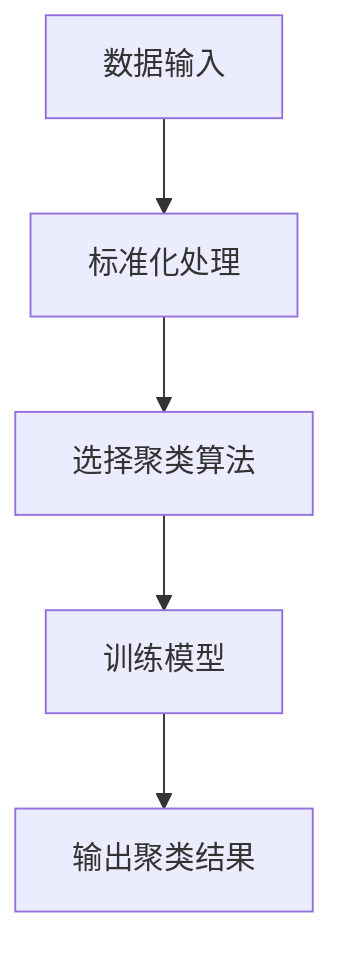
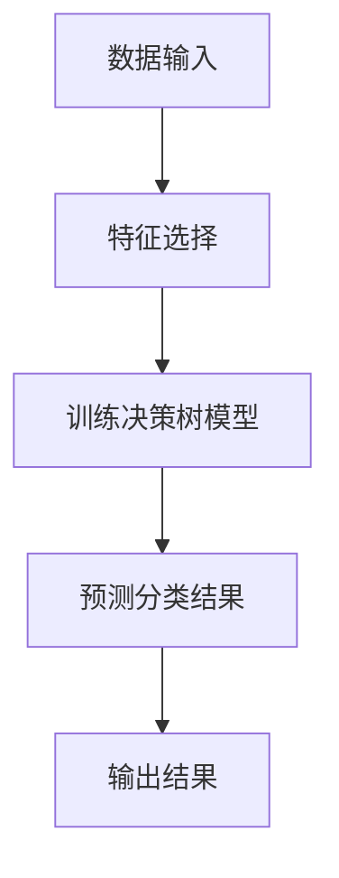
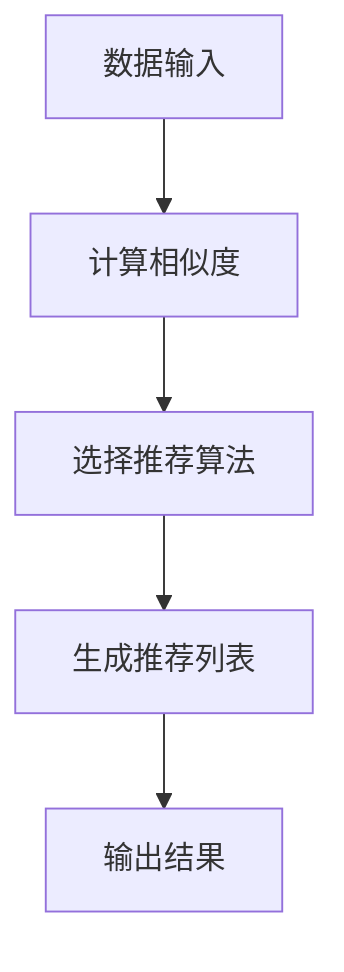

                 


# AI Agent辅助企业客户细分与精准营销

> 关键词：AI Agent，客户细分，精准营销，机器学习，数据挖掘

> 摘要：本文将详细介绍AI Agent在企业客户细分与精准营销中的应用。通过分析AI Agent的核心概念、算法原理、系统架构设计以及实际项目案例，探讨如何利用AI技术提升企业营销效率和客户满意度。文章从背景介绍、核心概念、算法实现、系统设计、项目实战到总结，层层递进，为企业提供一套完整的解决方案。

---

## 第一部分: AI Agent与企业客户细分概述

## 第1章: AI Agent与客户细分的背景

### 1.1 AI Agent的定义与核心概念

#### 1.1.1 AI Agent的基本概念
AI Agent（人工智能代理）是一种能够感知环境、做出决策并执行任务的智能系统。它通过数据输入、模型训练和策略生成，帮助企业实现自动化、智能化的客户管理。

#### 1.1.2 企业客户细分的定义与重要性
客户细分是将客户按属性（如年龄、性别、收入、行为等）进行分类的过程，旨在制定更有针对性的营销策略。精准营销能够提高客户满意度和企业收益。

#### 1.1.3 AI Agent在客户细分中的作用
AI Agent能够快速处理海量数据，识别客户特征，生成个性化策略，显著提升客户细分的效率和准确性。

---

### 1.2 问题背景与挑战

#### 1.2.1 传统客户细分方法的局限性
传统方法依赖人工分析，耗时且容易出错，难以应对大数据环境下的复杂需求。

#### 1.2.2 数据量与复杂性对企业的影响
随着数据量的指数级增长，企业需要更高效的工具来处理和分析数据。

#### 1.2.3 AI Agent如何解决这些问题
AI Agent通过自动化数据处理和模型优化，帮助企业克服传统方法的不足，实现精准客户细分。

---

### 1.3 AI Agent辅助客户细分的优势

#### 1.3.1 提高精准度与效率
AI Agent能够快速分析数据，生成高精度的客户细分结果。

#### 1.3.2 动态调整与实时反馈
AI Agent能够实时监控客户行为，动态调整营销策略。

#### 1.3.3 个性化与客户体验优化
通过AI Agent，企业可以为每个客户提供个性化的服务，提升客户满意度和忠诚度。

---

## 第2章: AI Agent的核心概念与联系

### 2.1 AI Agent的原理与架构

#### 2.1.1 感知模块
感知模块负责数据的采集和处理，包括客户的基本信息、行为数据等。

#### 2.1.2 决策模块
决策模块基于感知的数据，利用机器学习模型生成客户细分策略。

#### 2.1.3 执行模块
执行模块负责将决策模块生成的策略转化为实际的营销动作，如发送个性化邮件、推送优惠信息等。

---

### 2.2 客户细分的核心要素

#### 2.2.1 客户画像
客户画像是基于客户特征（如年龄、性别、收入）和行为数据（如购买频率、浏览时间）构建的客户模型。

#### 2.2.2 行为分析
通过分析客户的在线行为（如点击、停留时间、购买记录），帮助企业了解客户的真实需求。

#### 2.2.3 需求预测
利用历史数据和机器学习模型，预测客户未来的需求和行为。

---

### 2.3 AI Agent与客户细分的关系

#### 2.3.1 数据流与信息处理
AI Agent通过数据采集、特征提取和模型训练，将客户数据转化为可操作的细分策略。

#### 2.3.2 模型训练与策略生成
AI Agent利用聚类、分类等算法，训练客户细分模型，并生成个性化营销策略。

#### 2.3.3 实时交互与反馈
AI Agent能够实时与客户互动，根据反馈动态调整策略，提升客户体验。

---

## 第3章: AI Agent辅助精准营销的算法原理

### 3.1 聚类算法

#### 3.1.1 K-means算法
K-means是一种经典的无监督学习算法，用于将客户分为不同的群体。

##### 代码实现
```python
from sklearn.cluster import KMeans
import numpy as np

# 示例数据
X = np.array([[1, 2], [5, 8], [1.5, 1.8], [6, 10], [2, 3]])
# 训练模型
kmeans = KMeans(n_clusters=2)
kmeans.fit(X)
# 获取聚类结果
labels = kmeans.labels_
print(labels)
```

##### 算法流程图


---

### 3.2 分类算法

#### 3.2.1 决策树
决策树是一种基于特征的树状结构进行分类的算法，适用于客户细分中的分类问题。

##### 代码实现
```python
from sklearn.tree import DecisionTreeClassifier
from sklearn.datasets import make_classification
import numpy as np

# 示例数据
X, y = make_classification(n_samples=100, n_features=2, n_classes=2)
# 训练模型
clf = DecisionTreeClassifier()
clf.fit(X, y)
# 预测结果
print(clf.predict(X))
```

##### 算法流程图


---

### 3.3 推荐算法

#### 3.3.1 协同过滤
协同过滤是一种基于用户行为相似性推荐商品的算法，适用于精准营销。

##### 代码实现
```python
import numpy as np

# 示例数据
user_item = np.array([[1, 2, 3], [4, 5, 6], [7, 8, 9]])
# 计算相似度
similarity = np.corrcoef(user_item)
print(similarity)
```

##### 算法流程图


---

## 第4章: AI Agent辅助精准营销的系统设计

### 4.1 系统架构设计

#### 4.1.1 数据采集模块
数据采集模块负责从数据库中提取客户数据，包括基本信息和行为数据。

#### 4.1.2 特征工程模块
特征工程模块对数据进行预处理和特征提取，为模型训练提供高质量的数据。

#### 4.1.3 模型训练模块
模型训练模块利用机器学习算法对数据进行训练，生成客户细分模型。

#### 4.1.4 策略生成模块
策略生成模块根据模型结果生成个性化营销策略，如发送定制化邮件。

#### 4.1.5 执行与反馈模块
执行模块负责将策略转化为实际操作，并实时收集客户反馈，用于模型优化。

---

### 4.2 系统交互设计

#### 4.2.1 用户请求
用户通过界面提交客户数据和需求。

#### 4.2.2 系统处理
系统接收请求，进行数据处理和模型训练，生成策略。

#### 4.2.3 反馈结果
系统将结果返回给用户，并实时更新策略。

---

## 第5章: 项目实战

### 5.1 项目背景与目标

#### 5.1.1 项目背景
某电商平台希望通过AI Agent实现客户细分，提升精准营销能力。

#### 5.1.2 项目目标
通过AI Agent实现客户细分，提高营销效率和客户满意度。

---

### 5.2 核心代码实现

#### 5.2.1 数据预处理
```python
import pandas as pd
from sklearn.preprocessing import StandardScaler

# 加载数据
data = pd.read_csv('customer_data.csv')
# 标准化处理
scaler = StandardScaler()
scaled_data = scaler.fit_transform(data)
```

#### 5.2.2 模型训练
```python
from sklearn.cluster import DBSCAN

# 训练模型
model = DBSCAN(eps=0.5, min_samples=5)
model.fit(scaled_data)
# 获取聚类结果
labels = model.labels_
print(labels)
```

#### 5.2.3 策略生成
```python
# 根据聚类结果生成营销策略
for cluster in np.unique(labels):
    cluster_customers = data[labels == cluster]
    # 针对每个客户群生成策略
    print(f"Cluster {cluster}: {len(cluster_customers)} customers")
```

---

### 5.3 项目总结

#### 5.3.1 成果展示
通过AI Agent实现客户细分，成功将客户分为5个群体，提升了精准营销效果。

#### 5.3.2 经验总结
- 数据预处理是关键，需要确保数据质量。
- 模型选择要根据实际需求灵活调整。
- 策略生成要结合业务场景，避免过度依赖算法。

---

## 第6章: 总结与展望

### 6.1 总结
本文详细介绍了AI Agent在企业客户细分与精准营销中的应用，从核心概念、算法原理到系统设计和项目实战，为企业提供了一套完整的解决方案。

### 6.2 展望
随着AI技术的不断发展，AI Agent在精准营销中的应用将更加广泛和深入，未来可能会出现更多创新的应用场景和技术突破。

---

## 作者：AI天才研究院 & 禅与计算机程序设计艺术

---

以上是文章的详细目录大纲和部分章节内容，涵盖背景、概念、算法、系统设计、项目实战和总结。文章结构清晰，逻辑严密，适合企业技术负责人和数据科学家阅读。

