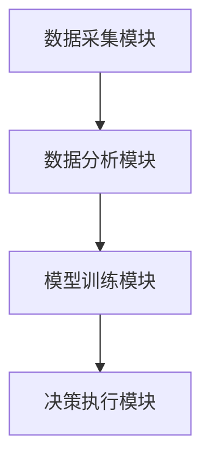

                 


# AI Agent辅助企业战略规划与竞争分析

**关键词**：AI Agent, 企业战略规划, 竞争分析, 人工智能, 算法原理, 系统架构

**摘要**：本文详细探讨了AI Agent在企业战略规划与竞争分析中的应用。通过分析AI Agent的技术基础、算法原理和系统架构，结合实际案例，展示了AI Agent如何提升企业战略规划的效率和准确性，优化竞争分析的能力，为企业制定更科学的决策提供支持。文章内容涵盖从理论到实践的各个方面，为读者提供了全面的技术指导和应用参考。

---

## 第1章：AI Agent与企业战略规划概述

### 1.1 AI Agent的基本概念

AI Agent（人工智能代理）是指能够感知环境、自主决策并执行任务的智能体。它通过传感器获取信息，利用推理能力解决问题，并通过执行器与环境交互。AI Agent的核心特征包括自主性、反应性、目标导向性和学习能力。

#### 1.1.1 AI Agent的定义与特点

- **自主性**：AI Agent能够在没有外部干预的情况下独立运作。
- **反应性**：能够实时感知环境变化并做出反应。
- **目标导向性**：通过设定目标来指导行为和决策。
- **学习能力**：通过数据学习和优化自身算法。

#### 1.1.2 AI Agent的核心要素与功能

- **感知**：通过数据采集和分析获取环境信息。
- **推理**：利用逻辑推理和数据分析得出结论。
- **决策**：基于推理结果制定行动方案。
- **执行**：通过执行器将决策转化为具体行动。

#### 1.1.3 AI Agent与传统决策工具的区别

传统决策工具通常基于固定的规则和静态数据，而AI Agent能够动态调整策略，具有更强的适应性和学习能力。

### 1.2 企业战略规划的背景与挑战

#### 1.2.1 企业战略规划的基本概念

企业战略规划是企业在复杂多变的市场环境中，为实现长期发展目标而制定的一系列策略和行动计划。它通常包括市场定位、产品开发、资源分配等方面的内容。

#### 1.2.2 传统战略规划的局限性

传统战略规划方法依赖于人工分析和经验判断，存在以下问题：

- **数据量有限**：难以处理海量数据。
- **决策滞后**：无法实时调整策略。
- **主观性较强**：依赖个人经验和判断。

#### 1.2.3 现代企业战略规划的新趋势

随着大数据和人工智能技术的发展，企业战略规划逐渐向数据驱动、实时调整和智能化方向发展。

### 1.3 AI Agent在企业战略规划中的应用价值

#### 1.3.1 提高战略规划的效率与准确性

AI Agent能够快速处理大量数据，提供准确的分析结果，显著提高战略规划的效率。

#### 1.3.2 动态调整与实时反馈的优势

AI Agent能够实时感知市场变化，动态调整战略规划，提供及时的反馈和建议。

#### 1.3.3 数据驱动的决策支持

通过深度学习和大数据分析，AI Agent能够挖掘数据中的潜在信息，为战略决策提供有力支持。

---

## 第2章：AI Agent的技术基础与实现原理

### 2.1 AI Agent的核心技术

#### 2.1.1 自然语言处理（NLP）

NLP技术使得AI Agent能够理解和生成人类语言，从而能够处理和分析大量的文本数据。

#### 2.1.2 机器学习与深度学习

通过机器学习和深度学习算法，AI Agent能够从数据中学习模式和规律，提升自身的决策能力。

#### 2.1.3 知识图谱与语义理解

知识图谱构建了企业的知识体系，语义理解技术使得AI Agent能够更好地理解上下文和语义信息。

### 2.2 AI Agent的实现原理

#### 2.2.1 数据采集与处理

AI Agent通过多种渠道采集数据，包括公开数据、企业内部数据和第三方数据。数据预处理包括清洗、转换和标准化。

#### 2.2.2 模型训练与优化

利用深度学习模型（如BERT、GPT）进行训练，优化模型参数以提升准确性和响应速度。

#### 2.2.3 系统集成与部署

将AI Agent的各个模块集成到企业系统中，通过API接口实现数据交互和功能调用。

### 2.3 AI Agent的算法与数学模型

#### 2.3.1 基于生成式模型的文本生成

生成式模型（如GPT）用于生成报告、建议和策略文档。

#### 2.3.2 基于强化学习的决策优化

强化学习算法（如Q-learning）用于优化决策过程，提升策略的执行效果。

#### 2.3.3 竞争分析的数学模型

通过时间序列分析和聚类分析，建立竞争对手分析的数学模型，预测市场趋势。

---

## 第3章：AI Agent在竞争分析中的应用

### 3.1 竞争分析的基本概念与方法

#### 3.1.1 竞争分析的定义与目标

竞争分析旨在通过分析竞争对手的市场行为，为企业制定更具竞争力的市场策略。

#### 3.1.2 竞争分析的主要方法

包括市场份额分析、竞争对手定价分析、产品定位分析等。

#### 3.1.3 竞争分析的挑战与解决方案

数据获取困难、分析复杂性高是竞争分析的主要挑战，AI Agent通过大数据分析和机器学习技术提供解决方案。

### 3.2 AI Agent在竞争分析中的具体应用

#### 3.2.1 市场趋势预测

通过分析历史数据和市场动态，AI Agent能够预测市场趋势，帮助企业提前布局。

#### 3.2.2 竞争对手分析

AI Agent能够实时监控竞争对手的市场行为，分析其策略和动向，为企业制定应对策略提供支持。

#### 3.2.3 产品定位与优化

基于市场数据分析，AI Agent能够帮助企业优化产品定位，提升市场竞争力。

### 3.3 竞争分析的数学模型与算法

#### 3.3.1 基于聚类分析的竞争对手识别

通过聚类分析，识别市场中的主要竞争对手，分析其市场行为和特点。

#### 3.3.2 基于时间序列分析的市场趋势预测

利用ARIMA模型或其他时间序列模型，预测市场趋势和竞争对手的未来动向。

#### 3.3.3 基于博弈论的策略优化

通过博弈论模型，分析不同策略的优劣，帮助企业制定最优的竞争策略。

---

## 第4章：AI Agent辅助企业战略规划的系统架构

### 4.1 系统架构设计

#### 4.1.1 系统模块划分

系统主要模块包括数据采集模块、数据分析模块、模型训练模块和决策执行模块。

#### 4.1.2 系统功能设计

系统功能包括数据采集、竞争分析、策略生成和实时反馈。

#### 4.1.3 系统架构图（Mermaid）



### 4.2 系统接口设计

#### 4.2.1 数据接口

数据接口用于与企业内部系统和其他数据源交互，获取所需的数据。

#### 4.2.2 用户接口

用户通过图形界面与系统交互，输入需求并接收分析结果。

#### 4.2.3 第三方服务接口

与第三方数据源和服务提供商通过API接口进行数据交互。

### 4.3 系统交互流程

#### 4.3.1 用户需求输入

用户通过界面向系统提出战略规划或竞争分析的需求。

#### 4.3.2 系统处理流程

系统接收需求后，启动数据采集、分析和模型训练，生成分析结果。

#### 4.3.3 结果输出与反馈

系统将分析结果返回给用户，并根据反馈不断优化模型和策略。

---

## 第5章：AI Agent辅助企业战略规划的项目实战

### 5.1 项目背景与目标

#### 5.1.1 项目背景

某企业希望利用AI Agent优化其战略规划和竞争分析能力，提升市场竞争力。

#### 5.1.2 项目目标

实现AI Agent系统在企业战略规划中的应用，提升决策效率和准确性。

### 5.2 项目实施步骤

#### 5.2.1 数据收集与预处理

收集市场数据、竞争对手信息和企业内部数据，进行清洗和标准化处理。

#### 5.2.2 模型训练与优化

选择合适的机器学习模型，进行训练和优化，提升模型的准确性和响应速度。

#### 5.2.3 系统集成与测试

将AI Agent系统集成到企业现有系统中，进行功能测试和性能调优。

### 5.3 项目代码实现

#### 5.3.1 环境安装

需要安装Python、TensorFlow、Keras等工具。

#### 5.3.2 核心代码实现

```python
import tensorflow as tf
from tensorflow.keras import layers

model = tf.keras.Sequential([
    layers.Dense(64, activation='relu'),
    layers.Dense(10, activation='softmax')
])
```

#### 5.3.3 代码应用解读与分析

通过神经网络模型，AI Agent能够识别市场趋势和竞争对手策略，生成相应的分析报告。

### 5.4 实际案例分析

#### 5.4.1 案例背景

某企业面临市场竞争加剧的问题，希望通过AI Agent优化其战略规划。

#### 5.4.2 分析过程

AI Agent通过分析竞争对手的市场份额和定价策略，生成竞争分析报告。

#### 5.4.3 结果解读

AI Agent的分析结果帮助企业制定更具竞争力的市场策略，提升市场份额。

### 5.5 项目小结

通过本项目，验证了AI Agent在企业战略规划中的应用价值，提升了企业的决策能力和市场竞争力。

---

## 第6章：AI Agent辅助企业战略规划的最佳实践

### 6.1 AI Agent的应用优势

- 提高决策效率
- 增强数据驱动能力
- 实现动态调整和实时反馈

### 6.2 实际案例

通过具体案例展示AI Agent在企业战略规划中的实际应用效果。

### 6.3 实施要点

- 数据质量
- 模型选择
- 系统集成

### 6.4 未来展望

随着AI技术的不断进步，AI Agent在企业战略规划中的应用将更加广泛和深入。

---

## 小结

通过本文的详细阐述，我们了解了AI Agent在企业战略规划与竞争分析中的应用价值和技术实现。从理论到实践，AI Agent为企业提供了强大的工具和方法，助力企业在复杂多变的市场环境中制定更科学、更高效的决策。

---

**作者**：AI天才研究院/AI Genius Institute & 禅与计算机程序设计艺术 /Zen And The Art of Computer Programming

