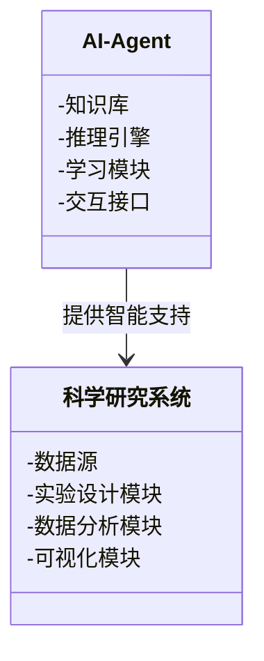
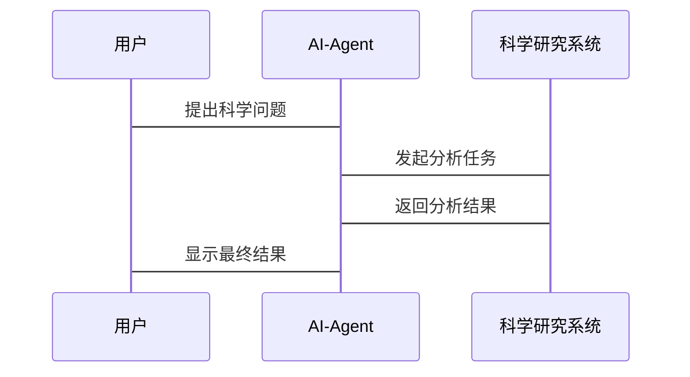

                 


# AI Agent辅助科学研究的方法

> 关键词：AI Agent, 科学研究, 知识表示, 推理机制, 机器学习, 自然语言处理, 系统架构

> 摘要：AI Agent作为一种智能化的工具，正在逐渐改变科学研究的方式。本文将从AI Agent的基本概念、核心原理、算法实现、系统架构以及实际应用等方面，详细探讨AI Agent如何辅助科学研究。通过理论与实践相结合的方式，本文旨在为科学研究者提供一种新的思路，利用AI Agent提升研究效率和准确性。

---

# 第1章: AI Agent的基本概念与演进

## 1.1 AI Agent的定义与特点
### 1.1.1 AI Agent的定义
AI Agent（人工智能代理）是指能够感知环境、自主决策并执行任务的智能实体。它具备自主性、反应性、目标导向性和社会性等核心特点。

### 1.1.2 AI Agent的核心特点
- **自主性**：AI Agent能够自主决策，无需外部干预。
- **反应性**：能够实时感知环境变化并做出响应。
- **目标导向性**：基于目标进行推理和决策。
- **社会性**：能够与其他AI Agent或人类进行协作。

### 1.1.3 AI Agent与传统AI的区别
传统的AI系统通常依赖于预定义的规则和数据，而AI Agent具备更强的自主性和适应性，能够动态调整行为以适应环境变化。

## 1.2 AI Agent在科学研究中的应用背景
### 1.2.1 科学研究的复杂性与挑战
科学研究涉及多学科交叉、数据量大、实验复杂等问题，传统方法难以高效解决问题。

### 1.2.2 AI Agent在科学研究中的优势
- 提高研究效率
- 处理复杂数据
- 协助实验设计与优化
- 支持多学科协作

### 1.2.3 当前AI Agent在科学领域的应用现状
AI Agent已经在药物研发、气候建模、天文学数据处理等领域取得显著进展。

## 1.3 AI Agent的核心要素与组成
### 1.3.1 知识表示与推理机制
- 知识表示：将科学领域的知识转化为数据结构，如知识图谱。
- 推理机制：基于知识进行逻辑推理，支持决策。

### 1.3.2 学习机制与自适应能力
- 通过机器学习算法不断优化模型。
- 支持在线学习，适应新数据和环境变化。

### 1.3.3 人机交互与协作模式
- 支持自然语言交互。
- 与人类科学家协作完成复杂任务。

## 1.4 本章小结
本章介绍了AI Agent的基本概念、核心特点以及在科学研究中的应用背景，为后续章节奠定了基础。

---

# 第2章: AI Agent的核心概念与原理

## 2.1 知识表示与推理机制
### 2.1.1 知识表示的基本概念
知识表示是将科学领域的知识转化为计算机可理解的形式，如符号逻辑、知识图谱等。

### 2.1.2 推理机制的类型与特点
- **符号逻辑推理**：基于逻辑规则进行推理。
- **概率推理**：基于概率论进行不确定性推理。
- **案例推理**：基于相似案例进行推理。

### 2.1.3 知识图谱的构建与应用
知识图谱通过节点和边描述实体及其关系，广泛应用于科学数据的组织与分析。

## 2.2 AI Agent的学习机制
### 2.2.1 监督学习与无监督学习
- **监督学习**：基于标注数据进行学习。
- **无监督学习**：从无标注数据中发现模式。

### 2.2.2 强化学习在AI Agent中的应用
通过与环境交互，AI Agent通过试错学习最优策略。

### 2.2.3 迁移学习与自适应学习
将已有的知识迁移到新任务，提高学习效率。

## 2.3 AI Agent的推理与决策过程
### 2.3.1 基于符号逻辑的推理
通过逻辑规则进行推理，适用于确定性问题。

### 2.3.2 基于概率的推理方法
处理不确定性问题，如贝叶斯推理。

### 2.3.3 多目标优化与决策树
通过多目标优化算法和决策树模型进行复杂决策。

## 2.4 本章小结
本章详细探讨了AI Agent的核心概念与原理，包括知识表示、推理机制和学习机制，为后续章节的算法实现奠定了理论基础。

---

# 第3章: AI Agent的算法原理与实现

## 3.1 AI Agent的核心算法概述
### 3.1.1 基于规则的推理算法
通过预定义的规则进行推理，适用于简单场景。

### 3.1.2 基于概率的推理算法
如马尔可夫链、贝叶斯网络等，适用于不确定性问题。

### 3.1.3 基于深度学习的推理算法
通过神经网络进行特征学习和推理。

## 3.2 知识表示与推理的算法实现
### 3.2.1 知识图谱的构建算法
使用图嵌入算法（如Word2Vec）进行知识表示。

### 3.2.2 基于符号逻辑的推理算法
如逻辑演绎推理、归纳推理。

### 3.2.3 基于概率的推理算法
如贝叶斯推理、马尔可夫逻辑网络。

## 3.3 AI Agent的学习与优化算法
### 3.3.1 监督学习算法
如线性回归、支持向量机、神经网络等。

### 3.3.2 无监督学习算法
如聚类分析、主题建模等。

### 3.3.3 强化学习算法
如Q-learning、深度强化学习（DQN）等。

## 3.4 算法实现的Python代码示例
### 3.4.1 知识表示与推理的代码实现
```python
# 示例代码：知识图谱构建
import networkx as nx
G = nx.DiGraph()
G.add_edge("基因", "疾病")
G.add_edge("疾病", "药物")
```

### 3.4.2 学习机制的代码实现
```python
# 示例代码：监督学习（线性回归）
from sklearn.linear_model import LinearRegression
model = LinearRegression()
model.fit(X, y)
```

### 3.4.3 推理与决策的代码实现
```python
# 示例代码：基于概率的推理（贝叶斯网络）
from pgmpy.inference import VariableElimination
infer = VariableElimination(model)
result = infer.query(variables=["疾病"], evidence={"基因": "A"})
```

## 3.5 本章小结
本章通过具体算法和代码示例，详细讲解了AI Agent的核心算法原理与实现，为后续章节的系统设计和项目实战提供了技术支持。

---

# 第4章: 数学模型与公式

## 4.1 知识表示的数学模型
### 4.1.1 符号逻辑表示
使用逻辑符号表示知识，如命题逻辑、谓词逻辑。

### 4.1.2 概率图模型
如贝叶斯网络、马尔可夫链等。

## 4.2 推理机制的数学公式
### 4.2.1 贝叶斯推理公式
$$P(A|B) = \frac{P(B|A)P(A)}{P(B)}$$

### 4.2.2 逻辑回归公式
$$P(y=1|x) = \frac{1}{1 + e^{-\beta x}}$$

## 4.3 学习算法的数学公式
### 4.3.1 线性回归公式
$$y = \beta x + \epsilon$$

### 4.3.2 支持向量机公式
$$\max \frac{1}{2}\|\beta\|^2$$
$$\text{subject to} \quad y_i(\beta x_i + \beta_0) \geq 1$$

## 4.4 本章小结
本章通过数学模型和公式，详细分析了AI Agent的核心原理，为后续章节的系统设计和项目实战提供了理论支持。

---

# 第5章: 系统分析与架构设计

## 5.1 问题场景介绍
AI Agent辅助科学研究的典型场景，如实验设计优化、数据分析与可视化等。

## 5.2 系统功能设计
### 5.2.1 领域模型设计（Mermaid类图）


### 5.2.2 系统架构设计（Mermaid架构图）


## 5.3 系统接口设计
### 5.3.1 输入接口
- 数据输入接口
- 用户交互接口

### 5.3.2 输出接口
- 分析结果输出
- 可视化结果输出

## 5.4 系统交互设计（Mermaid序列图）


## 5.5 本章小结
本章通过系统分析与架构设计，详细描述了AI Agent辅助科学研究的整体框架，为后续章节的项目实战提供了指导。

---

# 第6章: 项目实战

## 6.1 环境安装与配置
### 6.1.1 环境需求
- Python 3.8+
- 相关库的安装：numpy, pandas, scikit-learn, networkx, pgmpy

## 6.2 核心代码实现
### 6.2.1 知识表示与推理代码
```python
# 示例代码：知识图谱构建与推理
from networkx import *
G = nx.DiGraph()
G.add_edge("A", "B")
print(G.nodes())
```

### 6.2.2 学习机制代码
```python
# 示例代码：机器学习模型训练
from sklearn.tree import DecisionTreeClassifier
model = DecisionTreeClassifier()
model.fit(X, y)
```

## 6.3 案例分析与结果解读
### 6.3.1 案例背景
以药物研发为例，AI Agent辅助发现潜在药物分子。

### 6.3.2 数据分析与结果展示
通过可视化工具展示分析结果，如网络图、热力图等。

## 6.4 项目总结
通过实际案例，展示了AI Agent在科学研究中的强大能力，以及如何通过代码实现这些功能。

## 6.5 本章小结
本章通过项目实战，详细讲解了AI Agent在科学研究中的具体应用，帮助读者更好地理解理论知识。

---

# 第7章: 总结与展望

## 7.1 总结
本文详细探讨了AI Agent在科学研究中的核心概念、算法原理、系统架构以及实际应用，展示了其在提升科学研究效率和准确性方面的巨大潜力。

## 7.2 最佳实践 tips
- 结合具体科学领域特点，选择合适的AI Agent方案。
- 数据质量是关键，确保数据的准确性和完整性。
- 注重人机协作，充分发挥人类科学家的创造力。

## 7.3 未来展望
随着AI技术的不断发展，AI Agent在科学研究中的应用将更加广泛和深入，特别是在多模态数据处理、实时推理和自适应学习方面，将有更大的突破。

## 7.4 参考文献
- [1] Russell S, Norvig P. Artificial Intelligence: A Modern Approach.
- [2] Bengio Y. Deep Learning.

## 7.5 索引
（根据需要列出相关术语的索引）

---

# 作者：AI天才研究院/AI Genius Institute & 禅与计算机程序设计艺术 /Zen And The Art of Computer Programming

---

通过以上目录，读者可以系统地了解AI Agent辅助科学研究的方法，从理论到实践，逐步掌握相关技术和应用。

