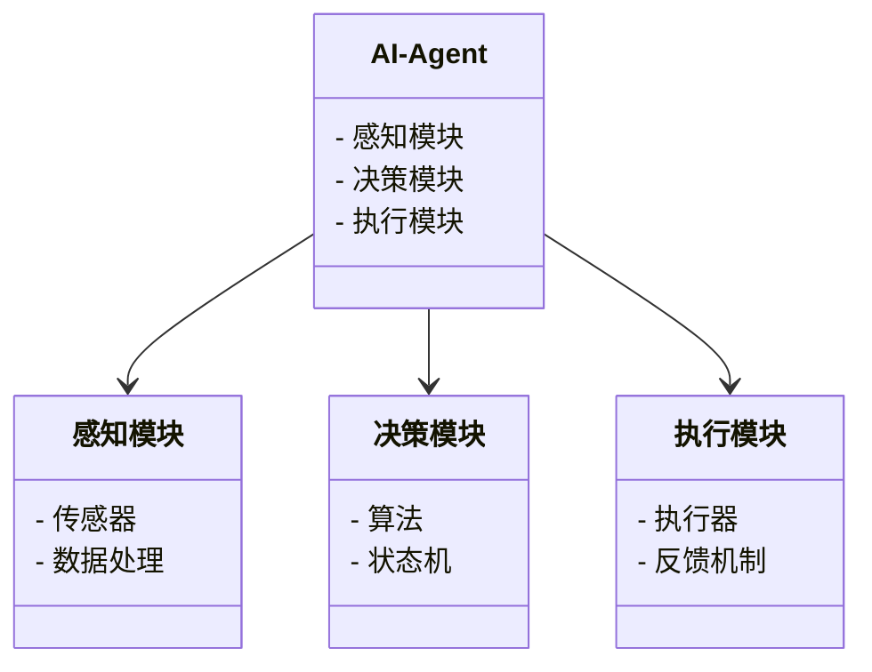
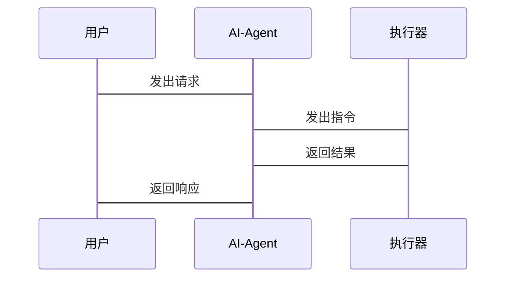

                 


# AI Agent项目的ROI分析方法

## 关键词：AI Agent、ROI分析、投资回报率、系统架构、项目实战

## 摘要：本文系统地介绍了AI Agent项目的投资回报率（ROI）分析方法。从AI Agent的基本概念、系统架构到ROI分析的具体步骤，再到项目实战和案例分析，全面阐述了如何通过科学的方法评估和优化AI Agent项目的投资回报。文章结合理论与实践，帮助读者掌握AI Agent项目 ROI分析的核心要点和实际应用技巧。

---

## 第1章: AI Agent的基本概念与背景

### 1.1 AI Agent的定义与核心要素

#### 1.1.1 什么是AI Agent
AI Agent（人工智能代理）是指能够感知环境、自主决策并执行任务的智能体。它可以是一个软件程序、一个机器人，或是一个嵌入式系统，通过传感器和执行器与外部环境交互。

**核心属性：**
- **自主性**：能够在没有人工干预的情况下独立运作。
- **反应性**：能够实时感知环境并做出响应。
- **目标导向**：具备明确的目标，能够优先处理与目标相关的信息。
- **学习能力**：能够通过经验或数据优化自身的行为。

#### 1.1.2 AI Agent的类型与应用场景
AI Agent可以分为以下几种类型：
1. **简单反射型**：基于当前输入做出反应，不依赖历史信息。
2. **基于模型的反射型**：结合内部状态和环境信息进行决策。
3. **目标驱动型**：根据预设目标优化行为。
4. **实用驱动型**：通过效用函数优化决策。

**应用场景：**
- **客服机器人**：通过自然语言处理为用户提供支持。
- **智能助手**：如Siri、Alexa，帮助用户完成日常任务。
- **自动驾驶**：通过实时感知和决策实现车辆自主驾驶。
- **工业自动化**：在制造业中优化生产流程。

### 1.2 ROI分析的基本原理

#### 1.2.1 什么是ROI
ROI（Return on Investment，投资回报率）是衡量投资项目盈利能力的指标，计算公式为：
$$ ROI = \frac{净收益}{总投资} \times 100\% $$

#### 1.2.2 ROI分析的步骤与方法
1. **确定目标**：明确项目的投资目标和预期收益。
2. **成本收益分析**：估算项目的总成本和预期收益。
3. **计算ROI**：通过公式计算投资回报率。
4. **风险评估**：分析项目可能面临的风险，并调整 ROI 计算。

#### 1.2.3 AI Agent项目中的ROI分析意义
AI Agent项目的ROI分析有助于企业评估项目的经济可行性，优化资源分配，降低投资风险。

---

## 第2章: AI Agent项目的背景与问题分析

### 2.1 AI Agent在企业中的应用现状

#### 2.1.1 当前AI Agent技术的发展趋势
AI Agent技术正在快速发展，应用场景从简单的自动化向复杂的自主决策延伸。

#### 2.1.2 企业级AI Agent应用的痛点
1. **技术复杂性**：AI Agent的开发和部署需要多学科知识。
2. **数据依赖性**：高度依赖高质量的数据输入。
3. **成本高昂**：开发和维护成本较高。

#### 2.1.3 ROI分析在AI Agent项目中的重要性
ROI分析能够帮助企业合理分配资源，确保项目投资的合理性。

### 2.2 问题背景与目标设定

#### 2.2.1 AI Agent项目中的常见问题
1. **技术实现难度大**。
2. **数据质量不稳定**。
3. **成本超出预算**。

#### 2.2.2 项目目标的设定与分解
1. **短期目标**：实现核心功能，确保基本可用性。
2. **长期目标**：优化性能，提升用户体验。

#### 2.2.3 ROI分析的边界与外延
明确项目范围，避免 ROI 分析过于宽泛或局限。

---

## 第3章: AI Agent项目的系统架构与核心要素

### 3.1 AI Agent系统的组成与功能

#### 3.1.1 系统组成模块
1. **感知模块**：负责数据采集和环境感知。
2. **决策模块**：基于感知数据做出决策。
3. **执行模块**：根据决策执行具体操作。

#### 3.1.2 各模块的功能描述
- **感知模块**：通过传感器或API获取环境数据。
- **决策模块**：利用算法对数据进行处理，生成决策指令。
- **执行模块**：将决策指令转化为实际操作。

#### 3.1.3 系统的核心要素分析
1. **数据流**：系统的输入和输出。
2. **算法逻辑**：决策模块的核心算法。
3. **执行机制**：如何将决策转化为行动。

### 3.2 系统架构设计

#### 3.2.1 分层架构设计
```
顶层架构设计：
- 感知层：数据采集与处理
- 决策层：算法处理与决策
- 执行层：指令执行与反馈
```

#### 3.2.2 模块间的依赖关系
- 感知模块依赖于传感器或API。
- 决策模块依赖于感知数据和算法模型。
- 执行模块依赖于决策指令和执行器。

#### 3.2.3 系统的可扩展性与可维护性
设计模块化架构，确保系统易于扩展和维护。

---

## 第4章: AI Agent项目的算法原理与数学模型

### 4.1 算法原理概述

#### 4.1.1 AI Agent的核心算法
1. **强化学习**：通过奖励机制优化决策。
2. **监督学习**：基于标记数据进行训练。
3. **无监督学习**：发现数据中的潜在模式。

#### 4.1.2 算法的输入输出关系
- **输入**：感知数据和环境状态。
- **输出**：决策指令和行动方案。

#### 4.1.3 算法的优化与改进
1. **参数调整**：优化算法性能。
2. **模型迭代**：通过反馈不断改进模型。

### 4.2 数学模型与公式

#### 4.2.1 收益计算公式
$$ 净收益 = 收益 - 成本 $$

#### 4.2.2 成本计算公式
$$ 成本 = 开发成本 + 维护成本 $$

#### 4.2.3 ROI计算公式
$$ ROI = \frac{收益 - 成本}{成本} \times 100\% $$

#### 4.2.4 算法的收敛性分析
分析算法在多次迭代中的收敛速度和稳定性。

---

## 第5章: 系统分析与架构设计方案

### 5.1 项目场景介绍

#### 5.1.1 项目目标
实现一个基于AI Agent的智能客服系统。

#### 5.1.2 项目范围
- 开发一个能够处理常见客户咨询的AI Agent。
- 确保系统具备自然语言理解和生成能力。

#### 5.1.3 项目约束
- 预算有限，开发周期紧张。

### 5.2 系统功能设计

#### 5.2.1 领域模型设计（Mermaid类图）


#### 5.2.2 系统架构设计（Mermaid架构图）
```mermaid
server
    [服务器]
client
    [客户端]
    [数据库]
    [API Gateway]
```

#### 5.2.3 系统接口设计
- **输入接口**：接收用户请求。
- **输出接口**：发送处理结果。

#### 5.2.4 系统交互流程（Mermaid序列图）


---

## 第6章: 项目实战与案例分析

### 6.1 环境安装与配置

#### 6.1.1 环境要求
- 操作系统：Linux/Windows/MacOS
- 开发工具：Python、Jupyter Notebook
- 依赖库：TensorFlow、Keras、Scikit-learn

#### 6.1.2 安装步骤
1. 安装Python。
2. 安装必要的库：
   ```bash
   pip install numpy pandas scikit-learn tensorflow
   ```

### 6.2 系统核心实现源代码

#### 6.2.1 感知模块
```python
import numpy as np

def感知数据():
    # 示例：从传感器获取数据
    return np.random.rand(10, 10)
```

#### 6.2.2 决策模块
```python
from sklearn import tree

def训练模型():
    X = 感知数据()
    y = np.random.randint(0, 2, 10)
    model = tree.DecisionTreeClassifier()
    model.fit(X, y)
    return model
```

#### 6.2.3 执行模块
```python
def执行指令(指令):
    print(f"执行指令：{指令}")
```

### 6.3 代码应用解读与分析
- 感知模块：负责数据采集和预处理。
- 决策模块：基于感知数据进行模型训练和预测。
- 执行模块：根据决策结果执行具体操作。

### 6.4 案例分析
案例：智能客服系统开发。

#### 6.4.1 案例介绍
开发一个能够处理客户咨询的智能客服系统。

#### 6.4.2 项目实现
1. **数据采集**：收集客户咨询记录。
2. **模型训练**：训练NLP模型，识别客户意图。
3. **系统集成**：将模型集成到客服系统中。

#### 6.4.3 项目小结
通过ROI分析，确保项目在预算范围内实现预期目标。

---

## 第7章: 总结与扩展

### 7.1 最佳实践 tips
- **数据质量管理**：确保数据的准确性和完整性。
- **算法优化**：根据实际需求调整算法参数。
- **系统维护**：定期更新模型和优化系统性能。

### 7.2 小结
本文系统地介绍了AI Agent项目的ROI分析方法，从理论到实践，帮助读者全面理解如何评估和优化AI Agent项目。

### 7.3 注意事项
- ROI分析需要结合实际项目特点。
- 数据质量和算法选择直接影响 ROI。

### 7.4 拓展阅读
- 《机器学习实战》
- 《深度学习入门：基于Python和TensorFlow》
- 《投资学原理》

---

## 作者：AI天才研究院 & 禅与计算机程序设计艺术

---

通过以上结构和内容，您可以开始撰写完整的文章。

