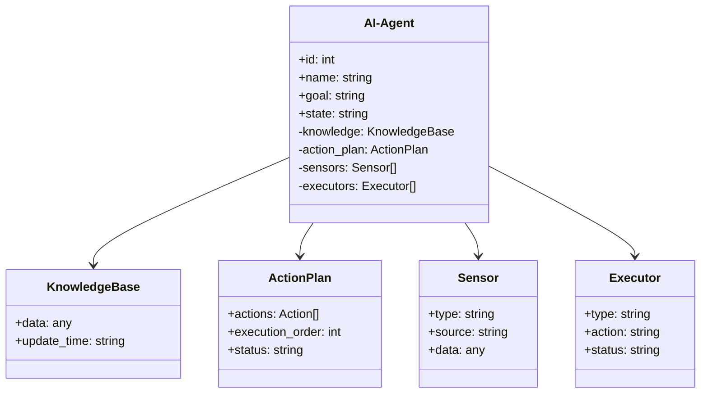
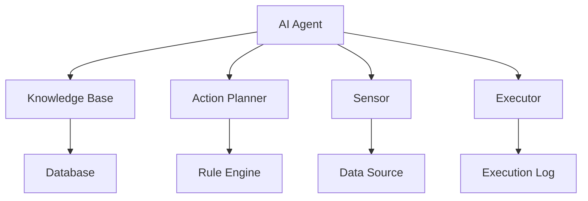
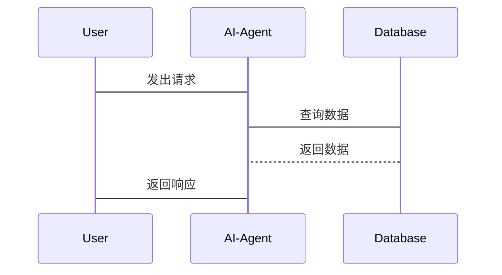

                 

# AI Agent项目的ROI分析：量化收益与成本

> 关键词：AI Agent, ROI分析, 收益与成本, 投资回报率, 量化分析

> 摘要：本文深入分析了AI Agent项目中的投资回报率（ROI）分析方法，从背景介绍、核心概念、算法原理到系统设计和项目实战，详细阐述了如何量化AI Agent项目的收益与成本，帮助读者全面理解并掌握ROI分析的技巧与实践。

---

# 第一部分: AI Agent项目的背景与核心概念

## 第1章: AI Agent项目的背景与概述

### 1.1 AI Agent的基本概念

#### 1.1.1 AI Agent的定义
AI Agent（人工智能代理）是一种能够感知环境、自主决策并执行任务的智能系统。它可以理解为一种具备人工智能能力的软件或实体，能够通过传感器获取信息、利用算法进行推理，并通过执行器完成操作。

#### 1.1.2 AI Agent的核心特征
- **自主性**：AI Agent能够在没有外部干预的情况下自主运行。
- **反应性**：能够实时感知环境并做出响应。
- **目标导向**：具备明确的目标，并通过行动来实现目标。
- **学习能力**：能够通过数据和经验不断优化自身的性能。

#### 1.1.3 AI Agent与传统软件的区别
AI Agent与传统软件的主要区别在于其智能性和自主性。传统软件通常是基于规则的、被动执行任务的程序，而AI Agent具备学习和推理能力，能够主动解决问题并适应环境的变化。

### 1.2 ROI分析的基本概念

#### 1.2.1 ROI的定义
ROI（Return On Investment）即投资回报率，是用来衡量投资项目的收益与成本之间的关系的重要指标。ROI = (收益 - 成本) / 成本。

#### 1.2.2 ROI分析的流程与方法
1. **收益预测**：估算项目带来的收益。
2. **成本估算**：估算项目的初始成本和运营成本。
3. **净现值计算**：将未来的收益和成本折现，计算净现值（NPV）。
4. **投资回收期**：计算投资回收所需的时间。

#### 1.2.3 ROI分析在企业决策中的作用
ROI分析是企业在决策过程中常用的工具之一，可以帮助企业在多个项目中选择最优的投资方案，降低投资风险，提高资金使用效率。

### 1.3 AI Agent项目中的ROI分析

#### 1.3.1 AI Agent项目的独特性
AI Agent项目的独特性在于其智能化和自动化能力，能够显著提高效率、降低成本，同时为企业创造新的价值。

#### 1.3.2 为什么需要 ROI 分析
在AI Agent项目中，由于投入较大且周期较长，进行ROI分析可以帮助企业评估项目的可行性和投资价值。

#### 1.3.3 ROI分析在AI Agent项目中的应用价值
通过ROI分析，企业可以量化AI Agent项目带来的收益，优化资源配置，确保投资的可持续性。

### 1.4 本章小结
本章介绍了AI Agent的基本概念及其与传统软件的区别，同时详细阐述了ROI分析的基本概念和在AI Agent项目中的重要性。

---

# 第二部分: AI Agent项目的收益与成本分析

## 第2章: 收益分析的核心概念与方法

### 2.1 收益的定义与分类

#### 2.1.1 显性收益与隐性收益
- **显性收益**：可以直接量化的收益，如节省的成本、增加的收入。
- **隐性收益**：难以直接量化的收益，如品牌价值的提升、客户满意度的提高。

#### 2.1.2 短期收益与长期收益
- **短期收益**：项目初期带来的直接收益。
- **长期收益**：项目长期运行后带来的持续收益。

#### 2.1.3 直接收益与间接收益
- **直接收益**：与项目直接相关的收益。
- **间接收益**：项目带来的间接影响，如企业形象的提升。

### 2.2 收益的量化方法

#### 2.2.1 收益的货币化
- 收益的货币化是将非货币化的收益转化为可量化的货币值。

#### 2.2.2 收益的非货币化评估
- 通过问卷调查、客户反馈等方式评估收益的非货币化指标。

#### 2.2.3 收益的预测模型
- 使用时间序列分析、回归分析等方法预测未来的收益。

### 2.3 AI Agent项目中的收益分析

#### 2.3.1 任务效率提升的量化
- 通过对比人工执行任务与AI Agent执行任务的效率差异，量化效率提升带来的收益。

#### 2.3.2 成本节约的量化
- 计算AI Agent执行任务所节约的成本，如人力成本、时间成本等。

#### 2.3.3 新业务机会的评估
- 通过AI Agent发现新的商业机会，评估这些机会带来的潜在收益。

### 2.4 本章小结
本章详细介绍了收益的定义与分类，并探讨了收益的量化方法在AI Agent项目中的具体应用。

---

## 第3章: 成本分析的核心概念与方法

### 3.1 成本的定义与分类

#### 3.1.1 固定成本与可变成本
- **固定成本**：在一定范围内不变的成本，如设备折旧。
- **可变成本**：随着产量变化的成本，如原材料成本。

#### 3.1.2 直接成本与间接成本
- **直接成本**：可以直接追溯到项目的成本。
- **间接成本**：无法直接追溯到项目的成本，如管理费用。

#### 3.1.3 初始成本与运营成本
- **初始成本**：项目启动时的一次性投入。
- **运营成本**：项目运行过程中的持续投入。

### 3.2 成本的量化方法

#### 3.2.1 成本的货币化
- 将非货币化的成本转化为可量化的货币值。

#### 3.2.2 成本的非货币化评估
- 通过评估成本的影响因素，如风险、资源消耗等，进行非货币化评估。

#### 3.2.3 成本的预测模型
- 使用时间序列分析、回归分析等方法预测未来的成本。

### 3.3 AI Agent项目中的成本分析

#### 3.3.1 初始成本的估算
- 包括AI Agent的开发成本、硬件设备的采购成本等。

#### 3.3.2 运营成本的估算
- 包括能源消耗、维护费用、人员培训费用等。

#### 3.3.3 风险成本的评估
- 评估AI Agent项目可能面临的风险，并计算这些风险带来的潜在成本。

### 3.4 本章小结
本章详细介绍了成本的定义与分类，并探讨了成本的量化方法在AI Agent项目中的具体应用。

---

# 第三部分: AI Agent项目的系统分析与架构设计

## 第4章: 系统分析与架构设计

### 4.1 问题场景介绍

#### 4.1.1 项目背景
- 介绍AI Agent项目的目标和应用场景。

#### 4.1.2 项目介绍
- 描述项目的总体架构和功能模块。

### 4.2 系统功能设计

#### 4.2.1 领域模型设计
- 使用Mermaid绘制领域模型类图，展示系统的功能模块和数据流。

#### 4.2.2 系统架构设计
- 使用Mermaid绘制系统架构图，展示系统的分层结构和模块之间的关系。

#### 4.2.3 系统接口设计
- 描述系统的主要接口及其交互方式。

#### 4.2.4 系统交互设计
- 使用Mermaid绘制系统交互序列图，展示系统的运行流程。

### 4.3 系统实现与优化

#### 4.3.1 系统实现
- 介绍系统的实现细节，包括代码结构和关键模块的实现。

#### 4.3.2 系统优化
- 探讨如何优化系统的性能和可扩展性。

### 4.4 本章小结
本章详细介绍了AI Agent项目的系统分析与架构设计，包括系统功能设计、架构设计、接口设计和交互设计。

---

# 第四部分: AI Agent项目的实战分析

## 第5章: 项目实战分析

### 5.1 环境安装与配置

#### 5.1.1 系统环境要求
- 介绍运行AI Agent项目的系统环境要求。

#### 5.1.2 软件安装
- 安装Python、深度学习框架等必要软件。

### 5.2 系统核心实现

#### 5.2.1 AI Agent核心模块实现
- 代码实现AI Agent的核心功能，如感知、决策、执行等。

#### 5.2.2 收益与成本计算模块实现
- 使用Python代码实现收益与成本的计算逻辑。

#### 5.2.3 系统测试与验证
- 通过测试用例验证系统的功能和性能。

### 5.3 实际案例分析

#### 5.3.1 案例背景介绍
- 介绍实际案例的背景和目标。

#### 5.3.2 收益与成本计算
- 详细计算案例中的收益与成本，并评估ROI。

#### 5.3.3 系统优化与改进
- 根据案例分析结果，提出系统优化建议。

### 5.4 本章小结
本章通过实际案例分析，展示了如何在AI Agent项目中进行收益与成本的量化分析，并评估其ROI。

---

# 第五部分: 最佳实践与总结

## 第6章: 最佳实践与总结

### 6.1 最佳实践

#### 6.1.1 项目规划
- 强调项目规划的重要性，确保项目目标清晰。

#### 6.1.2 数据质量管理
- 提高数据质量，确保分析结果的准确性。

#### 6.1.3 持续优化
- 定期评估和优化AI Agent系统的性能和ROI。

### 6.2 小结

#### 6.2.1 总结回顾
- 总结全文的主要内容和关键点。

#### 6.2.2 注意事项
- 提醒读者在实际操作中需要注意的事项。

#### 6.2.3 拓展阅读
- 推荐相关领域的书籍和资源，供读者进一步学习。

### 6.3 本章小结
本章总结了AI Agent项目中的最佳实践，提出了在实际操作中需要注意的关键点，并推荐了相关拓展资源。

---

# 作者简介

作者：AI天才研究院/AI Genius Institute & 禅与计算机程序设计艺术 /Zen And The Art of Computer Programming

---

本文通过系统化的分析和实际案例，详细探讨了AI Agent项目的ROI分析方法，帮助读者全面理解和掌握如何量化AI Agent项目的收益与成本，从而做出科学的投资决策。

